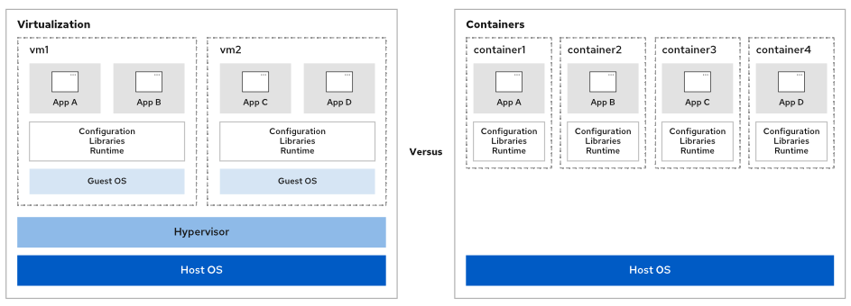

# Capitulo 16 - Ejecución de contenedores

## Contenedores: Conceptos

Tradicionalmente, el Software es instalado sobre el Sistema Operativo de un servidor dependiendo allí de librerías, archivos de configuración, servicios y mas, ya sea ese SO sobre una máquina física o virtual. Los sysadmin de SO son los que administran los paquetes sobre el RHEL validando las dependencias de los mismos, por lo tanto una dependencia de las versiones y librerias de la aplicación debe ser precisa y mantenerse en el tiempo.

Para resolver los anteriores obtáculos, un camino es desplegar la aplicación como contenedor. En RHEL   se usan las siguientes tecnologías:

- Gestión de recursos *Control Groups* (cgroups)
- Separar procesos Isolación por *Namespace*
- Fortalecer las bondades de seguridad con SELinux y Seccomp (Secure Computing mode)

{ width="600" height="400" style="display: block; margin: 0 auto" }

| Máquinas Virtuales | Containers |
| :----------------- | :--------- |
|Habilitar muchos SO simultaneamente en ejecución de 1 solo HW | Se ejecuta directamente el el SO del hosts |
|Se usa el hipervisor para dividir virtualmente el HW |El Kernel del host se comparte, pero las imágenes son independientes del resto del sistema |
|Requiere un ambiente completo de SO para soportar la aplicación | Requiere menos recursos de HW que una VM |
| |Incluye todas las dependencias |

### Rootless & Rootful

En un host de contenedores, se puede ejecutar como root o como un usuario regular sin permisos.**rootless** el contenedor se ejecuta sin permisos de ejecución de root. **rootful** es un contenedor con permisos de ejecución de root

 ### Arquitectura Base de contenedor

 Los contenedores son creados y diseñados para ser portables, moverlos entre ambientes y tener muchas versiones. El contenedor es efímero/temporal

 ### Herramientas de gestión de contenedores

 RHEL tiene varias herramientas entre ellas: **podman** (gestión de contenedores e imágenes), **skopeo** (revisión, copias, eliminar y asignar imágenes) y **buildah** (crear imagenes de contenedores)

## Imagenes de contenedor & Registries

Para ejecutar un contenedor debe usarse una *imagen de contenedor*. Es un archivo con los pasos específicos para crear el contenedor que contiene una imagen base, dependencias y librerías. Son compatibles y creados bajo las especificaciones OCI (Open Container Initiative) la cual definen el formato.

Un *Container Registry* es un repositorio para almacenar las imágenes. Se cargan o descragan imagenes para crear imagenes personalizadas y cargarlas en el sistema local. existen Registries públicos como privados, también con imágenes de terceros.

Red Hat distribuye imagenes de contenedores certificadas y se puede acceder a 2 sitios disponibles
- [registry.redhat.io](https://registry.redhat.io) (para contenedores bsados en productos oficiales RH)
- [registry.connect.redhat.com](https://registry.connect.redhat.com)  para contenedores basados en productos de 3eros

***NOTA:*** La imagen base de Red Hat se llama UBI (Universal Base Image)

Para conectarse y luego realizar descarga de imagenes, a contimuación unos ejemplos:

```bash
[eocampo@aap ~]$ podman login registry.redhat.io
Username: *****
Password: *****
Login Succeeded!
 
[eocampo@aap ~]$ podman login registry.redhat.io --username ***** 
 
[eocampo@aap ~]$ echo $PASSWORDVAR podman login --username ***** --password-stdin registry.access.redhat.com
 ```
Para verificar el login se usa el sigueinet comando: ***podman login registry.access.redhat.com --get-login***
 
### Configurar Container Registries

El archivo de configuración por default está en **/etc/containers/registries.conf**. Se recomienda crear un archivo con un usuario sin privilegios para cada registry en el HOME de ese usuario *$HOME/.config/containers* con el nombre **registries.conf**. Se debe especificar el fqn de la imagen del contenedor usará el por default por ello siempre se reocmienda usar el fqn completo. Ejemplo:

```bash
[eocampo@aap ~]$ podman pull registry.access.redhat.com/ubi8/ubi:latest
```
 
Para configurar el registry en el archivo utilice la siguiente estructura:

```bash
[[registry]]
location = "registry.lab.example.com"
insecure = true
blocked = false
```
 
Donde **location** especifica la ubicació del registry, **insecure** si desea usar (*true*) encripción HTTP con cifrado TLS (*false* si no se desea usar) y **blocked** para bloquear la descarga de imágenes, ejemplo:
 
### Archivos de Contenedor para construir imagenes de contenedor
 
Un *container file* e s un archivo de texto con instrucciones  para crear una imagen de contenedor. El resultado será capas de solo lectura donde cada capa representa una instrucción
 
```dockerfile
FROM registry.access.redhat.com/ubi8/ubi:latest
RUN dnf install -y python3
CMD ["/bin/bash", "-c", "echo hello"]
```
### Gestión de escalamiento de contenedores
 
## Despliegue de Contenedores

### Podman

Podman es una utilidad de ingeniería con todas las características de los paquetes OCI para construir imágenes, no se usa como un demonio en en el SO o una función, y no es necesario tener privilegios de *root* paea su ejecución. 

Comandos:

| Comando | Descripción |
|:------- |:----------- |
|podman build | Construir imagen de contenedor con un archivo |
|podman run | Comando para ejecutar un nuevo contenedor |
|podman images | Listar todas las imagenes del storage local |
|podman ps | Imprimir información acerca de los contenedores |
|podman inspect | Mostrar la configuración de un contenedor, imagen, volumen, network, o pod |
|podman pull | Descargar imagen del registry |
|podman cp | Copiar archivos o directorios entre un contenedor y el sistema local de archivos |
|podman exec | Ejecuta un comando en un contenedor en ejecución |
|podman rm | Elimina uno o mas contenedores |
|podman rmi | Elimina uno o mas imagenes del storage locak |
|podman search | Busca en el registry para una imagen |
 
Para mas información se puede hacer una llamado al manual de podman (*podman-build man*). Un contenedor con base RHEL 8 UBI tiene el paquete python-38

### Instalar utilidades de Contenedores

***container-tools*** es un meta-paquete que contiene las utilidades requeridas para interactuar con contenedores. Descarga, ejcuta y compara contenedores en su SO. Instalarlo con el siguiente comando:

```bash
[eocampo@aap ~]$ dnf install container-tools
[eocampo@aap ~]$ dnf info container-tools$
...output omitted...
Summary     : A meta-package witch container tools such as podman, buildah,
            : skopeo, etc.
License     : MIT
Description : Latest versions of podman, buildah, skopeo, runc, conmon, CRIU,
            : Udica, etc as well as dependencies such as container-selinux
            : built and tested together, and updated.
...output omitted...
```
### Desdecarga de imagen de contendor desde el registry

1. Primero se debe validar que las herramientas están instaladas 
2. Buscar las imagenes disponibles con el nombre
3. Usar ***skopeo inspect*** para examinar diferentes formatos de imagenes de contenedores desde el directorio local o el registry remoto
4. Descargar la imagen elegida, en este caso *registry.access.redhat.com/ubi8/python-38*
5. Validar la lista de imágenes
 
```bash
[eocampo@aap ~]$ podman info (1)
[eocampo@aap ~]$ podman search python-38 (2)
[eocampo@aap ~]$ skopeo inspect docker://registry.access.redhat.com/ubi8/python-38 (3)
[eocampo@aap ~]$ podman pull registry.access.redhat.com/ubi8/python-38 (4)
[eocampo@aap ~]$ podman images
```

### Crear imagen de contenedor desde un archivo (Container File)

El nombre del archivo será siempre ***Containerfile***. Utiliza la imagen base del registry de Red Hat, instalará la versión de python36 y luego ejecutará un *sleep infinity* y su contenido será asi:

```dockerfile
FROM registry.access.redhat.com/ubi8/ubi:latest
RUN dnf install -y python36
CMD ["/bin/bash", "-c", "sleep infinity"]
``` 

Para crear la imagen se utiliza el comando build 

```bash 
[eocampo@aap ~]$ podman build -t NAME:TAG DIR
```

NAME: Nombre para la nueva imagen
TAG:  Tag para la nueva imagen
DIR:  Path de trabajo del directorio. Si el el mismo donde está el archivo se agrega **.** (punto)

```bash
[eocampo@aap ~]$  podman build -t python36:1.0 .
STEP 1/3: FROM registry.access.redhat.com/ubi8/ubi:latest
STEP 2/3: RUN dnf install -y python36
...output omitted...
STEP 3/3: CMD ["/bin/bash", "-c", "sleep infinity"]
COMMIT python36:1.0
--> 35ab820880f
Successfully tagged localhost/python36:1.0
35ab820880f1708fa310f835407ffc94cb4b4fe2506b882c162a421827b156fc
```
La última linea del output muestra el ID de la imagen del contenedor. **Podman** solo muestra los primeros 12 caracteres para referirse a la imagen. Se usa para verificar que la imagen esté creada

```bash 
[eocampo@aap ~]$ podman images
[eocampo@aap ~]$ podman inspect localhost/python36:1.0
``` 
### Ejecutar contenedores

| Estado | Descripción |
|:--------- | :---------- |
|Created | Contenedor es creado pero no iniciado |
|Running |Contenedor está en ejecución |
|Stopped |Contenedor está detenido |
|Paused |Contenedor está en procoso pausado. **No soportado para rootless** |
|Deleted |Contenedor en inactividad |

Se puede utilizar podman create y al final agregar el ID del contendor de la imagen a utilizar. Luego se utiliza podman start y el nombre del contenedor

```bash
[eocampo@aap ~]$ podman create --name python36 dd6ca291f097
[eocampo@aap ~]$ podman ps
[eocampo@aap ~]$ podman ps -a
[eocampo@aap ~]$ podman start python36
```


## Gestión de Almacenamiento (Storage) de Contenedores & Recursos de Red

## Administración de Contenedores como Servicio del Sistema