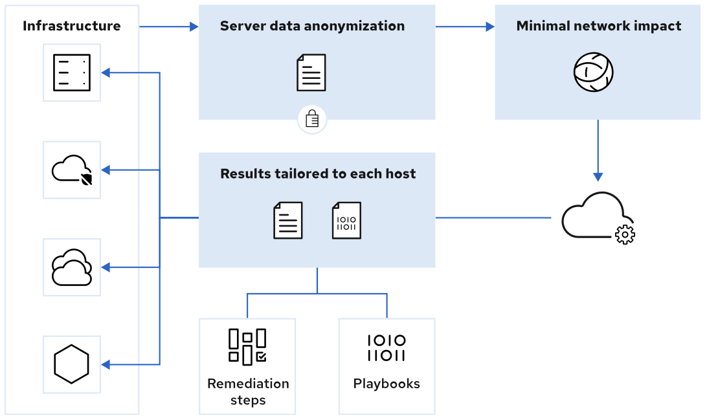

# Access Systems and Get Support

## Edit Text Files from the Shell Prompt

- Se utiliza el editor ***vim***
- Tiene el modo visual (se activa al digitar la letra **v**) y el modo comandos (nativamente al ingresar)
- Presionando la tecla **ESC** unos segundos puede regresar al modo comandos.

### The Minimum, Basic Vim Workflow

| Letra | Acción |
|:----: |:-----  |
| u     | Deshace la última acción|
| x     | Borra solo 1 caracter |
| :w    | Solo guarda los cambios|
| :wq   | Guarda los cambios y sale del editor |
| :q!   | Salir sin guardar |
| y ó 'ESC y'   p ó 'ESC  p' | Selecciona varias filas seleccionadas y las almacena en memoria   Pega las filas seleccionadas | 

### Vim Configuration Files

        $ cat /etc/vimrc
        $ cat ~/.vimrc
[Vim Reference Manual: Vim Options](https://vimhelp.org/options.txt.html#options.txt) https://vimhelp.org/options.txt.html#options.txt

## Configure SSH Key-based Authentication

Configurar llaves de acceso basadas en autenticación sin utilizar password

### Se guardan por defecto en:

        $ cat ~/.ssh/id_rsa
        $ cat ~/.ssh/id_rsa.pub

### Generation, Share the Public Key, Non-interactive, Troubleshooting

 | Comando | Acción |
 |:------- | :----- |
 | ssh-keygen | Genera la la llave pública y la privada: en el proceso puede asignarle un password llamado *passphrase* |
 | ssh-keygen -f .ssh/**nombre_llave** | Argumento **-f** para cambiar el nombre de las llaves |
 | **ssh-copy-id** -i .ssh/key-with-pass.pub **user@remotehost** | Comparte la llave **pública** en host remoto   **NOTA**: Si la llave tiene *passphrase*, se debe escribir la primera ves |
 | eval $(ssh-agent) | Iniciar el programa *ssh-agent* |
 | ssh-add | Cargar manualmente su *passphrase* de llave privada a ~/.ssh/ id_rsa |
 | ssh -i .ssh/key-with-pass **user@remotehost** | Argumento **-i** sirve para conectarse utilizando una llave específica |
 | ssh -v **user@remotehost** | Argumento **-v** para realizar Troubleshooting, puede hasta 3 niveles | 

 ***NOTA: Durante la creación si ya existe unas llaves con nombres por defecto, estos se reemplazan***

 ### SSH Client Configuration

        $ cat ~/.ssh/config

## Create a Diagnostics Report

### Resources on the Red Hat Customer Portal

 [The Red Hat Customer Portal https://access.redhat.com](https://access.redhat.com)

### Navigate the Red Hat Customer Portal Menus

 | Categories | Descriopción |
 |:---------- |:------------ |
 |Products & Services | Información de productos y servicios con sus guiías |
 |Tools | Herramientas de ayuda para los productos RH |
 |Security | Acceso al centro de productos de seguridad para productos RH |
 |Comunity | Portal de comunidades, foros |

### Contact Red Hat Customer Support

Apertura de casos de soporte para productos con suscripción

#### Prepare a Support Case

 1. Definir el problema especificando los síntomas
 2. Recopilar la información de referencia: version de producto, un SOS Report, etc
 3. Determinar la severidad del caso
      
      3.1. Urgent (severidad 1)
      
      3.2. High (severidad 2)
      
      3.3. Medium (severidad 3)
      
      3.4. Low (severidad 4)

#### Generate an sos Report with the Web Console

 - Login con usuario root, consola en el servidor local (https://localhost:9090) en el apartado **Diagnostic Reports**
 - Instalar el paquete y luego genera el reporte
  
                [root@host ~]# dnf install sos
                [root@host ~]# sos report

 - Validar si el servicio esté arriba:

                [root@host ~]# systemctl status cockpit.socket

##### Referencias:

  [Contacting Red Hat Technical Support](https://access.redhat.com/support/policy/support_process/)

  [Help - Red Hat Customer Portal](https://access.redhat.com/help/)

## Detect and Resolve Issues with Red Hat Insights

 Red Hat Insights es una herramienta de analisis predictivo que ayuda a identificar y remediar brechas de seguridad, performance, diponibilidad y estabilidad de los sistemas en la infraestructura de los productos Red Hat. Realiza recomendaciones sobre:

  * Red Hat Enterprise Linux 6.4 and later
  * Red Hat Virtualization
  * Red Hat Satellite 6 and later
  * Red Hat OpenShift Container Platform
  * Red Hat OpenStack Platform 7 and later
  * Red Hat Ansible Automation Platform

 **Insights high-level architecture**

 

 | Comando | Acción |
 |:------- | :----- |
 | insights-client | Refrescar la metadata del cliente |
 | subscription-manager register --auto-attach | Registra el sistema interactivamente en RHSM |
 | dnf install insights-client | instala el cliente en el sistema |
 | insights-client --register | registra el sistema en servicio Insight |

 En Red Hat Insights [https://console.redhat.com/insights](https://console.redhat.com/insights) se valida el estaod de los sistemas.

### Referencias:

 For more information about Red Hat Insights, refer to the [Product Documentation for Red Hat Insights](https://access.redhat.com/documentation/en-us/red_hat_insights)

 For more information about excluding data that Insights collects, refer to the [Red Hat Insights Client Data Obfuscation and Red Hat Insights Client Data Redaction chapters in the Client Configuration Guide for Red Hat Insights](https://access.redhat.com/documentation/en-us/red_hat_insights/2021/html- single/client_configuration_guide_for_red_hat_insights/assembly-main-client-cg)

 Information about the data that Red Hat Insights collects is available [System Information Collected by Red Hat Insights](https://access.redhat.com/articles/1598863)

### Review System Journal Entries

journalctl
journalctl -n 5
journalctl -f
journalctl -p err
journalctl -u sshd.service
journalctl --since today
journalctl --since "2024-02-07 14:00" --until "2024-02-07 16:00"
journalctl --since "1 hour" 
