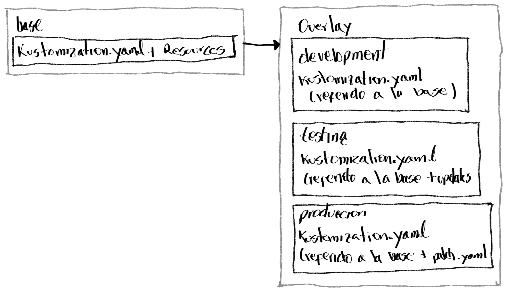

# Capitulo 1 - Gestión Declarativa de recursos

Desplegar y actualizar aplicaciones desde manifiestos de recursos y parametrizados para diferentes ambientes

- Desplegar y actualizar aplicaciones desde manifiestos de recursos que se alojan como archivos YAML
- desplegar y actualizar aplicaciones desde manifiestos de recursos que se realizan desde *Kustomize*

## Manifiesto de recursos

Una aploicación de K8S es un conjunto de múltiples recurtsos que trabajan en conjunto. Cada recursos tiene una definición y una configuración. Muchos recusos comparten configuración común de atributos para que operen correctamente. Los comandos de configuración se ejecutan en un solo momento de tiempo para ejecutar correctamente. El comando **imperativo** configura una al tiempo.

El modo imperativo tiene varias desventajas:
- Deficiencia al reproducir
- No se puede controlar las versiones
- No tiene soporte para GitOps

Por ello la forma declarativa en flujos es la opción mas recomendada para desplegar y actulizar aplicaciones de K8S.

### Flujos imperativos

Son utilizados para desarrollo y pruebas, como el siguiente ejemplo:

```bash        
kubectl create deployment db-pod --port 3306 --image registry.ocp4.example.com:8443/rhel8/mysql-80
```

En esta opción `kubectl set env deplyment` se pueden enviar parámetros de configuranción dentro del pod en ejecución. Estos cambios son enviados como variables extras para que el pod inicie si los valores no los tiene y resolver el problema de funcionamiento y iniciar el pod correctamente.

```bash
kubectl set env deployment/db-pod \
MYSQL_USER='user1' \
MYSQL_PASSWORD='mypa55w0rd' \
MYSQL_DATABASE='items'
```

Usando los comandos imperativos se pueden agregar componentes como *services*, *routes*, montaje de volumenes, y *claim* de volúmenes persistentes. Esto sirve mucho como experimentación y testing, sin embargo, trabajar con demasiadas lineas se fragmenta el trabajo.

### Usando comando declarativo

Esta forma pemirte tomar el estado previsto de la sucuencia y llevarlo a un archivo de manifiesto. El modo declarativo usa un archivo o un conjunto de archivos manifiesto.

#### Creando manifiestos de K8S

Crear un manifiesto de K8S puede tomar mucho tiempo si se quiere hacer desde cero todo su contenido, sin embargo existen técnicas para proveer ese inicio de un manifiesto

- Usar la vista YAML de un recurso desde la consola Web
- Usando el comandos imperaticos con la opción `--dry-run=client` para generar el manifiesto de acuerdo a los comandos generados, así:

```bash
kubectl create deployment hello-openshift -o yaml \
--image registry.ocp4.example.com:8443/redhattraining/hello-world-nginx:v1.0 \
--save-config \
--dry-run=client \
> ~/my-app/example-deployment.yaml
```

|opción | explicación |
|:----- |:----------- |
|`--save-config` | Con esta opción se graba las configuraciones del recurso en `kubectl.kubernetes.io/last-applied-configuration`|
|`--dry-run=client` | Se evita que los recursos sean creados en el cluster |

ejmplo muestra lo mínimo de un manifiesto de un deplyment, no productivo

```yaml
apiVersion: apps/v1
kind: Deployment
metadata:
  namespace: resource-manifests
  labels:
    app: hello-openshift
  name: hello-openshift
spec:
  replicas: 2
  selector:
    matchLabels:
      app: hello-openshift
  template:
    metadata:
      labels:
        app: hello-openshift
    spec:
      containers:
      - image: quay.io/redhattraining/hello-world-nginx:v1.0
        name: hello-world-nginx
        ports:
        - containerPort: 8080
          protocol: TCP
```

Se puede crear un manifiesto para cada recurso que se gestiona, como alternativa, se puede cerar un solo manifiesto y allí usando `---` se puede separar en partes cada manifiesto:

```yaml
---
apiVersion: apps/v1
kind: Deployment
metadata:
  namespace: resource-manifests
  annotations:
  ...output omitted...

---
apiVersion: v1
kind: Service
metadata:
  namespace: resource-manifests
  labels:
    app: hello-openshift
  name: hello-openshift
spec:
...output omitted...
```

#### Flujos declarativos

Y se puede crear el recurso de acuerdo a la ubicación de los archivos yml en el cliente de kbctl

```bash
kubectl create -f path-to-yaml # puede ser la URL del yml

kubectl create -R -f ~/mi-applicacion
deployment.apps/hello-openshift created
service/hello-openshift created        

tree mi-aplicacion
mi-aplicacion
├── example_deployment.yaml
└── service
    └── example_service.yaml
```

#### Actualizando recursos

Los recursos ya creados se pueden actualizar con la opción `kubectl apply`

```bash
kubectl apply -f ~/my-app/example-deployment.yaml --dry-run=server --validate=true
```
Ejecutar `kubectl create -f` cuando el recurso está *running* sale error, en cambio con el comando `kubectl apply -f` al ser *declarativo* tiene en cuenta el estado del recurso en el clúster y el estado en el manifiesto

#### Validación de YAML

Antes de aplicaer los cambios en un recurso, se puede aplicar el argumento `--dry-run=server` y `--validate=true` para revisar posibles errores

|opción | explicación |
|:----- |:----------- |
|`--dry-run=server` | Envía solicitud al servidor sin mantener el recurso |
|`--validate=true` |opciómn utilizada pára validar el input y si el request no es válido falla |

Ejemplo:

```yaml
kubectl apply -f ~/my-app/example-deployment.yaml --dry-run=server --validate=true
deployment.apps/hello-openshift created (server dry-run)
```
#### Comparación de recursos

Con el comando `kubectl diff` se puede revisar las diferencias entre los objetos *activos* y los objetos en el *manifiesto*

```bash
kubectl diff -f example-deployment.yaml
...output omitted...
diff -u -N /tmp/LIVE-2647853521/apps.v1.Deployment.resource...
--- /tmp/LIVE-2647853521/apps.v1.Deployment.resource-manife...
+++ /tmp/MERGED-2640652736/apps.v1.Deployment.resource-mani...
@@ -6,7 +6,7 @@
     kubectl.kubernetes.io/last-applied-configuration: |
       ...output omitted...
   creationTimestamp: "2023-04-27T16:07:47Z"
-  generation: 1 1
+  generation: 2
```

***NOTA*** Si hay cambios en el recurso, es necesario reiniciar los pod's por medio de un rollout, o bajando las réplicas a una menor expresión (1) y luego volverlas a subir

### Parchado de recursos Kubernetes

Es la modificación a partir de una parte o un archivo json/yml a un recurso en OCP. Se utiliza el comando `oc patch`. Se utiliza el argumento `-p` para agregar el la parte necesaria:

```bash
oc patch deployment hello -p '{"spec":{"template":{"spec":{"resources":{"requests":{"cpu": "100m"}}}}}}'
```

O utilizando el archivo completo:

```bash
oc patch deployment hello --patch-file ~/volume-mount.yaml
```


## Kustomize Overlays

- Desplegar aplicaciones desde un manifiesto de recursos que son ampliados por Kustomize

Cuando se usa K8S, multiples equipos usan ambientes para desarrollo, staging, testing y producción para desplegar aplicaciones, Cada ambiente tiene pequeños cambios en su configuración, por ejemplo: el número de réplicas para cargas de trabajo en producción es menor en un ambiente de testing y es acá donde **Kustomize** soporta estos diferentes casos.

El comando `oc` como el comando `kubectl` soportan la herramienta **kustomize**

### Estructura de archivos Kustomize

Se trabaja con un directorio de archivos que contiene el archivo `kustomization.yaml` al igual que los archivos de service, deployment y secret.

#### Base

En directorio base contiene el archivo `kustomization.yaml` el cual tiene una lista de campos de recursos que incluye todos los archivos de recursos, así:

```bash
base
├── configmap.yaml
├── deployment.yaml
├── secret.yaml
├── service.yaml
├── route.yaml
└── kustomization.yaml
```
```yaml
apiVersion: kustomize.config.k8s.io/v1beta1
kind: Kustomization
resources:
- configmap.yaml
- deployment.yaml
- secret.yaml
- service.yaml
- route.yaml
```

#### Overlays

Es la capacidad de *sobreponer* los artefactos YAML que son declarativos o parches sobre las configuraciones generales sin modificar los archivos originales, con las sguiente estrutura ejemplo:

{ width="600" height="400" style="display: block; margin: 0 auto" }

```bash
base
├── configmap.yaml
├── deployment.yaml
├── secret.yaml
├── service.yaml
├── route.yaml
└── kustomization.yaml
overlay
└── development
  └── kustomization.yaml
└── testing
  └── kustomization.yaml
└── production
  ├── kustomization.yaml
  └── patch.yaml
```

Ejemplo del contenido de un archivo `kutomization.yaml` de un ambiente de desarrollo en el directorio `overlay/deplyment`:

```yaml
apiVersion: kustomize.config.k8s.io/v1beta1
kind: Kustomization
namespace: dev-env
resources:
- ../../base
```

Otro ejemplo, se usa el `../../base` para la aplicación `frontend-app/overlay/development/kustomization.yaml` para crear los recursos en el *namespace* **dev_env**.

Los siguientes campos tendrán los valores para todos los recursos en el archivo kustomization:

|Campo | Descripción, para todos los recusos |
|:---- |:----------- |
|`namespace` | Se especifica el *namespace* |
|`namePrefix` | Se adiciona el nombre prefijo |
|`nameSuffix` | Se adiciona nombre de sufijo | 
|`commonLabels` | Se adicionan etiquetas y a los *selectors* |
|`commonAnnotations` | Se adiciona anotacionesy a los *selectors* | 

Uno puede personalizar para múltiples ambientes usando overlays & patching. Los parches utilizan 2 elementos: `patch` y `target`.

**NOTA**:  Las llaves *PatchesJson6902* & *PatchesStrategicMerge* estan deprecadas desdela versión Kustomize 5, fueron reeplazados con 1 sola llave

Ejemplo de un archivo `kustomize.yaml` de un directorio `overlays/testing`

```yaml
apiVersion: kustomize.config.k8s.io/v1beta1
kind: Kustomization
namespace: test-env
patches:
- patch: |-
    - op: replace
      path: /metadata/name
      value: frontend-test
  target:
    kind: Deployment
    name: frontend
- patch: |-
    - op: replace
      path: /spec/replicas
      value: 15
  target:
    kind: Deployment
    name: frontend
resources:
- ../../base
commonLabels:
  env: test
```

 Se puede ver la lista de parches a actualizar, en el primero se realiza cambio en el nombre por `frontend-test`. Los campos del `target` el tipo y nombre del recurso a aplicar el parche por `frontend-test`. También se aplica un cambio en el número de rélicas. Al final, en `resources` tiene el path de el archivo `kustomization.yaml` con el cual se trabaja y se desplegarn los recursos y a continuación este es un ejemplo de ese archivo:

```yaml
apiVersion: kustomize.config.k8s.io/v1beta1
kind: Kustomization
namespace: prod-env
patches:
- path: patch.yaml
  target:
    kind: Deployment
    name: frontend
  options:
    allowNameChange: true
resources:
- ../../base
commonLabels:
  env: prod
```

 En este ejemplo anterior, se ve como en el campo de `allowNameChange` habilita el update para usar en el patch.

Por último, un ejemplo de como sería el contenido un archivo `patch.yaml` donde se aplica el update a un deplyment con el nombre `frontend-prod` y se especifica ek número de réplicas a 5

```yaml
apiVersion: apps/v1
kind: Deployment
metadata:
  name:`frontend-prod
spec:
  replicas: 5
```

#### Vista y desplegar Recursos usando Kustomize

Visualizar los manifiestos sin aplicar los cambios en el cluster

```bash
kubectl kustomize overlay/production
```

Aplicar los cambios en el clúster:

```bash
kubectl apply -k overlay/production
```

#### Eliminar recursos usando Kustomize

```bash
oc delete -k overlay/production
```

### Generadores Kustomize

Los `ConfigMap` tienen data no confidencial usando llaves-valor. Los `secrets` en cambio si son llaves-valor con data confidencial. **Kustomize** tiene los campos `configMapGenerator` y `secretGenerator` que generan ambos tipoos de recursos. Estos generadores pueden incluir archivos externor por lo que se puede utilizar archivos generados por otras herramientas o que están en sistemas diferentes y pueden ayudar a gestionar esre contenido.

#### ConfigMap Generator

**Kustomize** tiene un campo llamadao `configMapGenerator` que crea el mapa de configuración. La generación de estos mapas con **Kustomize** permite agregar un hash al name, y cualquier cambio (`trigger`) y genera un `rolling update`.

Ejemplo de un archivo `kustomization.yaml` con la descriipción anterior:

```yaml
apiVersion: kustomize.config.k8s.io/v1beta1
kind: Kustomization
namespace: hello-stage
resources:
- ../../base
configMapGenerator:
- name: hello-app-configmap
  literals:
    - msg="Welcome!"
    - enable="true"
```

Y del archivo del *deployment.yaml*:

```yaml
apiVersion: apps/v1
kind: Deployment
metadata:
  name: hello
  labels:
    app: hello
    name: hello
spec:
...output omitted...
    spec:
      containers:
      - name: hello
        image: quay.io/hello-app:v1.0
        env:
        - name: MY_MESSAGE
          valueFrom:
            configMapKeyRef:
              name: hello-app-configmap
              key: msg
        - name: MSG_ENABLE
          valueFrom:
            configMapKeyRef:
              name: hello-app-configmap
              key: enable
```

Para visualizar y aplicar el despliegue en todos los recursos y personalizar este archivo Kustomize lo define en eel directorio

```bash
kubectl kustomize overlays/staging

kubectl apply -k overlays/staging

oc get all
```

Anteriormente, con el `apply -k` se aplica la confiuración y **Kustomize** agrega un nuevo atributo al *ConfigMap*. Se puede generar un nuevo *ConfigMap* usando archivos llave: `.properties` o `.env` usando el campo *envs* para su llamado.Incluso se puede generar escribiendo literakmente los campos

Ejemplo para generar diferentes tipo de *ConfigMap*:

```yaml
.
.
.
configMapGenerator:
- name: configmap-1
  files:
    - application.properties
- name: configmap-2
  envs:
    - configmap-2.env
- name: configmap-3
  literals:
    - name="configmap-3"
    - description="literal key-value pair"
```

Ejemplo de un archivo `application.properties` del ejemplo anterior:

```text
Day=Monday
Enable=True
```

Y el ejemplo del contenido del un `configmap-1`

```text
Greet=Welcome
Enable=True
```
Se puede utlizar el comnando `kubectl kustomize .` para ver los detalles de los recursos personalizados

#### Secret Generator

Asi como la creación del *ConfigMap*, también se pueden crear secretos de la misma manera:

```yaml
.
secretGenerator:
- name: secret-1
  files:
    - password.txt
- name: secret-2
  envs:
    - secret-mysql.env
- name: secret-3
  literals:
    - MYSQL_DB=mysql
    - MYSQL_PASS=root
```

#### Opciones adicionales para el Generator

Existen opciones que cuando se aplica cambios en los *ConfigMap* y *secrets* generan cambios que en algunos caso pueden desencadenar en un *rollout* ya que hay casos donde que los generadores agregar un atru¿ibutos que al momento de actualizarse el *configmap* o *secret* el nombre del recuros cambia. Por ello se pueden agregar opciones que desactivan acciones, o agregar etiquetas y anotaciones usando el campo `generatorOptions`

Ejemplo:

```yaml
.
.
.
configMapGenerator:
- name: my-configmap
  literals:
    - name="configmap-3"
    - description="literal key-value pair"
generatorOptions:
  disableNameSuffixHash: true
  labels:
    type: generated-disabled-suffix
  annotations:
    note: generated-disabled-suffix
```

Y la vista es la siguiente:

```bash
kubectl kustomize .

apiVersion: v1
data:
  description: literal key-value pair
  name: configmap-3
kind: ConfigMap
metadata:
  annotations:
    note: generated-disabled-suffix
  labels:
    type: generated-disabled-suffix
  name: my-configmap
```

## Documentación

- [Declarative Management of Kubernetes Objects Using Kustomize](https://kubernetes.io/docs/tasks/manage-kubernetes-objects/kustomization/)
- [Your Guide to Continuous Delivery with OpenShift GitOps and Kustomize](https://cloud.redhat.com/blog/your-guide-to-continuous-delivery-with-openshift-gitops-and-kustomize)
- [Customization of Kubernetes YAML Configurations](https://github.com/kubernetes-sigs/kustomize/blob/master/api/types/kustomization.go)
- [JavaScript Object Notation (JSON) Patch](https://www.rfc-editor.org/rfc/rfc6902)
- [Notes on the Strategic Merge Patch](https://kubernetes.io/docs/tasks/manage-kubernetes-objects/update-api-object-kubectl-patch/#notes-on-the-strategic-merge-patch)