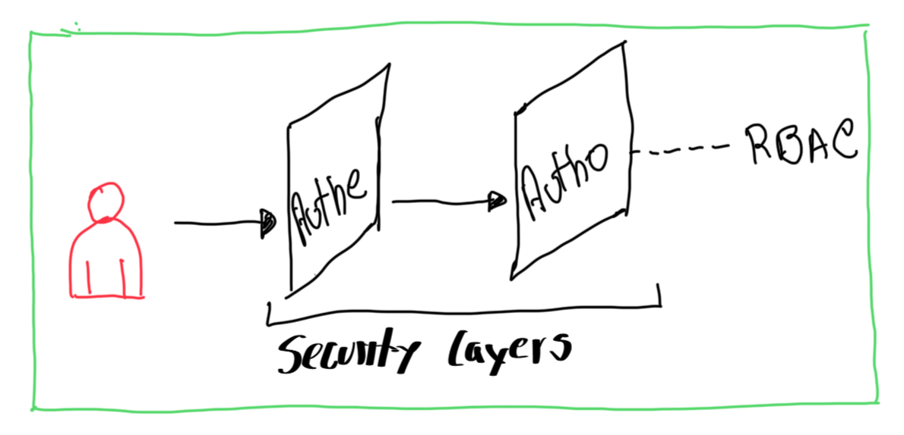

# Capitulo 3 - Autenticación y Autorización

Configurar autenticación con un proveedor de identidad HTPasswd y asignar roles a ususario/grupos

- Configurar un proveedor de identidades HTPAsswd para la autenticación de OCP
- Definir controles de acceso basados en roles y aplicar permisos a usuarios.

## Configurar Proveedor de Identidades

Muchos de lso recursos de OCP se relacionan con autenticación y autorización. La siguiente lista muestra los tipos de recursos primarios y otras definiciones:

| Tipo de Recurso <br/> Primario | Descripción |
|:-------------------------------|:------------|
| *user* | El recurso tipo *usuarios* son indentidades en OCP que interactúan con el API Server y representa un actor en el sistema. Se asigna permisos por roles directamente a él o a un grupo al que pertenece |
| *identity* | El recurso de *identidades* ayuda a mantener el registro de los intentos de autenticación de un *usuario* de algún proveedor de identidades. todo dato se almacena |
| *Service Account* | El recursos *cuenta de servicio* es para cominicar las aplicaciones con la API independientemente cuando las credenciales de usuario no son necesarias. Ejemplo: la credenciales de *usuario* no se comparten y se pasan las *cuentas de servicio* |
| *Group* | El recurso *grupos* repesenta un conjunto de *usuarios*. Los *usuarios* se asignan a *grupos*. OCP provee *grupos* de sistema o virtuales aprovisionados automaticamente por el clúster |
| *Role* | El recurso *role* define las operaciones API que el *usuario* puede hacer en un recurso determinado. Los *roles* se pueden asignar a *usuarios* *grupos* y *cuentas de servicio* |

### Authenticating API Requests

La autenticación y la autorización son capas de seguridad habilitadas para un usuario interactuar en un clúster.

{ width="600" height="400" style="display: block; margin: 0 auto" }

El API de OCP tiene 2 mpetodos para las solicitudes de autenticación

 - Accesos de token OAuth
 - Certificados cliente X.509

### Operador de Autenticación

OCP tiene o provee el operador de Autenticación que se ejecuta en un servidor de OAuth. Este provee tokens de acceso a los usuarios que intentan autenticar y el debe estar configurado con un proveedo de identidades.

### Proveedor de identidades

Un servidor OCP OAuth se puede configurar con muchos proveedores de identidades, entre ellos:

| Proveedor de Identidades | Descripción |
|:-------------------------|:------------|
| HTPasswd | Validación de usuario/password contra un *secret* que los tiene almacenados con el comando `htpasswd` |
| Keystone | Autenticación compartida habilitada con servidor OpenStack Keystone v3 |
| LDAP | Proveedor LDAP de usuarios/passwords de un server con LDAPv3 usando autenticación bind |
| GitHub or GitHub Enterprise | Se puede configurar GitHub como proveedor de identidades |
| OpenID Connect | Se puede integrar usando Autorización Code Flow |

### Autenticando como Admin Clúster

Antes de iniciar la configuración con con un proveedor de identidades, se debe acceder al clúster de OCP como administrador. Una instalación nueva tiene 2 opciones de autenticación por solicitud al API. La primera es a traves de el archivo `kubeconfig` el cual incluye un certificado x509 que nunca expira. El otro camino es a traves de `kubeadmin` desde un servidor virtual. Una correcta autenticación otorga un token con acceso

#### Autenticando con certificado X.509

Durante del proceso de instalación de OCP se crea un archivo único `kubeconfig` en el directorio `auth`. Este archivo tiene en detalle los parámetros para relaizar una conexión CLI como cliente hacia el API del server, e incluye el certificado X.509.

Los logs de instalación está la ruta, es tipo info

```text
INFO Run 'export KUBECONFIG=/root/auth/kubeconfig' to manage the cluster with 'oc'.
```

Para acceder a la granja de OCP, se exporta el path de del `kubeconfig` tal como se ve en el LOG y luego puede ejecutar un `oc get nodes` para verificar. Como alternativa puede usar el argumento `--kubeconfig` para describir el path, así:

```bash
oc --kubeconfig /home/user/auth/kubeconfig get nodes
```

### Autenticando con usuario vitual `kubeadmin` 

Despues de una completa instalación, OCP crea un usuario virtual `kubeadmin`. El *secret* esta tipo *hash*. El proceso de instalador genea un password aleatorio y unico para la administración del clúster y en los logs de instalación se puede el usuario, el password y la URL de acceso a la consola

#### Eliminando el usuario virtual

Luego de definir un proveedor de identidad, cerar usuario y asignarle el role de *admin clúster*, se puede eliminar el usuario `kubeadmin`

```bash
oc delete secret kubeadmin -n kube-system
```

{ width="30" height="20" style="display: block" }

***Si antes de eliminar no se cuenta con un usuario con role Admin o no se tiene una copia del archivo `kubeconfig` la alternativa de acceso es destruir y reinstalar el cluster***

### Gestionando usuarios con el proveedor de identidad HTPasswd

Gestionar las credenciales de un usuario con el proveedor de identidades requiere la creación de un archivo temporal  `HTPasswd` el cual se modifica y luego se aplica los cambios.

#### Creando el archivo HTPasswd

```bash
htpasswd -c -B -b /tmp/htpasswd eocampo myp4ssw0rd
```

La opción `-c` reempaza el contenido del archivo si este ya existe. Con la opción `-b` se actualiza el password y con solo la opción `-D` se eliminan las credenciales

#### Creando el secret de HTPasswd

Cuando se usa el proveedor *HTPasswd*, se debe crear un *secret* que contenga los datos del archivo `htpasswd`. 

```bash
oc create secret generic htpasswd-secret --from-file htpasswd=/tmp/htpasswd -n openshift-config
```
**NOTA** Un secret que tiene el IdP (Identity Provider) HTPasswd debe tener el prefijo `htpasswd=` antes de especificar la rurta del archivo

#### Extrayendo los datos del *secret*

## Definir y aplicar permisos con RBAC