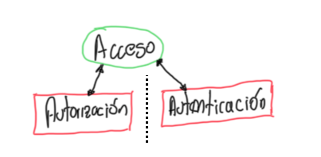

# Capitulo 3 - Autenticación y Autorización

Configurar autenticación con un proveedor de identidad HTPasswd y asignar roles a ususario/grupos

- Configurar un proveedor de identidades HTPAsswd para la autenticación de OCP
- Definir controles de acceso basados en roles y aplicar permisos a usuarios.

## Configurar Proveedor de Identidades

Muchos de lso recursos de OCP se relacionan con autenticación y autorización. La siguiente lista muestra los tipos de recursos primarios y otras definiciones:

| Tipo de Recurso <br/> Primario | Descripción |
|:-------------------------------|:------------|
| *user* | El recurso tipo *usuarios* son indentidades en OCP que interactúan con el API Server y representa un actor en el sistema. Se asigna permisos por roles directamente a él o a un grupo al que pertenece |
| *identity* | El recurso de *identidades* ayuda a mantener el registro de los intentos de autenticación de un *usuario* de algún proveedor de identidades. todo dato se almacena |
| *Service Account* | El recursos *cuenta de servicio* es para cominicar las aplicaciones con la API independientemente cuando las credenciales de usuario no son necesarias. Ejemplo: la credenciales de *usuario* no se comparten y se pasan las *cuentas de servicio* |
| *Group* | El recurso *grupos* repesenta un conjunto de *usuarios*. Los *usuarios* se asignan a *grupos*. OCP provee *grupos* de sistema o virtuales aprovisionados automaticamente por el clúster |
| *Role* | El recurso *role* define las operaciones API que el *usuario* puede hacer en un recurso determinado. Los *roles* se pueden asignar a *usuarios* *grupos* y *cuentas de servicio* |

### Authenticating API Requests

La autenticación y la autorización son capas de seguridad habilitadas para un usuario interactuar en un clúster.

{ width="600" height="400" style="display: block; margin: 0 auto" }

El API de OCP tiene 2 mpetodos para las solicitudes de autenticación

 - Accesos de token OAuth
 - Certificados cliente X.509

### Operador de Autenticación

OCP tiene o provee el operador de Autenticación que se ejecuta en un servidor de OAuth. Este provee tokens de acceso a los usuarios que intentan autenticar y el debe estar configurado con un proveedo de identidades.

### Proveedor de identidades

Un servidor OCP OAuth se puede configurar con muchos proveedores de identidades, entre ellos:

| Proveedor de Identidades | Descripción |
|:-------------------------|:------------|
| HTPasswd | Validación de usuario/password contra un *secret* que los tiene almacenados con el comando `htpasswd` |
| Keystone | Autenticación compartida habilitada con servidor OpenStack Keystone v3 |
| LDAP | Proveedor LDAP de usuarios/passwords de un server con LDAPv3 usando autenticación bind |
| GitHub or GitHub Enterprise | Se puede configurar GitHub como proveedor de identidades |
| OpenID Connect | Se puede integrar usando Autorización Code Flow |

### Autenticando como Admin Clúster

Antes de iniciar la configuración con con un proveedor de identidades, se debe acceder al clúster de OCP como administrador. Una instalación nueva tiene 2 opciones de autenticación por solicitud al API. La primera es a traves de el archivo `kubeconfig` el cual incluye un certificado x509 que nunca expira. El otro camino es a traves de `kubeadmin` desde un servidor virtual. Una correcta autenticación otorga un token con acceso

#### Autenticando con certificado X.509

Durante del proceso de instalación de OCP se crea un archivo único `kubeconfig` en el directorio `auth`. Este archivo tiene en detalle los parámetros para relaizar una conexión CLI como cliente hacia el API del server, e incluye el certificado X.509.

Los logs de instalación está la ruta, es tipo info

```text
INFO Run 'export KUBECONFIG=/root/auth/kubeconfig' to manage the cluster with 'oc'.
```

Para acceder a la granja de OCP, se exporta el path de del `kubeconfig` tal como se ve en el LOG y luego puede ejecutar un `oc get nodes` para verificar. Como alternativa puede usar el argumento `--kubeconfig` para describir el path, así:

```bash
oc --kubeconfig /home/user/auth/kubeconfig get nodes
```

### Autenticando con usuario vitual `kubeadmin` 

Despues de una completa instalación, OCP crea un usuario virtual `kubeadmin`. El *secret* esta tipo *hash*. El proceso de instalador genea un password aleatorio y unico para la administración del clúster y en los logs de instalación se puede el usuario, el password y la URL de acceso a la consola

#### Eliminando el usuario virtual

Luego de definir un proveedor de identidad, cerar usuario y asignarle el role de *admin clúster*, se puede eliminar el usuario `kubeadmin`

```bash
oc delete secret kubeadmin -n kube-system
```

{ width="30" height="20" style="display: block" }

***Si antes de eliminar no se cuenta con un usuario con role Admin o no se tiene una copia del archivo `kubeconfig` la alternativa de acceso es destruir y reinstalar el cluster***

### Gestionando usuarios con el proveedor de identidad HTPasswd

Gestionar las credenciales de un usuario con el proveedor de identidades requiere la creación de un archivo temporal  `HTPasswd` el cual se modifica y luego se aplica los cambios.

#### Creando el archivo HTPasswd

```bash
htpasswd -c -B -b /tmp/htpasswd eocampo myp4ssw0rd
```

La opción `-c` reempaza el contenido del archivo si este ya existe. Con la opción `-b` se actualiza el password y con solo la opción `-D` se eliminan las credenciales

#### Creando el secret de HTPasswd

Cuando se usa el proveedor *HTPasswd*, se debe crear un *secret* que contenga los datos del archivo `htpasswd`. 

```bash
oc create secret generic htpasswd-secret --from-file htpasswd=/tmp/htpasswd -n openshift-config
```
**NOTA** Un secret que tiene el IdP (Identity Provider) HTPasswd debe tener el prefijo `htpasswd=` antes de especificar la rurta del archivo

#### Extrayendo los datos del *secret*

Cuando se agregan o remueven usuarios se tiliza el comando `oc extract` para recuperar el *secret*. Por defecto el comando guarda cada llave del *secret* en un archivo separado, sin embargo se puede reubicar la salida de todos las llaves a un solo archivo, asi:

```bash
oc extract secret/htpasswd-secret -n openshift-config --to /tmp/ --confirm
```

#### Actualizandoel *secret* del HTPasswd

El *secret* se debe actualizar luego de adicionar, modificar o incluso eliminar un usuario y se puejde hacer con el comando `oc set data secret` para actualizar. A menos que el nombre del archivo no sea `htpasswd` se debe especificar, asi:

```bash
oc set data secret/htpasswd-secret --from-file htpasswd=/tmp/htpasswd -n openshift-config
```

Una ves actualizado el *secret* el operador OAuth re-despliega los pods del *namespace* `openshift-authentication`. Se puede monitorrear asi:

```bash
watch oc get pods -n openshift-authentication
```

### Configurando el IdP HTPasswd

El IdP valida los usuarios contra un *secret* que contiene los nombres de usuario y contraseñas y solo el Admin del Clúster puede modifcar los datos.

#### Configurando el recurso OAuth tipo personalizado

Para usar el IdP HTPasswd, la personalización del recurso OAuth debe editarse para agregar una entrada a la matriz de `.spec.identityProviders`

```yml
apiVersion: config.openshift.io/v1
kind: OAuth
metadata:
  name: cluster
spec:
  identityProviders:
  - name: my_htpasswd_provider
    mappingMethod: claim
    type: HTPasswd
    htpasswd:
      fileData:
        name: htpasswd-secret
```

| entry | explicación |
|:------|:------------|
| - name: my_htpasswd_provider | Nombre del IdP |
| mappingMethod: claim | La opción `claim` no permite el inicio de sesión con diferentes IdP |
| name: htpasswd-secret | *secret* existente que contiene los datos |

#### Actulizando el recurso personalizadode OAuth

Primero se exporta el contenido a un yaml con el comando `get` . En el output generado se edita para modificar los cambios del IdP y sus configuraciones y al completarse se guardan los cambios y luego se reemplaza con el comando `replace` así:

```bash
oc get oauth cluster -o yaml > oauth.yaml

oc replace -f oauth.yaml
```

#### Eliminando usuarios e IdP

- Elimiando un usuario del `httpsswd`

```bash
htpasswd -D /tmp/htpasswd manager
```

- Actualizar el *secret* eliminando que queda del password del recurso del usuario

```bash
oc set data secret/htpasswd-secret --from-file htpasswd=/tmp/htpasswd -n openshift-config
```

- Eliminar el usuario

```bash
oc delete user manager
```

- IdP, se busca el IdP en el clúster y luego se elimina:

```bash
oc get identities | grep manager

oc delete identity my_htpasswd_provider:manager
```

#### Asignación de privilegios de administración

```bash
adm policy add-cluster-role-to-user cluster-admin eocampo
```

### Documentación

- [Understanding Identity Provider Configuration](https://docs.redhat.com/en/documentation/openshift_container_platform/4.14/html-single/authentication_and_authorization/index#understanding-identity-provider)

## Definir y aplicar permisos con RBAC

Definir controles de acceso basados en roles y aplicar permisos a *usuarios*

### RBAC (Role-based Access Control)

RBAC es una técnica para gestionar acceso a los recursos es un sistema de cómputo. En OCP, RBAC determina que acciones se pueden ejecutar dentro de un Clúster o proyecto. Se pueden elegir entre 2 tipos de role, dependiendo del nivel de responsabilida del usuario: **cluster** y **local**

{ width="600" height="400" style="display: block; margin: 0 auto" }

#### Proceso de autorización

Este es gestionado por reglas, roles y enlaces

| Objeto RBAC | Descripción |
|:------------|:------------|
| Rule | Permite acciones sobre objetos o grupo de objetos |
| Role | Conjunto de reglas. Los usuarios y grupos se pueden asociar a varios roles |
| Binding | Asignación de usuarios/grupos a un role |

#### Alcance de RBAC

RHOCP tiene definido 2 tipos de nivel de grupos que depende del alcance y responsabilidad

 - **Cluster RBAC:** Roles y enlaces aplicados a través de todos los objetos
 - **Local RBAC:** Roles y enlaces para un proyecto determinado. Los enlaces de role local puede refernciar ambos: cluster o local.

#### Gestionando RBAC con CLI

Utiliza el comando `oc adm policy` para agregar o eliminar roles del cluster

Cambiar usuario normal a administrador del cluster y luego ejemplo para removerlo

```bash
oc adm policy add-cluster-role-to-user cluster-admin eocampo

oc adm policy remove-cluster-role-from-user cluster-admin eocampo
```

Para saber si el usuario puede ejecutar una acción se utliza el comando `oc adm policy who-can` así:

```bash
oc adm policy who-can delete eocampo
```

### Roles por default

Por defecto el cluster de OCP tiene roles que pueden ser asignados localmente en todo el clúster, lo cuales se pueden modificar ser mas precisos en la asignación del contrtol de acceso a los recursos

| Default Role | Descripción |
|:-------------|:------------|
| `admin` | Puede gestionar todos los recursos de un proyecto, incluyedo otorgar acceso a otros usuarios. Otorga acceso a los recursos de un proyecto incluyendo *limits* y *quotas* |
| `basic-user` | Acceso de solo lectura al proyecto |
| `cluster-admin` | Superusurio ya que tiene acceso a los recursos del Clúster. Puede hacer cualquier acción |
| `cluster-status` | Acceso a la informción de estado del clúster |
| `cluster-reader` | Acceso y/o vista a la mayoría de objetos en el clúster, pero no modificarlos |
| `edit` | Crear, modificar y eliminar recursos comunes de la app de un proyecto (services, deplyments). No puede realizar acciones sobre recursos de gestión [*limits*, *quotas*], tampoco gestionar permisos de acceso al proyecto. Acceso tipo desarrollador |
| `self-provisioner` | Pueden cerar sus propios proyectos. Permite crear recursos `projectrequests`  |
| `view` | Pueden ver los recursos de un proyecto sin modificarlos |

Agregar un role a un usuario específico:

```bash
oc policy add-role-to-user role-name eocampo -n miproyecto
```

### Tipos de usuarios

| Tipos de usuarios | Descripción |
|:------------------|:------------|
| Regular users | Son los usuarios con mas interacción y se representan como `User` |
| System users | Creados automaticamente con la definición de la infra. Principalmente para la seguridad de la infraestructura e interacción con la API ***cluster adminitrator*** <br/> Utiliza el prefijo `system:` por ejemplo `system:admin` |
| Service accounts | Usuario de sistema asociados con proyectos. Los Workloads pueden usar *service account* para conectarse a APIs de K8S <br/> Se podría crear de forma automática momento de cerar un poryecto <br/> No tiene roles <br/> Se otorga roles a los *service account* <br/> Se representa como `ServiceAccount` <br/> tiene el prefijo `system:serviceaccount:default:eocampo` (default is a namespace)

### Gestión de grupos

Crear un grupo en el clúster:

```bash
oc adm groups new ocampos
```

Agregar usuarios al grupo:

```bash
oc adm groups add-users ocampos eocampo
```

## Documentación

- [Using RBAC to Define and Apply Permissions](https://docs.redhat.com/en/documentation/openshift_container_platform/4.14/html-single/authentication_and_authorization/index#authorization-overview_using-rbac)
- [Understanding Authentication](https://docs.redhat.com/en/documentation/openshift_container_platform/4.14/html-single/authentication_and_authorization/index#understanding-authentication)