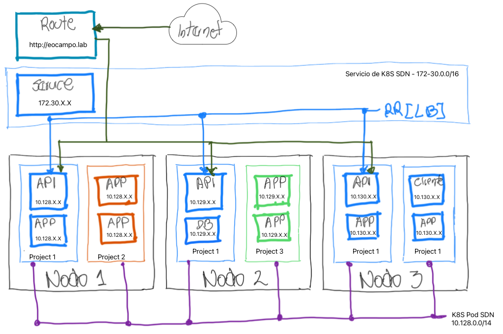
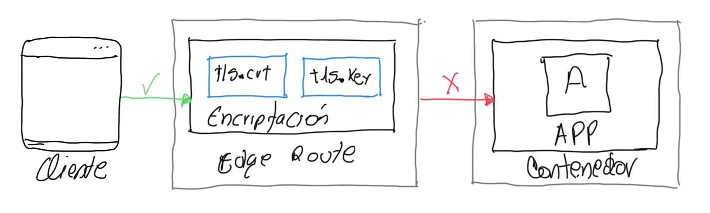

# Capitulo 4 - Seguridad de Redes

Proteger el tráfico de red entre las *apps* tanto al interior como por fuera del clúster

## Protección Externa de Tráfico con TLS

***Permitir y proteger las conexiones de red de las apps detro del clúster de OCP***

OCP tiene muchas formas de exponer las *apps* a redes externas, se puede a través de tráfico HTTP, HTTPS, aplicaciones TCP y no TCP. Algunos de ests métodos son el *tipo* servicio o `NodePort` o balanceador de carga. Otros puedes utilizar su poropio API como `Ingress` y `Route`.

En Con las *routes* de OCP se pueden exponer las *apps* a redes externas con un `hostname` único y accesible públicamente. Las `routes` se basan en un complemento del enrrutador para redirigir el tráfico de la IP pública a los pods. Ejemplo de diagrama de *routes*

{ width="600" height="400" style="display: block; margin: 0 auto"}

### Encripción de *routes*

La no cifradas son las mas fácil de configurar por no re querir certificados o llaves. *Routes* cifradas admiten soporta avrios tipos de las capa de seguridad TLS para los certificados del cliente y están disponibles en varios tipos de terminación

| OpenShift Route Encryption | Descripción |
|:---------------------------|:------------|
| Edge | La terminación TLS ocurre en el *router*. Allí es donde residen los ceertificado TLS y debe ser configurados en el *route* de lo contrario OCP asigna su propio certificado. Desde *router* a los *endpoints* no está cifrada |
| Passthrough | El tráfico cifrado se envía directamente al *pod* sin el *router*. La *app* es responsable de los certificados. Soporta autenticación mutua, entre la *app* y el cliente que accede a ella |
| Re-encryption | Variación de Edge. El path completo está encriptado, ya que el *router* termian con certificado TLS y vuelve a encriptar su conexión al punto final y este podría ser uno diferente. |

### Seguridad de la APPs con routes Edge

Antes de crear *route* cifrada se requere el certificado TLS. Con el siguiente comando se crea *route Edge* cifrada con certificado TLS personalizado (entregado por terceros)

```bash
oc create route edge --service api-frontend --hostname api.apps.acme.com --key api.key --cert api.crt
```
Si se opmite el `--key` y el `--cert` el operador ingress de RHOCP asignará un certificado CA. Con el comando `oc get secrets/router-ca -n openshift-ingress-operator -o yaml` se puede ver el certficado que proporciana la CA interna.

{ width="600" height="400" style="display: block; margin: 0 auto"}

**NOTA:** Las politicas de red pueden ayudarle a proteger en el trafico de red interno las APP o entre sus proyectos.

### Seguridad de la APPs con Re-encrypt Routes

Esta comunicación interna requiere un certificado para el servicio de destino con un FQDN de OCP, como el nombre de host *mi-app.namespace.svc.cluster.local*.

OpenShift proporciona el controlador `service-ca` para generar y firmar certificados de servicio para el tráfico interno

### Documentación

- [Configuring Routes](https://docs.redhat.com/en/documentation/openshift_container_platform/4.14/html-single/networking/index#configuring-routes)
- [Configuring Ingress Cluster Traffic](https://docs.redhat.com/en/documentation/openshift_container_platform/4.14/html-single/networking/index#configuring-ingress-cluster-traffic)
- [Self-Serviced End-to-end Encryption Approaches for Applications Deployed in OpenShift](https://cloud.redhat.com/blog/self-serviced-end-to-end-encryption-approaches-for-applications-deployed-in-openshift)


## Configurar Politicas de Redes

- Restringir el tráfico de red entre proyecto y pods

Con las politicas de red, se pueden configurar políticas separadas para pods individuales. se pueden crear sin tener privilegios Admin. Se pueden crear zonas lógicas en la SDN de la organización.

A diferencias de los FW tradicionales que funcionan con reglas de IP, K8S controlan el tráfico con etiquetas (labels) entre pods. Para pemitir la cominuación entre los pods de diferentes *namespace* se agrega allí el *label* y se crea la politica de red con este *label*. Se utiliza *selectors* en `spec` para asiganar a los pods destino la política y *selectors* en `spec.ingress` para los pods de origen. Asignación de etiqueta:

```bash
oc label namespace eocampo network=network-1
```
La siguiente política de red se aplica a cualquier pod con el *label* *deployment="product-catalog"* en *namespace* network-1. El *namespace network-2* tiene el *label* network=network-2. La política permite el tráfico TCP a través del puerto 8080 desde pods cuya *label* sea *role="qa"* en namespaces con el *label* network=network-2.

```yaml
kind: NetworkPolicy
apiVersion: networking.k8s.io/v1
metadata:
  name: network-1-policy
  namespace: network-1
spec:
  podSelector:
    matchLabels:
      deployment: product-catalog
  ingress:
  - from:
    - namespaceSelector:
        matchLabels:
          network: network-2
      podSelector:
        matchLabels:
          role: qa
    ports:
    - port: 8080
      protocol: TCP
```

La siguiente política de red permite el tráfico desde cualquier pod en *namespace* con el *label* network=network-1 hacia cualquier pod y puerto en el namespace network-2. Esta política es menos restrictiva que la política network-1, porque no restringe el tráfico de ningún pod del *namespace* network-1.

```yaml
kind: NetworkPolicy
apiVersion: networking.k8s.io/v1
metadata:
  name: network-2-policy
  namespace: network-2
spec:
  podSelector: {}
  ingress:
  - from:
    - namespaceSelector:
        matchLabels:
          network: network-1
```
### Políticas de red entre Proyects

Permiten gestionar la seguridad entre proyectos («tenants») con mínimo privilegio. el siguiente ejemplo combina los *selectors* en una regla y, de este modo, sólo permite el acceso desde pods con el *label* app=mobile en *namespace* con el *label* network=dev:

```yaml
.
.
.
  ingress:
  - from:
    - namespaceSelector:
        matchLabels:
          network: dev
      podSelector:
        matchLabels:
          app: 
```

Del ejemplo anterior `podSelector` dse modifica para que sea un elemento de la lista *from*, cualquier pod de *namespace* con el *label* network=dev o cualquier pod con el *label* app=mobile de cualquier *namespace* puede llegar a los pods que coincidan con el campo `podSelector` de nivel superior:

```yaml
.
.
.
  ingress:
  - from:
    - namespaceSelector:
        matchLabels:
          network: dev
    - podSelector:
        matchLabels:
          app: mobile
```

### Políticas de red Deny-all ejemplo:

Se aplica a de un proyecto si el *selector* está vacio:

```yaml
kind: NetworkPolicy
apiVersion: networking.k8s.io/v1
metadata:
  name: default-deny
spec:
  podSelector: {}
```

***NOTA:*** OCP no restringe el tráfico si no tiene asignadas políticas de red. Cuando se crea un environment para permitir el tráfico, se debe incluir la política *deny-all*

### Permitiendo el acceso desde los servicios del Cluster OCP

En algunas ocasiones es necesario que algunos servicios como monitoreo o *router* que permite el acceso a los recurso desde afuera. Ejemplo de oermitir acceso de *ingress* monitoreo a los pods:

```yaml
---
apiVersion: networking.k8s.io/v1
kind: NetworkPolicy
metadata:
  name: allow-from-openshift-ingress
spec:
  podSelector: {}
  ingress:
  - from:
    - namespaceSelector:
        matchLabels:
          policy-group.network.openshift.io/ingress: ""
---
apiVersion: networking.k8s.io/v1
kind: NetworkPolicy
metadata:
  name: allow-from-openshift-monitoring
spec:
  podSelector: {}
  ingress:
  - from:
    - namespaceSelector:
        matchLabels:
          network.openshift.io/policy-group: monitoring
```

***NOTAS:***
- Las políticas de red no bloquean el tráfico de los pods que utilizasn la red del *host* a los pods del mismo nodo
- Las políticas de red sólo controlan el tráfico interno de los pods que no utilizan redes de host
- Las políticas de red controlan todo el tráfico procedente de otros nodos

### Documentación

- [Network Policies](https://kubernetes.io/docs/concepts/services-networking/network-policies/#what-you-can-t-do-with-network-policies-at-least-not-yet)
- [Network Policy](https://docs.redhat.com/en/documentation/openshift_container_platform/4.14/html-single/networking/index#network-policy)


## Protección Interna de Tráfico con TLS

- Configurar y uso automático de servicio de certificados


### Environments Zero-trust

Inicia con un estado de no confianza, donde solo se puede acceder a lo permitido y la comunicación debe estar cifrada donde las APPs van a verificar la autenticidad de los servidores. OCP cifra por defecto el tráfico de red entre los nodos y el *control plane* e impiden que el tr¿áfico externo vea el tráfico interno. Esto requiere una entidad CA de confianza que firme los certificados

### Servicio de Certificados

OCP tiene el controlador `service-ca` para firmar los certificados de tráfico interno, el cual crea un *secret* que se llena con certificado firmado y su llave. Se puede montar el *secret* como un volumen para usar el certificado. Las APPs cliente deben confiar en la CA del controlador `service-ca`

#### Creación de Certificados de servicio

El controlador `service-ca` crea el *secret* "mi-secret" en el mismo *namespace* si no existe, y lo rellena con un certificado firmado y un par de llaves para el *service*:

```bash
oc annotate service hello service.beta.openshift.io/serving-cert-secret-name=hello-secret
```

Después de que OCP genera el *secret*, este se debe montar en el *deployment* de la APP y dependará de cada APP donde se ubica. Ejemplo de un ngnix:

```yaml
spec:
  template:
    spec:
      containers:
        - name: hello
          volumeMounts:
            - name: hello-volume
              mountPath: /etc/pki/nginx/
      volumes:
        - name: hello-volume
          secret:
            defaultMode: 420
            secretName: hello-secret
            items:
              - key: tls.crt
                path: server.crt
              - key: tls.key
                path: private/server.key
```

#### Configuración de la aplicación de servicio al cliente

Si un cliente requiere validar un certificado, la APP debe tener el Bundle CA que firmó ese certificado. Eso se puede aplicar como:

| Mount Blunde CA | Descripción inyección del Bundle CA |
|:----------------|:------------|
| *config map* | `service.beta.openshift.io/inject-cabundle=true` <br/> ` oc annotate configmap ca-bundle service.beta.openshift.io/inject-cabundle=true` <br/> Debe utilizar un *config map* dedicado para evitar sobrescribir los datos existentes |
| *API Service* | En el campo `spec.caBundle` |
| *CRD* | En el campo `spec.conversion.webhook.clientConfig.caBundle` |
| *validación webhook* | En el campo `clientConfig.caBundle` |

### Rotación de llaves

Son válidos por 26 meses y se rotan o cambian cada 13 meses, por lo tanto hay un periodo de gracia del certificado CA original. Por ello el pod debe reiniciarse. También se puede rotan manualmente. Primero se elimina el certificado existente y luego el controlaldor `service-ca` generará uno nuevo:

```bash
oc delete secret certificate-secret

oc delete secret/signing-key -n openshift-service-ca
```

### Otras opciones de servicios de certificados

- el operador `certmanager`
- Red Hat OCP Service Mesh

### Documentación

- [Securing Service Traffic Using Service Serving Certificate Secrets ](https://docs.redhat.com/en/documentation/openshift_container_platform/4.14/html-single/security_and_compliance/index#understanding-service-serving_service-serving-certificate)
- [About OpenShift Service Mesh section in the Service Mesh 2.x](https://docs.redhat.com/en/documentation/openshift_container_platform/4.14/html-single/service_mesh/index#ossm-about)
- [cert-manager Operator for Red Hat OpenShift](https://docs.redhat.com/en/documentation/openshift_container_platform/4.14/html-single/security_and_compliance/index#cert-manager-operator-about)
- [Red Hat Topics - What Is Zero Trust?](https://www.redhat.com/en/topics/security/what-is-zero-trust)


