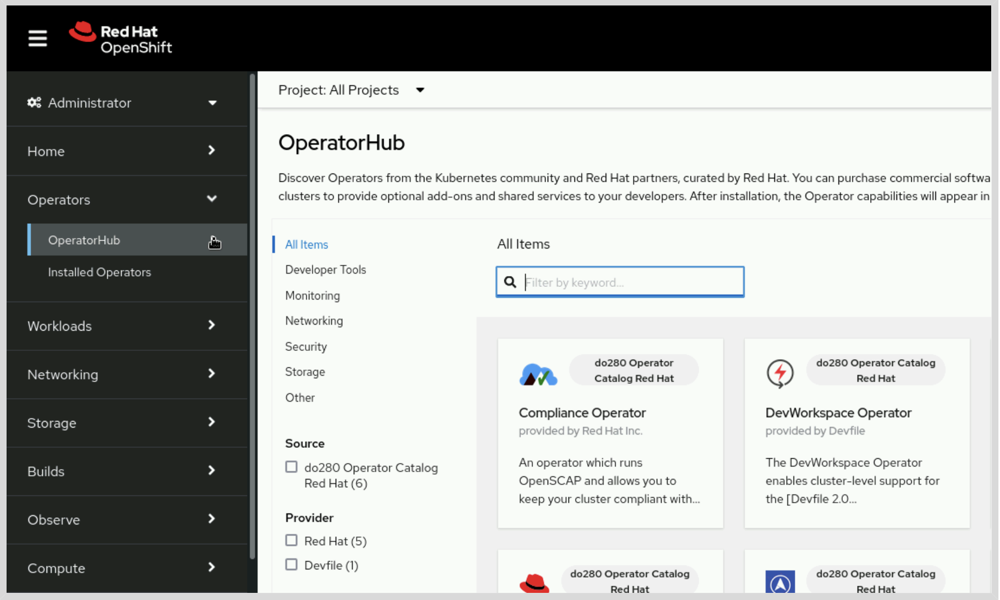

# Capitulo 7 - Gesión de Operador de Kubernetes

Instalar y actualizar operadore del ciclo de vida y operadores de versión del cluster

- Explicar operadores y sus enfoques para instalar y actualizar
- Instalar y actualizar operadores por medio de la consola Web y el ciclo de vida
- Instalar y actualizar operadores mediante API del ciclo de vida 

## Operador de Kubernetes & el Administrador del Ciclo de vida de Operadores

Desplegar *Workloads* para K8S con recursos como **deplyments, replica sets, stateful sets, daemon sets, jobs y cron jobs**. Cada uno de los recursos desplegados cumplen una funcion en particular, por ejemplo: los **jobs** ejecutan una tarea única; los **cron jobs** ejecutan tareas periódicamente y los demás recursos crean *Workloads* persistentes. Los recursos como los deployment, los stateful sets o los daemon sets difieren en la forma en que se distribuye la carga de trabajo en un clúster.

Aqui las cargar pueden estar representadas por los diferentes modelos que existen para implementar en un clúster, sin embargo grandes *Workloads* pueden requerir diferentes componentes como un servidor de DB un servidor de backend o frontend. Las *Workloads* necesitan tareas de mantenimiento que se pueden automatizar 

Un operador tiene recursos personalizados (CRs Custom Resources). Los CRs del operador contienen la información necesaria para imnplementar y gestionar las *Workloads*. Un operador observa el clúster buscando instancias de CRs y luego crea los Workloads necesarios. 

### Implementación de operadores

| Tipo de Operador | Descripción |
|:---------------- |:----------- |
| Operadores de Clúster | Servicios de plataforma OCP (servidor Web y OAth)|
| Operadores Complementarios | (OLM - Operator Lifecycle Manager), Ayuda a instalar y actualizar los operadores en el clúster |
| Otros operadores | Desde los proveedores de SW diseñan y distrubuyen SW como manifiestos, chart de Helm y otro mecanismo de distribución |

#### Operadores de Clúster

EL CVO (Cluster Version Operator) instala y actualiza los operadores del clúster como parte de los procesos de instalación y actualización de OCP. El CVO provee información e inspecciona los recursos del clúster para examinar todo su estado. Esto incluye condiciones para identificar problemas 

```bash
oc get clusteroperator
```
Tambien se púede ir a **Administration** > **Cluster Settings** y luego en la pestaña **ClusterOperators**

#### Administrador del ciclo de vida de operadores y OperatorHub

Los admin pueden utilizar el OLM para instalar y actualizar operadores. Se usa la interfaz Web para interactuar con el OLM y proporciona CR para gestionar los operadores con el API de K8S. El OLM utiliza catálogos para encontrar los que están disponibles para instalar que son imágenes de contenedores con info de los operadores y sus versiones disponibles. Los catálogos disponibles son:

| Catálogo | Descripción |
|:-------- |:----------- |
|Red Hat | Operadores soportados por Red Hat |
|Certified | Operadores soportados por SW de terceros |
|Community | Operadores sin soporte oficial |
|Marketplace | Operadores con opción de comprar en le Red Hat Marketplace |

El OLM crea un recurso tipo **PackageManifest** para cada operador que esté disponible que también se pueden ver por el entorno Web. 

La implementación de operadores de compone de una definición de CR y Workloads de K8S. **NOTA:**  Un clúster contiene 2 Workloads por cada operador:
 1. Operador de Workloads. Gestiona el OLM.
 2. Los Workloads estan asociados con el CR y el gestor de imágenes. 

Se implementan operadores para automatizar cualquier tarea manual de K8S que se ajuste al patron del operador. Los SDK proporcionan componentes y marcos para el desarrollo de operadores.

 - ***Operador SDK*** contiene herramientas para desarrollar operadores con el lenguaje de programación Go y Ansible. También contiene tools para empaquetar chats de Helm.
 - ***Operador de Java SDK*** contiene herramientas para desarrollar operadores con el lenguaje Java. Tiene una extensión de Quarkus.

### Documentación

[Operadores en la documentación de OCP](https://docs.redhat.com/en/documentation/openshift_container_platform/4.14/html-single/operators/index) 

[SDK de operadores](https://sdk.operatorframework.io/) 

[SDK de operadores Java](https://javaoperatorsdk.io/) 

[SDK de operadores Quarkus](https://github.com/quarkiverse/quarkus-operator-sdk) 


## Instalación de operadores con la consola web

La consola Web de OCP proporciona una interfaz gráfica para el administrador de OLM. La página de **OperatorHub** muestra los operadores disponibles y cómo instalarlos, mientras los de la página **Installed Operators** muestra los que ya están instalados.


{ width="600" height="400" style="display: block; margin: 0 auto" }

En **Operators > OperatorHub** mueestra los operadores disponibles, tiene filtros que ayudan a la búsqueda por categoría, source, proveedor o suscripción requerida. Se hace click en **Install** para iniciar el asistente de instalar el operador con las siguientes opciones

| Opción | Descripción |
|:------ |:----------- |
|Update channel | Elegir el canal de actualización mas adecuado |
|Installation mode | Por defecto ( **All namespaces on the cluster** ), es el sugerido y mas adecuado para la mayoría de operadores. Los usuarios pueden crear recursos personalizados en sus namespaces. Los AdminCluster se ayudan para combinar aciones basadas en acceso por roles y políticas de red |
|Installed namespace | OLM instala el workload del operador en un namespace, algunos se instalan por defecto en **openshift-operator** . Solo los AdminCluster requieren acceso al workload |
|Update approval | OLM actualiza los operadores automaticamente cuando hay nuevas versiones disponibles. Se pueden elegir las actualizaciones manuales. |

Si un operador incluye monitoreo en su definició, el asistente mostrará una opción para habilitar el monitoreo. Se debe revisar la documentación del operador para conocer las opciones admitidas. Una ves configurada la instalación, en la opción **Install** instalará los recursos del operador.

## Visualización de operadores instalados

En **View Operator** muestra la lista de detalles de ese operador instalado. También puede a traves de **Operators > Installed Operators**. allí se muestra con la versión  y cada uno tiene un CSV el cual es usado por el OLM para instalar el operador. El CSV queda con la información actualizada una ves cambia el status.

## Solución de problemass

Si el OLM no instala o actualiza los operadores, se utiliza el CSV para identificar la causa del error, por lo general son pueden ser problemas del operador en específico

## Instalación de operadores con CLI

### Pasos para instalación 
1. Buscar el operador a instalar
2. Revisar el ooperador y su documentación (conocer pre-requisitos y opciones disponibles)
   1. Definir el canal de actualización a utilizar
   2. Definir el modo de instalación. en la mayoría de operadores se disponen para todos los namaspace
   3. Definir el workload del operador en un namesapce existente o uno nuevo
3. Crear grupo de operadores, depende del modo de instalación, si aplica
4. Crear el namaspace, si aplica
5. Crear la suscripción del operador
6. Revisar y validar la instalación

### Recursos del operador

| Tipos de recursos | Descripción |
|:----------------- |:----------- |
|Catalog source | Cada recurso de este tipo hace referencia a un repositorio. OLM cada cierto tiempo examina las fuentes y recupera la información de los operadores |
|Package manifest | OLM crea un manifiesto para c/operador y este contiene la info necesaria para instalar un operador (por ejemplo los canales) |
|Operator group | Definen como el OLM presenta los namespaces |
|Subscription | Los admincluster crear suscripciones para instalar operadores |
|Operator | OLM crea recursos para guardar información de los operadores |
|Install plan | OLM crea estos planes como parte del proceso de instalación y updates, al momento de aprobaciones los admincluster lo aprueban |
|Cluster service version (CSV) | Cada versión de un operador le corresponde uno que contiene la información  que el OLM requiere para instalar el operador |

### Examinando los operadores disponibles

En el namespace **openshift-marketplace** contiene los origenes del catálogos disponibles

```bash
oc get catalogsource -n openshift-marketplace
oc get packagemanifests
oc describe packagemanifest lvms-operator -n openshift-marketplace
```

### Instalación

Una ves revisado y examindo el manifiesto del paquete se revisa la documentación del operador para validar los procedimientos para la instalación de ese operador. Al decidir instalar el workload del operador en un **namespace nuevo** crear el namespace. Algunos operadores recomiendan instalar el operador en el namespace **openshift-operators**  o a veces requiere uno especpifico.

Es necesario validar si se requiere crear **operator group**. Los operadores utilizan el grupo en este namesapce los cuales monitorean los recursos. El namspace **openshift-operators** contiene un *operator group* llamado **global-operator**. Si este *operator group* no es el indicado puede crearse uno nuevo.

Ejemplo YAML que describe la estructura de un *operator group*:

```yaml
apiVersion: operators.coreos.com/v1
kind: OperatorGroup
metadata:
  name: name
  namespace: namespace
spec:
  targetNamespaces:
  - namespace
```

Luego de crear el *namaspace* o el *operator group* necesarios, se crea la suscripción, como el siguiente ejemplo:

```yaml
apiVersion: operators.coreos.com/v1alpha1
kind: Subscription
metadata:
  name: lvms-operator
  namespace: openshift-storage
spec:
  channel: stable-4.14
  name: lvms-operator
source: do280-catalog-cs
installPlanApproval: Automatic
sourceNamespace: openshift-marketplace
```

#### Instalar Plans

El OLM crea un Resource Plan para representar el proceso para instalar o actualizar un operador. Y en el campo *status.components.refs* se puede ver la referencia:

```bash
oc describe operator file-integrity-operator
Name: file-integrity-operator.openshift-file-integrity
Namespace:
Labels: <none>
Annotations: <none>
API Version: operators.coreos.com/v1
Kind: Operator
...output omitted...
Status:
  Components:
  ...output omitted...
  Refs:
    API Version: operators.coreos.com/v1alpha1
    Kind: InstallPlan
    Name: install-pmh78
    Namespace: openshift-file-integrity
    API Version: operators.coreos.com/v1alpha1
    Conditions:
      Last Transition Time: 2024-01-26T17:53:27Z
      Message: all available catalogsources are healthy
      Reason: AllCatalogSourcesHealthy
      Status: False
      Type: CatalogSourcesUnhealthy
      Last Transition Time: 2024-01-26T17:53:49Z
      Reason: RequiresApproval
```

Se utiliza oc patch para aprobar un plan de instalación cuando está establecido en Manual

```bash
oc patch installplan install-pmh78 --type merge -p '{"spec":{"approved":true}}' -n openshift-file-integrity
```

### Uso de operadores

Hay definiciones personalizadas de recursos de las cuales se pueden crear recursos personalizados Puede validar cadad una de las definiciones

```bash 
oc get csv metallb-operator.v4.14.0-202401151553 -o jsonpath="{.spec.customresourcedefinitions.owned[*].name}{'\n'}"
```

### Troubleshooting de operadores

Alguno operadores requieren pasos adicionales para installar o ser actualizados. Debe revisarse la documentación del operador para comprobar todos los pasos necesarios.

Es posible que el OLM instale un operador y puede suceder que no funcione correctamente. Los operadores tiene 2 workloads:
 - WorkLoad del Operador (revisa los recursos custom)
 - WorkLoads de instancias custom 

```bash spec.install.spec.deployments ``` en su CSV contiene implementaciones que el OLM crea al instalar