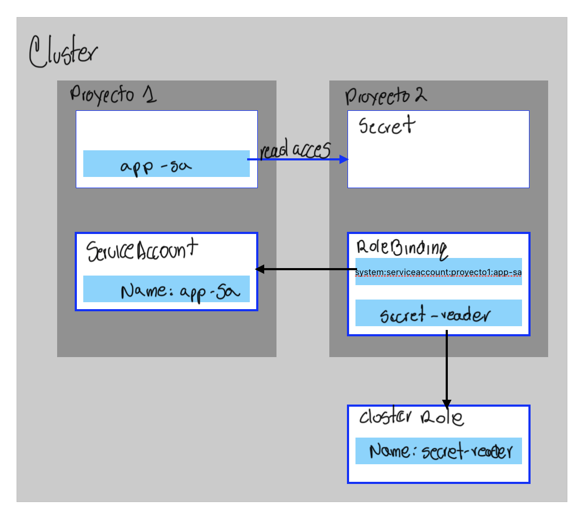
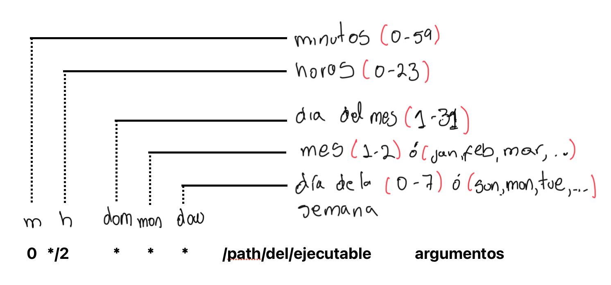

# Capituolo 8 - Seguridad de aplicaciones

## Control de permisos de aplicaciones con restricciones del contexto de seguridad

- Crear cuentas de servicio (service account) y aplicar permisos, y gestionar las restricciones de contexto de seguridad

### Restricciones de Contexto de Serguridad (SCCs Security Context Constraints)

RH OpenShift provee SCCs, un mecanismo que limita el acceso desde un pod en ejecución al host del ambiente, y tiene los siguientes recursos de hosts:

 - Contenedores con derechos de ejecución
 - Request de capacidades para un contenedor
 - Modificar el contecto SELinux a un contenedor
 - Modificar el ID del usuario

Los Admin del Clúster pueden ejecutar el comando `oc get scc` y obtener la lista de SCCs definidas para OpenShift, por default están:

 - `anyui`
 - `hostacces`
 - `hostmount-anyui`
 - `hostnetwor`
 - `hostnetwork-v2`
 - `lvms-topolvm-nod`
 - `lvms-vgmanage`
 - `machine-api-termination-handle`
 - `node-exporte`
 - `nonroo`
 - `nonroot-v2`
 - `privilege`
 - `restricte`
 - `restricted-v2`

Se puede obtener información adicional con `oc describe scc anyuid`.

Muchos de los pods creandos en OpenShift usan la resticción `restricted-v2` el cual provee límite de acceso a los recursos externos a OpenShift. Con el argumento `describe` puede ver la restricción contexto de seguridad que el pod está usando:

```bash
oc describe pod console-5df4fcbb47-67c52 -n openshift-console | grep scc
```

Las imágenes de contenedores públicos (Por ejemplo Docker Hub) puede no ejecutarse cuando se utiliza el SCC `restricted-v2`. Se puede utilizar el argumento `scc-subjet-review` para listar todas las restricciones de un contenedor:

```bash
oc get deployment ocampos -o yaml | oc adm policy scc-subject-review -f -
```

El SCC `anyuid` es la definición de estrategia de ejecución como usuario *RunAsAny*, lo que significa que el pod se puede ejecutar como cualquier ID de usuario disponible en el contenedor.

Para modificar el contanedor para que se ejecute con un SCC diferente, se debe crear un *service account* que esté en *bound* a un pod. Se puede agregar la opción `-n` para elegir un *namespace*

```bash
oc create serviceaccount service-account-name
```

Y para asociar el *service account* a la SCC, se utiliza `oc adm policy` con el argumento `-z`, así:

```bash
oc adm policy add-scc-to-user SCC -z service-account
```
***NOTA:*** Solo los Admin Clúster pueden asignar/remover SCC a un *service account*

Modificar un *deployment* existente para que use un *service account. Se el comando finaliza correctamente, los pods serán asociados cuando se redespliegue el ¨deployment*

```bash
oc set serviceaccount deployment/deployment-name service-account-name
```

### Privilegios de contenedores

Algunos contenedores pueden necesitar acceder al entorno de ejecución del host.Utilice los SCC para habilitar el acceso de los contenedores privilegiados mediante la creación de cuentas de servicio con acceso privilegiado.

### Documentación:

- [Managing Security Context Constraints](https://docs.redhat.com/en/documentation/openshift_container_platform/4.14/html-single/authentication_and_authorization/index#managing-pod-security-policies)


## Permiso de acceso de aplicaciones a las APIs de Kubernetes

- Ejecución de APPs que requieresn acceso a la API de K8S como APP del Clúster

### Seguridad en APIs de K8S

Con un APIs de K8S, un usuario o APP puede consultar  y modificar el estado del cluster. Para proteger el clúster de interacciones maliciosas, se debe otorgar acceso a diferentes API de K8S.

La autorización RBAC está preconfigurada en OpenShift y una APP requiers autotización RBAC explícita para acceder a las APIs de K8S.

### Autorización de APP con *Service Account*

Un *Service Account* es un objeto in K8S dentro de un proyecto. El *Service Account* representa la identidad de una APP que se ejecuta en un pod. Para otorgar acceso de la APP a la API de K8S, tomar estas acciones:

 - Crear un *Service Account* de APP
 - Otorgar acceso al *Service Account al API de K8S
 - Asinar el *Service Account* a los pods de la APP

Si en la definición de un pod no se especifica el *Service Account* el pod utilizará el *Service Acoount* por defecto y Openshift no otorga derechos sobre esta cuenta.

### Casos de uso de acceso al API de K8S

| Casos de Uuso | Descripción |
|:--------------|:------------|
| Monitoreo de APPS | Aplicaciones que necesitan acceder a observar la salubridad de los recursos del Clúster, por ejemplo RH Advanced Clpuster Security (ACS) para validar las vulnerabilidad de los contenedores en el clúster. |
| Controlladores | Son APPs que están constantemente en modo vigilar e intentar que un recurso llegue al estado previsto |
| *Operators | Creaciójn automatica de Operadores, configuración y gestión de instancias de APPs nativas de K8S |

### APP API K8S, Autorización con Roles

Ejemplo de crear un Role para una APP que lea secretos

```yaml
apiVersion: rbac.authorization.k8s.io/v1
kind: ClusterRole
metadata:
  name: secret-reader
rules:
- apiGroups: [""]
  resources: ["secrets"]
  verbs: ["get", "watch", "list"]

```
OpenShift tiene roles predetermiandos que se pueden utilizar, como el role de Edición que puede ver Secrets, es menos restrictivo y puede crear la mayoría de objetos.

### Vincular Roles a *Service Account*

Para que una APP use los permisos del Role, se debe vincular el role o el role-cluster al *Service Account* de la APP utilizando el comando `oc adm policy add-role-to-user`. Con el argumento `-z` se evita agregar el prefijo `system:serviceaccount:project` así:

```bash
oc adm policy add-role-to-user cluster-role -z service-account
```
Asignación del role cluster al *Service Acoount*:

```bash
oc adm policy add-cluster-role-to-user cluster-role service-account
```

### Asignando App Service Account a Pods

OpenShift usa RBAC con los roles aosciados a los Service Account para dar/denegar permisos de accesoa un recurso especificandolo en la definición del pod `spec.serviceAccountName`. A partir de la versión 4.11 de OpenShift los token no se generan automaticamente y se debe montar el token como un volumen en el Pod para que la APP pueda acceder a él.

### Rango acceso de APPs a los recursos de la API de K8S.

Un Acceso de una APP en el mismo *namespace* a otro recursos, otro *ns* o en todos los *ns*.

1. **Acceso a los recursos API en el mismo *namespace***: Se necesecita un *role* o un *cluster role* y un *service account* en el *ns*. Se debe vincular el *role* asociadoa al *service account* con las acciones permitidas al recurso
2. **Acceso a los recursos API en diferentes *namespace***: Se debe crear una vinculación de *role* en el proyecto del recurso, con la siguiente sintaxis: `system:serviceaccount:project:service-account`

{ width="600" height="400" style="display: block; margin: 0 auto" } <center>Acceso de Service Account a diferente proyecto</center>

### Documentación:

- [Using RBAC to Define and Apply Permissions](https://docs.redhat.com/en/documentation/openshift_container_platform/4.14/html-single/authentication_and_authorization/index#authorization-overview_using-rbac)
- [Understanding and Creating Service Accounts](https://docs.redhat.com/en/documentation/openshift_container_platform/4.14/html-single/authentication_and_authorization/index#service-accounts-overview_understanding-service-accounts)
- [Using Service Accounts in Applications ](https://docs.redhat.com/en/documentation/openshift_container_platform/4.14/html-single/authentication_and_authorization/index#service-accounts-overview_using-service-accounts)
- [About Automatically-generated Service Account Token Secrets](https://docs.redhat.com/en/documentation/openshift_container_platform/4.14/html-single/authentication_and_authorization/index#auto-generated-sa-token-secrets_using-service-accounts)


## Mantenimiento de clústeres y nodos con tareas Cron de Kubernetes

- Automatización de tareas regulares de gestión del clúster y de APPs con *cron jobs*

### Tareas de mantenimiento

Los administradores del clúster pueden programar tareas que automaticen el mantenimiento de tareas en el clúster, otros usuarios pueden programar tareas de mantenimeinto sobre sus APPs. Las tareas de mantenimiento varian de acuerdo a los privilegios requeridos

### K8S Batch recursos API

En OpenShift se pueden automatizar tareas usando *Jobs* y *cron jobs* y se configuran de una única ejecución o con frecuencia

#### job: Ejecución única

Ejemplo K8S Job, con el comando `oc create job --dry-run=client` para obtener el YAML

```bash
oc create job --dry-run=client -o yaml test --image=registry.access.redhat.com/ubi8/ubi:8.6 -- curl https://example.com
```

Agregar metadata, labels o anotaciones para definir el job:

```yaml
apiVersion: batch/v1
kind: Job
metadata:
  creationTimestamp: null
  name: test
spec:
  template:
    metadata:
      creationTimestamp: null
    spec:
      containers:
      - command:
        - curl
        - https://example.com
        image: registry.access.redhat.com/ubi8/ubi:8.6 6
        name: test
        resources: {}
      restartPolicy: Never
status: {}
```

#### Cron Job: Ejecución con frecuencia de ejecución

Ejemplo K8S Cron Job, con el comando `oc create cronjob --dry-run=client` para obtener el YAML

```bash
oc create cronjob --dry-run=client -o yaml test --image=registry.access.redhat.com/ubi8/ubi:8.6 --schedule='0 0 * * *' -- curl https://example.com
```

Agregar metadata, labels o anotaciones para definir el cronjob:

```yaml
apiVersion: batch/v1
kind: CronJob
metadata:
  creationTimestamp: null
  name: test
spec:
  jobTemplate:
    metadata:
      creationTimestamp: null
      name: test
    spec:
      template:
        metadata:
          creationTimestamp: null
        spec:
          containers:
          - command:
            - curl
            - https://example.com
            image: registry.access.redhat.com/ubi8/ubi:8.6 7
            name: test
            resources: {}
          restartPolicy: OnFailure
  schedule: 0 0 * * * 8
status: {}
```

### Estructura de Cron Jobs en Linux

{ width="600" height="400" style="display: block; margin: 0 auto" } <center>Sintxsis crontab</center>

#### Ejemplos

| Programnación específica | Descripción |
|:-------------------------|:------------|
| 0 0 * * * | Todos los días a la media noche |
| 0 0 * * 7 | Todos los domingos a la media noche |
| 0 * * * * | Cada hora |
| 0 */4 * * * | Cada 4 horas |