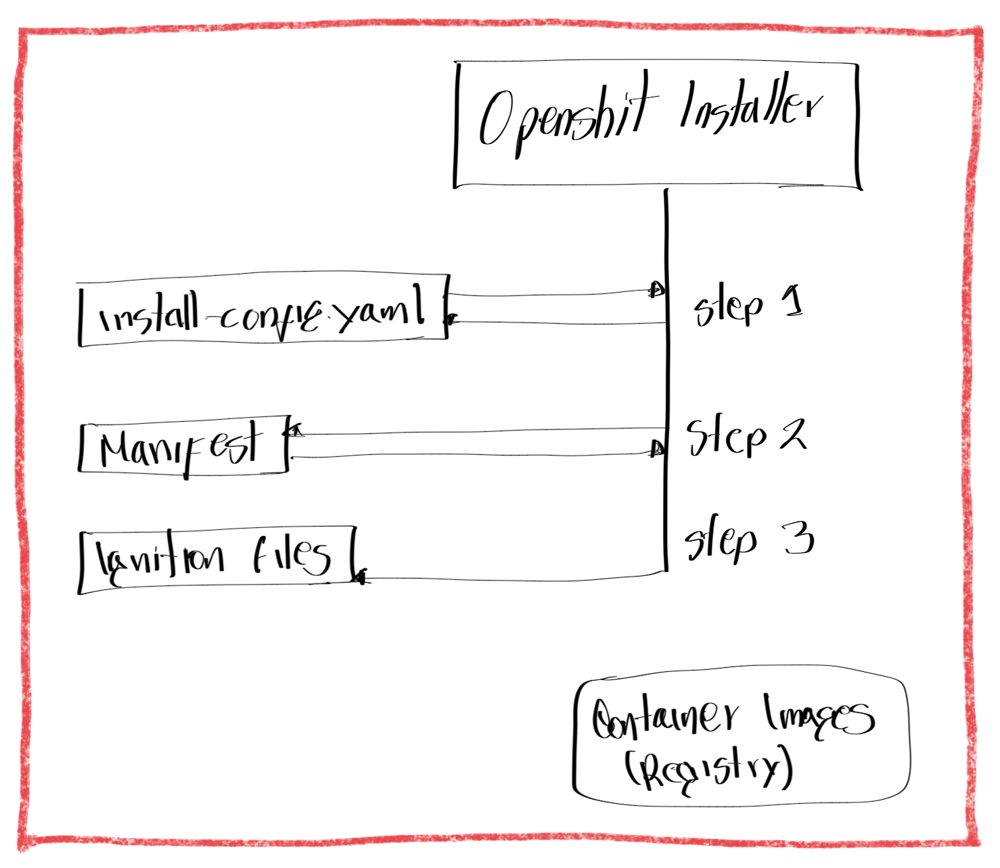
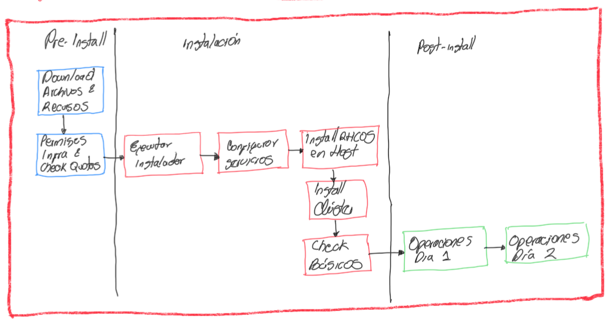
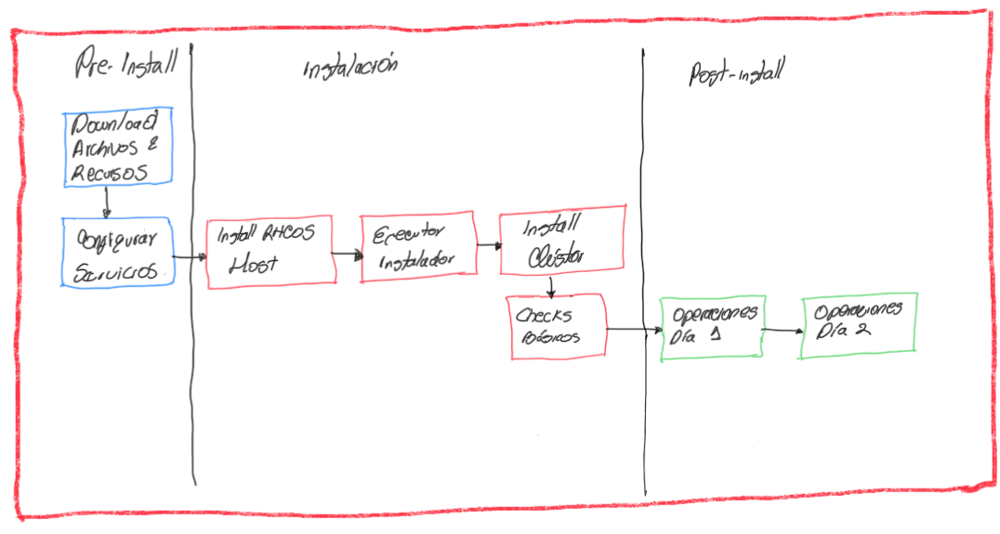

# Capitulo 1, Descripción del proceso de Instalación de OCP

## Introducción a los métodos de instalación

- Describir y comparar los métodos de instalación automatica *full-stack*.

### Instalación de OpenShift

Debido a que el instalar OCP 3 era bastante complejo, se crea una mejora en la versión 4 la cual permite una instalación desplegar un clúster con las opciones necesarias.

Se denomina "Día 2" a una fase de la instalación donde se puede personalizar y ampliar las funcionalidades del cluster, a parte de las siguientes ventajas:

 - Automatización de la instalación
 - Menos errores humanos en la instalación
 - Se aplica buenas prácticas recomendadas para OCP 4
 - Facilita la integración más adelante de:
   - OCP Assisted Installer
   - RH Advanced Cluster Managment for K8S (ACM)
   - Pipelines (CI/CD)

### Achivos de configuración Ignition

Para instalar un clúster de OCP se debe utilizar el comando ```openshift-install``` al cual se conoce como el **instalador de OCP**. El instalador genera 3 archivos de configuración de inicio o de startup (ignition):

 * bootstrap
 * Control plane nodes
 * Compute nodes

Ingnition es una tool de aprovisionamiento en el primer boot de sistemas RHCOS (Red Hat Enterprise Linux CoreOS) el cual usa un archivo *.ign* en formato JSON donde se declara el estado para el sistemas RHCOS y aplioca la configuración requerida en el startup inicial. Este proceso consta de:

 - Boot de Linux
 - Ejecución en nodos físicos, nodos virtuales o instancias en Cloud
 - Funciones unificadas con el *kickstart* y *cloud-init* del sistema RHCOS
 - Se ejecuta en el paso *initramfs* del proceso de boot RHCOS
 - Configura Storage, unidades systemd, certificados, usuarios
 - Consume los archivos de configuración  generados por el comando  y instalador y el MCO (Operador Machine Config)
     - ```openshift-install```  usa los archivos de configuración del startup para configurar el estado de cada nodo
     - el MCO aplica los cambios despues de la instalación

El startup carga los archivos desde 3 posibles fuentes: disco local, metadas Cloud o por red con HTTP/HTTPS:

#### Ejemplo de archivo de configuración:

Validar que en el SO donde se edita el archivo este instalada la librería **jq**

```bash
cat bootstrap.ign | jq .
{
  "ignition": {
    "version": "3.1.0"
  },
  "passwd": {
    "users": [
      {
        "name": "core",
        "sshAuthorizedKeys": [
          "ssh-rsa AAA...hlw== lab@utility.lab.example.com\n",
          "ssh-rsa AAA...3DR\n"
        ]
      }
    ]
  },
  "storage": {
    "files": [
      {
.
.
.
       {
         "overwrite": false,
         "path": "/etc/motd",
         "user": {
           "name": "root"
       },
       "append": [
         {
            "source": "data:text/plain;charset=utf-8;base64,VGh...lCg=="
         }
       ],
       "mode": 420
    },
.
.
.
  "systemd": {
    "units": [
      {
        "contents": "[Unit]\nDescription=Bootstrap a Kubernetes cluster\nRequires=crio-configure.service\nWants=kubelet.service\nAfter=kubelet.service crio-configure.service\nConditionPathExists=!/opt/openshift/.bootkube.done\n\n[Service]\nWorkingDirectory=/opt/openshift\nExecStart=/usr/local/bin/bootkube.sh\n\nRestart=on-failure\nRestartSec=5s\n",
        "name": "bootkube.service"
      },
.
.
.
      }
    ]
  }
}
```

##### Solucionando problemas:


 - Los datos de startup (ignition) están codificados en **base64** para revisar se puede decodificar utilizando el comando ```base64 -d```

```bash
[user@demo ~]$ echo "VGh...lCg==" | base64 -d
This is the bootstrap node; it will be destroyed when the master is fully up.
The primary services are release-image.service followed by bootkube.service. To
 watch their status, run e.g.

  journalctl -b -f -u release-image.service -u bootkube.service
```
- Validar despues de boot de RHCOS la configuración de startup

```bash
[root@bootstrap ~]$ cat /boot/ignition/config.ign
{"ignition":{"version":"3.1.0"},"passwd":{"users":
[{"name":"core","sshAuthorizedKeys":["ssh-rsa...]}}
```

- Validar registros de encendido

```bash
[root@bootstrap ~]# journalctl -t ignition
```

- Se puede editar el archivo ```install-config.yaml``` para personalizar la isntalación de OCP
- Se ejecuta ``openshift-installer`` para crear los manifiestos de K8S desde el archivo YAML
- Luego se ejecuta ``openshift-installer`` para crear los archivos startup (ignition) 

### Ejecución del proceso de instalación

El proceso de instalación se puede explicar en los siguientes pasos en secuencia:

- *Paso 1* Ejecución del instalador. Este solicita información sobre el clúster y luego crea el archivo de configuración ``install-config.yaml``.
- *Paso 2* Con el yml de configuración, el instalador de OCP crea los manifiestos de K8S con las instrucciones necesarias para compilar los recursos de la instalación.
-  *Paso 3* Con el contenido de los manifiestos, el proceso de instalción de OCP crea los archivos de startup (ignition) poara el nodo *bootstrap* **bootstart**.ing, los nodos de control o **master**.ing y los nodos de procesamiento o **workers**.ing


{ width="600" height="400" style="display: block; margin: 0 auto" } <center>Proceso de instalación - Etapa de configuración archivos Ignition</center>

- *Paso 4* En el *node bootstrap*, realiza el boot y obtiene los recursos remotos del startup inicial. Aqui el API de K8S está ejecutandose en el nodo boot
- *Paso 5* Los *control node* inician y obtienen sus recursos.
- *Paso 6* el *node bootstrap* inicia e instala temporalmete el operador **etcd**
- *Paso 7* el *operator* **etcd** ejecutandose en el *node bootstrap* escala el cluster a 3 instancias usando 2 *control node*
- *Paso 8* en el *temporal control bootstart* programa el *control plane* de PDN. Transferencia de clúster **etcd**
- *Paso 9* el *temporal control plane* termina e inicia el *control plane* de PDN. El API de K8S ejecutandose en el *control plane* de PDN
- *Paso 10* Cuando la instalación es *Auto full-stack* se apaga el *node bootstrap* ya que no es necesario
- *Paso 11* el *control plane* PDN despliega los recursos remotos del clúster

***NOTAS*** 

- Si se utiliza la isntalación de infra preesxistente, la instalación puede instalar los **worker**
- Red Hat solo soporta 3 *control plane nodes*
- Red Hat a pprobado máximo 2000 *compute nodes*
- Red Hat recomienda al menos 2 *compute nodes* para HA


### Métodos de instalación

| Métodos de instalación | Descripción | Crear </br> Red | Config </br> Balanceador | Config </br> DNS | Deploy </br> HW o VM | Install </br> SO | Config </br> Startup </br> Ignition | Soporte </br> SO </br> Control </br> plane | Soporte </br> SO </br> worker | Config </br> Storage </br> persistente | Config </br> Storage </br> Provider | Config </br> provisioning </br> node </br> auto-scaling |
|:---------------------- |:----------- |:------ | :------ | :------- | :------| :------- |:----- |:------- |:------- |:------- |:------- |:------- |
| Full-stack Automation | Instalación manual mínima <br/> OCP Installer desliega el clúster en la infraestructura que el Installer aprovisiona y el clúster mantiene | Instalador | Instalador | Instalador | Instalador | Instalador | Instalador | Instalador </br> RHCOS | Instalador </br> RHCOS (1) | Instalador (2) | Instalador (2) | Instalador |
| Pre-existeing Infraestructure | Instalacion flexible </br> Usan el Instaler para desplegar un clúster en la infraestructura que usted mantiene y prepara | usuario | usuario | usuario | usuario | usuario | instalador | usuario: </br> RHCOS | usuario: </br> RHCOS </br> RHEL 7 | usuario | usuario | Solo </br> providers </br> OCP </br> Machine </br> API |

{ width="600" height="400" style="display: block; margin: 0 auto" } <center>Proceso de instalación - Installación Full-stack</center>

{ width="600" height="400" style="display: block; margin: 0 auto" } <center>Proceso de instalación - Installación Pre-existente</center>

NOTAS:

1. Ambas métodos soportan la adición de *compute nodes* por el usuario como parte del **día de operación 2**
2. Las instalación son en tipo **bare-metal** menos en Full-stack
3. Diferencia entre UPI CI (Cloud Integration) y UPI BM (Bare Metal)
   1. CI el provider se integra con OCP
   2. BM si no hay soporte del proveedor no hay auto-scaling de nodos

Compara ción de métodos de instalación:

| Acción | Full-stack <br/> Automation | Infraestructura <br/> Pre-existente |
|:-------|:----------------------------|:------------------------------------|
| Contruir la red | Instalador | Usuario |
| Configurar balanceador | Instalador | Usuario |
| Configurar DNS | Instalador | Usuario |
| Aprovisionamiento de HW o VM | Instalador | Usuario |
| Instalación de OS | Instalador | Usuario |
| Generar configuraciones de *ignition* | Instalador | Instalador |
| Soporte OS del Control Plane | Instalador:RHCOS | Usuario:RHCOS |
| Soporte OS del nodo de Computo <br/> Se soporta agregar nodos RHEL 7 en el "Dia 2 de operación" por el usuario | Instalador:RHCOS | Usuario:RHCOS + RHEL 7 |
| Configuración persistente de storage para uso interno de *registry* | Instalador <br/> Excepto instalación Bare Metal | Usuario |
| Configuración dinamica del proveedor de storage | Instalador <br/> Excepto instalación Bare Metal | Usuario |
| Configuración de aprovisionamiento de nodo y autoesclamiento del clúster | Instalador | Solo para proveedores que soportan OpenShift API |

### Prerequisitos de Instalación de OpenShift

Antes de iniciar el proceso de instalación, los admins deben cumplir con una serie de prerequiisitos

#### Prerequisitos Generales

- Aprovisionar host *bastion*
- SSH key del *bastion*
- Download & Install ``openshift-install`` en el *bastion*
- Download & Install ``oc`` en *bastion*
- Obtener **pull-secret** del *registry*
- Acceso a NTP en los nodos del clúster
- Reglas de FW habilitadas para el clúster

#### Prerequisitos de Full-stack

- Validar permisos de infarestructura y quotas
- En Cloud, account de Cloud con permisos y quotas necesarios

#### Prerequisitos de Infraestructura Pre-existente

- Configurar servicios de red
- Aprovisionar HW (sea VM o físico) para los nodos del clúster
- Instalar RHCOS en los nodos del clúster

### Prerequisitos de DNS OpenShift

Con el método de instalación de infra pre-existente, se debe configurar el servicio DNS con registros de la zona directa DNS de la siguiente manera

`<componente>.<cluster_name>.<base_domain` ejemplo: `componente.ocppdn4.eocampo.lab`

Es requerido también que la zona reversa con los registros o punteros PTR estén diligenciados corretamente. Estos son los registros requeridos:

| Componente | Registro | Descripción |
|:---------- |:-------- |:----------- |
|K8S API | api.ocppdn4.eocampo.lab | (A/AAAA o CNAME y PTR) </br> Identifica balanceador de carga de API para los *control plane*| 
|K8S API | api-int.ocppdn4.eocampo.lab | (A/AAAA o CNAME y PTR) </br> Identifica balanceador de carga de API para los *control plane* |
|Routes  | *.apps.ocppdn4.eocampo.lab | (A/AAAA o CNAME y PTR) </br> Identifica balanceador de carga del *Ingress*  que apunta a los *control plane*|
|Clúster Nodes | hostsocp01.ocppdn4.eocampo.lab | (A/AAAA o CNAME y PTR) </br> Identifica cada host del clúster |

Las rutas utilizadas para almacenar la configuración de instalación son:

```bash
cat /etc/named.conf
...output omitted...
zone "example.com" {
    type master;
    file "example.com.db";
    allow-update { none; };
};
...output omitted...

cat /var/named/example.com.db
$TTL 1D
@ IN SOA dns.ocp4.example.com. root.example.com. (
           2019022400 ; serial
           3h ; refresh
           15 ; retry
           1w ; expire
           3h ; minimum
         )
         IN NS dns.ocp4.example.com.
dns.ocp4 IN A 192.168.50.254
api.ocp4 IN A 192.168.50.254
api-int.ocp4 IN A 192.168.50.254
*.apps.ocp4 IN A 192.168.50.254
bootstrap.ocp4 IN A 192.168.50.9
master01.ocp4 IN A 192.168.50.10
master02.ocp4 IN A 192.168.50.11
master03.ocp4 IN A 192.168.50.12
worker01.ocp4 IN A 192.168.50.13
worker02.ocp4 IN A 192.168.50.14

cat /var/named/example.com.reverse.db
$TTL 1D
@ IN SOA dns.ocp4.example.com. root.example.com. (
           2019022400 ; serial
           3h ; refresh
           15 ; retry
           1w ; expire
           3h ; minimum
         )
         IN NS dns.ocp4.example.com.
254 IN PTR api.ocp4.example.com.
254 IN PTR api-int.ocp4.example.com.
9 IN PTR bootstrap.ocp4.example.com.
10 IN PTR master01.ocp4.example.com.
11 IN PTR master02.ocp4.example.com.
12 IN PTR master03.ocp4.example.com.
13 IN PTR worker01.ocp4.example.com.
14 IN PTR worker02.ocp4.example.com.
```

Se utiliza el comando `dig` para validar la configuración de DNS antes de proceder con la instalación:

```bash
dig @dns.ocp4.example.com api.ocp4.example.com
...output omitted...
;; ANSWER SECTION:
api.ocp4.example.com. 86400 IN A 192.168.50.254
...output omitted...

dig @dns.ocp4.example.com api-int.ocp4.example.com
...output omitted...
;; ANSWER SECTION:
api-int.ocp4.example.com. 86400 IN A 192.168.50.254
...output omitted...

dig @dns.ocp4.example.com -x 192.168.50.254
...output omitted...
;; ANSWER SECTION:
254.50.168.192.in-addr.arpa. 86400 IN PTR api.ocp4.example.com.
254.50.168.192.in-addr.arpa. 86400 IN PTR api-int.ocp4.example.com.
...output omitted...
```

***NOTA:*** Por defecto cuando se instal OpenShift usando Full-stack el método soporta proveedores Cloud y el instalador realiza la configuración automática del DNS, plaica para:
 - RH OpenStack usando DNS externo
 - VMware vSphere
 - Bare metal

### Prerequisitos de servicios de Firewall

Los puertos de red debes estar abiertos antes de ejecutar la instalación y debe garantizarse la conectividad entre todos los nodos del clúster y una correcta resolución de nombres entre todos.

De todos los nodos a todos los nodos:

| Protocolo | Puerto | Descripción |
|:--------- |:------ |:----------- |
| ICMP | N/D |  Pruebas de Ping |
| TCP | 9000-9999 | Servicios de Host
| TCP | 10250-10259 | Los puertos de reserva K8S
| TCP | 10256 | openshift-sdn
| UDP | 4789 | VXLAN y Geneve
| UDP | 6081 | VXLAN y Geneve
| UDP | 9000-9999 | Servicios de Host |
| TCP/UDP | 30000-32767 | Node Ports K8S

De todos los nodos a todos los control plane:

| Protocolo | Puerto | Descripción |
|:--------- |:------ |:----------- |
|TCP | 2379-2380 | etcd server, peer, y puertos de métrica
|TCP | 6443 | API de K8S

Del Balanceador de carga de API:

| Protocolo | Back-end </br> nodes | Acceso </br> Interno | Acceso </br> Externo | Descripción |
|:--------- |:------ |:----------- |:-------------------- |:-------------------- |
|6443   |Bootstrap temp & nodos control plane | SI | SI | K8S APi Server |
|22623 | Bootstrap temp & nodos control plane | SI | NO | Maquina Config server |


Del Balanceador de carga del ingress:

| Protocolo | Back-end </br> nodes | Acceso </br> Interno | Acceso </br> Externo | Descripción |
|:--------- |:------ |:----------- |:-------------------- |:-------------------- |
| 443 | Nodos del clúster donde se ejecuta el router ingress de los pods | SI | SI | Tráfico <br/> HTTPS
| 80 | Nodos del clúster donde se ejecuta el router ingress de los pods | SI | SI | Tráfico <br/> HTTP

***NOTAS:***
 - La configuración de FW aplica pata el métpodo de Infra pre-existente
 - La red tiene restricciones de red gestionadas por un FW
 - Una instalación en Cloud
   - Se crea una VPC nueva, el instalador lo hace
   - Si ya existe, debe validarse que cumpla con todos los pre-requisitos

### Modos de Instalación OpenShift

| Conectado | Desconectado |
|:--------- |:------------ |
| Los nodos del clpuster tienen acceso a internet para descargar las imágenes desde **quay.io** y a **registry.redhat.io**. esta modo es soportado cuando se usa la instalación automática full-stack o una instalación pre-existente | Este tipo de instalación es cuando no se tiene acceso a internet. el instaldor de OCP utiliza un **registry** local para realiezar el pull de imágenes |

#### Instalaciones desconectadas

La instalación de ambientes desconectados tienen algunas restricciones ue deben tenerse en cuenta:

- Copia de las imágenes con especificación API `schema2` en el *registry* local.
- Acceso a internet para descargar las imágnes desde los registries haceia el *registry* lacal
- Copia de las imágenes requeridas para la instalación en el *registry* local

Se debe obtener aparte de todas las imagenes necesarias para instalar en el *registry* local, la data de la versión de OCP: `imageContentSource`. Se debe copiar todo el siguiente contenido en el *registry* local:

- Repositorio de imágenes de OCP (provee imágenes que se usan durante la instalación o el upgrade)
- Provee las imagenes durante el proceso de instalación o upgrade de OCP
- Tiene ejemplos de OCP Container Platform

La mayoría de imágenes de importancia del namespace `openshift` usa imagenes locales de **registry.redhat.io** de Red Hat, la principal rélica de estas imágenes

- Orígenes remotos de OperatorHub
- Orígenes remotos de Operator Hub

En un clúster desconectado el OLM no tiene acceso al los origenes del proveedor Operator Hub en **quay.io** por ello se debe hacer descarga localmente

##### Custom de instalaciones desconectada

Despues de descargar localmente las imágenes al registry local, se inicia el proceso de instalación. Se puede modificar el archivos `install-config.yaml` para personalizar el proceso de instalación


**Ejemplo YAML de instalación conectada** 

```bash
cat ${HOME}/ocp4-cluster/install-config.yaml

apiVersion: v1
baseDomain: example.com
#proxy:
# httpProxy: http://<username>:<pswd>@<ip>:<port>
# httpsProxy: http://<username>:<pswd>@<ip>:<port>
# noProxy: example.com
compute:
- hyperthreading: Enabled
  name: worker
  replicas: 2
controlPlane:
  hyperthreading: Enabled
  name: master
  replicas: 3
metadata:
  name: ocp4
networking:
  clusterNetwork:
  - cidr: 10.128.0.0/14
    hostPrefix: 23
  networkType: OpenShiftSDN
  serviceNetwork:
  - 172.30.0.0/16
platform:
  none: {}
fips: false
pullSecret: |
  {"auths":...output omitted...}
sshKey: |
  ssh-rsa AA...output omitted...
```

**Ejemplo de YAML instalación desconectada**

```bash
cat ${HOME}/ocp4-cluster/install-config.yaml
apiVersion: v1
baseDomain: example.com
compute:
- hyperthreading: Enabled
  name: worker
  replicas: 2
controlPlane:
  hyperthreading: Enabled
  name: master
  replicas: 3
metadata:
  name: ocp4
networking:
  clusterNetwork:
  - cidr: 10.128.0.0/14
    hostPrefix: 23
  networkType: OpenShiftSDN
  serviceNetwork:
  - 172.30.0.0/16
platform:
  none: {}
fips: false
pullSecret: |
  {"auths":...output omitted...} 1
sshKey: |
  ssh-rsa AA...output omitted...
additionalTrustBundle: | 2
  -----BEGIN CERTIFICATE-----
  ZZZZZZZZZZZZZZZZZZZZZZZZZZZZZZZZZZZZZZZZZZZZZZZZZZZZZZZZZZZZZZZZ
  -----END CERTIFICATE-----
imageContentSources: 3
- mirrors:
  - nexus-registry-int.apps.tools.dev.nextcle.com/openshift/ocp4
  source: quay.io/openshift-release-dev/ocp-release
- mirrors:
  - nexus-registry-int.apps.tools.dev.nextcle.com/openshift/ocp4
  source: quay.io/openshift-release-dev/ocp-v4.0-art-dev
```

## URL's de documentación

 -  [Red Hat Enterprise Linux CoreOS](https://access.redhat.com/documentation/en-us/openshift_container_platform/4.6/html-single/architecture)
 -  [Planning your environment according to object maximums](https://access.redhat.com/documentation/en-us/openshift_container_platform/4.6/html-single/scalability_and_performance)
 -  [Config Files starup Ignition ](https://coreos.github.io/ignition/examples)
 -  [Installation and update](https://access.redhat.com/documentation/en-us/openshift_container_platform/4.6/html-single/architecture)


## Usando el binario de instalación de OpenShift

Independiente del método, se debe utilizar el binario de la instalación `openshift-install` para iniciar el proceso y para una infra Bare metal se utiliza `openshift-baremetal-install`

Los siguientes pasos son el resumen del proceso de instlación:

1. Tener todos los prerequisitos de instalación
2. Crear el directorio de instalación
3. Crear el archivo de instalación `install-config.yaml`
4. Crear los manifiestos de K8S
5. Crear los archivos de confoguración *ignition* o startup
6. Desplegar el clúster de OCP
7. Validar el estado de salubridad del clúster de OCP

### Crear el directorio de instalación

El instalador de OpenShift lo genera automaticamente si no existe, sin embargo lo puede crear:

```bash
INSTALLDIR=ocp4-cluster
mkdir ${HOME}/$INSTALLDIR
```

### Crear el archivo de instalación `install-config.yaml` 

Ejemplo en AWS:

```bash
openshift-install create install-config --dir=${HOME}/$INSTALLDIR
? SSH Public Key /home/user/.ssh/ocp4-cluster.pub
? Platform aws
INFO Credentials loaded from the "default" profile in file "/home/user/.aws/
credentials"
? Region us-east-2
? Base Domain mydomain.com
? Cluster Name ocp4
? Pull Secret [? for help] +++++
INFO Install-Config created in: /home/user/ocp4-cluster
```
Ejemplo instalación onpremises:

```bash
cat ${HOME}/$INSTALLDIR/install-config.yaml

apiVersion: v1
baseDomain: mydomain.com
compute:
- architecture: amd64
  hyperthreading: Enabled
  name: worker
  platform: {}
  replicas: 3
controlPlane:
  architecture: amd64
  hyperthreading: Enabled
  name: master
  platform: {}
  replicas: 3
metadata:
  creationTimestamp: null
  name: ocp4
networking:
clusterNetwork:
  - cidr: 10.128.0.0/14
    hostPrefix: 23
  machineNetwork:
  - cidr: 10.0.0.0/16
  networkType: OpenShiftSDN
  serviceNetwork:
  - 172.30.0.0/16
platform:
  aws:
    region: us-east-2
publish: External
pullSecret: |
  {"auths":...}
sshKey: |
  ssh-rsa AA...
```

### Crear los manifiestos de K8S y buscarlos

```bash
openshift-install create manifests --dir=${HOME}/$INSTALLDIR

find ${HOME}/$INSTALLDIR/manifests
```

#### Ejemplo manifiesto agregando loglevel 7

```bash
cat cat << EOF > ${HOME}/$INSTALLDIR/manifests/openshift/99-openshift-machineconfig-master-kargs.yaml
apiVersion: machineconfiguration.openshift.io/v1
kind: MachineConfig
metadata:
  labels:
    machineconfiguration.openshift.io/role: master
  name: 99-openshift-machineconfig-master-kargs
spec:
  kernelArguments:
    - 'loglevel=7'
EOF
```
***NOTA:*** La modificación de los manifiestos de K8S solo es soportada bajo los procedimeintos de Red Hat

### Crear los archivos de configuración ignition o startup y buscarlos

```bash
openshift-install create ignition-configs  --dir=${HOME}/$INSTALLDIR

find ${HOME}/$INSTALLDIR -name '*.ign' | xargs ls -lrt
```
***NOTA:*** Los archivos de *ignition* solo están disponibles por 24 horas, si la instalación falla es posible que los certificados hayan vencido. La modificación de los manifiestos de K8S solo es soportada bajo los procedimeintos de Red Hat

### Desplegar el clúster de OpenShift

```bash
openshift-install create cluster  --dir=${HOME}/$INSTALLDIR --log-level=debug
```

#### Desplegar lo faltante en una instalación pre-existente

No se puede ejecutar el `openshift-install create cluster` porque este ya existe, lo que se hace es la ejecución del bootstrap y completar la instalación

```bash
openshift-install wait-for bootstrap-complete --dir=${HOME}/$INSTALLDIR --log-level=debug
openshift-install wait-for install-complete  --dir=${HOME}/$INSTALLDIR --log-level=debug
```

### Monitoreando la instalación de OpenShift

Primero se debe configurar el archivo KUBECONFIG para que apunte al ambiente y para empezar a usar el comando `oc` con cualquiera de os 2 métodos:

- `kubeconfig`

```bash
export KUBECONFIG=${HOME}/ocp4-cluster/auth/kubeconfig
```
- Usando `kubeadmin`

{ width="30" height="20" style="display: block" }
Tener presente respaldae el archivo del `kubeadmin` es un lugar seguro.

Una ves ingresado al cluster, podemos validar inicialmente algunos estados:

```bash
watch 'oc get clusterversion; oc get clusteroperators; oc get pods --all-namespaces | grep -v -E "Running|Completed"; oc get nodes'
```

El comando `watch` puede visualizar en tiempo real  como el CVO instala los operadores. Con `oc get events -A -w` se puede ver en tiempo real los mensajes de eventos de OCP, para ver también los proceso de isntalación en *background*

### Troubleshooting de la instalación de OpenShift

Existen 3 etapas del proceso de despliegue de un clúster de OCP:

| Stage | Descripción |
|:------|:------------|
| Bootstrap (Bootkube) | Se despliega el nodo bootstrap <br/> el servicio de *systemd* `release-image` ejecutandose en el nodo bootstrap descarga las imagenes de contenedores requeridas pata el inicio temporal de *control plane* <br/> El servicio systemd `bootkube` inicia temporalmente el *control plane* | 
| Bootstrap (Temporary Control Plane) | El API de K8S y el *control plane* temporal están en ejecución en el nodo *bootstrapp* <br/> el nodo *bootstrap* espera mientras el boot de los nodos del *control plane* y forman el etcd del clúster <br/> El nodo *bootstrap* programa el paso a producción |
| Production Control Plane | Despues de que los nodos de *control plane* han pasado a producción, el CVO (cluster version operator) finaliza con el clúster desplegado.

#### Troubleshooting Stage Bootstrap (Bootkube)

Como la API de K8S aun no está disponible en el nodo *bootstrap* se deben ir a los logs del nodo usando ssh

***NOTA:*** No genere una nueva llave con `ssh-keygen` durante este stage ya que sobreescribirá las llaves del clúster y se perderá acceso, es por ello que se debe ejecutar antes de iniciar la instalación

```bash
ssh-keygen -t rsa -b 4096 -N '' -f ${HOME}/.ssh/ocp4-cluster
```
Antes de iniciar el despliegue del clúster, se debe incluir la llave pública SSH `ocp4-cluster.pub` en el archivo de instalación `install-config.yml`. Despues de instalar los nodos del clúster, la llave permitirá acceso desde el host hasta el bastion. Para solucionar problemas e el nodo *bootstrap* se debe conectar por SSH, un ejemplo:

```bash
ssh -i ${HOME}/.ssh/ocp4-cluster core@192.168.50.9
```

Una ves estando allí, se pueden ejecutar comando de validación como `journalctl -b -f -u release-image.service -u bootkube.service` ya que el el servicio de systemd `release-image` y el servicio `bootkube` están en ejecución en este nodo.

Con el comando `crictl` puede ver las contenedores en falla e imprimir los logs:

```bash
sudo bash
crictl ps -a
crictl logs <container_id>
```

*Algunos errores tipicos son:*

- no se puedan descargar las imágenes desde `quay.io` por problemas de autenticación con el registry local o problemas de red.
- Los nodos del cluster no ven la IP del API de K8S por problemas en la resolución de nombres por DNS

#### Troubleshooting Stage Bootstrap (Temporary Control Plane)

Es este Stage se debe obtener los logs de desde el nodo de *bootstrap* y como en esta fase la API de K8S está disponible en este nodo, se puede utilizar los comandos `openshift-install` o `oc` para obtener los logs.

```bash
export KUBECONFIG=${HOME}/ocp4-cluster/auth/kubeconfig
openshift-install gather bootstrap --dir=${HOME}/ocp4-cluster

cd ocp4-cluster
tar -xvzf log-bundle-20240107135825.tar.gz
cd log-bundle-20240107135825
ls
```


