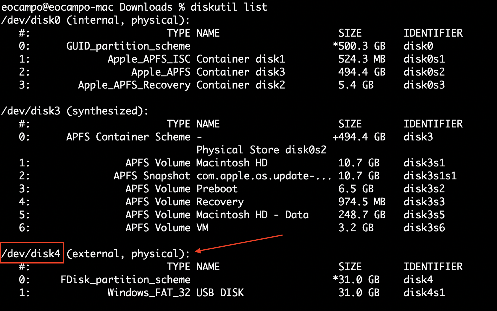
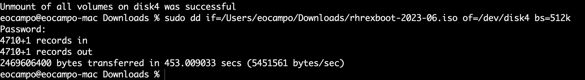

# Procesos de preparación de exámen

## Descarga de medios y creación de memoria USB con Boot

- [Programación exámen](https://rhtapps.redhat.com/individualexamscheduler/#/PublicLocations)

- [Prepración del exámen](https://learn.redhat.com/t5/Certification-Resources/Getting-Ready-for-your-Red-Hat-Remote-Exam/ba-p/33528)


```bash
diskutil list
diskutil unmountDisk /dev/disk4
sudo dd if=/Users/eocampo/Downloads/rhrexboot-2023-06.iso of=/dev/disk4 bs=512k
```

{ width="600" height="400" style="display: block; margin: 0 auto" } <center>Lista disco Mac</center>

{ width="600" height="400" style="display: block; margin: 0 auto" } <center>Unmount & dd</center>