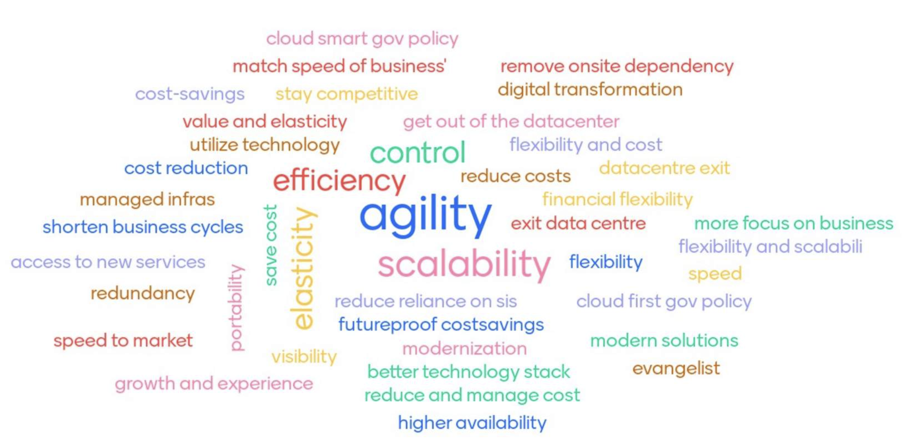
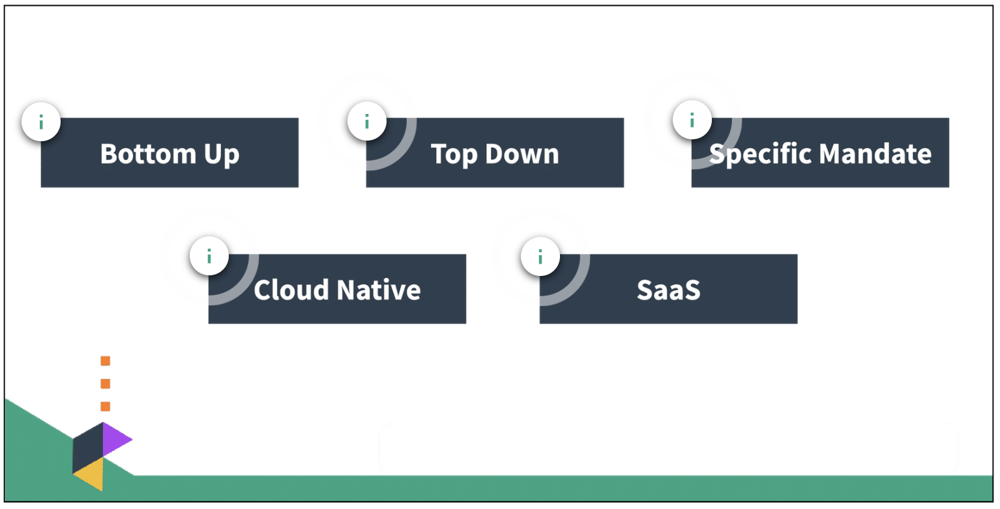
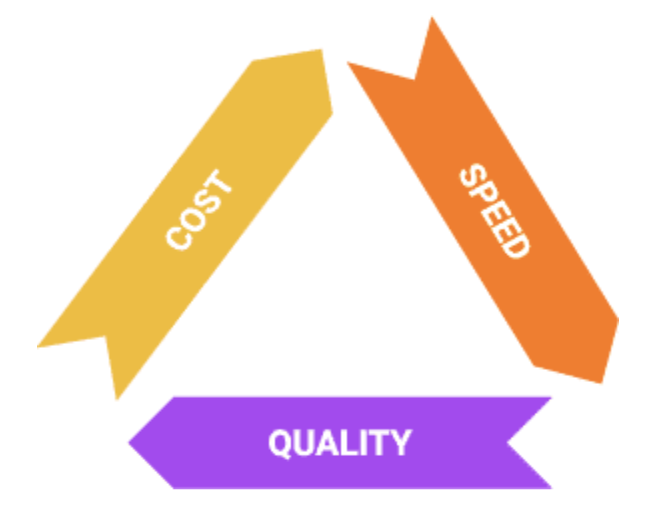
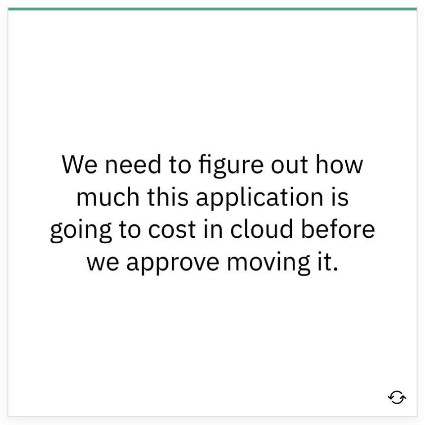
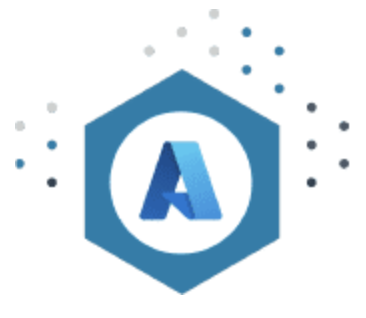
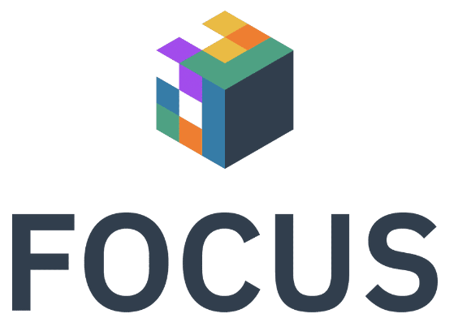
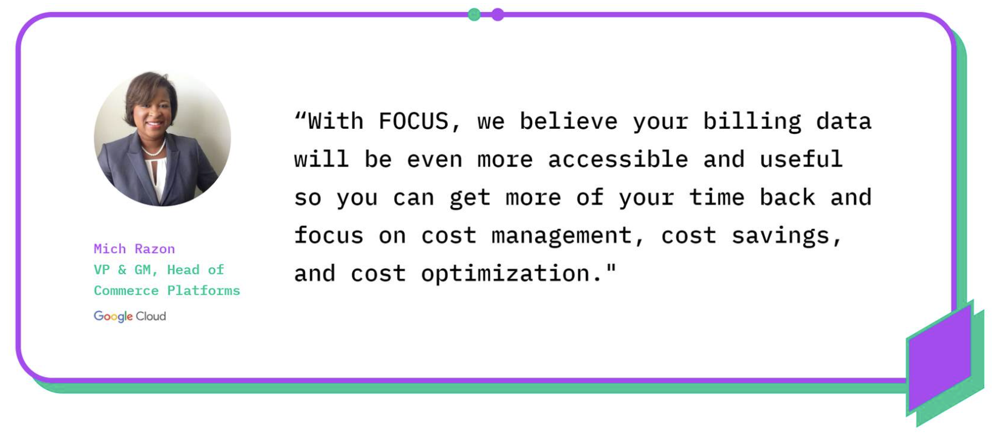
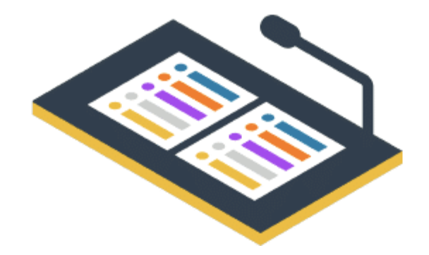
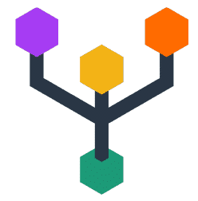

# FinOps Certified Practitioner Introduction

## Getting Started

### Introduction to FinOps

FinOps is an evolving cloud financial management discipline and cultural practice that enables organizations to get maximum business value by helping engineering, finance, technology and business teams to collaborate on data-driven spending decisions.

### Cloud FinOps Book

Anyone working in engineering, finance, procurement, product ownership, or leadership in a company running—or aspiring to run—in the public cloud will benefit from this book. As an organization understands the personas in FinOps, it can map them to relevant teams across the business. 

This book is not required to pass the test or complete the course, however, it is a good companion reference and includes additional stories and context.

### FinOps Terminology

There are lots of terms and tools specific to FinOps. Utilize the terminology resources below throughout the course to support your learning.

- **FinOps Terminology**: A list of terminology and examples for Cloud Cost Management, Public Cloud, Software Development & Operations, and Finance & Accounting categories. [FinOps Terms](https://fino.ps/C2UHWT)
- **Multi-Cloud Tools & Terminology**: A matrix of tools available to help FinOps practitioners learn and practice efficient utilization of cloud resources as well as terminology and additional resources. [Multi-Cloud Terms](https://fino.ps/LCvUwP)

### Organization Information

Gather information about your organization's cloud use and cloud challenges to use throughout this course. Below are some key questions to help you get started. 

 * What are the organization’s goals in using the cloud?
 * What have been the challenges in accomplishing these goals?
 * What accomplishments can be attributed to the cloud that could not have happened otherwise?

### Be the FinOps Lead
 Throughout this course, we encourage you to think of yourself in the position of a FinOps lead at your organization. This is the person who will be leading the company's cloud journey. At the end of each module, check-in to see how your knowledge is evolving and how you will address each topic at your organization. 

## FinOps Foundation Overview

### About the FinOps Foundation

 The FinOps Foundation is a program of the [The Linux Foundation](http://linuxfoundation.org/) dedicated to advancing people who practice the discipline of cloud financial management through best practices, education, and standards. The FinOps Foundation includes 5300+ individual members, representing more than 1500 companies. [Learn More](https://fino.ps/jLx9PQ)

### Mission of the FinOps Foundation

 To advance every individual who manages the value of cloud wherever they are.

 

### Get Involved

 If you are new to FinOps, there are lots of ways to get involved! 
 
 - Join our [Slack](https://finopsfoundation.slack.com/) and ask your question on _#ask-a-question_
 - Learn from others via [real world member stories](https://fino.ps/VQ29bX) and the [FinOps Podcast](https://www.finops.org/community/finops-podcast/)
 - Find help [adopting FinOps](https://fino.ps/m60bA0)
 - Gain insights on [encouraging engineers to take action](https://fino.ps/Zg5EAS)
 - Learn about [vendors in our community](https://fino.ps/k1i1V1)
 - Still need help finding what you need? Let us know at <hello@finops.org>
 - Questions about training? Contact us at <training@finops.org># Cloud Changes IT

## DevOps & Cloud

### DevOps & Cloud have broken traditional procurement 

 DevOps allows companies to accelerate technology delivery to meet customer demand using cloud. This shift has put purchasing power in the hands of developers in ways that have broken traditional procurement processes. DevOps and cloud have forced the removal of constraints that has led to the need for a new operating model. This new model allows for collaborative decision making and gives companies the ability to continue to maximize the value of IT investment. This is the premise that led to the development of FinOps. 
    
### DevOps & Cloud allow for all costs to be attributed to owners

 The cost of goods sold for our IT-enabled products and the cost per user of support systems, have always relied upon data centers and infrastructure whose cost is unchangeable. Product owners now have the ability to consume IT services in the exact mix and at the exact times when needed. Product owners can also build in such a way that all of the costs can be examined and taken into account in the pricing, support, and agile development processes. The cloud gives us the ability to develop applications on architectures that scale appropriately to demand, matching IT supply and demand more effectively than ever possible in the data center. All the while, improving our ability to buy incremental small systems and scale to massive heights.
    
### DevOps & Cloud offer unprecedented opportunities

 Procurement and finance now have the ability to see spending in real-time as well as granularity and attribution. Technology leaders who previously needed to face product demand, changes in technology trends, and data center infrastructure challenges, now have the ability to build incrementally. DevOps engineers, once constrained to whatever the infrastructure team had previously purchased within the confines of the data center, are now free to consider using a wide – and ever growing – selection of technologies to solve a range of customer needs. And, more importantly to the organization, DevOps engineers have the right to buy and use only what they need at any given moment.
    
***How do we develop the ability to tackle these challenges and take advantage of these new opportunities?***

## FinOps
  
### The New Operating Model for the Cloud
 
 For many organizations, FinOps is the new operating model for the cloud. FinOps is the practice of bringing technology, business, and finance together to master the unit economics of cloud for competitive advantage. It brings financial accountability to the variable spend model of cloud.

 ***Cloud FinOps is an evolving cloud financial management discipline and cultural practice.***

 - FinOps enables organizations to get maximum business value......by helping engineering, finance, and business teams...to collaborate on data-driven spending decisions.

    

### Creating a Culture of Accountability

 FinOps creates a culture of accountability by supporting product, finance, and business teams to collaborate and make real-time decisions related to tradeoffs between cost, speed, and quality. This drives decisions that increase business value to enhance efficiency and better align costs to business needs as well as improving forecasting of cloud costs.

### Cloud Usage & Goals 
 
 

 ***Before moving on***... 
    
 - Think about why your organization is using or moving to the cloud
 - Consider what you are trying to achieve by using the cloud
    

## The Challenge of Cloud**

### Traditional Technology Consumption

 Traditionally, companies had a platform team who dreamed of getting some hardware to build their application so they went to procurement. Procurement reviewed their complex business case and if sufficient, gave them access to the money.

#### In this model...

  * DevOps, or developers, are the requesters
  * Finance are the gatekeepers, the approvers
  * Spend is predictable and static, with known costs
  * There are long procurement cycles
  * The infrastructure purchased is usually intentionally oversized and not certain to be correct
  * There is high risk of some level of failure at a high cost
   
 

 To complicate things further, in a DevOps world, there are many teams working at once and technology requests are becoming more complex. Now, introduce the world of cloud and automation where procurement can't keep up or is not needed to make purchases. This leads to companies where engineers with automation go directly to the money. Procurement and finance are losing control of the investment and the ability to track it over time. This means they cannot do their fiduciary duty to the company to control and correctly report on costs!

#### Cloud changes the dynamic...

   + Engineers now have the power to spend company money with code
   + Finance has less visibility into spend until after the fact and cannot do their fiduciary duty to the company
   + Spend is dynamic and changes daily
   + There is agile experimentation and some waste
   + Overall, there is a lack of communication
   
   

### State of FinOps

 Below are the biggest unresolved pain points for organizations, gathered from 1,056 responses on the 2022 State of FinOps Survey.

 

#### State of FinOps Survey

 The State of FinOps data can be found at [data.FinOps.org](http://data.finops.org/). This data will be referenced throughout the course to illustrate points and to provide a way to dig into practitioner content. We see from our 2022 survey that several of the challenges reported as difficult for FinOps practitioners are these we've been discussing: organizational adoption, aligning teams, accounting for cloud costs. We'll talk about the other challenges later in the course.# What is FinOps

 ***At its core, FinOps is a cultural practice. It’s the way for teams to manage their cloud costs, where everyone takes ownership of their cloud usage supported by a central best-practices group. Cross-functional teams in Engineering, Finance, Product, etc. work together to enable faster product delivery, while at the same time gaining more financial control and predictability.***

 80% of organizations will overshoot IaaS budgets due to a lack of cloud cost optimization governance and misguided upfront spend commitments. [DevOps.com](https://devops.com/)

 You are not alone.

 Budget overruns often stem from a lack of cost governance and not understanding what the organization is committing to spend, how it is committing to spending, and what it is spending that money on.  FinOps helps address this reality. 

## Let's Recap

 Cloud FinOps is an evolving cloud financial management discipline and cultural practice.

 

 FinOps enables organizations to get maximum business value...by helping engineering, finance and business teams...to collaborate on data-driven spending decisions.

## The New Cloud Reality for IT

 - *Decentralized*: Buying centers are siloed and more decentralized than before. They can no longer be run through centralized IT or procurement.

 - *Material*: There is a 24% year-over-year increase in public cloud spend. These cloud costs are now material and are a large percentage of the company's spend. They are becoming much more visible to top company executives, and much more important to be able to deconstruct for CIOs and CIO finance teams.

 - *Variable*: Spending is variable. Spending is up and down and will move in unpredictable ways or ways that look unpredictable to finance teams that are not used to looking at IT spend in public cloud. Spending can be runaway when developers have the ability to launch services without regard to their costs. There is a large possibility for dramatic overspending. 

 - *Inefficiency*: There is a lot of inefficiency that will need to be drawn out from spending. Macroeconomic instability is going to push us more toward efficiency. Efficiency steps in the cloud pay off in dollars not spent. Whereas efficiency in the data center world, where costs were fixed and capped were not as effective. Inefficiency is a big indicator in the new cloud economy.

## FinOps: Changing the Model

 FinOps allows us to bring DevOps and IT Finance back into alignment, allowing for visibility into spending and collaborative control.

### In this model...

 - Engineering and finance can work together in what has been called “the FinOps Hug”
 - The company can leverage the "Infrastructure as Code" instant procurement the cloud offers
 - Experimentation is enabled, can be managed, and is more predictable (which is good for the business)
 - Lower risk and cost of failing to buy exactly the right hardware upfront and can change it as needed
 
 

# Adopting FinOps
 
## Where to Begin

 If you haven’t started to do FinOps or have started to use cloud but not formed a team yet, then you may need to begin by building the awareness and support for a FinOps practice. The FinOps Foundation has resources available to help you get started and begin to use the FinOps framework effectively.

 [Adopting FinOps](https://fino.ps/m60bA0)

## Impacts of Cloud Adoption

 Once an organization has recognized the need to use cloud to effectively build and manage IT value, there will be next steps to take. FinOps teams can have the biggest impact by enabling the whole organization to understand and gain visibility into the impacts of cloud.

  
 
 - **Technical** aspects of cloud adoption will be managed by the engineering teams.
 - **Governance** aspects of cloud adoption will be managed by architecture, security, platform, and infrastructure teams.
 - **Financial** Changes to the procurement and accounting processes related to the purchase of IT services will change as we move from an ownership-based IT model to the consumption-based IT model in cloud.
 - **Cultural** changes accompanying the adoption of cloud are often left untouched for longer periods of time as other tactical issues are addressed. These will be the areas where the FinOps team can best help the organization to adapt.

## Models of Adoption

 Select each information icon in the graphic below to learn more.

  

## Resources

### Adopting FinOps - Getting Started

 A starter guide to help you build a presentation to inform other teams, teammates, and stakeholders about the benefits of building a FinOps practice. [Learn More](https://fino.ps/m60bA0)

### Adopting FinOps - Pitfalls to Avoid

 This article is about what to invest and what to avoid, together with some stories that can help inspire the FinOps journey you are about to make. [Learn More](https://fino.ps/kPpUzT)

# FinOps Framework & Principles

## The FinOps Framework

### FinOps Framework

 The FinOps Framework describes the **principles** that drive FinOps practices, the **personas** that FinOps supports as stakeholders, the **best practices** and **process models** used to accomplish this, and the **domains of activity** FinOps practitioners will perform as they build a FinOps team and drive the cultural change that FinOps brings into their organizations.

 

### FinOps Maturity

 A “**Crawl, Walk, Run**” approach to performing FinOps enables organizations to start small and grow in scale, scope, and complexity. Taking quick action at a small scale and limited scope allows FinOps teams to assess the outcomes of their actions and gain insights into the value of taking further action in a larger, faster, or more granular ways.

 Start at a __Crawl__ and mature the capabilities that provide your company strategic value. There is no need to try to do all capabilities at once.

 There is no value judgement here. Every organization does not need to be at the same level and each capability can be at a different level of maturity as well.

#### Examples

 - [Gall’s law](https://en.wikipedia.org/wiki/John_Gall_(author)#:~:text=Gall's%20Law%20is%20a%20rule,a%20simple%20system%20that%20worked) tells us that complex processes that work have evolved from simple processes that work; they are not designed from scratch. Do not attempt to build full solutions, rather, build only the amount of solution that you need in any given case. For example, you should build the capability to Run when it provides business value. If you are in the Run phase and it is not adding value, you may be wasting a most precious resource: time. 

 - In another example, you may be in the Run phase at buying commitment based discounts because you have a heavily VM based architecture that is very broad. Or, you may use a heavily serverless architecture that does not require a large amount of savings plans or RIs to be rate-optimized and you never need to develop this capability beyond the Crawl phase. None of these use cases is “better,” they are all well suited to their situation. 

### FinOps Lifecycle

 Like Agile, DevOps, or other modern methodologies, we practice FinOps in an iterative loop, making small incremental changes to our cloud infrastructure as we advance. We describe this approach using the FinOps lifecycle which is comprised of three phases.

 

  ***Strive for a regular, cyclical process to your analysis/work as you conduct the FinOps function.***

#### Phases In Practice

 - At first, it may take a while to perform the work in each phase and you may be more explicit about moving from one to another. However, over time, this cycle of looking at usage, looking for opportunities to improve, and then taking an incremental action step will become more fluid and natural. 

 - The ultimate goal is to exercise the FinOps lifecycle as frequently and quickly as possible, and to include as much automation to help that process as possible. This is how we take incremental steps toward building the culture of accountability and the governance to support our FinOps function.

 - We use this looping lifecycle with FinOps, in conjunction with Crawl Walk Run, to get more mature every time we go through the loop. 

## Important Concepts

### Prioritization & Triage

 When conducting our work in FinOps, because the work is cyclical and iterative, we want to establish a triage or prioritization model early on to drive our work. A FinOps team should often consider the question **“What will I work on next?”** The answer to that question will often be **“The thing that gives us the biggest business value boost.”**

#### How do you identify or document the value of any given step? 

 For now, consider that we want to use the Pareto Principle, or 80/20 rule, to focus on the costs or problems that appear as outliers in the data. We are naturally predisposed to look at these outliers (either small or large) but by taking a consistent approach to looking at the largest cost items, we will often improve our overall cost situation the most.

 

### Pick The Right Approach

 As you focus in on the items to be addressed, take a moment as a FinOps team to think through various approaches you will use to address the opportunity. When identifying the right approach for integrating the FinOps Framework into your business processes and model ask the following questions. 

 - Are there any existing business processes, behaviors, or capabilities in place that could accelerate or empower Framework adoption? Are there any that could hinder it?
 - What changes are needed in order to resolve those conflicts?
 - What are the most valuable “missing pieces” of the Framework to deliver first, for maximum impact? Are there any elements that may require considerable effort to achieve, and is there sufficient support for that effort?
 - When developing your Framework [adoption roadmap](https://fino.ps/m60bA0), ask: what is the appetite for change within the business, what are the cadences and the pace of change that the business can realistically achieve?

 Always keep the end goal in mind when building the FinOps Framework into your business - guide your actions by the key principles, and remember that this is a marathon, not a sprint! It will take time and an iterative approach to adopt the Framework and deliver success. 
 
 There is a tendency to dive into the solution we know, or to use the technique we are comfortable with, or the tool most recently used successfully. 
 
 Adoption of cloud is not just a technology problem, a business problem, or a system problem, it is very multi-faceted. Controls that traditionally were in place (procurement control on spending, IT control of technology selection, organizational control of speed, security physical control of environment) are less effective overall, so you may face and address issues that were handled by a wide variety of people in your organization previously all in one place.
 
 FinOps teams can become the catchall for questions from capacity planning to cloud service selection to automation to reporting to architecture redesign. Therefore, it is important to have the right resources lined up for support.

### Making Tradeoffs

 Cloud tradeoffs are made on what we refer to as the iron triangle. 

 All of these tradeoffs must be done by balancing the company’s goals. Decisions can be made to save money but you will be balancing against speed or quality. Similarly,  you could decide to spend more for better quality but you may give up on cost. 

 

### Unit Economics

 Making all these decisions ultimately leads us to where a mature organization wants to be able to clearly articulate its costs through [Unit Economics](https://fino.ps/7eWwyb). The goal is to make decisions based on value.

## FinOps Principles

 ***FinOps principles give us north stars to guide our activities as we practice FinOps. These principles were developed by FinOps Foundation members and honed through experience. ***

### Overview

 These principles are presented in no particular order and should be used all together as a set. Implementing one, without the others to the extreme creates problems just as implementing all except one will create. The principles are in open source in the [FinOps Foundation github repository](https://github.com/finopsfoundation/definition/blob/master/principles.md).

 - Teams need to collaborate
 - Decisions are driven by the business value of cloud
 - Everyone takes ownership of their cloud usage
 - FinOps reports should be accessible and timely
 - A centralized team drives FinOps
 - Take advantage of the variable cost model of the cloud

### The FinOps Principles

#### Teams need to collaborate

 FinOps is about cultural change: breaking down the silos between teams that historically haven’t worked closely together. Collaboration is the hallmark of FinOps. Teams must work together in near real-time as the cloud operates on a per resource per second basis. Continuous improvement and fast decision making are required and collaboration is the engine of the practice of FinOps.

#### Decisions are driven by the business value of cloud
 
 Unit economics and value-based metrics demonstrate business impact better than aggregate spend. Make conscious trade-off decisions between cost, quality, and speed (the iron triangle). Think of cloud as a driver of innovation, a driver of capability, and a way to get speed to market and customer satisfaction up.

#### Everyone takes ownership of their cloud usage
 
 Accountability of usage and cost is pushed to the edge. Individual feature and product teams are empowered to manage their own usage of cloud against their budget. Decentralize the decision making about resource usage and optimization. Technical teams must begin to consider cost as a new efficiency metric. 

#### FinOps reports should be accessible and timely
 
 Process cost data quickly and consistently for better cloud utilization. Visibility into cloud spend is provided to all levels of the organization. Create, monitor, and improve real-time financial forecasting and planning. Focus relentlessly on clean data to drive decisions. Utilize internal team benchmarking as well as industry peer-level benchmarking. 

#### A centralized team drives FinOps

 Centralized automation for FinOps reduces duplicated efforts. Executive buy-in for FinOps practices and processes is required. Rate and discount optimization is centralized. Centrally govern and control committed use discounts, reserved instances, and volume/custom discounts with cloud providers. Remove the need for engineers and operations teams to think about rate negotiations, then they stay focused on usage optimization.

#### Take advantage of the variable cost model of the cloud
 
 The variable cost model of the cloud should be viewed as an opportunity, not a risk. This includes just-in-time prediction, planning, and purchasing of capacity. Agile iterative planning is preferred over static long term plans. Make continuous small adjustments in cloud usage/optimization.# Personas & Teams

## Personas

### Collaboration

 FinOps is inherently about collaboration. The key to the FinOps practice is the need to support a variety of different personas across the business. The FinOps team does not need to have all of the skills of each persona. Rather, they should work to build connections between personas as the FinOps culture becomes ingrained in the organization. FinOps teams also work to ensure the right people in the organization have the information they need to do their specific jobs.

 

 - Each persona represents a different discipline or perspective on the business
 - Each persona brings their own particular motivations and backgrounds to the discussion
 - Each persona brings important skills and abilities to the successful practice of FinOps
 
 **The FinOps team should be focused on providing information specific to and useful to each of these personas**. Cloud cost and usage data may be a very deep and broad set of data about an organization's services. However, a big part of what is done in data analysis and showback, chargeback, budgeting, forecasting, and in the organization alignment domain can be customized and tailored to the needs of the audience. The FinOps team can do more than simply provide "all the data."

### Personas Across the Organization

 An important soft skill of a FinOps team is understanding how to serve each persona. Every persona has different interests (cost versus usage, applications versus services, scope, KPIs, etc.).
 
 Let's refer back to the FinOps principle: everyone is responsible for their cloud usage. Personas cannot be responsible without good information. Good information must come from all groups who use cloud being able to see, in near real time, what they are using. This enables them to optimize as they go and build responsibly. The FinOps team must ensure everyone takes the responsibility for their cloud usage seriously.
 
 Every organization will have specific personas that outline the roles and responsibilities of specific groups in the organization. For example, government entities often have very strong procurement or contract management personas due to the many contract restrictions on government purchasing. In another example, traditional IT companies might have an ITAM persona who works with the FinOps team. Other organizations may have neither of these and the finance persona will handle these responsibilities. Take some time to determine who the personas in your organization are and define how the FinOps team will support each.

 **Practitione**
 
 
 **Executive**
 
 
 **PO**
 
 
 **Engineering**
 
 
 **Finance**
 
 
 **Procurement**
 

 [Additional information about FinOps personas.](https://fino.ps/Ip8N0h)

### FinOps Team

 FinOps sits at the junction of all these groups and helps to coordinate their activity. Additionally, the FinOps team will have interaction with and may coordinate the activities of cloud vendors externally and many teams internally.

 

 While FinOps primarily focuses on the coordination of discounts and collaboration with commercial cloud companies, the same disciplines and processes can be used to coordinate workload placement in other commercial clouds or on-premises or collocated data centers as well.

## Teams

### A FinOps Team

 For an organization to successfully adopt cloud, adopt the FinOps principles, generate best practices, and satisfy the needs of the diverse set of stakeholder personas, it needs a FinOps Team. The FinOps team is not a gatekeeper, but a facilitator which brings a unique set of skills and information to the organization to help it adopt a FinOps culture and more successfully drive value from their use of cloud.

#### A FinOps Team's Primary Actions
 
 - _Push Accountability Through the Organization_: FinOps requires that we extend accountability to the edges of the organization, where the commitment to purchase now resides. FinOps teams empower feature and product teams to manage their own usage of cloud against their budget. Note that every persona does not have to watch everything, the FinOps team can focus on providing curated information to meet a persona’s needs.
 - _Centralized Rate & Discount Optimization_: The FinOps team itself centrally governs and controls: Committed Use Discounts, Reserved Instances, Savings Plans, and Volume/Custom Discounts with Cloud Providers (FinOps principle: a centralized team drives FinOps). 
   
    The FinOps team is looking at the macro consumption by regions, instance types, and will have insights into both product development and executive strategic planning. This is a specific job individuals within a FinOps team do themselves by analyzing, getting commit sign-off, procurement authorization, and executing.

### Building a FinOps Team

 FinOps teams are as diverse as company organization structures and there seems to be no one way for how to build or run a FinOps team. Here are some key questions to ask when getting started.

 - Who should be on a FinOps team? 
 - What roles should we look for?
 - How many people should be on a FinOps team?
 - Where should the FinOps team report in the org chart?
 - What are the barriers to effectiveness?

### Team Structure Examples

 1. Most FinOps teams start with someone part-time who has other job roles and then evolves from there.
 1. In a less complex organization, a dedicated team can be the central point for all activities.
 1. In a more complex organization, or one that has inconsistent use case across business units, a fully matrixed organization might be a better model, giving each unit more autonomy. For example, this might be a good model for a private equity company which expects each unit to be bought or sold independently, and only wants loose coordination across them.
 1. Fidelity speaks publicly about their “hub and spoke” team structure which has each of their six large-scale cloud-using business units (BU) contributing a person to a core team. This core team performs the FinOps function for the organization as a whole (central RI purchasing, etc.) and then those people also represent and promote FinOps within their BU. They have long-term credibility, an in-depth knowledge of the specific needs of the business unit (all of which have very different cloud use cases), and they can drive that with their users. The centralized FinOps team has a shared understanding of FinOps, its value to the overall organization, and the benefits of the shared functions to the company as a whole.

### State of FinOps Data: Teams

 The State of FinOps survey report(opens in a new tab) is meant to be a living snapshot of the industry. We continue to collect additional responses from our membership and update this report as new insights come in.

 
 In 2019, FinOps members identified the following common roles that existed on FinOps teams.

 
 Our analysis also shows teams are growing 47% from last year and expecting to grow 75% next year.

 **Team size seems to hinge on complexity of cloud use** ($10M a year on one SaaS product is easier than $5M a year on 50 applications) **and complexity of company** (multi-BU, multinational, dozens of apps, five levels of management all complicates things).

 Most often FinOps sits where the problem started in an organization, and it should then move to wherever the coordination point is to continue doing it.

 

 | Location of FinOps Team | Pros / Cons |
 | :---------------------- |:----------- |
 | CIO | May have more sway with engineers; may not be aligned fully with finance, who watches the watchers |
 | CFO | May be overly focused on cost savings, may not have support of engineers |
 | Procurement | May be too low in the organization to be effective, may have the best view as to all avenues for cost savings, right mindset |
 | IT Finance | May not have the skills or experience to think broadly about finance topics, may be closer to engineering teams |
 | CEO | This should be a cooperative effort, not jammed down from above, but high level focus and push can make it effective immediately |
 | Strategic Initiative | Ultimately cloud and FinOps are standard operating procedure, so if strategic, plan to find a permanent home for it soon |
 | CTO | Worry about FinOps seeming like it’s all about new things, technology change, again look for a permanent home ultimately |

# Domains & Capabilities

## Domains Overview

### Overview

 Remember, you are moving to the cloud, facing challenges, and opportunities along the way.  FinOps is helping you on that journey with the north star principles and you’ve formed a FinOps team to help work toward them. **Now, what does a FinOps team do?**

 
 The FinOps capabilities are the “what” the FinOps team does. **Within the FinOps framework, the capabilities are categorized into domains**. The FinOps team will do work in every domain. However, they will not do all the capabilities all the time or at the same level of maturity.

  ***Visit [finops.org](http://finops.org/) for more information on [domains](https://fino.ps/kKISA8) and [capabilities](https://fino.ps/Ay1zp5)***

### FinOps Domains

 FinOps domains are the areas of activity or knowledge that are linked to the business outcomes an organization should expect from a FinOps practice. You can think of FinOps domains as the reaction to the large scale changes created by cloud use in the organization. Every organization should strive to do work in each of these domains.
 

### Key Questions

 Each domain answers important questions for the organization using cloud. Click each card to learn more.
 
 | Answer | Question |
 | :------- | :----- |
 | Understanding Cloud Usage and Cost | What are we spending on cloud, what are we using, and who is paying for it? |
 | Performance Tracking & Benchmarking | Does what we’re using and spending create a path for us to achieve our strategic and organizational objectives?  |
 | Real-Time Decision Making | What actions should we be taking right now to allow us to better meet (or stay in line with) our organizational goals? |
 | Cloud Rate Optimization | How can we change the rate we’re paying, or the way we’re buying what we are using in the cloud to see better price performance? |
 | Cloud Usage Optimization | How can we adjust what we’re using in the cloud and when we’re using it to better meet our organizational goals? |
 | Organizational Alignment | What changes or integrations can I do to make my organization use cloud more effectively? |

### An Analogy

 Callie has been preparing to do a Master Gardening program. When she goes out into the garden every morning, she uses a similar lifecycle model to inform her as to the general health and situation of the garden. She will look for things she may want to do to optimize, then take action on those things for the period of time she has available.
 
 The types of things she will do in the garden might include: watering, fertilizing, pruning, planting, mulching, thinning, pulling up, shaping, replanting, or any number of other tasks. She might be at the “run” maturity at watering and fertilizing but still at the “crawl” maturity when it comes to pruning. She might even be at the “run” maturity at pruning certain types of plants but not others.
 
 The one thing she knows is that she will never “mulch” her way to the perfect garden. She will always have to be able to draw upon a wide variety of skills – at all different levels of maturity – to maintain the garden. As Callie adds to the garden's diversity and experiences different weather conditions and seasons over time, her skills will have to mature and broaden as well.
 
 Just as Callie uses a lifecycle model and performs certain actions (capabilities), you will work to implement each of the different actions (capabilities) of FinOps to maintain the cultural practice of FinOps and maximize business value.

 

## Understanding Cloud Usage and Cost

### Understanding Cloud Usage and Cost

 This domain enables an organization to understand what cloud services it’s using, what is driving spend, and who owns that spending. It provides key data consistently to support a picture of current cloud usage and a view into historical trends at a level of granularity appropriate to the organization's current maturity level.

### Key Questions

 - What are we spending on cloud?
 - What are we using?
 - Who is responsible for that usage?

### Focus Areas

 | Focus Area | Description |
 |:---------- | :---------- |
 | WHEN TO USE | When will you use this domain most?    Continuously throughout your FinOps practice and consistently during Crawl, Walk, and Run phases.   Over time you will develop more granular reporting, more detailed metadata strategies, and more automation to your hierarchy and compliance |
 | KEY BUSINESS OBJECTIVES | What are the key business objectives that will lead you to perform this domain?    All of the other domains of FinOps rely heavily on this domain and without it they cannot succeed |
 | SUCCESS CRITERIA | How do you need to think about this FinOps domain to be successful?     Data quality, consistency, timeliness, and clarity are absolutely essential   Evolve metadata, hierarchy and reporting consistently over time, making small improvements as your cloud use evolves and your FinOps practice becomes more mature |
 | APPLICABLE PERSONAS | Which personas are critical to and most involved in this domain?    All stakeholder personas will rely upon this data   Defining the metadata and hierarchy for cost allocation will rely heavily on engineering platform teams and architecture teams   Reporting will rely heavily on finance and executives for input |

### Capabilities

#### Data Ingestion & Normalization

 Data ingestion and normalization in the context of FinOps represents the set of functional activities involved with processing/transforming data sets to create a queryable common repository for your cloud cost management needs. [Learn More](https://fino.ps/vwUzNq)

#### Cost Allocation (Metadata & Hierarchy)

 Cost allocation is the set of practices to divide up a consolidated invoice or bill among those who are responsible for its various component parts. In the context of FinOps this typically involves dividing up consolidated Cloud Service Provider invoices among various IT groups who use cloud within the organization. [Learn More](https://fino.ps/G7koXK)

#### Managing Shared Costs

 A foundational principle of FinOps is: “Everyone takes ownership for their cloud usage." The true key to understanding total cost of ownership is built upon transparency and accuracy, but unallocated shared costs hinders both of these. Without appropriately splitting costs that are shared, engineers and product managers lack a complete picture of how much their products are really costing. [Learn More](https://fino.ps/q2FEwq)

#### Data Analysis & Showback

 Data analysis and showback is the ability to leverage data, along with metadata on cloud resources and resource hierarchies, to create a near “real time” reporting mechanism for stakeholders which calls to attention: total costs for the desired business entity, opportunities for cost avoidance, and KPIs for financial health (e.g. performance of rate reduction commitments, unit cost measures for key services, efficiency metrics aggregated by desired “team”, organizational unit, etc…). [Learn More](https://fino.ps/zwE24F)

## Performance Tracking & Benchmarking

### Performance Tracking & Benchmarking

 Within this domain, the organization sets and maps its usage and cost to budgets, uses historical information to forecast, and establishes and measures KPIs and other performance indicators (including benchmarking). This domain entails the capabilities that look at past and current spend, setting baselines and budgets, and then forecasting to help understand if spending is expected, understood, and at a level that meets organizational objectives.

### Key Question
 
 Does what we’re using/spending allow us to achieve our strategic and organizational objectives?

### Focus Areas

 | Focus Area | Description |
 |:---------- | :---------- |
 | WHEN TO USE | When will you use this domain most?    Continuously throughout your FinOps practice and consistently during Crawl, Walk, and Run phases   Will take some work early in your journey   Slow, steady evolution toward things that bring you value   Large effort to adopt cloud budgeting  |
 | KEY BUSINESS OBJECTIVES | What are the key business objectives that will lead you to perform this domain?    Goal/budget setting relies on tracking over time and against others   Accurate forecasting in cloud is much more important   Consistent and meaningful KPI/unit metric reporting |
 | SUCCESS CRITERIA | How do you need to think about this FinOps domain to be successful?    KPIs can be used in many ways across the business, they are most useful in dynamic areas of variable spend (be creative here)   Measure similar things against one another, measure unique things against themselves over time   Budgeting and forecasting both have to change dramatically and it will take years to complete |
 | APPLICABLE PERSONAS | Which personas are critical to and most involved in this domain?    All stakeholder personas will rely upon this data   Defining the KPIs that will measure each discipline will require those managing each discipline   Budgeting will rely heavily on finance and executives for input   Forecasting will be a joint effort between finance and engineering groups in the long run |

### Capabilities

#### Measuring Unit Costs

 This capability is about developing metrics that reveal the business value of your cloud spend. By calculating cloud spend for total revenue, you can attach growth in cloud spending to your overall business growth. When these are in line, it makes sense that cloud spend isn’t wasted. When cloud spend is growing faster than the business, there may be cause for concern. For a customer-facing application, that unit might be a user or customer subscription; for an ecommerce platform, it might be a transaction; and for an airline, it might be a seat. [Learn More](https://fino.ps/vkuXse)

#### Forecasting

 Forecasting is the practice of predicting future spending, usually based on a combination of historical spending and an evaluation of future plans, understanding how future cloud infrastructure and application lifecycle changes may impact current budgets and influence budget planning and future cloud investment decisions. [Learn More](https://fino.ps/W5KgT3)

#### Budget Management

 Budgeting for Cloud (or other IT expenses) is a process of collecting estimated expenses for a specific period of time. Decisions on how to operate as a business, what to invest in and other strategic decisions are made based on budgets. If actual expenses do not match the budget, it can impact the operations and other decisions that were made based on those budgets. [Learn More](https://fino.ps/tb7YUc)

## Real-Time Decision Making

### Real-Time Decision Making

 When we understand what we are spending and understand how we are performing relative to expectations and standards, we can use that information to make real-time decisions.

 The goal is not to strive for real-time data in and of itself, but to leverage timely access to consistent cost and usage data for making continuous adjustments. This domain improves stakeholder enablement by curating data in stakeholder specific contexts, continually improving decision speed and aligning organizational processes to the realities of operating in the cloud.

### Key Question
 
 What actions can I take now to allow me to better meet organizational goals and objectives?

### Focus Areas

 | Focus Area | Description |
 |:---------- | :---------- |
 | WHEN TO USE | When will you use this domain most?    Continuously throughout your FinOps practice   Consistently during Crawl, Walk, and Run phases, but with more action required by the FinOps team earlier in maturity   As you mature, your decisions will be more impactful and important in the "run" phase |
 | KEY BUSINESS OBJECTIVES | What are the key business objectives that will lead you to perform this domain?    Variable use and real-time usage of cloud services means costs accrue immediately   Monthly billing cycles are too slow to spot excessive spending |
 | SUCCESS CRITERIA | How do you need to think about this FinOps domain to be successful?    Establish decision matrix ahead of problems   Update decision trees and policies regularly   Use automation (in layers) to spot anomalies   Regular communications to those who can investigate or solve anomalous spending |
 | APPLICABLE PERSONAS | Which personas are critical to and most involved in this domain?    The engineering persona will be critically involved because they must be responsible for their cloud use   FinOps teams will drive this behavior initially if it is new to the organization   Finance or leadership may want to have an aggregate view of anomalous spending |

### Capabilities

#### Establishing a FinOps Decision & Accountability Structure

 Establishing a FinOps decision and accountability structure is about capturing an organization’s FinOps-related roles, responsibilities, and activities to bridge operational cloud cost management gaps between teams. These decision-making and accountability structures help cross-functional teams work out the processes and decision trees they’ll need to use to tackle challenges and resolve conflicts, in addition to having them be proactively available when they need to take action ahead of time.

#### Managing Anomalies

 Anomaly management is the ability to detect, identify, clarify, alert and manage unexpected or unforecasted cloud cost events in a timely manner in order to minimize detrimental impact to the business, cost or otherwise. Managing anomalies typically involves the use of tools or reports to identify unexpected spending, the distribution of anomaly alerts, and the investigation and resolution of anomalous usage and cost.

## Cloud Rate Optimization

### Cloud Rate Optimization

 Within this domain, the organization works to define pricing model goals, uses historical data to make pricing model adjustments by buying commitment based discounts, and works to manage the pricing aspects of services it is using in the cloud. The cloud rate optimization domain will contain the specialized capabilities to improve the way we purchase cloud services and ensure our pricing models, purchase options, and committed use are consistent with our goals.

### Key Question

 How can we change what we pay for in the cloud to achieve better price performance?

### Focus Areas

 | Focus Area | Description |
 |:---------- | :---------- |
 | WHEN TO USE | When will you use this domain most?    Continuously throughout your FinOps practice   Likely in more impactful ways early in FinOps maturity   Over time you will develop more granular reporting to track your rate optimization |
 | KEY BUSINESS OBJECTIVES | What are the key business objectives that will lead you to perform this domain?    Pay lower amounts of money for things you know you’ll use over an extended period   Leverage commitment targets to move more workloads more quickly   Achieve a level of savings while doing longer-cycle optimizations |
 | SUCCESS CRITERIA | How do you need to think about this FinOps domain to be successful?    Track commitments against actual usage, balance of various discounting levels, and commitment levels   Consistent coverage rate (at targets set by organization)   Improved rate optimization over time   KPIs around savings and cost avoidance as a result of rate optimization   High utilization of commitments |
 | APPLICABLE PERSONAS | Which personas are critical to and most involved in this domain?    A FinOps team will provide access to forecasts and usage patterns to make commitment decisions   Executives and procurement will manage many of the commitment discussions   Finance will be involved in verifying commitments to strategy and approving commitment payments   Product owners consult on forecasting and give guidance on commitment impacts to budgets |

### Capability

#### Managing Commitment Based Discounts
 
 Spend-based commitment discounts and resource-based commitment discounts are the most popular rate optimizations that cloud service providers offer. Each cloud service provider has a slightly different offering with its own specific rules on how it works and the discounts it provides. You must consider the implementation models that organizations use, based on their needs, and how the overall process should work inside an organization. [Learn More](https://fino.ps/QU3V2g)

## Cloud Usage Optimization

### Cloud Usage Optimization

 Within this domain, the organization identifies and takes action to match running cloud resources to the actual demand of the workloads running at any given time. This work involves predictive rightsizing of resources, managing workloads to align with the correct number of scaling resources, turning resources off when not in use, and other techniques.

 The cloud usage optimization domain contains the set of capabilities to match our actual workload needs to the cloud services we use at any given time as closely as possible. Using the right resources, in the right size, only when we need them to produce business value is ultimately how the variable use model of cloud allows us to do to maximize value to our business.

### Key Questions
 
 - How can we change **what** we use in the cloud to better meet organizational goals?
 - How can we change **when** we use it to better meet organizational goals?

### Focus Areas

 | Focus Area | Description |
 |:---------- | :---------- |
 | WHEN TO USE | When will you use this domain most?    Continuously throughout your FinOps practice   More frequently during Crawl and Walk than in Run phase as engineering teams push cost earlier in the design & build process   More for newer services and products that are unfamiliar |
 | KEY BUSINESS OBJECTIVES | What are the key business objectives that will lead you to perform this domain?    Only use what you need |
 | SUCCESS CRITERIA | How do you need to think about this FinOps domain to be successful?    Efficiency metrics will show the areas in which to focus   Prioritize teams, products, or use cases that provide most value (work through that list from top down)   Empower those who can make a difference as close to the resources as possible |
 | APPLICABLE PERSONAS | Which personas are critical to and most involved in this domain?    Engineering is the key persona for cloud usage optimization   Everyone is responsible for their cloud use   FinOps teams will drive early on   Leadership should champion |

### Capabilities

#### Onboarding Workloads
 
 This capability is about establishing a cloud front door process to onboard brownfield and greenfield applications through financial viability and technical feasibility assessment criteria. [Learn More](https://fino.ps/HWm5tX)

#### Resource Utilization & Efficiency 

 The management of resource utilization and efficiency translates into identifying whether there is scope to reduce resource costs while maintaining the required performance and, if there is, making the changes required where it is economically worthwhile to do so. [Learn More](https://fino.ps/9hmWYF)

#### Workload Management & Automation

 Workload management and automation focuses on running resources only when they are needed, and creating the mechanisms to automatically adjust what resources are running at any given time. This capability is intended to give FinOps teams the ability to match supply to demand most efficiently, and effectively optimize cloud usage through measurement of workload demand and provisioning capacity dynamically. [Learn More](https://fino.ps/IHynA0)

## Organizational Alignment

### Organizational Alignment

 Within this domain, the organization acts and automates to manage cloud use within the context of other IT finance activities, and integrates FinOps capabilities with existing organizational processes, organizational units, and technology.

 This domain contains the capabilities we’ll use to continuously improve, to change, and align our organization itself - its people, processes and technology - to use cloud in the way it will benefit the company best. Actions here may improve persona centric enablement, FinOps training and adoption, and align existing processes to support cloud use more effectively.

### Key Questions

 - What changes can I make within my organization to use cloud more effectively?
 - How can I establish a FinOps culture to enable stakeholder teams?

### Focus Areas

 | Focus Area | Description |
 |:---------- | :---------- |
 | WHEN TO USE | When will you use this domain most?    Continuously throughout your FinOps practice   Consistently during Crawl, Walk, and Run phases   Purposefully maintain focus on evolving organizational alignment as cloud maturity grows   Important to introduce early in the FinOps maturity for maximum impact (refine as you grow) |
 | KEY BUSINESS OBJECTIVES | What are the key business objectives that will lead you to perform this domain?    Ensure all key stakeholders are informed, educated, and empowered to make timely, data-driven decisions to maximize value   Strategy and context flows across the business to promote successful implementation  Improve the quality and pace of real-time decision making |
 | SUCCESS CRITERIA | How do you need to think about this FinOps domain to be successful?    Clear and appropriate cadences and cycles for stakeholder reviews and decisions   High level of confidence that using cloud is being used in the best way to maximize benefit |
 | APPLICABLE PERSONAS | Which personas are critical to and most involved in this domain?    All stakeholder personas will be affected by and involved in the organizational alignment domain   FinOps is driving alignment across all levels and disciplines within the organization   Successful alignment depends on engagement and support from the entire organization |

### Capabilities

#### Establishing FinOps Culture

 This capability is about creating a movement to establish cultures of accountability so that your organization understands that the practice of cloud cost management is really about leveraging FinOps to accelerate the creation of business value. [Learn More](https://fino.ps/iaaBkR)

#### Chargeback & Finance Integration

 Chargeback and finance integration is about pushing spend accountability to the edges of the organization that are responsible for creating the expense. [Learn More](https://fino.ps/nwqwUJ)

#### FinOps Education & Enablement 

 FinOps education and enablement allows all those participating in FinOps practices to increase the business value of cloud by accelerating FinOps adoption. [Learn More](https://fino.ps/LDVZ7P)

#### Cloud Policy & Governance

 Policy and governance can be thought of as a set of statements of intent, with associated assurances of adherence. A “cloud policy” is a clear statement of intent, describing the execution of specific cloud-related activities in accordance with a standard model designed to deliver some improvement of business value. “cloud governance” is a set of processes, tooling or other guardrail solution that aims to control the activity as described by the cloud policy to promote the desired behavior and outcomes. Combining good policy and governance provides us with a mechanism to orchestrate and direct our Cloud FinOps activity. [Learn More](https://fino.ps/cV0V41)

#### FinOps & Intersecting Frameworks 

 This capability examines the intersection between FinOps with other standards and frameworks used within your organization. Widespread use of public cloud creates new challenges for traditional processes and the intention for this capability is to provide a place to capture FinOps’ interactions with existing IT and financial standards being used by your organization. [Learn More](https://fino.ps/dEQoT2)

## Platforms & Tools

### Platforms & Tools

 Every organization will use some combination of cloud provider provided tools, third party or open source tooling, and internally developed tools and platforms to perform every domain. The mix of tooling and process support will change as you mature in your practice of FinOps and in your use of cloud.

#### Cloud Provider Cost Management Tools
 - All cloud providers will include tools designed to help you understand your cloud usage and cost 
 - Cloud provider platforms will most often only be applicable to that cloud provider’s usage
 - Differences will exist between providers’ data primarily in granularity, grouping/summarization, handling of amortization for prepaid amounts, and application of custom discounts and credits
 - Cloud provider tools and platforms are typically going to be available for no or very low cost

#### FinOps Platforms & Tooling
 
 - Understanding cost and usage calls for a lot of data ingestion, summarization, normalization and data analysis
 - Broadly-focused platforms ingest cloud data, process it, provide recommendations, and provide a broad reporting mechanism that will cover a wide variety of reporting needs
 - Consider more specialized tools where you have extensive use of specific products or services (e.g. Kubernetes)
 - Broad FinOps platforms typically are sold at a percentage of your overall cloud cost managed

#### FinOps Service Providers (consulting help)

 - Some FinOps service providers offer services which perform this type of service on your behalf, but these would typically be longer-term consulting engagements to do this broadly focused job

#### Internal Tooling (custom)

 - FinOps teams need to be aware of the amount of data and degree of potential change which can occur in billing and usage data
 - Data quality will need to be monitored closely and consistently over time
 - Internal reporting and data analysis or metrics teams can often provide skilled resources who can help develop dashboards and other reporting capabilities inside your organization

## Activity

### Capabilities Review

 Read each of the following scenarios and consider which capability will best address it. (Flip each card for the answer before advancing to the next card)

 
 FinOps Education & Enablement

 
 Resource Utilization & Efficiency

 
 Cost Allocation

 
 Manage Commitment Base Discounts

 
 Forecasting

 
 Chargeback & IT Finance Integration

 

# Motivations & Common Language

## Motivations

### Overview

 Remember, you’re moving to the cloud, facing challenges and opportunities. Your FinOps team is coming together to meet the FinOps principles and to perform the FinOps capabilities. However, as you think of the breadth of activities you’ll need to perform, consider the motivations and common language needs that will come into play.

 

 Everyone the FinOps team interacts with has a different set of motivations, language, and point of view. Further, every member of the FinOps team itself brings a different set of motivations, language, and point of view. One of the primary jobs of the FinOps team is to integrate these motivations, languages, and points of view to drive collaboration.

 In order to do that work across the organization, though, we first have to establish a common language and understand the motivations of all of the teams we will work with.

### Motivations

 FinOps teams are usually cross-functional and matrixed, meaning there are a wide variety across many dimensions. Different motivations and language can come together, through collaboration, to be more powerful.

 *FinOps Teams Come with a Variety of:*

 * Backgrounds
 * Points of View
 * Motivations
 * Experiences

 * Biases
 * Vocabularies
 * Expertise

## Common Language

 A big part of building the FinOps practice is building a common language or vocabulary. Everyone on the FinOps team will be learning new terms and new concepts. Many of these terms are loaded with meaning that may not be apparent to all.

### Terms

 Each organization should build a working vocabulary or acronym list that defines key terms. This glossary should include both generic industry terms and terms that are specific to the organization. Below are examples of both generic and specific terms within FinOps (both cloud and discipline specific).

 | FinOps | |
 |:--- |:----|
 | Inform   Optimize   Operate   Financial | Crawl, Walk, Run    Rightsizing   Automation   Blended Rates |
 | Cloud | |
 | AWS   Azure   GCP | EC2   Enrollments   Projects |
 | Finance   Engineering / IT   Product / Business | NPV   DevOps   Agile |
 | Organizatioal | |
 | Organizational Hierarchy    Cost Tracking | Business Unit, Division    Cost Center, CMDB Code |

#### Glossaries

 There are lots of terms and tools specific to FinOps, utilize the resources below to get started.

 **FinOps Terminology**

 A list of terminology and examples for Cloud Cost Management, Public Cloud, Software Development & Operations, and Finance & Accounting categories. [FinOps Terms](https://fino.ps/C2UHWT)

 **Multi-Cloud Tools & Terminology**

 A matrix of tools available to help FinOps practitioners learn and practice efficient utilization of cloud resources as well as terminology and additional resources. [Multi-Cloud Terms](https://fino.ps/LCvUwP)

#### Finance & Accounting

 Below are key accounting terms useful when dealing with finance and accounting teams. What we do in the cloud has big implications to the finance teams and is a big change from the old data center model. Check with your finance team to see if they have an existing glossary of terms or find definitions to many terms [here](https://fino.ps/zw60U7).

  

### Importance of a Common Language

 We need to drive toward the point where the FinOps team does not have to be in every meeting translating every sentence for every team. Rather, the FinOps team should bring everyone into a common language where discussions can be productive between any groups. We then are able to let these groups build that culture of the cloud in their own teams as well.# Anatomy of a Cloud Bill

 Remember, you’re moving to the cloud, facing challenges and opportunities. Your FinOps team is in place, ready to perform the capabilities that will let you meet the goals of the FinOps principles. One of the biggest challenges you will face is something specific to cloud: the massive amount of information presented in the cloud bill.

## Levels of Cloud Usage & Cost Information

 Part of the reason FinOps can be so challenging is the quantity of data FinOps teams need to manage in order to report on usage, find optimizations, and act on them on a fast cycle. 

### Summary Invoice Data

 **Summary invoice data at the management, enrollment or billing account level**

 - Usage summarized for your whole organization
 - May be broken down by service name
 - May or may not include discounts 
 - Several pages covering an unlimited amount of spend, delivered once a month after the fact

### Usage & Cost Reporting Tools

 **Usage and cost reporting platform provided by the cloud provider (or third party or that you build)**

 + Usage reportable more flexibly
 + May or may not include specific rates, metadata, summarization information
 + Business Intelligence type tool for creating custom reports, available anytime

### Detailed Usage & Billing Data

 **Detailed cost and usage data via CUR file or billing APIs**

 * Detailed usage information at full granularity
 * Extremely large datasets, up to billions of lines of data per month, delivered each day

## Invoice Level

 Invoices are for billing, not FinOps. This is an example invoice report produced by a cloud provider. It summarizes hundreds of thousands of dollars, aggregated by service, with very little detail. This is too little data to effectively manage cost or usage. However, CUR Files, Billing Extracts and Billing APIs provide an often overwhelming amount of data.

 It is crucial to find the right tools to allow you to get the data you need at the right level of detail for your maturity level to make the real-time decisions you need to make.

 

## Cloud Cost Management Platforms

 Cloud providers offer tools to see more granularity. These tools generally provide a basic way to look at the data. These tools are always advancing and becoming more flexible and detailed.

 | AWS |
 |:--- |
 |AWS has the most mature billing process    Still Invoice and CUR come out of different systems, rarely match 100% to the penny   Constantly evolving   CUR is third generation bill format   CUR fed by individual service teams, not entirely internally consistent either |
 | 

 | AZURE |
 |:--- |
 | Invoices monthly or quarterly, depending on the contract relationship   Billing data via billing APIs pre-2020 does not include list cost, amortization of upfront payments, prepaid RI costs, specific resource information (scale sets, eg),   Utilization data available from Azure Monitor   Significant advanced internal tooling/platforms for reporting |
 |  |

 | GCP |
 |:--- |
 | Most summarized of the three, constantly evolving their [Standard Export](https://cloud.google.com/billing/docs/how-to/export-data-bigquery-tables/standard-usage) and [Detailed Export](https://cloud.google.com/billing/docs/how-to/export-data-bigquery-tables/detailed-usage) to add new columns to help customers understand their bill   Resource level information available for most services, the billing export is summarized at the SKU level |
 | 

 | OCI |
 |:--- |
 | |

## Anatomy of an AWS CUR File

## Detailed Cost & Usage

 There is a lot of new language introduced in the cloud usage and billing data, and we need to know how to deal with it. Cloud providers usually give you billing data every day; it is important to understand how the billing is coming in and how to understand the information.

### Raw cloud data is not human readable. 

 - Cloud bills can run to the hundreds of millions or billions of rows of data.
 - AWS breaks its monthly CUR file into dozens of files in the S3 bucket where they are stored so that each file is smaller than the maximum file size limit on some machines. So, the CUR can’t even be loaded all at once into Excel. It’s too big.
 - Azure and GCP provide data through an API, which allows more control over how big the data set is and how it’s summarized. However, these services also have multiple APIs.

 

###  The billing data contains the details about each charged item.

 * The billing data contains attributes about the charges (metadata or dimensions) like region or instance ID or the time it ran, the tags, the description, the size, etc. 
 * Metrics include the amount of time it ran, or the usage quantity, and the rate(s).
 * Multiple rates might be quoted, blended rates, unblended rates, amortized rates, etc. 
 
 

### One virtual machine might be billed at various rates. 

 * Some of a virtual machine's time might be covered by reservations and some on-demand.
 * Each "rate x usage" or "rate x time" combination will be a separate line.
 * Some services also include many types of charges/meters – usage, storage, iops, read/write units, data transfer, etc. 
 
 

### These files & APIs are imperfectly documented and change often.

 * They can go into the many teams dumping data into the billing data discussion if helpful.
 * They can go into the issue of data quality being a problem to manage if you build your own queries.
 * They can go into ongoing improvements in this area from all the vendor.
  
 

## Cloud Billing Data Fundamentals

 At the basic level each item has a time or usage number and a rate. We multiply those to get the cost. Everything else is details (lots of details). If you want to change the cost for yourself, there are two main levers:

 1. Change how much you use (decentralized)
 1. Change the rate you pay (centralized)

 # FOCUS

When thinking about cost avoidance, rate reduction, and practically every FinOps capability, we must talk again about data and cloud billing. A massive quantity of cloud billing data, likely from a wide variety of vendors, shows up every day. Your ability to ingest, normalize, and then analyze this data into coherent reporting and recommendations is compromised by this complexity and variability. This inefficient process needs a solution.

**FOCUS** (FinOps Open Cost & Usage Specification) is a project designing a vendor agnostic technical specification for cloud billing data. FOCUS aims to make billing data more consistent and usable across Cloud, SaaS, and even internal billing sources, improving your understanding of your costs, and allowing you to make better decisions. 

[focus.finops.org](https://focus.finops.org/) - Check out our dedicated FOCUS page to see the specification, contributors, and learn how to get involved. 

## Tell Me More

 Imagine there was a single view of spend connected to the delivery of applications and services in the cloud. Well, FOCUS says just how to do this! This means cloud adoption would move faster and stakeholders would start to trust more in the data and cost mapping.

 A simple bill that reliably reports across multiple vendors? FOCUS will remove complexity and overhead from processes such as allocation, chargeback, budgeting, forecasting, and more to maximize business value in the cloud. 

 

## Introduction to FOCUS

 In this session during FinOps X 2023, Mike Fuller (CTO of the FinOps Foundation) and Udam Dewaraja (Chair of the FOCUS Project) give an in-depth look at the FinOps Cost and Usage Specification project, better known as FOCUS. They discuss what the project is all about, its objectives toward steering the cloud billing data and its variants into something more of an open, accessible data model, and how practitioners, cloud service providers, and tooling vendors can get involved.

 [Introduction to FOCUS](https://www.youtube.com/watch?v=dnU3ZedDys4)

## How Will This Work?

 FOCUS is already underway. A specification has been created covering cloud service providers (CSPs) and future updates are expected to add support for SaaS providers and even on-premises datasets. The following steps show the outline for the modernization of cloud billing data.

 1. Build a specification detailing the dimensions and metrics required for good cost management
 1. Work with the community to convert existing billing formats into FOCUS compatible datasets
 1. Work with cloud service providers and SaaS providers to natively support FOCUS

## Why It Matters

 Understanding data and FOCUS could lead to an increase in trust and collaboration within the organization. With simplified and reliable data, an organization might feel empowered to share data more openly. This would enable those you work with to have more ownership of their own cloud spend. Additionally, rather than having to learn (or teach someone) multiple ways to run queries, there will be one centralized location and set of processes. This also means that your skills are more portable. You will be able to run queries on datasets that comply with the FOCUS specifications regardless of which CSP or SaaS providers are involved.

 Additionally, FOCUS means:

 1. Better understanding of cost and usage data to make better engineering decisions that consider cost from the beginning
 1. Better ability to compare apples to apples when considering how and where to run resources as part of an infrastructure or application
 1. More consistent terminology and data structures to enhance collaboration, and to make skills more portable across clouds, FinOps tools, and organizations.

## What People are Saying about FOCUS...

 **Tim O'Brien**, Senior Director Engineering, Walmart
 Learn more about how FinOps data is used at scale at Walmart and the importance of FOCUS for the future of data.
 [FinOps Data](https://youtu.be/gYbccHWAIzE?feature=shared&t=3257)

 **Mich Razon**, VP & GM Platform, Google
 **Fred Delombaerde**, VP Core Commerce, Microsoft
 **Phil Newman**, VP Product, Oracle
 Learn from this panel about why the each CSP would be involved in FOCUS and what this initiative would provide to their customers (YOU!). 
 [CSP Panel on FOCUS](https://youtu.be/gYbccHWAIzE?feature=shared&t=5025)

 **Google’s Insight on FOCUS**
 When they go closed, we go open – Google Cloud and open billing data.
 [GCP on FOCUS](https://cloud.google.com/blog/topics/cost-management/working-with-finops-foundation-on-open-cloud-billing-data)

 **Microsoft's Insight on FOCUS**
 This article explains how to export cost details using the FinOps Open Cost and Usage Specification (FOCUS). 
 [Azure on FOCUS](https://azure.microsoft.com/en-us/updates/export-cost-using-focus/)

# Running the FinOps Team

## Recap

 We have spent a lot of time learning about the work that a FinOps team must do in an organization. Now, how do we use these concepts and models in our FinOps team to help our organizations achieve greatness and still focus on the FinOps team as a team?

 As we run our team we want to hone in on FinOps as a discipline. We also have to remember that our FinOps team itself (whatever the size, structure or reporting point) requires management and focus too.

## Understanding Types of Work Performed

 As your FinOps practice continues to grow and evolve along with your cloud adoption journey, it is likely that no two days will be the same. As the roles, responsibilities, processes, and tasks of your team develop, they will often fall into three areas: ad-hoc, business as usual (BAU), and planned work.

 Appropriate time and resources should be budgeted to accommodate these different workflows, ensuring that the practice is always able to respond to time-sensitive matters while continuing to perform the daily activities.

 

## Running a FinOps Team

 The [Adopting FinOps Roadmap](https://fino.ps/m60bA0) gets your organization primed to actually begin to perform the capabilities we have described as well as accelerate and amplify the value of your move to cloud. Once a FinOps team is running, there will also be an arc of progress as you launch, mature, and grow your cloud use.

### Operating the Team as a Team

 First there should be a focus on operating the team as a team with a distinct set of goals, KPIs, and responsibilities. It is tempting to staff a FinOps team entirely with part-time resources or to distribute some of the jobs of the central FinOps team to other disciplines.

 

 Without some focus on the team as a discipline, there is a likelihood that only the low hanging fruit of FinOps will be targeted and the deeper functionality and more lasting results will be missed.

### Have a FinOps Leader

 Second, there should be a FinOps leader. This is someone who will be responsible for the successful adoption of FinOps and closely accountable for the success of the organization’s use of cloud.

 

 The [FinOps Professional certification](https://learn.finops.org/path/finops-certified-professional) is an excellent way to prepare to be a FinOps leader. 

### Work the FinOps Capabilities, Mature Functionality, Bring Value

 Third, the FinOps team should work not just to do the FinOps capabilities, but to mature its own functionality and value to the organization. A FinOps team starting out will rack up some impressive results early on as low hanging fruit are often plentiful. However, over time, the team will begin to tackle harder challenges, which may take longer to implement or may involve more stakeholders to accomplish.

 

 Begin as early as possible to focus on the value the team is bringing the organization. 

  1. What recommendations are you making?
  1. Which are actioned?
  1. What value is being created?
  1. What long term value are you enabling?
  1. Are you making an impact on the engineering time available, the staffing, or the number of apps that can be moved or built in cloud?

 Continually focus on this value as you grow and mature.

# Inform Phase Overview

## Recap

 Remember, you’re moving to cloud, facing challenges and opportunities. You’ve put together a FinOps team to realize the FinOps principles by exercising the FinOps capabilities. You’ve looked at the motivations of teams around your company and mastered the cloud billing data.  Now we’ll exercise all of those capabilities to understand our use and spending in the Inform phase.

## Inform Phase

 In the Inform phase, we create and use the tags/labels, account hierarchy and other taxonomy to allocate all costs to get a near-real-time view of our current cloud usage.

 **The Inform phase supports the principles:**

 * Everyone takes ownership for their cloud usage
 * FinOps reports should be accessible and timely

 

 **During the Inform phase, we're looking to see:**

   * What are we using and spending?
   * Is it what we expected?
   * What value is it creating?
   * Who is responsible for its effective use?
 
 

  **The majority of the capabilities we will use to accomplish the Inform phase are in the domains:**

   * Understanding Cloud Usage & Cost
   * Real-Time Decision Making
   * Performance Tracking & Benchmarking

   

## Reporting

 **Work to establish trust in numbers and consistently report cloud cost data within all groups. Assess the presentation materials for the audience, accuracy, scope, etc. Take all types of data quality issues seriously.** 

### Reporting: The User Interface of FinOps

 The reports and dashboards created to build FinOps inside your organization can be considered the User Interface (UI) of FinOps. These reports are often what your staff see when interacting with FinOps processes. By looking at your reports and dashboards as your UI, you can apply decades of research into good UI design, apply DevOps practices in order to manage your reports and design them with consideration to the psychology of how users interact with them. 

#### Building Quality FinOps Reports

 *  Differentiate production reports from ad hoc and investigative reporting capabilities - and treat them like the production software they are
 *  Prioritize consistency and data quality above all else. Automate important reports to avoid human errors and ensure consistent delivery
 *  Make reports specific to the needs and motivation of a each persona
 *  Provide context: use KPIs instead of raw numbers
 *  Edit ruthlessly, simplify, and look at what’s actually useful to your users

##### Types of Cost Metrics

 There are various types of cost metrics available to use on reporting, on dashboards, and as part of KPIs. Click each card below to flip and view the definition.

 | Types of Cost Metrics | Description |
 |:--------------------- |:----------- |
 | On-Demand Cost | On-Demand Cost: The list prices publicly stated by vendors, before any discounts. |
 | Discounted Rate | Discounted Rate: The public rate discounted with some of the available discounts (free tier, commitment based discounts, negotiated rate discounts, sustained use discounts). |
 | Amortized Costs | Amortized Cost: The amortized cost of a resource takes this initial payment into account and distributes it out based on usage, attributing the prorated cost for each hour of billing. |
 | Fully-Loaded Cost | Fully-Loaded Cost: Are amortized, reflect the actual discounted rates a company is paying for cloud resources, equitably factor in shared costs, and are mapped to the business’s organizational structure. In essence, they show the actual costs of your cloud and what is driving them. |
 | Unblended Rate | Unblended Rate: Some resources are charged in decreasing rates the more you use them. This means you’re billed different rates for resources as you use more, or for longer periods during the month. By examining your bill, you can see that some resource costs are larger than others, even for the same type of resource or an identical resource. When the rates are presented this way, they’re called unblended. |
 | Blended Rate | Blended Rate: AWS provides blended rate information on its invoice showing the effective rate for a group of resources with the same attributes where some of the resources are receiving a discount from reservations and some are not. This can help to eliminate the effects of reservations applying randomly to resources in multiple linked accounts, by providing a consistent rate for specific resources that would have been eligible to be covered by the reservation or savings plan. |

## Data in the Path of the Engineer

### The Prius Effect

 In a regular gas car, the feedback you receive about your mileage lags. You get it only when you fuel up, if you get a receipt and do some math. In the Prius, and other electric cars, the driver is given instant feedback on when they are using power from the engine, using gas, or when they are regenerating/charging. There is no light on the dash that says “Drive economically!” It is just the natural inclination of drivers to attempt to stay in the green zone. This effect will stay with you even when you drive in gas cars shortly after being in an electric, but it slowly wears off. This is not to say that you can’t go hyper fast and powerful in an electric vehicle. Anyone who has driven a full-power Tesla knows this. 

 

 There is continuous feedback on usage in the Prius (engine, gas, or recharging/charging). Therefore, when you need to use all the power at your disposal you can make a conscious decision to do so and the car will support it. However, under ordinary circumstances, the continuous feedback provided on usage tends to guide responsible behavior. 

 It is similar with the cloud. **FinOps teams should strive to provide continuous, simple, clean feedback to cloud users to keep them driving economically.** Engineering teams responsible for their cloud use will respond to cost information and use it as an efficiency metric, which is what we want. We refer to this as “Putting Data in the Path of the Engineer." This doesn’t just work for engineers, putting a good UI in front of any of our persona stakeholders makes a big difference in keeping cloud optimization front of mind. **It is in the Inform phase that the FinOps team creates the data transparency that the organization needs to successfully execute the FinOps lifecycle.**

### Resources

 **Encouraging Engineers to Take Action.** This article addresses how finance, operations, and executives can work better together to encourage cloud cost optimization from their engineering teams. [Learn More](https://fino.ps/Zg5EAS)

## Anomaly Detection

### Anomaly Detection

 Anomaly detection is crucial to any cloud operation. In addition to security and operational monitoring, cost monitoring can provide crucial early warning signs.

 **Consider Various Alerting Schemes**

 

 Anomalies will occur. Security systems, performance systems, and configuration management systems will spot anomalies in usage. FinOps teams should choose tools to help spot anomalies in spending as well. Various alerting methods work in different scenarios: spending changes, spending changes over standard deviations, and checking each allocation category (e.g. $500 of extra spending may not be anomalous on a $50,000 monthly bill, but $500 extra in my $200 monthly bill is). Percentage change can also be an anomaly type, and in some cases, spending of any type of unexpected service type can be considered an anomaly. Anomaly definitions should be continuously reviewed and refined in order to balance valid alerting against noise.

### Resources

 **Managing Anomalies** Learn more about the managing anomalies capability within the performance tracking and benchmarking domain. 

 **Anomaly Detection at Scale** This practitioner story provides an example of anomaly detection at scale. |[learn more](https://fino.ps/3j200q)

## Benchmarking

 Within the Inform phase, benchmarks enable you to see what is being used, how much it costs, and compare to others. **There are multiple ways in which you can benchmark:**

 | General Analyst Benchmarking | Details |
 |:---------------------------- |:------- |
 |Flexera, McKinsey, Gartner, IDC, etc.	| Provides some general information on state of the cloud, state of cloud adoption, cloud migration, etc.|
 |Cloud Providers |	Provides benchmarking for companies “like you” (sometimes this is not provided) |
 |FinOps Foundation: State of FinOps | Provides benchmarks for some cloud use [data.finops.org](https://data.finops.org/) |
 |FinOps Slack Group | Provides avenues to meet others and compile anecdotal comparisons to other companies in or outside your industry |
 | Internal Benchmarking | Provides insight between teams within your organization with similar profiles of usage or for size-independent KPIs |
 | Benchmarking Against Self | Provides useful and consistent benchmarks over time as well as a means to compare different types of teams |

 As you benchmark, work to develop KPIs that make sense to compare against one another. You are more likely to promote KPIs that are measured. KPIs will drive priorities - sometimes to the detriment of other things that are not being measured. It is important to select clear, relevant KPIs that are going to foster related benefits. 

 You will use these KPIs and scores in the Optimize phase to utilize trending and conduct variance analysis. You will also assess performance over time since this is just as important as the numbers. Additionally, be sure to save and consistently evaluate behavior trends.

 Different benchmarks will measure the performance of different teams. Asking whether the FinOps team is performing well is a very different question than whether your engineering, architecture, or migration team is performing well.

### Examples

 * Cost/Compute Hour Trend: Measures team against itself over time, compare against any team

 * Consistent Compute Use Coverage Rate: Measures the performance of the FinOps team in buying commitment based discounts

 * Recommended Optimization Savings/Total Cost Trend: Could measure each team or the architecture team in bringing in more scalable architectures or using spot
  
 

 Be sure not to over do it. You cannot benchmark with others until you understand your usage and have common language to communicate (FinOps). 

## Cost Allocation

 Cost allocation (or cost attribution) is the most important thing you will do as someone involved in FinOps. In order for anyone in the organization to adhere to the principle: "Everyone is responsible for their cloud usage," they must know what they are spending. Further, to know what value we are getting from spend, we must be able to identify the costs associated with delivering that value. We perform cost allocation so we can produce these reports for the users of cloud. This reporting is usually one of two types: showback or chargeback. 

### Showback

 Showback reports are reports that use cost allocation mechanisms to show a team what they are using and spending.

 

 * These reports can be done at any level (what we’re spending on compute across all applications, what we’re spending on storage within this one microservice, what we’re spending on network only in Azure, etc.)
 * These reports are not mutually exclusive of one another
 * They are designed to be informative and to be helpful to cloud users to understand usage and take actions to be responsible for its efficiency and effectiveness
 * They are not entered into an accounting system, or general ledger. Rather, they are informational and designed to promote transparency and drive behavior
  
### Chargeback

 Chargeback reports are given to the accounting system and applied against an official budget the organization is tracking.

 

 * These reports are created for a specific P&L or budget owner
 * They are likely mutually exclusive (add them all up and that’s all your cloud spend)
 * They are designed to create debits against established budgets in the accounting system
 
 Chargeback reports may be the exact same report as a showback report, but they are official budget reports. You can have less mature and more mature versions of each (maybe your reports have shared costs, maybe they have blended rates, maybe they have indirect allocations, maybe they don’t). Because these are similar, they can be produced similarly, but it is likely you will do showback for more groups.

 Chargeback reporting will face much more scrutiny. Making changes to charges in the accounting system can be difficult, or require documentation. Particularly, shared charges outside of a P&L owner’s control will face more scrutiny. Some organizations require SOC compliance testing of chargeback reporting. You will want to save and preserve your chargeback reporting more than showback reporting which can be more short-lived. This may affect the tooling or process you use. 

### Why Choose a Model

#### Start off Budgeting Centrally
 Companies adopting cloud slowly may start off budgeting for “cloud” centrally

 * It is easier
 * It is unknown how costs will divide out at first
 * It allows for flexibility and innovation, especially during the “science fair project” phase

#### Showback/Chargeback
 
 Showback/Chargeback comes later with

 * More shared cost items and complexity in the cloud environment
 * Better predictability
 * More scale making cloud costs material

#### Chargeback records costs when...

 Chargeback records costs in the accounting system when:

 * It is necessary 
    - Multinationals with different tax treatment
    - Multi Business Unit who want to keep units very separate (e.g. high M&A)
    - Highly regulated or governmental requirements

 * Have to account for changes after the fact (billing data sometimes shows up late)
    - This is more complex operationally for finance/accounting teams

#### Historically

 Chargeback may not typically be done in the traditional data center IT. Sunk costs are rarely billed or tracked for efficient use. The money was already out the door, outside of the P&L owner’s control, and did not change month-to-month. If chargeback was being done, it was likely done in the accounting system only and not in the reporting shown to those actually working on the applications.

 Unlike the data center, cloud cost can change and be tracked more easily and should be managed daily. Ideally, all direct and indirect costs should be allocated to the cost center budgeting for them.

 

 **Crawl** Split the invoice up

 **Walk** Generate reports of direct costs with amortization of commiment based discounts

 **Run** Direct and shared costs, amortization is tied to business results of each cost center

## Managing Shared Costs

 Try not to divide up shared costs unless you have to. If you have to divide up shared costs, do it in the simplest way that is feasible for your organization.

### Managing Cost Sharing

#### Centrally budget 

 * Centrally budget and pay for shared costs without dividing (cheating here, but this is the easiest way)
    - We budget for security and compliance services separately, you as a P&L owner don’t worry about them

#### Fixed or even distribution

 * Build a quick table of how much of the total each budget is going to pay
    - The SaaS product will pay 80% of the security and compliance costs, and the two other P&L groups will pay 10% each

#### Proportional

 * Cost is split based on the spending of each budget on some other item
    - We’ll split the Enterprise support cost based on total spend in your direct allocated accounts that month, you get the proportion that your total spend represents

#### Direct Allocation

 * Cost is allocated based on tracking usage of some other non-cloud-bill data
    - We will pull in the Kubernetes cluster information which can identify which pods are being run by which application and we’ll calculate total allocated resources by pod, then total by application, then figure out total cost of the environment, allocate to each application that cost, and allocate cost directly to each application’s P&L. Additionally, we’ll have to distribute a percentage of vacant/unused container environment and we’ll distribute that proportionally to the use of the overall container resources

## Resources

 **Cost Allocation**. Cost Allocation is the set of practices to divide up a consolidated invoice or bill among those who are responsible for its various component parts. In the context of FinOps this typically involves dividing up consolidated Cloud Service Provider invoices among various IT groups who use cloud within the organization. 

 **Data Analysis & Showback.** Data analysis and showback is the ability to leverage data, along with metadata on cloud resources and resource hierarchies, to create a near “real time” reporting mechanism for stakeholders which calls to attention: total costs for the desired business entity, opportunities for cost avoidance, and KPIs for financial health (e.g. performance of rate reduction commitments, unit cost measures for key services, efficiency metrics aggregated by desired “team”, organizational unit, etc…). 

 **Fair Cost Allocation in a Shared Platform.** This article provides a look into the setup, goals and story of fair cost allocation in a shared platform. 

## Accounts, Taxonomy, and Tags

 Now that we know what Showback and Chargeback are, **how do we produce reporting from our massive pile of cloud data?**  We will use various cost allocation/attribution techniques involving:

 * A meaningful structure/taxonomy of identifiers and metadata that allows us to meaningfully divide up our costs. This is very specific to your business: What do you call things? What do you call your divisions? Your cost centers? Your departments? Your P&L segments? etc. 
 * AWS Accounts / Azure Subscriptions or Resource Groups / GCP Projects are the building blocks of organization in each of the cloud providers which are required and provide a concrete boundary of cost (and other things)
 * Tags, labels, and other metadata are used to apply and associate the taxonomy values with the resources or resource hierarchy you are actually running
 
 You will use a combination of all of these structures/methods to accomplish your cost allocation task. 

### Terms

 Within the FinOps Foundation, we are vendor neutral, so we use generic terms for some of these things. In the rest of this lesson, "**account**" will be used to represent the resource hierarchy and "**tags**" will be used to represent cost allocation metadata.

 | Generic Term | Specific Terms |
 |:------------ |:-------------- |
 | Resource Hierarchy |	accounts, subscriptions, account groups, projects, folders |
 | Cost Allocation Metadata	| metadata, tags, labels |

### Methods

 Organizations often choose to allocate costs primarily by account, especially at first, because it is easy for everyone to understand. Every cost shows up in an account, even resources that can’t be tagged. 

 Eventually there will be accounts which are used for multiple purposes. Then you will need to tag things. In many cases you can tag the resource hierarchy too. In tagging individual resources you identify them in ways you will use to filter showback, chargeback, and ad hoc reporting later.

 You may not define your entire resource hierarchy plan and metadata strategy up front. You can take time and evolve these as you go. Remember, you aren’t the only stakeholder here, CCOE, Platform, Engineering, Security, etc. They all have an interest in hierarchy and metadata.

 Account-based allocation is the most powerful method of dividing costs. Azure Management Groups, AWS Organizations, and multi-layered GCP folders make this even easier to manage. How is your taxonomy broken up? 

## Tags and Labels

 Tags or labels used for cost allocation may need to be enabled or you may need to grant access to them to use them in downstream reporting (Cost Allocation Tags in AWS, IAM permissions required to view labels in GCP, etc.). Or, you may need to create or augment your cloud usage and cost data with third party tools or other data sets you have available within your organization (i.e. a CMDB of cost centers and their owners). Click each information icon below to learn more.

### Resource Level 
 
 Tag an instance,databese, connector, app ID, etc

### Account Level

 Everything in this account, resource, environment group goes to cost center xxx

### Business Rule

 If a resource is tagged, put in the cost center it's tagged with. Otherwise, make it the cost center of the account it's in.

 Any GuardDuty or Cloudwatch charges go to the central IT cost center but other costs go to the team cost centers. If one of these services is used, tag it with a "Data Services" Service Category tag.

 Business rule tags typically do not live in the billing data from the cloud provider.

### Activity
 
 

 There are lots and lots of tags; too many is just as debilitating as too few. While tags are needed for lots of reasons (operational, development, financial, team management, etc.), FinOps is interested specifically in the tags that allow us to allocate costs consistent with the company’s needs. Tags can be at the resource level, at the group of resource level, at the account level, or at the synthetic level (applied after the billing is done). Certain tags are appropriate for each level. 

#### There are some things that are untaggable.

 * Cloud vendors are constantly adding things, but also releasing things that aren’t taggable
 * Some things have taggable bits and untaggable bits (data charges associated with an EC2 instance)
 * Some things are only taggable after you create them 
 * Some things are only taggable through the SDK/API/CLI not through the console

 

#### Tag compliance will hit everyone sometime or another.

 * Measure tag compliance by cost, not items or instances
 * You will be in a good place if you get 99% of cost tagged
 
 

## Forecasting & Budgeting

 **Forecasting is one of the greatest challenges of cloud.** There are many unknowns. Traditionally 80% of IT cost was fixed, mostly depreciation. Therefore, if you were 100% wrong in your variable estimates, you were at most 20% variant from budget. Now, 80% of your IT costs are variable. If you’re 50% wrong, you’re 40% variant!

 

 **Crawl** - Forecast based on manual estimates or last year plus models

 **Walk** - Forecast based on past usage at an application or an environment scale

 **Run** - Granular forecasting by service with daily tracking and updating to actuals, including discounts, amortization, and shared cost

 Budgeting is underrated. Budgets do not have to be official budgets. You can establish "rule of thumb budgets" for each team/view where someone is responsible for spending, set alert thresholds for alerts, and know what your daily/weekly/monthly spend patterns are. This will create a basis for your estimating going forward. You will get better at budgeting if you do it weekly and assess your results. Forecasting and budgeting are skills like any others. Practice now before the annual budget cycle so you get a feel for it and start to build your skills. 

## Resources

 **Forecasting** Forecasting is the practice of predicting future spending, usually based on a combination of historical spending and an evaluation of future plans, understanding how future cloud infrastructure and application lifecycle changes may impact current budgets and influence budget planning and future cloud investment decisions. # Optimize Phase Overview

## Recap

 Now that we've learned about exercising all of the capabilities and understanding our use and spending in the Inform phase, let's look at opportunities to optimize. This could look like optimizing usage, cost profile, coverage, automation, or even level of visibility.

## Optimize Phase

 In the Optimize phase we target, define, and document optimization opportunities; this is all about triage and prioritization.

### The Optimize phase supports the principles:

 * Business value of cloud drives decisions
 * A centralized team drives FinOps
 * Take advantage of the variable cost model of the cloud

 

 ### During the Optimize phase, we're looking to see:

 * Are we doing enough?
 * Is each of these capabilities mature enough?
 * Are we making progress toward our goals?
 * Do we know enough to make good progress?

 

### The majority of the capabilities we will use to accomplish the Optimize phase are in the domains:

 * All of the domains and capabilities will come into play in this phase

 

### The Optimize phase is all about identifying opportunities:

 * To do FinOps better
 * To understand usage better
 * To improve usage (do more where valuable, do less where valuable)
 * To improve rates 
 
 

## KPIs & Outcomes

 In order to drive the rest of the work you will do in the Optimize phase we need to know:

 * What outcomes are expected by the business? 
 * What Key Performance Indicators (KPIs) will our business use to measure success?
 
 Your organization may already have defined KPIs related to cloud use or to IT use in general. If not, you may need to take a look at what outcomes you are trying to achieve with cloud:  

 * What behavior will help achieve those outcomes?
 * How you can measure or determine that you are accomplishing that work?

### Defining KPI Challenges

 Defining good KPIs for cloud use can be challenging  because cloud use is new to many teams and  because there is so much to measure and so much data to measure it with. 

### Sample KPI's

 Examples of ways to measure each of the capabilities is found in the real-world resources section within each capability on [FinOps.org](https://www.finops.org/framework/capabilities/)

 * Consider difference in reserved coverage rate when using cost versus usage
 * Do you want to promote spot use? Or reserved use? Or total?
 * Do KPIs measure the performance of the FinOps team or the development teams?
 * Reservation coverage rate (cost or usage)
 * Reservation utilization rate 
 * Optimization opportunities as a percent of spending
 * Spot/preemptible/low priority as a percent of compute

## Incremental Goals and Targets

 As you perform the Optimize phase, do so with an eye toward taking steps to improve KPIs or achieve the outcomes you have defined. Remember, you do not have to achieve the outcomes in one step, think incrementally. Make your immediate term goals and targets achievable, actionable, and clear. **Revisit these goals each time you move through the FinOps lifecycle.**

 * What were we trying to achieve last time?
 * Did we achieve it by doing what we did?
    - Yes. Then more of that, please.
    - No. Then, do we need to act with more scale? Less scale? Different action?

### Example

 We have an OKR (Objective and Key Results) of having a highly rate optimized cloud environment for all production systems. We have established a KPI to measure this: discount percentage for consistent-use, production compute workloads - which we would like to achieve and sustain at 50%.

 This means we would like our average discount to be 50% for all of our consistently running production compute instances. Some will be covered by three-year savings plans, some compute, some EC2, some will be covered by one-year savings plans, and some will be paid on demand. All of these are providing different rates of savings for various resources, and of course, our workload mix and total demand is changing/growing over time as well. 

#### Expectations

 It is unreasonable to expect to go from the time we establish this KPI to meeting it in one cycle. 

 * First, we don’t want to buy all of our reservation at once, we want to buy them incrementally over time
 * Second, we don’t want to make too large a bet at any one time, we want to watch trending over time and take small incremental actions

#### Goal Setting

 As a goal during this cycle in the Optimize phase, we may want to look to improve this KPI from where it is now to something slightly better. Perhaps we’re currently at 32%. To make it better we have to consider several things:

 * Cover more resources that are currently at 0% discount
 * Cover resources currently getting lower discount coverage with higher discount options
 * We have the option to purchase some or all of our recommended purchases of discount options
 * What do we do?

#### Taking Action

 Once we have a plan of what we would like to accomplish, we look at options, and attempt to not only identify what incremental step we take now, but what effect we expect it will have.
 
 If we take that step, we can then, in the next loop through the lifecycle, look at the impact we actually had and determine if our estimations were correct. This will give us more information about how our actions impact our KPIs and give us a better understanding of what to do next time.
 
 By taking small steps we are passing up some potential savings, but in the long run, our incremental improvement approach and the confidence created by this approach, will pay larger dividends.

#### Monitoring

 We will put our goals and opportunities into a tracking system.

 * For Agile, create a backlog of items to address
 * Create visibility into how we are doing, what we are working on, and how we are prioritizing

### Defining Good Goals

 The first goal of any optimization effort should be good cost allocation. Without a full understanding of all of the costs, optimization will aim off target. Cost savings can be a goal - just not the only, or most important, goal. Be sure to express cost savings in ways that allow for flexibility (the model of the cloud).

 

 **Remember the iron triangle. The goal is to make value-based decisions knowing that trade offs between cost, speed, and quality are required.**

### Resources

 **KPIs** See a list of common KPIs. [Learn More](https://fino.ps/0WFunK)

## Primary Ways to Optimize Usage

### Workload Management

 The first primary way you can optimize usage is through workload management. This means turning things on only when you need them. A central FinOps team, as well as utilizing automation, can help make this easier. Note that this is not appropriate for all workloads. 

 

 **Crawl** - Manually turn off resources when idle

 **Walk** - Schedule an automated off of resources when idle

 **Run** - Identify and auto-terminate idle resources

### Scalability and Elasticity

 Another way to optimize your usage is by introducing scalability or elasticity. The idea is to use a number of smaller resources to accomplish a task or support a workload such that as the demands of that workload vary over time, the number of small resources can be adjusted. Scalability and elasticity is a function of the architecture of the systems running in the cloud. Architecture teams, development teams, and platform teams should look for ways to accomplish this by incorporating scalable architecture choices as early as possible and completing involved re-architecting.

#### Examples

 * Microservice architectures are ones where the end user app or website are made up of many smaller services each of which provides a piece of what the user sees. Because each can be scaled and developed separately this provides the ability to serve the webpage by having all sections generating their content at once on separate machines
 * Stateless compute instances. These don’t need to handle a long series of transactions in a particular order, but can just work on atomic transactions, and can be used instead of stateful process servers which must wait around for long sequences to finish (or for very slow humans to respond) by using queueing techniques or developing what are called loosely coupled architectures
 * Serverless architectures bypass many of the scalability challenges by only calling on compute resources when there is actual demand, and having each individual call its own resources to run
 * Container-based applications are often built to scale horizontally, adding capacity as it becomes necessary 
 * Basic websites often have what’s called a three-tiered architecture where the front-end servers that users connect to can be stateless and can be reached via a “load balancer” which allows multiple front end web servers to work together to handle the load. The number of these can be adjusted for actual or anticipated demand

### Rightsizing

 Rightsizing always has to be approached as a collaborative effort. The centralized FinOps team cannot do this alone and will need to: ask for help, talk, discuss, agree, and then build a business case. The FinOps team should talk about opportunities with other teams regularly, not just when there’s a “problem." Additionally, the FinOps team will need to collaborate with the architecture team to build a working relationships and stay informed about about planned changes. 

 **It is as important to confirm good workload match as it is to identify change opportunities!**

#### Getting Started

 Where to start?

 * Unattached and idle resources (find and remove underutilized resources)
 * Storage types and classes (rightsizing, management plan)
 * Ultra low utilization (rightsizing)
 * Old generation instances (modernization)
 
#### Cadence

 Maintain a monthly cadence with development teams.

 * Identify opportunities for rightsizing throughout the month
 * Everyone should look for rightsizing opportunities
 * Maintain regular cadence with architecture and platform teams 
    - Planned architecture changes / platform changes
    - Verify continued use of services and resources, watch out for trials and tests

#### Rightsizing Versus Commitment Based Discounts

 Optimization and commitment purchasing are two sides of the same coin. We will want to create loose ties and checks as we do both.  
 * Be sure not to commit to resources you might rightsize
 * Be sure not to rightsize without checking what you are already committed to using

 We will perform both sets of activities on their own cadence. Include touchpoints with the other process at key decision points and prior to detailed analysis. The FinOps team can give development teams timely information for them to take action while allowing them to work optimization into their sprint.

 

 ## Optimize Usage

### Candidates for Optimization

 In the Optimize phase is where you will identify optimization opportunities. Look for a mix of easy wins and harder elements. It will become tougher as you become more advanced (fewer easy wins, better team usage). You will want to do a combination of all items listed below as you go through your work.

 

#### Examples

 This is a potential list of optimization opportunities. They are more or less in order of difficulty. Some of these are slightly more concrete examples of optimization opportunities you could go after. 

 

 * Turn off/turn on development, test, sandbox environments
 * Create/manage storage policies to deprecate storage over time to cheaper tiers
 * Rightsize compute, databases, networks, environments 
 * Change from 3rd party licensed resources to cloud native resources
 * Modernize resources
 * Service substitution (or license substitution)
 * Mature your DevOps approach 
 * Move to/expand use of containers
 * Move to serverless
 
 Based on what you are seeing in your Inform phase, your FinOps team might create such a list of optimization opportunities as a triage or brainstorming exercise. With each opportunity ask the following questions:

 * What is the value of each of these? 
 * What is the effort required?
 * Which are reasonable to consider for the Operate phase?
 * Who would we need to talk to to get all these answers?

## Optimize Rates

 Optimizing rates is the job of the central team (FinOps principle). Committed based discount purchasing, like reserved instances, savings plans, CUDs are the main focus here.

### Discounting

 Although the specifics can vary greatly by vendor and service, discounting in general is similar regardless of vendor or type. Commitment to the cloud provider – in terms of dollars, time, and details – will get you discounts. The more specific, the larger, or the longer your commitments, the more you can generally save.

 "[discount types](images/course/74-focp.png)

 Cloud providers discount because they want predictability (the same as private data centers, but with more scale). Because you are committing to pay, you are by definition giving up flexibility that on-demand service usage offers. The other way to think about this is the cloud providers are buying your flexibility. Despite the fact that this is scary, do not wait. Constantly work on getting discounts. 

#### Before you Commit

 Cloud providers are experts at discounting. So, before you commit, be able to forecast your demand and understand what commitments you can live with.
 
 You do not need to get the highest discount ever (Crawl Walk Run applies here too). If you can only forecast a total spend number over the next year, take a 15% discount over nothing. If you can forecast that you will use a particular instance family in a particular region for three years, go for the 74% off. Also, mix up what you buy and how you negotiate.

#### How to Optimize

 What discounts you buy and how you buy them will impact the tools you need to have in place. How would you optimize?

 * Primarily through procurement for negotiated discounts
 * If you have enterprise agreements for licenses or other contracts, handle like that and spend an appropriate amount of time given the scale of your spending
 * You can’t optimize much in time-based or usage based discounts
 * It is important to know what discounts are happening so you can use them in any other arrangements

### Discounting Decisions

 When looking for discounts, whether it’s negotiated, tiered, or commitment based discounts, you have several decisions to make. 

 1. Are you willing to pay upfront? This is increasingly not beneficial, but still gets you a 10% bump in discount if that works with your internal cost of capital. If you pay up front, where will that money come from? How will it be recovered by those who provide it? 
 2. How will you collect, recognize, and apply the discounts when they come in?
 3. Will you show discounts to your engineers or others responsible for cloud costs?

#### Commitment-Based Discounts

 RIs, savings plans, and committed use discounts are commitments to use a certain type of resource (maybe in a certain place or of a certain type), or to spend a certain amount of money (over a period of one or three years, every hour of every day). 

##### Examples

 * Reserved Instances (RIs)
 * Committed Use Discounts (CUDs)
 * Capacity Reservations
 * Savings Plans

##### Features

 * Like coupons, not actual resources
 * 1-year or 3-year
 * 17-75% discounts
 * The less flexible they are, the bigger the discount
 * Up-front payments or monthly 
 * ocation, instance family, size, tenancy decisions

#### Discount Purchasing

 Managing discounts is complex and there are a lot of decisions to make. That is one reason we recommend managing centrally with input from finance (your cost of money) and technology groups (your future usage) to inform decisions.

 Discounts are complex to figure out correctly and maintain well. It may be best to have a person on your team who knows all the options you have, inside and out. Then, have someone else learn from that person. 

 When you own these discounts they will apply against running resources your engineering team launches. This is why we have to be sure they will continue to use them. There is no indication that a resource is covered when you stop using it (coverage will apply randomly across your whole cloud estate). 

#### Spot Market

 **Spot Market available on all three major CSPs:**

 * AWS Spot Instances
 * GCP has Preemptible and Spot VMs
 * Azure Low Priority VMs, Spot VMs

##### Benefits

 * Provides “spare” capacity for sale at deep discounts
 * Many limitations and restrictions on use
 * Can be pulled at any time on very short notice
 * Usually priced 70-91% lower than on-demand rates
 * Not appropriate for all workloads

##### Limitations

 * VMs can be recalled within 30 seconds or 2 minutes.
 * The FinOps team cannot implement this itself
 * Challenge teams and architects to find uses for spot if you use AWS. Cost savings can be a game changer if you can deal with the volatility
 * You can attach EBS volumes to spot instances and allow them hibernate, or turn them off based on price changes or preemption
 * Many more uses means discount will probably decrease because more are in ”normal” use

##### Applications

 * Dev boxes, test boxes, trials, short-cycle jobs, stateless taskers
 * More and more services in AWS are starting to allow the use of Spot (e.g. Sagemaker, ECS Fargate, etc.)
 * Applications can include Jenkins, batch things, even K8s when managed correctly

## Business Cases

 **Never bring a business case to a discussion fight.**

### Business Cases

 Don’t spend too much time on a business case until you know that time will be valuable. The amount of data needed to build a business case around an opportunity can be tremendous.  Business cases should: 
 
 * Be as simple, clear, and concise as possible
 * Have something for everyone (business, technology, finance)
 * Use measurable, achievable, and actionable goals/targets
 * Be agreed upon before drafting the details

#### Business Case Cadence

 1. Gather Reports – Pull together the information needed to flesh out the opportunity.
 1. Analyze – Evaluate the data; look at options and different parameters. This could be things like: what terms to use for an RI purchase, what instance types should be the focus of a round of rightsizing, or what old instance types are the focus of upgrading. Figure out what you want to achieve with the action.
 1. Document – Write down your decisions, your rationale, your thought process, approvals, etc. and save it in an appropriate repository for your organization.# Operate Phase

## Operate Phase Overview

### Recap

 Remember, you’re moving to the cloud, overcoming challenges by applying FinOps principles and exercising the FinOps capabilities with your FinOps team, as well as considering everyone’s motivations and each group’s goals. As you exercise the FinOps lifecycle, you’ve looked at how you are using cloud in the Inform phase. You’ve looked at many opportunities for optimization in the Optimize phase. What is next?

### Operate Phase

 The Operate phase is where we take action to achieve goals and the company’s internal processes are engaged. The challenge of this phase is taking care of business, actually getting things done, then seeing the impact as we re-enter the Inform phase.

 

 In this phase, the business may:

 * Perform an optimization plan or put it on the backlog
 * Not implement the plan
 * Determine the plan is infeasible to action - minimize
 
 The Operate phase is much more about your business than it is about the cloud. This is where you will create the culture and the integration to the persona stakeholders who will drive value out of your cloud spend. You will spend a lot of time defining process, defining workflows, and defining responsibilities. 

 

 Meet stakeholders where they are:

 * Keep them informed
 * Present them with optimization opportunities
 * Help them put the opportunities into operation

 The Operate phase supports the principles:

 * Teams need to collaborate
 * Business value of the cloud drives decisions
 * Take advantage of the variable cost model of the cloud

 

## Aligning Teams

 The Operate phase is where the rubber meets the road. It is where the technical work of identifying optimization opportunities has to be enacted in your organization.

 How do we get teams to actually make these changes, adopt FinOps, and take on responsibilities?

 * By aligning goals
 * Utilizing FinOps team members' influence in their organizations
 * Build credibility and trust through small wins
 * Take all costs into account
 * Consider using a Challenger Sale approach internally to become a help to your teams
 * Create a bias for action (where taking action is your default state)

### Communications

 Communications in a FinOps culture is of paramount importance. In order to align teams, you must communicate with them effectively. 

 

 How will you:

 * Get the word out
 * Message effectively
 * Develop training programs

#### Examples

 * Put information in the path of engineers (and others): utilize dashboards, meet them where they work (Slack, Confluence, JIRA, Teams), through product design tools 
 * Integrate with training systems used by your company
 * Develop a training program with internal and external speakers
 * Attend FinOps events
 * Speak at business conferences about FinOps in your company
 * Invite and include your vendors and cloud providers to speak on specific topics
 * Ensure consistent and clear communication

### Engineers Taking Action

 One of the top challenges shown in the State of FinOps data(opens in a new tab) has been getting engineers to take action (working with engineers taking action), etc. Let’s agree: engineers are the ones taking action and we need to be involved.

### Metrics Driven Cost Optimization

## Containers & Shared Environments

 Containers are another layer of abstraction that allows you to use the variable cost, variable usage model to gain advantage (in addition to other technical advantages of containers for some applications).

 Container technology is similar to cloud five years ago: new terminology, new concepts, but also rapidly maturing and standardizing. You need to understand your fully-loaded costs, tag appropriately, chargeback, optimize, and align to business. 

 Special care is needed to get the right Inform phase data from container environments like GKE, EKS, AKS. However, the process is the same as getting variable cost/use data from the cloud. 

 * You need to tag
 * You need an allocation strategy
 * You need good reporting
 * You need to plan how to optimize, etc. 

## Resources

 **Calculating Container Costs** Addressing how and why containers complicate how teams manage the visibility and optimization of container costs, and how to apply FinOps best practices to improve cloud financial management.

 **State of FinOps Data** Last year, practitioners ranked their FinOps challenges and we took charge in creating projects, training, and content to help them master FinOps fundamentals. 

## FinOps and Other Methodologies

 FinOps is closely related to several other methodologies that may be in use at your company. You can create awareness by drawing distinctions or highlighting similarities with users of those methodologies. A FinOps practice can find affinity with practice of other similar methodologies, value in working together, and using each other for support. Vendors, consultants, developers, and security teams may all be sources of partnership for your FinOps Team. Use all the resources at your disposal!

### FinOps, Agile, and DevOps

 The FinOps lifecycle has many conceptual similarities to other methodologies that will be discussed or actually be in use. The most commonly encountered will be DevOps, Agile, and perhaps other concepts such as CI/CD Pipeline. It will be important in conversations with cloud stakeholders to understand enough about these complementary methodologies and how they relate to FinOps.

 

### Azure Cloud Adoption Framework

 Azure has a cloud adoption framework. In building out your FinOps team, consider your TAMs and the other vendor resources they can bring to bear (for money or for free). They will use this language when they talk to you, so become familiar with your vendor’s cloud adoption framework and get your money’s worth out of their help.

 

### Google Cloud Center of Excellence

 Google has created a Cloud Adoption Framework for thinking about the various aspects of cloud use. Various other organizations also promote Cloud Center of Excellence as a catchall phrase to group things that help companies adopt and promote cloud use. Google's Cloud Center of Excellence focuses on much more than FinOps, including other aspects of cloud control such as governance, security, strategy, and cloud technical competence. However, it also has many similarities to FinOps such as collaboration, clarity and transparency, training, information sharing, and focus on business outcomes. 

 

### AWS Well Architected Framework

 This is how AWS looks at managing the architecture needs of cloud systems. FinOps addresses cost optimization but also has strong ties to other pillars. Be familiar with this framework as AWS cloud teams will use it.

 Increasingly companies are going with best of breed solutions in each pillar rather than one-tool-fits-all approaches (both to give them capability across cloud providers, and because they are increasingly outgrowing the MVP tools provided natively by the vendors).

 

### Other Methodologies

 **What do all these methodologies have in common with FinOps?** None of them are the business of your company (most likely). All of them require work on the part of many people throughout the company. Security in particular, but all other disciplines also have this impact on the company that can be profound if not actioned. In many cases, these disciplines are also not very prescriptive, but more targeting for attention.

 

 Be careful not to just wave red flags, but layout what actions could be taken to address the risks, cost optimization opportunities, unused licensing, etc. Licensing in particular should be called out as an area where some companies in the right circumstances can save large amounts of money (or spend large amounts) and if this is an area for you, your ITAM or SAM team should be engaged. # Maturing FinOps

## Maturing Your FinOps

 One of the consequences of the change from building IT infrastructure to consuming IT infrastructure is that the job never ends. As you become more experienced in FinOps, you will find that there is so much left to learn. The challenges become more complex or varied; they can be brought on by changes in how your organization uses cloud, what services are available from cloud providers, and by the needs of your maturing organization and team. As a FinOps practitioner, you will be helping to drive the culture change your organization needs to get the most value out of your cloud use. This means your team will need to adapt over time as well.

### Evolutionary Build

 ***Dann Berg, the leader of the NYC meetup and FinOps Ambassador, talked about the evolution of his team at his last two companies as being an evolutionary build.***

 At first, the team builds a visibility capability, then brings on someone to operationalize it. Learning and communications are next, the mechanisms are established and then someone steps in to carry it forward.

 Optimization activities that are important then get built and someone comes on to continue those activities. Over time, some of the earlier functions may become routine, established within the broader organization, or carried out by other teams. In the best cases, these earlier functions  become automated away or made obsolete by the good behavior of the organization. As new functions for the FinOps team are established, the team grows and changes to accommodate the new work.

### Building Success

 * FinOps team leadership is critical to making the team successful
 * No one knows all of the ins and outs of FinOps from a single engagement. Use your resources, like the FinOps Foundation, to provide edge cases and outside perspectives
 * Regularly and routinely step back, look at how the FinOps team is fulfilling the principles and the organization’s goals, then adjust
 * Recognize that the team’s jobs and functions will change, sometimes dramatically, over time. Hire and grow with a mix of people who are flexible, broadly skilled, curious problem solvers as well as operationally minded and who can promote change and development from the team
 * You need to manage the FinOps team as a thing, the same way a marketing team needs to manage the team of people doing marketing and the marketing function’s effectiveness. They are intertwined but distinct functions and there is merit in focusing on the value that having a FinOps team brings to the organization and then managing it, and managing what it delivers

### Achieving Results

 The KPIs that the FinOps team is asked to deliver will also change over time. When an organization is first starting to do FinOps, the returns on work tend to be very large because there is a lot of inefficiency which can be addressed by taking fairly simple steps.

 Over time, the work that will be required increases – both the mechanics of doing the cost optimization and the number of people who will need to be involved in making the changes. The relatively large inefficiencies that once existed are now corrected, leaving smaller incremental improvements. However, without the consistent work of the FinOps team to promote efficiency, and the culture change to bring it on board, there can be a quick backslide into inefficient practices.

 Revisit the KPIs for the FinOps team as it evolves to make sure the value is aligned with what is being produced and the team is focused on the right things to create sustaining value for the organization.

### Activity: Elevator Pitch

 Think about how you can incorporate what you’ve learned in this course into your own work when you return. You’re about to become a certified FinOps practitioner! When you meet your CIO and they ask “What does this FinOps thing mean for us?” **What is your elevator pitch? What will you say?**

#### Examples

 - Cloud FinOps will enable us to drive business value/innovation for financial accountability through increased visibility and transparency as we better understand unit economics. This will help us to balance speed, cost and quality, and to make smart business decisions. Cloud FinOps also brings the business together to collaborate in the best interest of the business, working towards common goals, and building a common culture.
 - FinOps helps us identify and drive value for cloud across the organization. With FinOps, we can improve our understanding of cost allocations and make informed decisions about tradeoffs. Further, using FinOps, we can drive alignment between IT, the business, and finance to ensure the best possible uses of our resources.
 - FinOps is a cultural change that will transform the organization into one with robust and agile control over its cloud provisioning and spending.
 - FinOps means cloud structure understanding and innovation to provide our organization with the direction we need to make improvements and provide more value to our teams and ultimately our customers.

### State of FinOps Data

 As you mature your FinOps practice, you will face different challenges. At first, forecasting and adoption may be the top challenges. As you become more mature, getting engineers to take action will become more of an issue. As your maturity increases you will have overcome some of the early challenges and begin to work on more complex tasks around reducing waste and automation. 

 

## Advice from the Field

 **Patrick Brogan**, Principal Product Manager, Cloud Business Operations (Wells Fargo)

 **Dusty Bowling**, Principal Engineer, Cloud Financial Management (SailPoint)