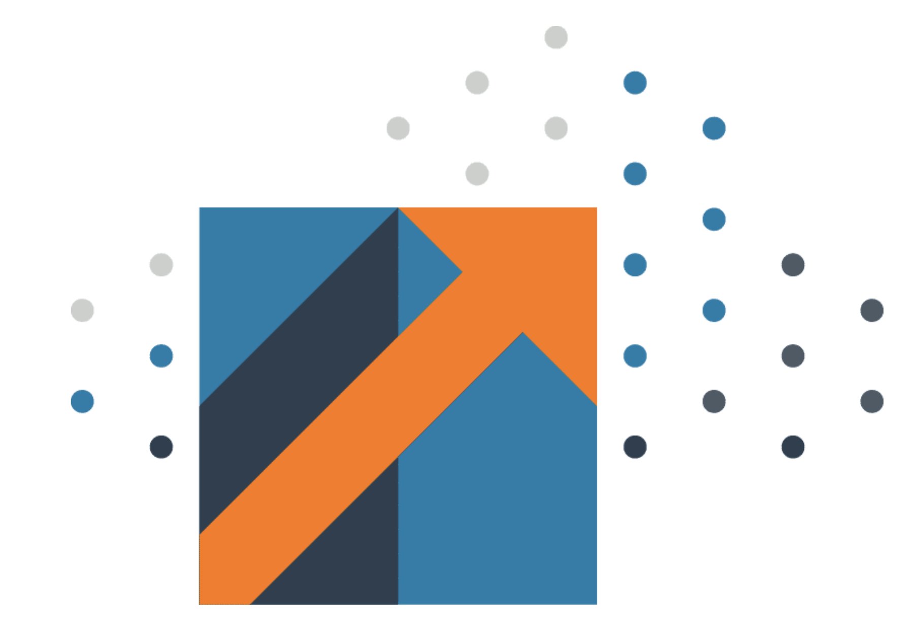
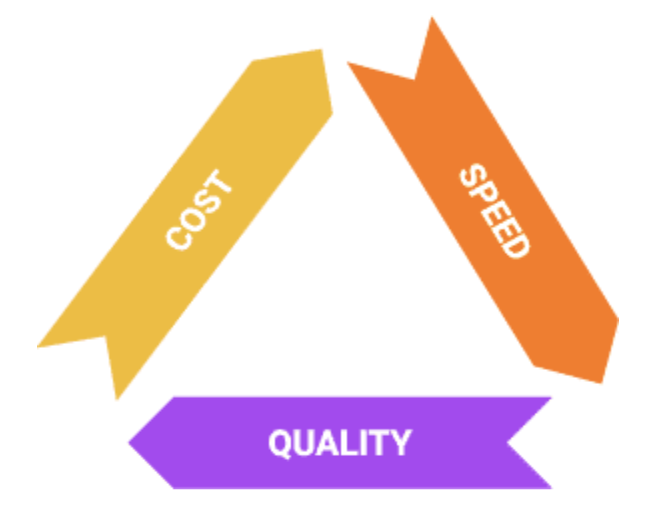

# FinOps Framework & Principles

## The FinOps Framework

### FinOps Framework

 The FinOps Framework describes the **principles** that drive FinOps practices, the **personas** that FinOps supports as stakeholders, the **best practices** and **process models** used to accomplish this, and the **domains of activity** FinOps practitioners will perform as they build a FinOps team and drive the cultural change that FinOps brings into their organizations.

 

### FinOps Maturity

 A “**Crawl, Walk, Run**” approach to performing FinOps enables organizations to start small and grow in scale, scope, and complexity. Taking quick action at a small scale and limited scope allows FinOps teams to assess the outcomes of their actions and gain insights into the value of taking further action in a larger, faster, or more granular ways.

 Start at a __Crawl__ and mature the capabilities that provide your company strategic value. There is no need to try to do all capabilities at once.

 There is no value judgement here. Every organization does not need to be at the same level and each capability can be at a different level of maturity as well.

#### Examples

 - [Gall’s law](https://en.wikipedia.org/wiki/John_Gall_(author)#:~:text=Gall's%20Law%20is%20a%20rule,a%20simple%20system%20that%20worked) tells us that complex processes that work have evolved from simple processes that work; they are not designed from scratch. Do not attempt to build full solutions, rather, build only the amount of solution that you need in any given case. For example, you should build the capability to Run when it provides business value. If you are in the Run phase and it is not adding value, you may be wasting a most precious resource: time. 

 - In another example, you may be in the Run phase at buying commitment based discounts because you have a heavily VM based architecture that is very broad. Or, you may use a heavily serverless architecture that does not require a large amount of savings plans or RIs to be rate-optimized and you never need to develop this capability beyond the Crawl phase. None of these use cases is “better,” they are all well suited to their situation. 

### FinOps Lifecycle

 Like Agile, DevOps, or other modern methodologies, we practice FinOps in an iterative loop, making small incremental changes to our cloud infrastructure as we advance. We describe this approach using the FinOps lifecycle which is comprised of three phases.

 

  ***Strive for a regular, cyclical process to your analysis/work as you conduct the FinOps function.***

#### Phases In Practice

 - At first, it may take a while to perform the work in each phase and you may be more explicit about moving from one to another. However, over time, this cycle of looking at usage, looking for opportunities to improve, and then taking an incremental action step will become more fluid and natural. 

 - The ultimate goal is to exercise the FinOps lifecycle as frequently and quickly as possible, and to include as much automation to help that process as possible. This is how we take incremental steps toward building the culture of accountability and the governance to support our FinOps function.

 - We use this looping lifecycle with FinOps, in conjunction with Crawl Walk Run, to get more mature every time we go through the loop. 

## Important Concepts

### Prioritization & Triage

 When conducting our work in FinOps, because the work is cyclical and iterative, we want to establish a triage or prioritization model early on to drive our work. A FinOps team should often consider the question **“What will I work on next?”** The answer to that question will often be **“The thing that gives us the biggest business value boost.”**

#### How do you identify or document the value of any given step? 

 For now, consider that we want to use the Pareto Principle, or 80/20 rule, to focus on the costs or problems that appear as outliers in the data. We are naturally predisposed to look at these outliers (either small or large) but by taking a consistent approach to looking at the largest cost items, we will often improve our overall cost situation the most.

 

### Pick The Right Approach

 As you focus in on the items to be addressed, take a moment as a FinOps team to think through various approaches you will use to address the opportunity. When identifying the right approach for integrating the FinOps Framework into your business processes and model ask the following questions. 

 - Are there any existing business processes, behaviors, or capabilities in place that could accelerate or empower Framework adoption? Are there any that could hinder it?
 - What changes are needed in order to resolve those conflicts?
 - What are the most valuable “missing pieces” of the Framework to deliver first, for maximum impact? Are there any elements that may require considerable effort to achieve, and is there sufficient support for that effort?
 - When developing your Framework [adoption roadmap](https://fino.ps/m60bA0), ask: what is the appetite for change within the business, what are the cadences and the pace of change that the business can realistically achieve?

 Always keep the end goal in mind when building the FinOps Framework into your business - guide your actions by the key principles, and remember that this is a marathon, not a sprint! It will take time and an iterative approach to adopt the Framework and deliver success. 
 
 There is a tendency to dive into the solution we know, or to use the technique we are comfortable with, or the tool most recently used successfully. 
 
 Adoption of cloud is not just a technology problem, a business problem, or a system problem, it is very multi-faceted. Controls that traditionally were in place (procurement control on spending, IT control of technology selection, organizational control of speed, security physical control of environment) are less effective overall, so you may face and address issues that were handled by a wide variety of people in your organization previously all in one place.
 
 FinOps teams can become the catchall for questions from capacity planning to cloud service selection to automation to reporting to architecture redesign. Therefore, it is important to have the right resources lined up for support.

### Making Tradeoffs

 Cloud tradeoffs are made on what we refer to as the iron triangle. 

 All of these tradeoffs must be done by balancing the company’s goals. Decisions can be made to save money but you will be balancing against speed or quality. Similarly,  you could decide to spend more for better quality but you may give up on cost. 

 

### Unit Economics

 Making all these decisions ultimately leads us to where a mature organization wants to be able to clearly articulate its costs through [Unit Economics](https://fino.ps/7eWwyb). The goal is to make decisions based on value.

## FinOps Principles

 ***FinOps principles give us north stars to guide our activities as we practice FinOps. These principles were developed by FinOps Foundation members and honed through experience. ***

### Overview

 These principles are presented in no particular order and should be used all together as a set. Implementing one, without the others to the extreme creates problems just as implementing all except one will create. The principles are in open source in the [FinOps Foundation github repository](https://github.com/finopsfoundation/definition/blob/master/principles.md).

 - Teams need to collaborate
 - Decisions are driven by the business value of cloud
 - Everyone takes ownership of their cloud usage
 - FinOps reports should be accessible and timely
 - A centralized team drives FinOps
 - Take advantage of the variable cost model of the cloud

### The FinOps Principles

#### Teams need to collaborate

 FinOps is about cultural change: breaking down the silos between teams that historically haven’t worked closely together. Collaboration is the hallmark of FinOps. Teams must work together in near real-time as the cloud operates on a per resource per second basis. Continuous improvement and fast decision making are required and collaboration is the engine of the practice of FinOps.

#### Decisions are driven by the business value of cloud
 
 Unit economics and value-based metrics demonstrate business impact better than aggregate spend. Make conscious trade-off decisions between cost, quality, and speed (the iron triangle). Think of cloud as a driver of innovation, a driver of capability, and a way to get speed to market and customer satisfaction up.

#### Everyone takes ownership of their cloud usage
 
 Accountability of usage and cost is pushed to the edge. Individual feature and product teams are empowered to manage their own usage of cloud against their budget. Decentralize the decision making about resource usage and optimization. Technical teams must begin to consider cost as a new efficiency metric. 

#### FinOps reports should be accessible and timely
 
 Process cost data quickly and consistently for better cloud utilization. Visibility into cloud spend is provided to all levels of the organization. Create, monitor, and improve real-time financial forecasting and planning. Focus relentlessly on clean data to drive decisions. Utilize internal team benchmarking as well as industry peer-level benchmarking. 

#### A centralized team drives FinOps

 Centralized automation for FinOps reduces duplicated efforts. Executive buy-in for FinOps practices and processes is required. Rate and discount optimization is centralized. Centrally govern and control committed use discounts, reserved instances, and volume/custom discounts with cloud providers. Remove the need for engineers and operations teams to think about rate negotiations, then they stay focused on usage optimization.

#### Take advantage of the variable cost model of the cloud
 
 The variable cost model of the cloud should be viewed as an opportunity, not a risk. This includes just-in-time prediction, planning, and purchasing of capacity. Agile iterative planning is preferred over static long term plans. Make continuous small adjustments in cloud usage/optimization.