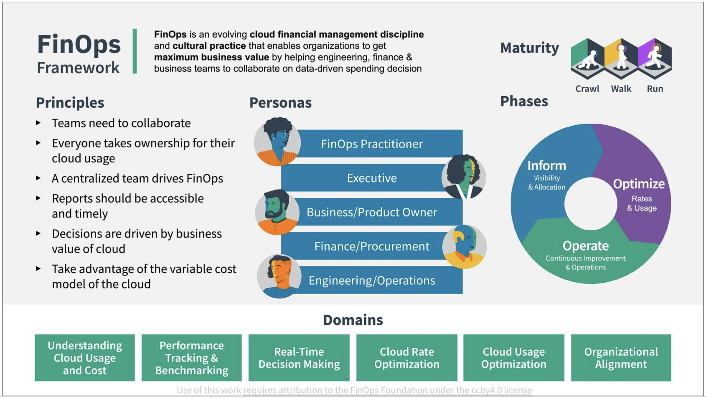
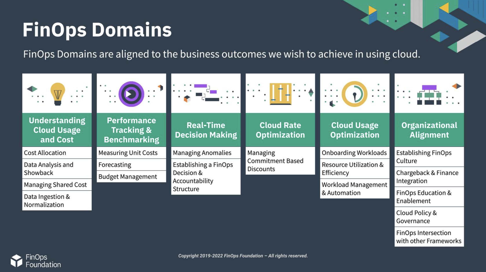
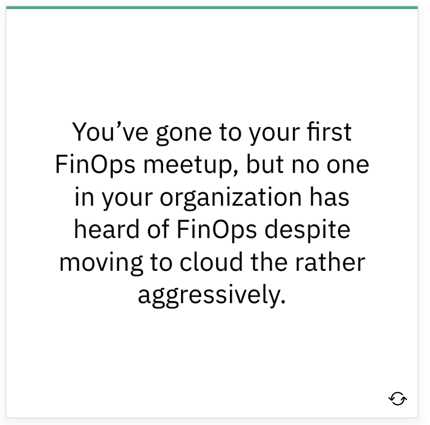
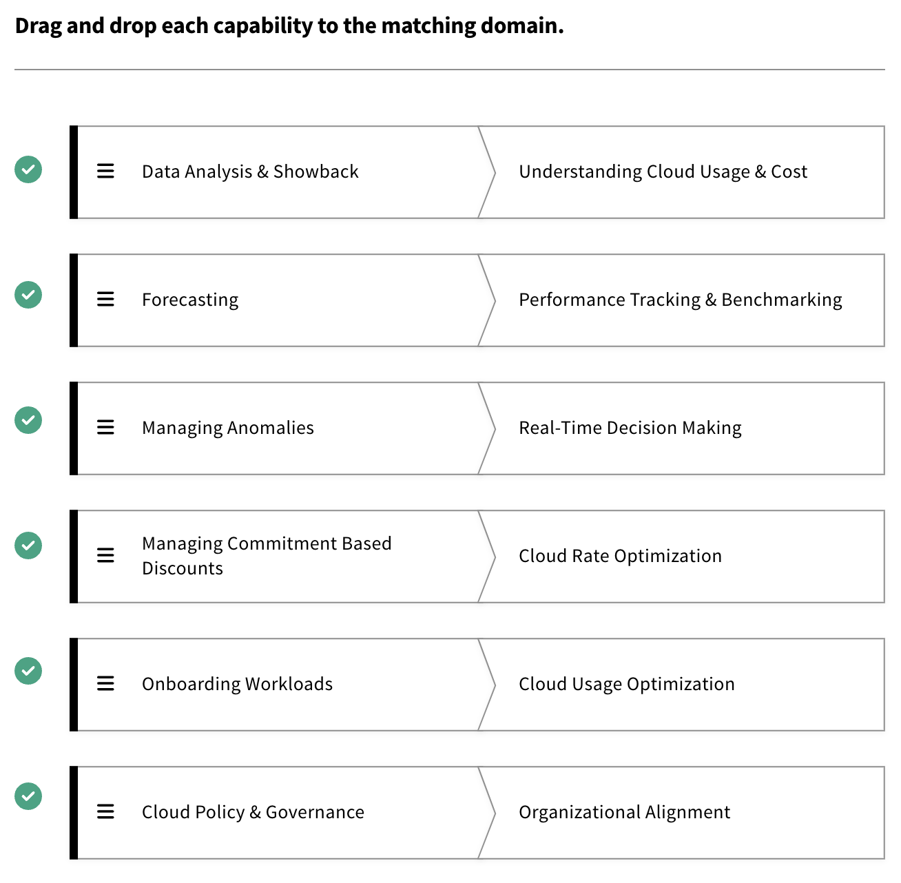

# Domains & Capabilities

## Domains Overview

### Overview

 Remember, you are moving to the cloud, facing challenges, and opportunities along the way.  FinOps is helping you on that journey with the north star principles and you’ve formed a FinOps team to help work toward them. **Now, what does a FinOps team do?**

 
 The FinOps capabilities are the “what” the FinOps team does. **Within the FinOps framework, the capabilities are categorized into domains**. The FinOps team will do work in every domain. However, they will not do all the capabilities all the time or at the same level of maturity.

  ***Visit [finops.org](http://finops.org/) for more information on [domains](https://fino.ps/kKISA8) and [capabilities](https://fino.ps/Ay1zp5)***

### FinOps Domains

 FinOps domains are the areas of activity or knowledge that are linked to the business outcomes an organization should expect from a FinOps practice. You can think of FinOps domains as the reaction to the large scale changes created by cloud use in the organization. Every organization should strive to do work in each of these domains.
 

### Key Questions

 Each domain answers important questions for the organization using cloud. Click each card to learn more.
 
 | Answer | Question |
 | :------- | :----- |
 | Understanding Cloud Usage and Cost | What are we spending on cloud, what are we using, and who is paying for it? |
 | Performance Tracking & Benchmarking | Does what we’re using and spending create a path for us to achieve our strategic and organizational objectives?  |
 | Real-Time Decision Making | What actions should we be taking right now to allow us to better meet (or stay in line with) our organizational goals? |
 | Cloud Rate Optimization | How can we change the rate we’re paying, or the way we’re buying what we are using in the cloud to see better price performance? |
 | Cloud Usage Optimization | How can we adjust what we’re using in the cloud and when we’re using it to better meet our organizational goals? |
 | Organizational Alignment | What changes or integrations can I do to make my organization use cloud more effectively? |

### An Analogy

 Callie has been preparing to do a Master Gardening program. When she goes out into the garden every morning, she uses a similar lifecycle model to inform her as to the general health and situation of the garden. She will look for things she may want to do to optimize, then take action on those things for the period of time she has available.
 
 The types of things she will do in the garden might include: watering, fertilizing, pruning, planting, mulching, thinning, pulling up, shaping, replanting, or any number of other tasks. She might be at the “run” maturity at watering and fertilizing but still at the “crawl” maturity when it comes to pruning. She might even be at the “run” maturity at pruning certain types of plants but not others.
 
 The one thing she knows is that she will never “mulch” her way to the perfect garden. She will always have to be able to draw upon a wide variety of skills – at all different levels of maturity – to maintain the garden. As Callie adds to the garden's diversity and experiences different weather conditions and seasons over time, her skills will have to mature and broaden as well.
 
 Just as Callie uses a lifecycle model and performs certain actions (capabilities), you will work to implement each of the different actions (capabilities) of FinOps to maintain the cultural practice of FinOps and maximize business value.

 

## Understanding Cloud Usage and Cost

### Understanding Cloud Usage and Cost

 This domain enables an organization to understand what cloud services it’s using, what is driving spend, and who owns that spending. It provides key data consistently to support a picture of current cloud usage and a view into historical trends at a level of granularity appropriate to the organization's current maturity level.

### Key Questions

 - What are we spending on cloud?
 - What are we using?
 - Who is responsible for that usage?

### Focus Areas

 | Focus Area | Description |
 |:---------- | :---------- |
 | WHEN TO USE | When will you use this domain most?    Continuously throughout your FinOps practice and consistently during Crawl, Walk, and Run phases.   Over time you will develop more granular reporting, more detailed metadata strategies, and more automation to your hierarchy and compliance |
 | KEY BUSINESS OBJECTIVES | What are the key business objectives that will lead you to perform this domain?    All of the other domains of FinOps rely heavily on this domain and without it they cannot succeed |
 | SUCCESS CRITERIA | How do you need to think about this FinOps domain to be successful?     Data quality, consistency, timeliness, and clarity are absolutely essential   Evolve metadata, hierarchy and reporting consistently over time, making small improvements as your cloud use evolves and your FinOps practice becomes more mature |
 | APPLICABLE PERSONAS | Which personas are critical to and most involved in this domain?    All stakeholder personas will rely upon this data   Defining the metadata and hierarchy for cost allocation will rely heavily on engineering platform teams and architecture teams   Reporting will rely heavily on finance and executives for input |

### Capabilities

#### Data Ingestion & Normalization

 Data ingestion and normalization in the context of FinOps represents the set of functional activities involved with processing/transforming data sets to create a queryable common repository for your cloud cost management needs. [Learn More](https://fino.ps/vwUzNq)

#### Cost Allocation (Metadata & Hierarchy)

 Cost allocation is the set of practices to divide up a consolidated invoice or bill among those who are responsible for its various component parts. In the context of FinOps this typically involves dividing up consolidated Cloud Service Provider invoices among various IT groups who use cloud within the organization. [Learn More](https://fino.ps/G7koXK)

#### Managing Shared Costs

 A foundational principle of FinOps is: “Everyone takes ownership for their cloud usage." The true key to understanding total cost of ownership is built upon transparency and accuracy, but unallocated shared costs hinders both of these. Without appropriately splitting costs that are shared, engineers and product managers lack a complete picture of how much their products are really costing. [Learn More](https://fino.ps/q2FEwq)

#### Data Analysis & Showback

 Data analysis and showback is the ability to leverage data, along with metadata on cloud resources and resource hierarchies, to create a near “real time” reporting mechanism for stakeholders which calls to attention: total costs for the desired business entity, opportunities for cost avoidance, and KPIs for financial health (e.g. performance of rate reduction commitments, unit cost measures for key services, efficiency metrics aggregated by desired “team”, organizational unit, etc…). [Learn More](https://fino.ps/zwE24F)

## Performance Tracking & Benchmarking

### Performance Tracking & Benchmarking

 Within this domain, the organization sets and maps its usage and cost to budgets, uses historical information to forecast, and establishes and measures KPIs and other performance indicators (including benchmarking). This domain entails the capabilities that look at past and current spend, setting baselines and budgets, and then forecasting to help understand if spending is expected, understood, and at a level that meets organizational objectives.

### Key Question
 
 Does what we’re using/spending allow us to achieve our strategic and organizational objectives?

### Focus Areas

 | Focus Area | Description |
 |:---------- | :---------- |
 | WHEN TO USE | When will you use this domain most?    Continuously throughout your FinOps practice and consistently during Crawl, Walk, and Run phases   Will take some work early in your journey   Slow, steady evolution toward things that bring you value   Large effort to adopt cloud budgeting  |
 | KEY BUSINESS OBJECTIVES | What are the key business objectives that will lead you to perform this domain?    Goal/budget setting relies on tracking over time and against others   Accurate forecasting in cloud is much more important   Consistent and meaningful KPI/unit metric reporting |
 | SUCCESS CRITERIA | How do you need to think about this FinOps domain to be successful?    KPIs can be used in many ways across the business, they are most useful in dynamic areas of variable spend (be creative here)   Measure similar things against one another, measure unique things against themselves over time   Budgeting and forecasting both have to change dramatically and it will take years to complete |
 | APPLICABLE PERSONAS | Which personas are critical to and most involved in this domain?    All stakeholder personas will rely upon this data   Defining the KPIs that will measure each discipline will require those managing each discipline   Budgeting will rely heavily on finance and executives for input   Forecasting will be a joint effort between finance and engineering groups in the long run |

### Capabilities

#### Measuring Unit Costs

 This capability is about developing metrics that reveal the business value of your cloud spend. By calculating cloud spend for total revenue, you can attach growth in cloud spending to your overall business growth. When these are in line, it makes sense that cloud spend isn’t wasted. When cloud spend is growing faster than the business, there may be cause for concern. For a customer-facing application, that unit might be a user or customer subscription; for an ecommerce platform, it might be a transaction; and for an airline, it might be a seat. [Learn More](https://fino.ps/vkuXse)

#### Forecasting

 Forecasting is the practice of predicting future spending, usually based on a combination of historical spending and an evaluation of future plans, understanding how future cloud infrastructure and application lifecycle changes may impact current budgets and influence budget planning and future cloud investment decisions. [Learn More](https://fino.ps/W5KgT3)

#### Budget Management

 Budgeting for Cloud (or other IT expenses) is a process of collecting estimated expenses for a specific period of time. Decisions on how to operate as a business, what to invest in and other strategic decisions are made based on budgets. If actual expenses do not match the budget, it can impact the operations and other decisions that were made based on those budgets. [Learn More](https://fino.ps/tb7YUc)

## Real-Time Decision Making

### Real-Time Decision Making

 When we understand what we are spending and understand how we are performing relative to expectations and standards, we can use that information to make real-time decisions.

 The goal is not to strive for real-time data in and of itself, but to leverage timely access to consistent cost and usage data for making continuous adjustments. This domain improves stakeholder enablement by curating data in stakeholder specific contexts, continually improving decision speed and aligning organizational processes to the realities of operating in the cloud.

### Key Question
 
 What actions can I take now to allow me to better meet organizational goals and objectives?

### Focus Areas

 | Focus Area | Description |
 |:---------- | :---------- |
 | WHEN TO USE | When will you use this domain most?    Continuously throughout your FinOps practice   Consistently during Crawl, Walk, and Run phases, but with more action required by the FinOps team earlier in maturity   As you mature, your decisions will be more impactful and important in the "run" phase |
 | KEY BUSINESS OBJECTIVES | What are the key business objectives that will lead you to perform this domain?    Variable use and real-time usage of cloud services means costs accrue immediately   Monthly billing cycles are too slow to spot excessive spending |
 | SUCCESS CRITERIA | How do you need to think about this FinOps domain to be successful?    Establish decision matrix ahead of problems   Update decision trees and policies regularly   Use automation (in layers) to spot anomalies   Regular communications to those who can investigate or solve anomalous spending |
 | APPLICABLE PERSONAS | Which personas are critical to and most involved in this domain?    The engineering persona will be critically involved because they must be responsible for their cloud use   FinOps teams will drive this behavior initially if it is new to the organization   Finance or leadership may want to have an aggregate view of anomalous spending |

### Capabilities

#### Establishing a FinOps Decision & Accountability Structure

 Establishing a FinOps decision and accountability structure is about capturing an organization’s FinOps-related roles, responsibilities, and activities to bridge operational cloud cost management gaps between teams. These decision-making and accountability structures help cross-functional teams work out the processes and decision trees they’ll need to use to tackle challenges and resolve conflicts, in addition to having them be proactively available when they need to take action ahead of time.

#### Managing Anomalies

 Anomaly management is the ability to detect, identify, clarify, alert and manage unexpected or unforecasted cloud cost events in a timely manner in order to minimize detrimental impact to the business, cost or otherwise. Managing anomalies typically involves the use of tools or reports to identify unexpected spending, the distribution of anomaly alerts, and the investigation and resolution of anomalous usage and cost.

## Cloud Rate Optimization

### Cloud Rate Optimization

 Within this domain, the organization works to define pricing model goals, uses historical data to make pricing model adjustments by buying commitment based discounts, and works to manage the pricing aspects of services it is using in the cloud. The cloud rate optimization domain will contain the specialized capabilities to improve the way we purchase cloud services and ensure our pricing models, purchase options, and committed use are consistent with our goals.

### Key Question

 How can we change what we pay for in the cloud to achieve better price performance?

### Focus Areas

 | Focus Area | Description |
 |:---------- | :---------- |
 | WHEN TO USE | When will you use this domain most?    Continuously throughout your FinOps practice   Likely in more impactful ways early in FinOps maturity   Over time you will develop more granular reporting to track your rate optimization |
 | KEY BUSINESS OBJECTIVES | What are the key business objectives that will lead you to perform this domain?    Pay lower amounts of money for things you know you’ll use over an extended period   Leverage commitment targets to move more workloads more quickly   Achieve a level of savings while doing longer-cycle optimizations |
 | SUCCESS CRITERIA | How do you need to think about this FinOps domain to be successful?    Track commitments against actual usage, balance of various discounting levels, and commitment levels   Consistent coverage rate (at targets set by organization)   Improved rate optimization over time   KPIs around savings and cost avoidance as a result of rate optimization   High utilization of commitments |
 | APPLICABLE PERSONAS | Which personas are critical to and most involved in this domain?    A FinOps team will provide access to forecasts and usage patterns to make commitment decisions   Executives and procurement will manage many of the commitment discussions   Finance will be involved in verifying commitments to strategy and approving commitment payments   Product owners consult on forecasting and give guidance on commitment impacts to budgets |

### Capability

#### Managing Commitment Based Discounts
 
 Spend-based commitment discounts and resource-based commitment discounts are the most popular rate optimizations that cloud service providers offer. Each cloud service provider has a slightly different offering with its own specific rules on how it works and the discounts it provides. You must consider the implementation models that organizations use, based on their needs, and how the overall process should work inside an organization. [Learn More](https://fino.ps/QU3V2g)

## Cloud Usage Optimization

### Cloud Usage Optimization

 Within this domain, the organization identifies and takes action to match running cloud resources to the actual demand of the workloads running at any given time. This work involves predictive rightsizing of resources, managing workloads to align with the correct number of scaling resources, turning resources off when not in use, and other techniques.

 The cloud usage optimization domain contains the set of capabilities to match our actual workload needs to the cloud services we use at any given time as closely as possible. Using the right resources, in the right size, only when we need them to produce business value is ultimately how the variable use model of cloud allows us to do to maximize value to our business.

### Key Questions
 
 - How can we change **what** we use in the cloud to better meet organizational goals?
 - How can we change **when** we use it to better meet organizational goals?

### Focus Areas

 | Focus Area | Description |
 |:---------- | :---------- |
 | WHEN TO USE | When will you use this domain most?    Continuously throughout your FinOps practice   More frequently during Crawl and Walk than in Run phase as engineering teams push cost earlier in the design & build process   More for newer services and products that are unfamiliar |
 | KEY BUSINESS OBJECTIVES | What are the key business objectives that will lead you to perform this domain?    Only use what you need |
 | SUCCESS CRITERIA | How do you need to think about this FinOps domain to be successful?    Efficiency metrics will show the areas in which to focus   Prioritize teams, products, or use cases that provide most value (work through that list from top down)   Empower those who can make a difference as close to the resources as possible |
 | APPLICABLE PERSONAS | Which personas are critical to and most involved in this domain?    Engineering is the key persona for cloud usage optimization   Everyone is responsible for their cloud use   FinOps teams will drive early on   Leadership should champion |

### Capabilities

#### Onboarding Workloads
 
 This capability is about establishing a cloud front door process to onboard brownfield and greenfield applications through financial viability and technical feasibility assessment criteria. [Learn More](https://fino.ps/HWm5tX)

#### Resource Utilization & Efficiency 

 The management of resource utilization and efficiency translates into identifying whether there is scope to reduce resource costs while maintaining the required performance and, if there is, making the changes required where it is economically worthwhile to do so. [Learn More](https://fino.ps/9hmWYF)

#### Workload Management & Automation

 Workload management and automation focuses on running resources only when they are needed, and creating the mechanisms to automatically adjust what resources are running at any given time. This capability is intended to give FinOps teams the ability to match supply to demand most efficiently, and effectively optimize cloud usage through measurement of workload demand and provisioning capacity dynamically. [Learn More](https://fino.ps/IHynA0)

## Organizational Alignment

### Organizational Alignment

 Within this domain, the organization acts and automates to manage cloud use within the context of other IT finance activities, and integrates FinOps capabilities with existing organizational processes, organizational units, and technology.

 This domain contains the capabilities we’ll use to continuously improve, to change, and align our organization itself - its people, processes and technology - to use cloud in the way it will benefit the company best. Actions here may improve persona centric enablement, FinOps training and adoption, and align existing processes to support cloud use more effectively.

### Key Questions

 - What changes can I make within my organization to use cloud more effectively?
 - How can I establish a FinOps culture to enable stakeholder teams?

### Focus Areas

 | Focus Area | Description |
 |:---------- | :---------- |
 | WHEN TO USE | When will you use this domain most?    Continuously throughout your FinOps practice   Consistently during Crawl, Walk, and Run phases   Purposefully maintain focus on evolving organizational alignment as cloud maturity grows   Important to introduce early in the FinOps maturity for maximum impact (refine as you grow) |
 | KEY BUSINESS OBJECTIVES | What are the key business objectives that will lead you to perform this domain?    Ensure all key stakeholders are informed, educated, and empowered to make timely, data-driven decisions to maximize value   Strategy and context flows across the business to promote successful implementation  Improve the quality and pace of real-time decision making |
 | SUCCESS CRITERIA | How do you need to think about this FinOps domain to be successful?    Clear and appropriate cadences and cycles for stakeholder reviews and decisions   High level of confidence that using cloud is being used in the best way to maximize benefit |
 | APPLICABLE PERSONAS | Which personas are critical to and most involved in this domain?    All stakeholder personas will be affected by and involved in the organizational alignment domain   FinOps is driving alignment across all levels and disciplines within the organization   Successful alignment depends on engagement and support from the entire organization |

### Capabilities

#### Establishing FinOps Culture

 This capability is about creating a movement to establish cultures of accountability so that your organization understands that the practice of cloud cost management is really about leveraging FinOps to accelerate the creation of business value. [Learn More](https://fino.ps/iaaBkR)

#### Chargeback & Finance Integration

 Chargeback and finance integration is about pushing spend accountability to the edges of the organization that are responsible for creating the expense. [Learn More](https://fino.ps/nwqwUJ)

#### FinOps Education & Enablement 

 FinOps education and enablement allows all those participating in FinOps practices to increase the business value of cloud by accelerating FinOps adoption. [Learn More](https://fino.ps/LDVZ7P)

#### Cloud Policy & Governance

 Policy and governance can be thought of as a set of statements of intent, with associated assurances of adherence. A “cloud policy” is a clear statement of intent, describing the execution of specific cloud-related activities in accordance with a standard model designed to deliver some improvement of business value. “cloud governance” is a set of processes, tooling or other guardrail solution that aims to control the activity as described by the cloud policy to promote the desired behavior and outcomes. Combining good policy and governance provides us with a mechanism to orchestrate and direct our Cloud FinOps activity. [Learn More](https://fino.ps/cV0V41)

#### FinOps & Intersecting Frameworks 

 This capability examines the intersection between FinOps with other standards and frameworks used within your organization. Widespread use of public cloud creates new challenges for traditional processes and the intention for this capability is to provide a place to capture FinOps’ interactions with existing IT and financial standards being used by your organization. [Learn More](https://fino.ps/dEQoT2)

## Platforms & Tools

### Platforms & Tools

 Every organization will use some combination of cloud provider provided tools, third party or open source tooling, and internally developed tools and platforms to perform every domain. The mix of tooling and process support will change as you mature in your practice of FinOps and in your use of cloud.

#### Cloud Provider Cost Management Tools
 - All cloud providers will include tools designed to help you understand your cloud usage and cost 
 - Cloud provider platforms will most often only be applicable to that cloud provider’s usage
 - Differences will exist between providers’ data primarily in granularity, grouping/summarization, handling of amortization for prepaid amounts, and application of custom discounts and credits
 - Cloud provider tools and platforms are typically going to be available for no or very low cost

#### FinOps Platforms & Tooling
 
 - Understanding cost and usage calls for a lot of data ingestion, summarization, normalization and data analysis
 - Broadly-focused platforms ingest cloud data, process it, provide recommendations, and provide a broad reporting mechanism that will cover a wide variety of reporting needs
 - Consider more specialized tools where you have extensive use of specific products or services (e.g. Kubernetes)
 - Broad FinOps platforms typically are sold at a percentage of your overall cloud cost managed

#### FinOps Service Providers (consulting help)

 - Some FinOps service providers offer services which perform this type of service on your behalf, but these would typically be longer-term consulting engagements to do this broadly focused job

#### Internal Tooling (custom)

 - FinOps teams need to be aware of the amount of data and degree of potential change which can occur in billing and usage data
 - Data quality will need to be monitored closely and consistently over time
 - Internal reporting and data analysis or metrics teams can often provide skilled resources who can help develop dashboards and other reporting capabilities inside your organization

## Activity

### Capabilities Review

 Read each of the following scenarios and consider which capability will best address it. (Flip each card for the answer before advancing to the next card)

 
 FinOps Education & Enablement

 
 Resource Utilization & Efficiency

 
 Cost Allocation

 
 Manage Commitment Base Discounts

 
 Forecasting

 
 Chargeback & IT Finance Integration

 

