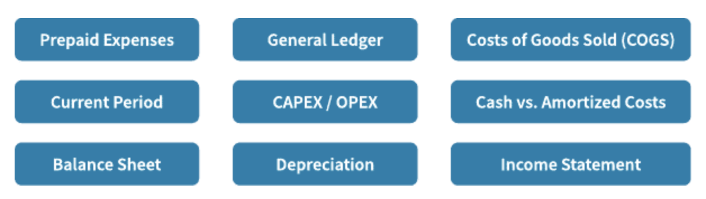

# Motivations & Common Language

## Motivations

### Overview

 Remember, you’re moving to the cloud, facing challenges and opportunities. Your FinOps team is coming together to meet the FinOps principles and to perform the FinOps capabilities. However, as you think of the breadth of activities you’ll need to perform, consider the motivations and common language needs that will come into play.

 

 Everyone the FinOps team interacts with has a different set of motivations, language, and point of view. Further, every member of the FinOps team itself brings a different set of motivations, language, and point of view. One of the primary jobs of the FinOps team is to integrate these motivations, languages, and points of view to drive collaboration.

 In order to do that work across the organization, though, we first have to establish a common language and understand the motivations of all of the teams we will work with.

### Motivations

 FinOps teams are usually cross-functional and matrixed, meaning there are a wide variety across many dimensions. Different motivations and language can come together, through collaboration, to be more powerful.

 *FinOps Teams Come with a Variety of:*

 * Backgrounds
 * Points of View
 * Motivations
 * Experiences

 * Biases
 * Vocabularies
 * Expertise

## Common Language

 A big part of building the FinOps practice is building a common language or vocabulary. Everyone on the FinOps team will be learning new terms and new concepts. Many of these terms are loaded with meaning that may not be apparent to all.

### Terms

 Each organization should build a working vocabulary or acronym list that defines key terms. This glossary should include both generic industry terms and terms that are specific to the organization. Below are examples of both generic and specific terms within FinOps (both cloud and discipline specific).

 | FinOps | |
 |:--- |:----|
 | Inform   Optimize   Operate   Financial | Crawl, Walk, Run    Rightsizing   Automation   Blended Rates |
 | Cloud | |
 | AWS   Azure   GCP | EC2   Enrollments   Projects |
 | Finance   Engineering / IT   Product / Business | NPV   DevOps   Agile |
 | Organizatioal | |
 | Organizational Hierarchy    Cost Tracking | Business Unit, Division    Cost Center, CMDB Code |

#### Glossaries

 There are lots of terms and tools specific to FinOps, utilize the resources below to get started.

 **FinOps Terminology**

 A list of terminology and examples for Cloud Cost Management, Public Cloud, Software Development & Operations, and Finance & Accounting categories. [FinOps Terms](https://fino.ps/C2UHWT)

 **Multi-Cloud Tools & Terminology**

 A matrix of tools available to help FinOps practitioners learn and practice efficient utilization of cloud resources as well as terminology and additional resources. [Multi-Cloud Terms](https://fino.ps/LCvUwP)

#### Finance & Accounting

 Below are key accounting terms useful when dealing with finance and accounting teams. What we do in the cloud has big implications to the finance teams and is a big change from the old data center model. Check with your finance team to see if they have an existing glossary of terms or find definitions to many terms [here](https://fino.ps/zw60U7).

  

### Importance of a Common Language

 We need to drive toward the point where the FinOps team does not have to be in every meeting translating every sentence for every team. Rather, the FinOps team should bring everyone into a common language where discussions can be productive between any groups. We then are able to let these groups build that culture of the cloud in their own teams as well.