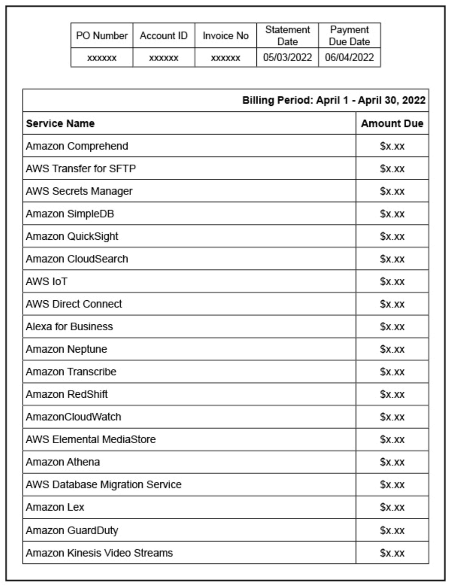

# Anatomy of a Cloud Bill

 Remember, you’re moving to the cloud, facing challenges and opportunities. Your FinOps team is in place, ready to perform the capabilities that will let you meet the goals of the FinOps principles. One of the biggest challenges you will face is something specific to cloud: the massive amount of information presented in the cloud bill.

## Levels of Cloud Usage & Cost Information

 Part of the reason FinOps can be so challenging is the quantity of data FinOps teams need to manage in order to report on usage, find optimizations, and act on them on a fast cycle. 

### Summary Invoice Data

 **Summary invoice data at the management, enrollment or billing account level**

 - Usage summarized for your whole organization
 - May be broken down by service name
 - May or may not include discounts 
 - Several pages covering an unlimited amount of spend, delivered once a month after the fact

### Usage & Cost Reporting Tools

 **Usage and cost reporting platform provided by the cloud provider (or third party or that you build)**

 + Usage reportable more flexibly
 + May or may not include specific rates, metadata, summarization information
 + Business Intelligence type tool for creating custom reports, available anytime

### Detailed Usage & Billing Data

 **Detailed cost and usage data via CUR file or billing APIs**

 * Detailed usage information at full granularity
 * Extremely large datasets, up to billions of lines of data per month, delivered each day

## Invoice Level

 Invoices are for billing, not FinOps. This is an example invoice report produced by a cloud provider. It summarizes hundreds of thousands of dollars, aggregated by service, with very little detail. This is too little data to effectively manage cost or usage. However, CUR Files, Billing Extracts and Billing APIs provide an often overwhelming amount of data.

 It is crucial to find the right tools to allow you to get the data you need at the right level of detail for your maturity level to make the real-time decisions you need to make.

 

## Cloud Cost Management Platforms

 Cloud providers offer tools to see more granularity. These tools generally provide a basic way to look at the data. These tools are always advancing and becoming more flexible and detailed.

 | AWS |
 |:--- |
 |AWS has the most mature billing process    Still Invoice and CUR come out of different systems, rarely match 100% to the penny   Constantly evolving   CUR is third generation bill format   CUR fed by individual service teams, not entirely internally consistent either |
 | 

 | AZURE |
 |:--- |
 | Invoices monthly or quarterly, depending on the contract relationship   Billing data via billing APIs pre-2020 does not include list cost, amortization of upfront payments, prepaid RI costs, specific resource information (scale sets, eg),   Utilization data available from Azure Monitor   Significant advanced internal tooling/platforms for reporting |
 |  |

 | GCP |
 |:--- |
 | Most summarized of the three, constantly evolving their [Standard Export](https://cloud.google.com/billing/docs/how-to/export-data-bigquery-tables/standard-usage) and [Detailed Export](https://cloud.google.com/billing/docs/how-to/export-data-bigquery-tables/detailed-usage) to add new columns to help customers understand their bill   Resource level information available for most services, the billing export is summarized at the SKU level |
 | 

 | OCI |
 |:--- |
 | |

## Anatomy of an AWS CUR File

## Detailed Cost & Usage

 There is a lot of new language introduced in the cloud usage and billing data, and we need to know how to deal with it. Cloud providers usually give you billing data every day; it is important to understand how the billing is coming in and how to understand the information.

### Raw cloud data is not human readable. 

 - Cloud bills can run to the hundreds of millions or billions of rows of data.
 - AWS breaks its monthly CUR file into dozens of files in the S3 bucket where they are stored so that each file is smaller than the maximum file size limit on some machines. So, the CUR can’t even be loaded all at once into Excel. It’s too big.
 - Azure and GCP provide data through an API, which allows more control over how big the data set is and how it’s summarized. However, these services also have multiple APIs.

 

###  The billing data contains the details about each charged item.

 * The billing data contains attributes about the charges (metadata or dimensions) like region or instance ID or the time it ran, the tags, the description, the size, etc. 
 * Metrics include the amount of time it ran, or the usage quantity, and the rate(s).
 * Multiple rates might be quoted, blended rates, unblended rates, amortized rates, etc. 
 
 

### One virtual machine might be billed at various rates. 

 * Some of a virtual machine's time might be covered by reservations and some on-demand.
 * Each "rate x usage" or "rate x time" combination will be a separate line.
 * Some services also include many types of charges/meters – usage, storage, iops, read/write units, data transfer, etc. 
 
 

### These files & APIs are imperfectly documented and change often.

 * They can go into the many teams dumping data into the billing data discussion if helpful.
 * They can go into the issue of data quality being a problem to manage if you build your own queries.
 * They can go into ongoing improvements in this area from all the vendor.
  
 

## Cloud Billing Data Fundamentals

 At the basic level each item has a time or usage number and a rate. We multiply those to get the cost. Everything else is details (lots of details). If you want to change the cost for yourself, there are two main levers:

 1. Change how much you use (decentralized)
 1. Change the rate you pay (centralized)

 