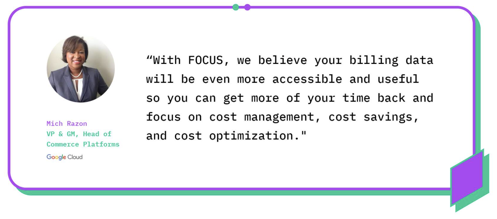

# FOCUS

When thinking about cost avoidance, rate reduction, and practically every FinOps capability, we must talk again about data and cloud billing. A massive quantity of cloud billing data, likely from a wide variety of vendors, shows up every day. Your ability to ingest, normalize, and then analyze this data into coherent reporting and recommendations is compromised by this complexity and variability. This inefficient process needs a solution.

**FOCUS** (FinOps Open Cost & Usage Specification) is a project designing a vendor agnostic technical specification for cloud billing data. FOCUS aims to make billing data more consistent and usable across Cloud, SaaS, and even internal billing sources, improving your understanding of your costs, and allowing you to make better decisions. 

[focus.finops.org](https://focus.finops.org/) - Check out our dedicated FOCUS page to see the specification, contributors, and learn how to get involved. 

## Tell Me More

 Imagine there was a single view of spend connected to the delivery of applications and services in the cloud. Well, FOCUS says just how to do this! This means cloud adoption would move faster and stakeholders would start to trust more in the data and cost mapping.

 A simple bill that reliably reports across multiple vendors? FOCUS will remove complexity and overhead from processes such as allocation, chargeback, budgeting, forecasting, and more to maximize business value in the cloud. 

 

## Introduction to FOCUS

 In this session during FinOps X 2023, Mike Fuller (CTO of the FinOps Foundation) and Udam Dewaraja (Chair of the FOCUS Project) give an in-depth look at the FinOps Cost and Usage Specification project, better known as FOCUS. They discuss what the project is all about, its objectives toward steering the cloud billing data and its variants into something more of an open, accessible data model, and how practitioners, cloud service providers, and tooling vendors can get involved.

 [Introduction to FOCUS](https://www.youtube.com/watch?v=dnU3ZedDys4)

## How Will This Work?

 FOCUS is already underway. A specification has been created covering cloud service providers (CSPs) and future updates are expected to add support for SaaS providers and even on-premises datasets. The following steps show the outline for the modernization of cloud billing data.

 1. Build a specification detailing the dimensions and metrics required for good cost management
 1. Work with the community to convert existing billing formats into FOCUS compatible datasets
 1. Work with cloud service providers and SaaS providers to natively support FOCUS

## Why It Matters

 Understanding data and FOCUS could lead to an increase in trust and collaboration within the organization. With simplified and reliable data, an organization might feel empowered to share data more openly. This would enable those you work with to have more ownership of their own cloud spend. Additionally, rather than having to learn (or teach someone) multiple ways to run queries, there will be one centralized location and set of processes. This also means that your skills are more portable. You will be able to run queries on datasets that comply with the FOCUS specifications regardless of which CSP or SaaS providers are involved.

 Additionally, FOCUS means:

 1. Better understanding of cost and usage data to make better engineering decisions that consider cost from the beginning
 1. Better ability to compare apples to apples when considering how and where to run resources as part of an infrastructure or application
 1. More consistent terminology and data structures to enhance collaboration, and to make skills more portable across clouds, FinOps tools, and organizations.

## What People are Saying about FOCUS...

 **Tim O'Brien**, Senior Director Engineering, Walmart
 Learn more about how FinOps data is used at scale at Walmart and the importance of FOCUS for the future of data.
 [FinOps Data](https://youtu.be/gYbccHWAIzE?feature=shared&t=3257)

 **Mich Razon**, VP & GM Platform, Google
 **Fred Delombaerde**, VP Core Commerce, Microsoft
 **Phil Newman**, VP Product, Oracle
 Learn from this panel about why the each CSP would be involved in FOCUS and what this initiative would provide to their customers (YOU!). 
 [CSP Panel on FOCUS](https://youtu.be/gYbccHWAIzE?feature=shared&t=5025)

 **Google’s Insight on FOCUS**
 When they go closed, we go open – Google Cloud and open billing data.
 [GCP on FOCUS](https://cloud.google.com/blog/topics/cost-management/working-with-finops-foundation-on-open-cloud-billing-data)

 **Microsoft's Insight on FOCUS**
 This article explains how to export cost details using the FinOps Open Cost and Usage Specification (FOCUS). 
 [Azure on FOCUS](https://azure.microsoft.com/en-us/updates/export-cost-using-focus/)

