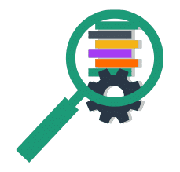
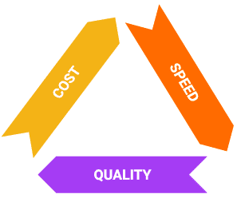
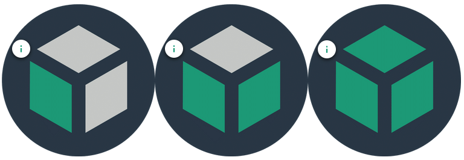
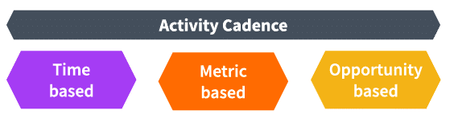
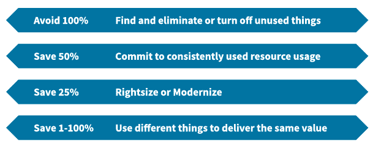

# Optimize Phase Overview

## Recap

 Now that we've learned about exercising all of the capabilities and understanding our use and spending in the Inform phase, let's look at opportunities to optimize. This could look like optimizing usage, cost profile, coverage, automation, or even level of visibility.

## Optimize Phase

 In the Optimize phase we target, define, and document optimization opportunities; this is all about triage and prioritization.

### The Optimize phase supports the principles:

 * Business value of cloud drives decisions
 * A centralized team drives FinOps
 * Take advantage of the variable cost model of the cloud

 

 ### During the Optimize phase, we're looking to see:

 * Are we doing enough?
 * Is each of these capabilities mature enough?
 * Are we making progress toward our goals?
 * Do we know enough to make good progress?

 

### The majority of the capabilities we will use to accomplish the Optimize phase are in the domains:

 * All of the domains and capabilities will come into play in this phase

 

### The Optimize phase is all about identifying opportunities:

 * To do FinOps better
 * To understand usage better
 * To improve usage (do more where valuable, do less where valuable)
 * To improve rates 
 
 

## KPIs & Outcomes

 In order to drive the rest of the work you will do in the Optimize phase we need to know:

 * What outcomes are expected by the business? 
 * What Key Performance Indicators (KPIs) will our business use to measure success?
 
 Your organization may already have defined KPIs related to cloud use or to IT use in general. If not, you may need to take a look at what outcomes you are trying to achieve with cloud:  

 * What behavior will help achieve those outcomes?
 * How you can measure or determine that you are accomplishing that work?

### Defining KPI Challenges

 Defining good KPIs for cloud use can be challenging  because cloud use is new to many teams and  because there is so much to measure and so much data to measure it with. 

### Sample KPI's

 Examples of ways to measure each of the capabilities is found in the real-world resources section within each capability on [FinOps.org](https://www.finops.org/framework/capabilities/)

 * Consider difference in reserved coverage rate when using cost versus usage
 * Do you want to promote spot use? Or reserved use? Or total?
 * Do KPIs measure the performance of the FinOps team or the development teams?
 * Reservation coverage rate (cost or usage)
 * Reservation utilization rate 
 * Optimization opportunities as a percent of spending
 * Spot/preemptible/low priority as a percent of compute

## Incremental Goals and Targets

 As you perform the Optimize phase, do so with an eye toward taking steps to improve KPIs or achieve the outcomes you have defined. Remember, you do not have to achieve the outcomes in one step, think incrementally. Make your immediate term goals and targets achievable, actionable, and clear. **Revisit these goals each time you move through the FinOps lifecycle.**

 * What were we trying to achieve last time?
 * Did we achieve it by doing what we did?
    - Yes. Then more of that, please.
    - No. Then, do we need to act with more scale? Less scale? Different action?

### Example

 We have an OKR (Objective and Key Results) of having a highly rate optimized cloud environment for all production systems. We have established a KPI to measure this: discount percentage for consistent-use, production compute workloads - which we would like to achieve and sustain at 50%.

 This means we would like our average discount to be 50% for all of our consistently running production compute instances. Some will be covered by three-year savings plans, some compute, some EC2, some will be covered by one-year savings plans, and some will be paid on demand. All of these are providing different rates of savings for various resources, and of course, our workload mix and total demand is changing/growing over time as well. 

#### Expectations

 It is unreasonable to expect to go from the time we establish this KPI to meeting it in one cycle. 

 * First, we don’t want to buy all of our reservation at once, we want to buy them incrementally over time
 * Second, we don’t want to make too large a bet at any one time, we want to watch trending over time and take small incremental actions

#### Goal Setting

 As a goal during this cycle in the Optimize phase, we may want to look to improve this KPI from where it is now to something slightly better. Perhaps we’re currently at 32%. To make it better we have to consider several things:

 * Cover more resources that are currently at 0% discount
 * Cover resources currently getting lower discount coverage with higher discount options
 * We have the option to purchase some or all of our recommended purchases of discount options
 * What do we do?

#### Taking Action

 Once we have a plan of what we would like to accomplish, we look at options, and attempt to not only identify what incremental step we take now, but what effect we expect it will have.
 
 If we take that step, we can then, in the next loop through the lifecycle, look at the impact we actually had and determine if our estimations were correct. This will give us more information about how our actions impact our KPIs and give us a better understanding of what to do next time.
 
 By taking small steps we are passing up some potential savings, but in the long run, our incremental improvement approach and the confidence created by this approach, will pay larger dividends.

#### Monitoring

 We will put our goals and opportunities into a tracking system.

 * For Agile, create a backlog of items to address
 * Create visibility into how we are doing, what we are working on, and how we are prioritizing

### Defining Good Goals

 The first goal of any optimization effort should be good cost allocation. Without a full understanding of all of the costs, optimization will aim off target. Cost savings can be a goal - just not the only, or most important, goal. Be sure to express cost savings in ways that allow for flexibility (the model of the cloud).

 

 **Remember the iron triangle. The goal is to make value-based decisions knowing that trade offs between cost, speed, and quality are required.**

### Resources

 **KPIs** See a list of common KPIs. [Learn More](https://fino.ps/0WFunK)

## Primary Ways to Optimize Usage

### Workload Management

 The first primary way you can optimize usage is through workload management. This means turning things on only when you need them. A central FinOps team, as well as utilizing automation, can help make this easier. Note that this is not appropriate for all workloads. 

 

 **Crawl** - Manually turn off resources when idle

 **Walk** - Schedule an automated off of resources when idle

 **Run** - Identify and auto-terminate idle resources

### Scalability and Elasticity

 Another way to optimize your usage is by introducing scalability or elasticity. The idea is to use a number of smaller resources to accomplish a task or support a workload such that as the demands of that workload vary over time, the number of small resources can be adjusted. Scalability and elasticity is a function of the architecture of the systems running in the cloud. Architecture teams, development teams, and platform teams should look for ways to accomplish this by incorporating scalable architecture choices as early as possible and completing involved re-architecting.

#### Examples

 * Microservice architectures are ones where the end user app or website are made up of many smaller services each of which provides a piece of what the user sees. Because each can be scaled and developed separately this provides the ability to serve the webpage by having all sections generating their content at once on separate machines
 * Stateless compute instances. These don’t need to handle a long series of transactions in a particular order, but can just work on atomic transactions, and can be used instead of stateful process servers which must wait around for long sequences to finish (or for very slow humans to respond) by using queueing techniques or developing what are called loosely coupled architectures
 * Serverless architectures bypass many of the scalability challenges by only calling on compute resources when there is actual demand, and having each individual call its own resources to run
 * Container-based applications are often built to scale horizontally, adding capacity as it becomes necessary 
 * Basic websites often have what’s called a three-tiered architecture where the front-end servers that users connect to can be stateless and can be reached via a “load balancer” which allows multiple front end web servers to work together to handle the load. The number of these can be adjusted for actual or anticipated demand

### Rightsizing

 Rightsizing always has to be approached as a collaborative effort. The centralized FinOps team cannot do this alone and will need to: ask for help, talk, discuss, agree, and then build a business case. The FinOps team should talk about opportunities with other teams regularly, not just when there’s a “problem." Additionally, the FinOps team will need to collaborate with the architecture team to build a working relationships and stay informed about about planned changes. 

 **It is as important to confirm good workload match as it is to identify change opportunities!**

#### Getting Started

 Where to start?

 * Unattached and idle resources (find and remove underutilized resources)
 * Storage types and classes (rightsizing, management plan)
 * Ultra low utilization (rightsizing)
 * Old generation instances (modernization)
 
#### Cadence

 Maintain a monthly cadence with development teams.

 * Identify opportunities for rightsizing throughout the month
 * Everyone should look for rightsizing opportunities
 * Maintain regular cadence with architecture and platform teams 
    - Planned architecture changes / platform changes
    - Verify continued use of services and resources, watch out for trials and tests

#### Rightsizing Versus Commitment Based Discounts

 Optimization and commitment purchasing are two sides of the same coin. We will want to create loose ties and checks as we do both.  
 * Be sure not to commit to resources you might rightsize
 * Be sure not to rightsize without checking what you are already committed to using

 We will perform both sets of activities on their own cadence. Include touchpoints with the other process at key decision points and prior to detailed analysis. The FinOps team can give development teams timely information for them to take action while allowing them to work optimization into their sprint.

 

 ## Optimize Usage

### Candidates for Optimization

 In the Optimize phase is where you will identify optimization opportunities. Look for a mix of easy wins and harder elements. It will become tougher as you become more advanced (fewer easy wins, better team usage). You will want to do a combination of all items listed below as you go through your work.

 

#### Examples

 This is a potential list of optimization opportunities. They are more or less in order of difficulty. Some of these are slightly more concrete examples of optimization opportunities you could go after. 

 

 * Turn off/turn on development, test, sandbox environments
 * Create/manage storage policies to deprecate storage over time to cheaper tiers
 * Rightsize compute, databases, networks, environments 
 * Change from 3rd party licensed resources to cloud native resources
 * Modernize resources
 * Service substitution (or license substitution)
 * Mature your DevOps approach 
 * Move to/expand use of containers
 * Move to serverless
 
 Based on what you are seeing in your Inform phase, your FinOps team might create such a list of optimization opportunities as a triage or brainstorming exercise. With each opportunity ask the following questions:

 * What is the value of each of these? 
 * What is the effort required?
 * Which are reasonable to consider for the Operate phase?
 * Who would we need to talk to to get all these answers?

## Optimize Rates

 Optimizing rates is the job of the central team (FinOps principle). Committed based discount purchasing, like reserved instances, savings plans, CUDs are the main focus here.

### Discounting

 Although the specifics can vary greatly by vendor and service, discounting in general is similar regardless of vendor or type. Commitment to the cloud provider – in terms of dollars, time, and details – will get you discounts. The more specific, the larger, or the longer your commitments, the more you can generally save.

 "[discount types](images/course/74-focp.png)

 Cloud providers discount because they want predictability (the same as private data centers, but with more scale). Because you are committing to pay, you are by definition giving up flexibility that on-demand service usage offers. The other way to think about this is the cloud providers are buying your flexibility. Despite the fact that this is scary, do not wait. Constantly work on getting discounts. 

#### Before you Commit

 Cloud providers are experts at discounting. So, before you commit, be able to forecast your demand and understand what commitments you can live with.
 
 You do not need to get the highest discount ever (Crawl Walk Run applies here too). If you can only forecast a total spend number over the next year, take a 15% discount over nothing. If you can forecast that you will use a particular instance family in a particular region for three years, go for the 74% off. Also, mix up what you buy and how you negotiate.

#### How to Optimize

 What discounts you buy and how you buy them will impact the tools you need to have in place. How would you optimize?

 * Primarily through procurement for negotiated discounts
 * If you have enterprise agreements for licenses or other contracts, handle like that and spend an appropriate amount of time given the scale of your spending
 * You can’t optimize much in time-based or usage based discounts
 * It is important to know what discounts are happening so you can use them in any other arrangements

### Discounting Decisions

 When looking for discounts, whether it’s negotiated, tiered, or commitment based discounts, you have several decisions to make. 

 1. Are you willing to pay upfront? This is increasingly not beneficial, but still gets you a 10% bump in discount if that works with your internal cost of capital. If you pay up front, where will that money come from? How will it be recovered by those who provide it? 
 2. How will you collect, recognize, and apply the discounts when they come in?
 3. Will you show discounts to your engineers or others responsible for cloud costs?

#### Commitment-Based Discounts

 RIs, savings plans, and committed use discounts are commitments to use a certain type of resource (maybe in a certain place or of a certain type), or to spend a certain amount of money (over a period of one or three years, every hour of every day). 

##### Examples

 * Reserved Instances (RIs)
 * Committed Use Discounts (CUDs)
 * Capacity Reservations
 * Savings Plans

##### Features

 * Like coupons, not actual resources
 * 1-year or 3-year
 * 17-75% discounts
 * The less flexible they are, the bigger the discount
 * Up-front payments or monthly 
 * ocation, instance family, size, tenancy decisions

#### Discount Purchasing

 Managing discounts is complex and there are a lot of decisions to make. That is one reason we recommend managing centrally with input from finance (your cost of money) and technology groups (your future usage) to inform decisions.

 

 Discounts are complex to figure out correctly and maintain well. It may be best to have a person on your team who knows all the options you have, inside and out. Then, have someone else learn from that person. 

 When you own these discounts they will apply against running resources your engineering team launches. This is why we have to be sure they will continue to use them. There is no indication that a resource is covered when you stop using it (coverage will apply randomly across your whole cloud estate). 

#### Spot Market

 **Spot Market available on all three major CSPs:**

 * AWS Spot Instances
 * GCP has Preemptible and Spot VMs
 * Azure Low Priority VMs, Spot VMs

##### Benefits

 * Provides “spare” capacity for sale at deep discounts
 * Many limitations and restrictions on use
 * Can be pulled at any time on very short notice
 * Usually priced 70-91% lower than on-demand rates
 * Not appropriate for all workloads

##### Limitations

 * VMs can be recalled within 30 seconds or 2 minutes.
 * The FinOps team cannot implement this itself
 * Challenge teams and architects to find uses for spot if you use AWS. Cost savings can be a game changer if you can deal with the volatility
 * You can attach EBS volumes to spot instances and allow them hibernate, or turn them off based on price changes or preemption
 * Many more uses means discount will probably decrease because more are in ”normal” use

##### Applications

 * Dev boxes, test boxes, trials, short-cycle jobs, stateless taskers
 * More and more services in AWS are starting to allow the use of Spot (e.g. Sagemaker, ECS Fargate, etc.)
 * Applications can include Jenkins, batch things, even K8s when managed correctly

## Business Cases

 **Never bring a business case to a discussion fight.**

### Business Cases

 Don’t spend too much time on a business case until you know that time will be valuable. The amount of data needed to build a business case around an opportunity can be tremendous.  Business cases should: 
 
 * Be as simple, clear, and concise as possible
 * Have something for everyone (business, technology, finance)
 * Use measurable, achievable, and actionable goals/targets
 * Be agreed upon before drafting the details

#### Business Case Cadence

 1. Gather Reports – Pull together the information needed to flesh out the opportunity.
 1. Analyze – Evaluate the data; look at options and different parameters. This could be things like: what terms to use for an RI purchase, what instance types should be the focus of a round of rightsizing, or what old instance types are the focus of upgrading. Figure out what you want to achieve with the action.
 1. Document – Write down your decisions, your rationale, your thought process, approvals, etc. and save it in an appropriate repository for your organization.