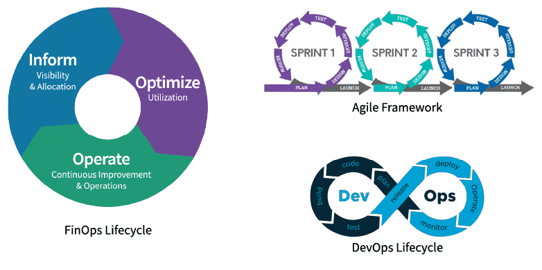
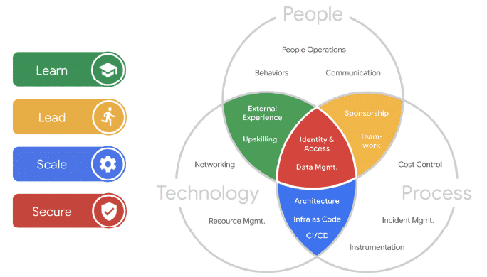

# Operate Phase

## Operate Phase Overview

### Recap

 Remember, you’re moving to the cloud, overcoming challenges by applying FinOps principles and exercising the FinOps capabilities with your FinOps team, as well as considering everyone’s motivations and each group’s goals. As you exercise the FinOps lifecycle, you’ve looked at how you are using cloud in the Inform phase. You’ve looked at many opportunities for optimization in the Optimize phase. What is next?

### Operate Phase

 The Operate phase is where we take action to achieve goals and the company’s internal processes are engaged. The challenge of this phase is taking care of business, actually getting things done, then seeing the impact as we re-enter the Inform phase.

 

 In this phase, the business may:

 * Perform an optimization plan or put it on the backlog
 * Not implement the plan
 * Determine the plan is infeasible to action - minimize
 
 The Operate phase is much more about your business than it is about the cloud. This is where you will create the culture and the integration to the persona stakeholders who will drive value out of your cloud spend. You will spend a lot of time defining process, defining workflows, and defining responsibilities. 

 

 Meet stakeholders where they are:

 * Keep them informed
 * Present them with optimization opportunities
 * Help them put the opportunities into operation

 The Operate phase supports the principles:

 * Teams need to collaborate
 * Business value of the cloud drives decisions
 * Take advantage of the variable cost model of the cloud

 

## Aligning Teams

 The Operate phase is where the rubber meets the road. It is where the technical work of identifying optimization opportunities has to be enacted in your organization.

 How do we get teams to actually make these changes, adopt FinOps, and take on responsibilities?

 * By aligning goals
 * Utilizing FinOps team members' influence in their organizations
 * Build credibility and trust through small wins
 * Take all costs into account
 * Consider using a Challenger Sale approach internally to become a help to your teams
 * Create a bias for action (where taking action is your default state)

### Communications

 Communications in a FinOps culture is of paramount importance. In order to align teams, you must communicate with them effectively. 

 

 How will you:

 * Get the word out
 * Message effectively
 * Develop training programs

#### Examples

 * Put information in the path of engineers (and others): utilize dashboards, meet them where they work (Slack, Confluence, JIRA, Teams), through product design tools 
 * Integrate with training systems used by your company
 * Develop a training program with internal and external speakers
 * Attend FinOps events
 * Speak at business conferences about FinOps in your company
 * Invite and include your vendors and cloud providers to speak on specific topics
 * Ensure consistent and clear communication

### Engineers Taking Action

 One of the top challenges shown in the State of FinOps data(opens in a new tab) has been getting engineers to take action (working with engineers taking action), etc. Let’s agree: engineers are the ones taking action and we need to be involved.

### Metrics Driven Cost Optimization

## Containers & Shared Environments

 Containers are another layer of abstraction that allows you to use the variable cost, variable usage model to gain advantage (in addition to other technical advantages of containers for some applications).

 Container technology is similar to cloud five years ago: new terminology, new concepts, but also rapidly maturing and standardizing. You need to understand your fully-loaded costs, tag appropriately, chargeback, optimize, and align to business. 

 Special care is needed to get the right Inform phase data from container environments like GKE, EKS, AKS. However, the process is the same as getting variable cost/use data from the cloud. 

 * You need to tag
 * You need an allocation strategy
 * You need good reporting
 * You need to plan how to optimize, etc. 

## Resources

 **Calculating Container Costs** Addressing how and why containers complicate how teams manage the visibility and optimization of container costs, and how to apply FinOps best practices to improve cloud financial management.

 **State of FinOps Data** Last year, practitioners ranked their FinOps challenges and we took charge in creating projects, training, and content to help them master FinOps fundamentals. 

## FinOps and Other Methodologies

 FinOps is closely related to several other methodologies that may be in use at your company. You can create awareness by drawing distinctions or highlighting similarities with users of those methodologies. A FinOps practice can find affinity with practice of other similar methodologies, value in working together, and using each other for support. Vendors, consultants, developers, and security teams may all be sources of partnership for your FinOps Team. Use all the resources at your disposal!

### FinOps, Agile, and DevOps

 The FinOps lifecycle has many conceptual similarities to other methodologies that will be discussed or actually be in use. The most commonly encountered will be DevOps, Agile, and perhaps other concepts such as CI/CD Pipeline. It will be important in conversations with cloud stakeholders to understand enough about these complementary methodologies and how they relate to FinOps.

 

### Azure Cloud Adoption Framework

 Azure has a cloud adoption framework. In building out your FinOps team, consider your TAMs and the other vendor resources they can bring to bear (for money or for free). They will use this language when they talk to you, so become familiar with your vendor’s cloud adoption framework and get your money’s worth out of their help.

 

### Google Cloud Center of Excellence

 Google has created a Cloud Adoption Framework for thinking about the various aspects of cloud use. Various other organizations also promote Cloud Center of Excellence as a catchall phrase to group things that help companies adopt and promote cloud use. Google's Cloud Center of Excellence focuses on much more than FinOps, including other aspects of cloud control such as governance, security, strategy, and cloud technical competence. However, it also has many similarities to FinOps such as collaboration, clarity and transparency, training, information sharing, and focus on business outcomes. 

 

### AWS Well Architected Framework

 This is how AWS looks at managing the architecture needs of cloud systems. FinOps addresses cost optimization but also has strong ties to other pillars. Be familiar with this framework as AWS cloud teams will use it.

 Increasingly companies are going with best of breed solutions in each pillar rather than one-tool-fits-all approaches (both to give them capability across cloud providers, and because they are increasingly outgrowing the MVP tools provided natively by the vendors).

 

### Other Methodologies

 **What do all these methodologies have in common with FinOps?** None of them are the business of your company (most likely). All of them require work on the part of many people throughout the company. Security in particular, but all other disciplines also have this impact on the company that can be profound if not actioned. In many cases, these disciplines are also not very prescriptive, but more targeting for attention.

 

 Be careful not to just wave red flags, but layout what actions could be taken to address the risks, cost optimization opportunities, unused licensing, etc. Licensing in particular should be called out as an area where some companies in the right circumstances can save large amounts of money (or spend large amounts) and if this is an area for you, your ITAM or SAM team should be engaged. 