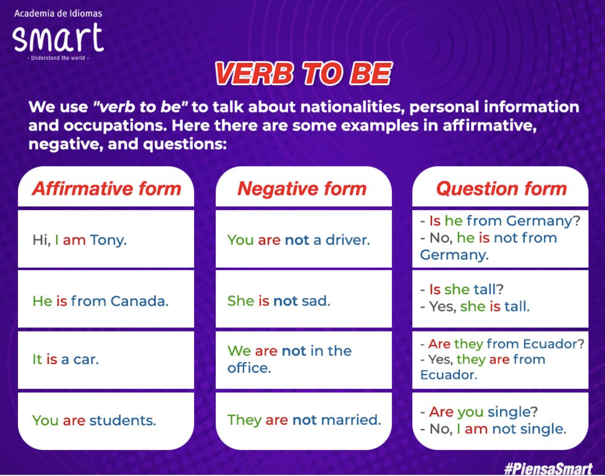
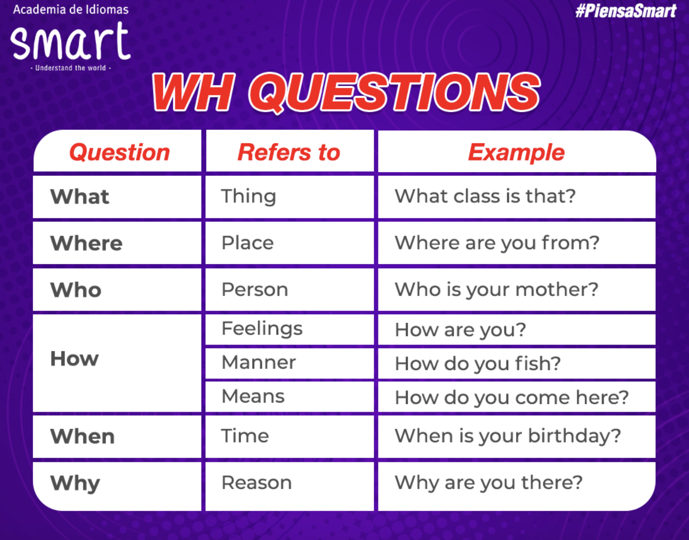

## Greetings & farewells

### Saying Hello

 | Formal | Informal |
 |:------ |:-------- |
 | Good morning | What´s up? |
 | Good afternoon | How's it going? |
 | Good evening | How are you doing |
 | How about you? | Hello/Hi |

 **Examples:**
 
 - Hello, I am Eddier
 - Hi, nice to meet you Monica. I'm Eddier
 - Good morning. How are you?
 - Great. What about you?
 - What's up, Monica?
 - No bad. What about you? Who's it going?

### Saying Goodbye

 | Formal | Informal |
 |:------ |:-------- |
 | Have a great day | Bye |
 | Good bye | Bye-bye |
 | Good nigth | See you! | 

 **Examples:**

 - Have a great day, Monica
 - Good bye. It was good to see you
 - I'm going to bed now. Good night!
 - Bye-bye, love! Sweet dreams.

### Part 1
 |image | response |
 |:------ |:------- |
 |Hi. My name is Eddier. | I am a Consultant |
 |You are ... |You are a student from Smart |
 |He is Freddy.| He is a fireman|
 |She is Daniela.| She is an engineer |
 |We are Pedro, Juan and Carlos.| We are doctors. |

#### Activity 1
 
 |image | response |
 |:------ |:------- |
 |I am a ... | chef |
 |You are a... | cashier |
 |He is a...| truck driver |
 |She is a | police officer |
 |We are... |waiters|
 |They are... | farmers |

#### Activity 2
 
 |image | response |
 |:------ |:------- |
 |Who am I? | A consultant |
 |Who is he | A student |
 |Who is the person | A fireman |
 |Who is she | An engineer |
 |Who are you? | Doctors |
 |Who are we | Soccer players |

### Personal information

|image | response |
|:------ |:------- |
| Hi. My name is Eddier | I am a consultant |
| You are a student | You are a student for Smart |
| He is Freddy | He is a fireman |
| She is Daniela | She is an engineerr |
| We are Pedro, Juan and Carlos | We are doctors |
| They are Mario and Camilo | They are soccer players |

## The Albhabet

 |letter | pronunciation | Example |
 |:------ |:------- |:------------ |
 | A | ei |as in Angel |
 | B | bi |as in Boy |
 | C | si |as in Cat|
 | D | di |as in Dog|
 | E | i  |as in |
 | F | ef |as in Family|
 | G | yi |as in Goat|
 | H |eich|as in House|
 | I | ai |as in Ice cream|
 | J | yei|as in Jam|
 | K | kei|as in King|
 | L | el |as in Lemon|
 | M | em |as in Money|
 | N | en |as in Notebook|
 | O | o  |as in Orange|
 | P | pi |as in Potato|
 | Q | kiu|as in Queen|
 | R | ar |as in Rabbit|
 | S | es |as in Start|
 | T | ti |as in Tomato|
 | U | iu |as in Uniform|
 | V | vi |as in Violin|
 | W | do-bul-iu|as in Women|
 | X | ex |as in X-ray |
 | Y | uai|as in Yogurt|
 | Z | dsi|as in Zebra|

 - emilee
 - jayden
 - catherin
 - damian
 - nicholas
 - isabelle
 - zoey

 - chair
 - eraser
 - desk
 - board
 - scissors
 - rulers
 - book
 - Pensicl
 - clip
 - folder

 Hello and good morning, my name is Eddier Ocampo, I am from Colombia and I am a consultant for Red Hat company. My email is eddier.ocampo@gmail.com and my number is 3238015629

## Numbers

| # |  | Example |
|---|--|---------|
|0  | zero  |  Two times zero equals zero |
|1  | one   |  There is one table |
|2  | two   |  There are two kids |
|3  | three |  There are three apples |
|4  | four  |  There are four cats |
|5  | five  |  There are five pencils |
|6  | six   |  There are six books |
|7  | seven |  There are seven hens |
|8  | eight |  There are eigth bananas |
|9  | nine  |  There are nine chickens |
|10 | ten   |  There are ten hamburgers |

## Ask and tell

### Pronouns

 - **I** am from Colombia
 - **You** are from Panamá
 - **He** is from Cameroon
 - **She** is from Autralia
 - **It** is from England
 - **We** are from Ireland
 - **They** are from Brazil, United States, Mexico and United Kindom

 

### Countries & Nationalities 

 | Country | Nationality |
 | :------ | :---------- |
 |Canada | Canadians |
 |Unites States | Americans |
 |Belize | Belozean |
 |Bahamas | Bahamian |
 |Jamaica | Jamaicans |
 |Trinidad and Tobago | Trinidadian(s)and Tobagonian(s) |
 |Guyana | Guyanese |
 |United Kingdom | Britsh |
 |Ireland | Irish |
 |Malta |Maltese |
 |Australia | Autralian |
 |New Zealand | New Zealander |
 
### Verb To be

- Personal Information
- Do NOT say "I to be"
- Am, Is (She, He, It) Are (You, We, They)
- A men, a woman or it (is)
- Positive S + TB + Compl
- Negative S + Am/Is/Are + Not + Compl 
- Interrogative Am/Is/Are + S + Compl?

|Complet form | short form |
|:----------- | :--------- |
|I am | I'm|
|You are | You're|
|She is | She's|
|He is | He's|
|It is | It's|
 

| Question | Answer |
|:-------- |:------ | 
| Is Shakira from Cameroon? | No, she isn't. She is from Colombia |
| Is Donald Trump a businessman? | Yes he is a businessman |
| Are The Beatles from England? | Yes, they are. The Beatles are from england |
| Are Freddie Mercury and Bob Marley singers? | Yes, they are. Freddie Mercury and Bob Marley are singers |
| Is Angelina Jolie a lawyer? | No, she insn't. She is a famous actress |
| Is the Eifefel Tower from France? | Yes, it is. It is from France |
| Is Tom Cruise from New Seeland? | No, he ins´t. he is from the Unetid States |

 Mark Zuckerberg **is** a media magnate. He **is** the co-founder of Facebook Inc. His middle name **is** Elliot. He **isn’t** from Ireland. He **isn't** 17 years old. He **’s** a software developer. His career started in 2004. His wife **is** Priscilla Chan. His Facebook profile **is** https://www.facebook.com/zuck .

### WH Questions

| Answer | WQ |
|:------ |:-- |
| This is a desktop | What is it? |
| This flag is from Colombia | Where is this flag from? |
| Because he likes teaching other people | Why is he a teacher?  |
| He is short and funny | What is he like? |
| My birthday is on 28 Abril | When is your birthday? |
| He is a student | Who is he? |

| WQ | Answer |
|:------ |:-- |
| **What** time is it? | It's five o'clock |
| **Where** do you live? | I live in Guarne |
| **Who** do you live with? I live with my wife |
| **How** old are you? | I am 42 years old |
| **When** is new  year's eve? New Year's eve is on December 31 st. |
| **Why** are you sad? | Because I failed Math |
| **Which** is your coat? My coat is the red one |

  

  Good morning Sir. Passport, please
  Here it is
  Sorry, what's your Id numb

