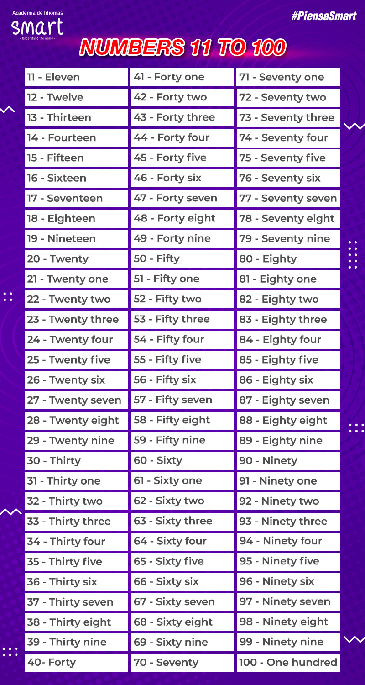

## greetings_&_farewells

### Saying Hello

 | Formal | Informal |
 |:------ |:-------- |
 | Good morning | What´s up? |
 | Good afternoon | How's it going? |
 | Good evening | How are you doing |
 | How about you? | Hello/Hi |

 **Examples:**
 
 - Hello, I am Eddier
 - Hi, nice to meet you Monica. I'm Eddier
 - Good morning. How are you?
 - Great. What about you?
 - What's up, Monica?
 - No bad. What about you? Who's it going?

### Saying Goodbye

 | Formal | Informal |
 |:------ |:-------- |
 | Have a great day | Bye |
 | Good bye | Bye-bye |
 | Good nigth | See you! | 

 **Examples:**

 - Have a great day, Monica
 - Good bye. It was good to see you
 - I'm going to bed now. Good night!
 - Bye-bye, love! Sweet dreams.

### Part 1
 |image | response |
 |:------ |:------- |
 |Hi. My name is Eddier. | I am a Consultant |
 |You are ... |You are a student from Smart |
 |He is Freddy.| He is a fireman|
 |She is Daniela.| She is an engineer |
 |We are Pedro, Juan and Carlos.| We are doctors. |

 #### Activity 1
 
 |image | response |
 |:------ |:------- |
 |I am a ... | chef |
 |You are a... | cashier |
 |He is a...| truck driver |
 |She is a | police officer |
 |We are... |waiters|
 |They are... | farmers |

 #### Activity 2
 
 |image | response |
 |:------ |:------- |
 |Who am I? | A consultant |
 |Who is he | A student |
 |Who is the person | A fireman |
 |Who is she | An engineer |
 |Who are you? | Doctors |
 |Who are we | Soccer players |

## The Albhabet

 |letter | pronunciation | Example |
 |:------ |:------- |:------------ |
 | A | ei |as in Angel |
 | B | bi |as in Boy |
 | C | si |as in Cat|
 | D | di |as in Dog|
 | E | i  |as in |
 | F | ef |as in Family|
 | G | yi |as in Goat|
 | H |eich|as in House|
 | I | ai |as in Ice cream|
 | J | yei|as in Jam|
 | K | kei|as in King|
 | L | el |as in Lemon|
 | M | em |as in Money|
 | N | en |as in Notebook|
 | O | o  |as in Orange|
 | P | pi |as in Potato|
 | Q | kiu|as in Queen|
 | R | ar |as in Rabbit|
 | S | es |as in Start|
 | T | ti |as in Tomato|
 | U | iu |as in Uniform|
 | V | vi |as in Violin|
 | W | do-bul-iu|as in Women|
 | X | ex |as in X-ray |
 | Y | uai|as in Yogurt|
 | Z | dsi|as in Zebra|

 - emilee
 - jayden
 - catherin
 - damian
 - nicholas
 - isabelle
 - zoey

 - chair
 - eraser
 - desk
 - board
 - scissors
 - rulers
 - book
 - Pensicl
 - clip
 - folder

 Hello and good morning, my name is Eddier Ocampo, I am from Colombia and I am a consultant for Red Hat company. My email is eddier.ocampo@gmail.com and my number is 3238015629

## Numbers

| # |  | Example |
|---|--|---------|
|0  | zero  |  Two times zero equals zero |
|1  | one   |  There is one table |
|2  | two   |  There are two kids |
|3  | three |  There are three apples |
|4  | four  |  There are four cats |
|5  | five  |  There are five pencils |
|6  | six   |  There are six books |
|7  | seven |  There are seven hens |
|8  | eigth |  There are eigth bananas |
|9  | nine  |  There are nine chickens |
|10 | ten   |  There are ten hamburgers |

## Pronouns

 - **I** am from Colombia
 - **You** are from Panamá
 - **He** is from Cameroon
 - **She** is from Autralia
 - **It** is from England
 - **We** are from Ireland
 - **They** are from Brazil, United States, Mexico and United Kindom

 

## Countries & Nationalities 

 | Country | Nationality |
 | :------ | :---------- |
 |Canada | Canadians |
 |Unites States | Americans |
 |Belize | Belozean |
 |Bahamas | Bahamian |
 |Jamaica | Jamaicans |
 |Trinidad and Tobago | Trinidadian(s)and Tobagonian(s) |
 |Guyana | Guyanese |
 |United Kingdom | Britsh |
 |Ireland | Irish |
 |Malta |Maltese |
 |Australia | Autralian |
 |New Zealand | New Zealander |
 

