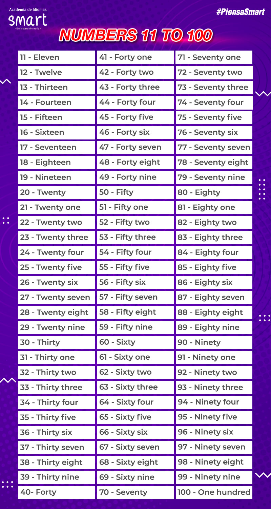

# Numbers

| # |  | Example |
|---|--|---------|
|0  | zero  |  Two times zero equals zero |
|1  | one   |  There is one table |
|2  | two   |  There are two kids |
|3  | three |  There are three apples |
|4  | four  |  There are four cats |
|5  | five  |  There are five pencils |
|6  | six   |  There are six books |
|7  | seven |  There are seven hens |
|8  | eigth |  There are eigth bananas |
|9  | nine  |  There are nine chickens |
|10 | ten   |  There are ten hamburgers |

