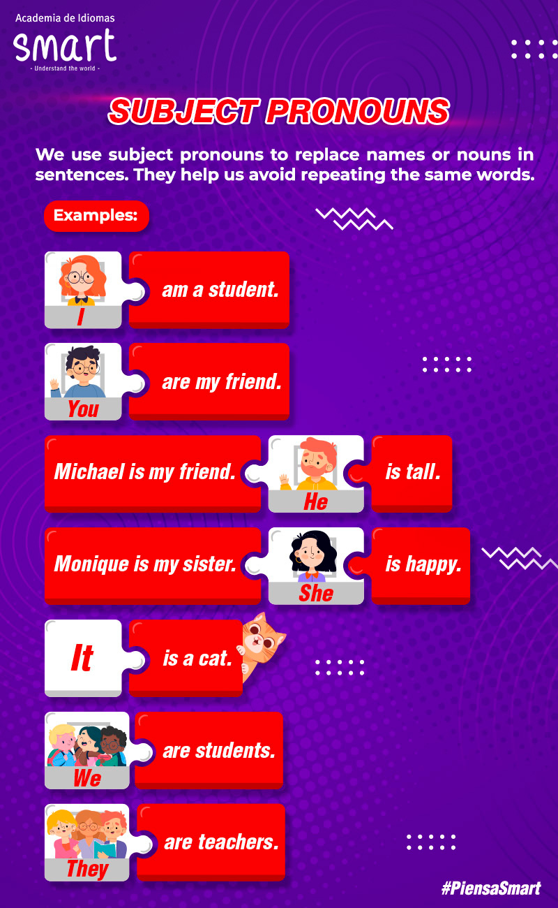

# Subject pronouns

 - **I** am from Colombia
 - **You** are from Panamá
 - **He** is from Cameroon
 - **She** is from Autralia
 - **It** is from England
 - **We** are from Ireland
 - **They** are from Brazil, United States, Mexico and United Kindom

 

 | Country | Nationality |
 | :------ | :---------- |
 |Canada | Canadians |
 |Unites States | Americans |
 |Belize | Belozean |
 |Bahamas | Bahamian |
 |Jamaica | Jamaicans |
 |Trinidad and Tobago | Trinidadian(s)and Tobagonian(s) |
 |Guyana | Guyanese |
 |United Kingdom | Britsh |
 |Ireland | Irish |
 |Malta |Maltese |
 |Australia | Autralian |
 |New Zealand | New Zealander |

