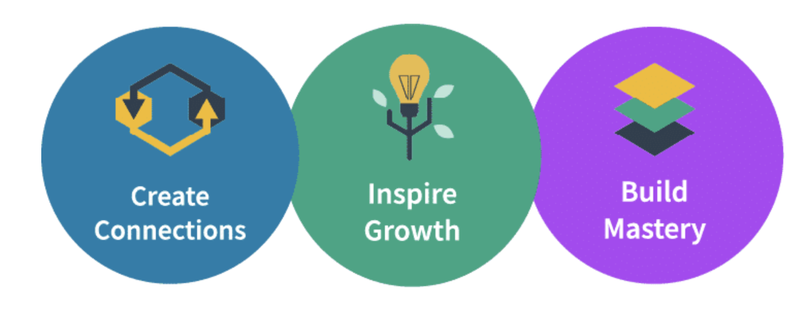

# FinOps Certified Practitioner Introduction

## Getting Started

### Introduction to FinOps

FinOps is an evolving cloud financial management discipline and cultural practice that enables organizations to get maximum business value by helping engineering, finance, technology and business teams to collaborate on data-driven spending decisions.

### Cloud FinOps Book

Anyone working in engineering, finance, procurement, product ownership, or leadership in a company running—or aspiring to run—in the public cloud will benefit from this book. As an organization understands the personas in FinOps, it can map them to relevant teams across the business. 

This book is not required to pass the test or complete the course, however, it is a good companion reference and includes additional stories and context.

### FinOps Terminology

There are lots of terms and tools specific to FinOps. Utilize the terminology resources below throughout the course to support your learning.

- **FinOps Terminology**: A list of terminology and examples for Cloud Cost Management, Public Cloud, Software Development & Operations, and Finance & Accounting categories. [FinOps Terms](https://fino.ps/C2UHWT)
- **Multi-Cloud Tools & Terminology**: A matrix of tools available to help FinOps practitioners learn and practice efficient utilization of cloud resources as well as terminology and additional resources. [Multi-Cloud Terms](https://fino.ps/LCvUwP)

### Organization Information

Gather information about your organization's cloud use and cloud challenges to use throughout this course. Below are some key questions to help you get started. 

 * What are the organization’s goals in using the cloud?
 * What have been the challenges in accomplishing these goals?
 * What accomplishments can be attributed to the cloud that could not have happened otherwise?

### Be the FinOps Lead
 Throughout this course, we encourage you to think of yourself in the position of a FinOps lead at your organization. This is the person who will be leading the company's cloud journey. At the end of each module, check-in to see how your knowledge is evolving and how you will address each topic at your organization. 

## FinOps Foundation Overview

### About the FinOps Foundation

 The FinOps Foundation is a program of the [The Linux Foundation](http://linuxfoundation.org/) dedicated to advancing people who practice the discipline of cloud financial management through best practices, education, and standards. The FinOps Foundation includes 5300+ individual members, representing more than 1500 companies. [Learn More](https://fino.ps/jLx9PQ)

### Mission of the FinOps Foundation

 To advance every individual who manages the value of cloud wherever they are.

 

### Get Involved

 If you are new to FinOps, there are lots of ways to get involved! 
 
 - Join our [Slack](https://finopsfoundation.slack.com/) and ask your question on _#ask-a-question_
 - Learn from others via [real world member stories](https://fino.ps/VQ29bX) and the [FinOps Podcast](https://www.finops.org/community/finops-podcast/)
 - Find help [adopting FinOps](https://fino.ps/m60bA0)
 - Gain insights on [encouraging engineers to take action](https://fino.ps/Zg5EAS)
 - Learn about [vendors in our community](https://fino.ps/k1i1V1)
 - Still need help finding what you need? Let us know at <hello@finops.org>
 - Questions about training? Contact us at <training@finops.org>