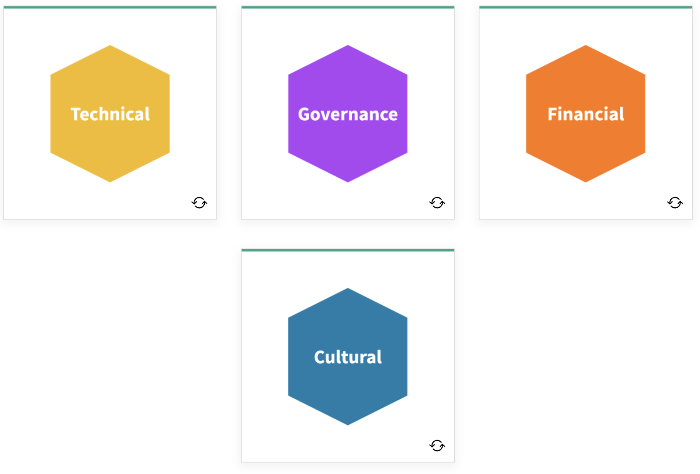

# What is FinOps

 ***At its core, FinOps is a cultural practice. It’s the way for teams to manage their cloud costs, where everyone takes ownership of their cloud usage supported by a central best-practices group. Cross-functional teams in Engineering, Finance, Product, etc. work together to enable faster product delivery, while at the same time gaining more financial control and predictability.***

 80% of organizations will overshoot IaaS budgets due to a lack of cloud cost optimization governance and misguided upfront spend commitments. [DevOps.com](DevOps.com)

 You are not alone.

 Budget overruns often stem from a lack of cost governance and not understanding what the organization is committing to spend, how it is committing to spending, and what it is spending that money on.  FinOps helps address this reality. 

## Let's Recap

 Cloud FinOps is an evolving cloud financial management discipline and cultural practice.

 

 FinOps enables organizations to get maximum business value...by helping engineering, finance and business teams...to collaborate on data-driven spending decisions.

## The New Cloud Reality for IT

 - *Decentralized*: Buying centers are siloed and more decentralized than before. They can no longer be run through centralized IT or procurement.

 - *Material*: There is a 24% year-over-year increase in public cloud spend. These cloud costs are now material and are a large percentage of the company's spend. They are becoming much more visible to top company executives, and much more important to be able to deconstruct for CIOs and CIO finance teams.

 - *Variable*: Spending is variable. Spending is up and down and will move in unpredictable ways or ways that look unpredictable to finance teams that are not used to looking at IT spend in public cloud. Spending can be runaway when developers have the ability to launch services without regard to their costs. There is a large possibility for dramatic overspending. 

 - *Inefficiency*: There is a lot of inefficiency that will need to be drawn out from spending. Macroeconomic instability is going to push us more toward efficiency. Efficiency steps in the cloud pay off in dollars not spent. Whereas efficiency in the data center world, where costs were fixed and capped were not as effective. Inefficiency is a big indicator in the new cloud economy.

## FinOps: Changing the Model

 FinOps allows us to bring DevOps and IT Finance back into alignment, allowing for visibility into spending and collaborative control.

### In this model...

 - Engineering and finance can work together in what has been called “the FinOps Hug”
 - The company can leverage the "Infrastructure as Code" instant procurement the cloud offers
 - Experimentation is enabled, can be managed, and is more predictable (which is good for the business)
 - Lower risk and cost of failing to buy exactly the right hardware upfront and can change it as needed
 
 

# Adopting FinOps
 
## Where to Begin

 If you haven’t started to do FinOps or have started to use cloud but not formed a team yet, then you may need to begin by building the awareness and support for a FinOps practice. The FinOps Foundation has resources available to help you get started and begin to use the FinOps framework effectively.

 [Adopting FinOps](https://fino.ps/m60bA0)

## Impacts of Cloud Adoption

 Once an organization has recognized the need to use cloud to effectively build and manage IT value, there will be next steps to take. FinOps teams can have the biggest impact by enabling the whole organization to understand and gain visibility into the impacts of cloud.

  
 
 - **Technical** aspects of cloud adoption will be managed by the engineering teams.
 - **Governance** aspects of cloud adoption will be managed by architecture, security, platform, and infrastructure teams.
 - **Financial** Changes to the procurement and accounting processes related to the purchase of IT services will change as we move from an ownership-based IT model to the consumption-based IT model in cloud.
 - **Cultural** changes accompanying the adoption of cloud are often left untouched for longer periods of time as other tactical issues are addressed. These will be the areas where the FinOps team can best help the organization to adapt.

## Models of Adoption

 Select each information icon in the graphic below to learn more.

  

## Resources

### Adopting FinOps - Getting Started

 A starter guide to help you build a presentation to inform other teams, teammates, and stakeholders about the benefits of building a FinOps practice. [Learn More](https://fino.ps/m60bA0)

### Adopting FinOps - Pitfalls to Avoid

 This article is about what to invest and what to avoid, together with some stories that can help inspire the FinOps journey you are about to make. [Learn More](https://fino.ps/kPpUzT)

