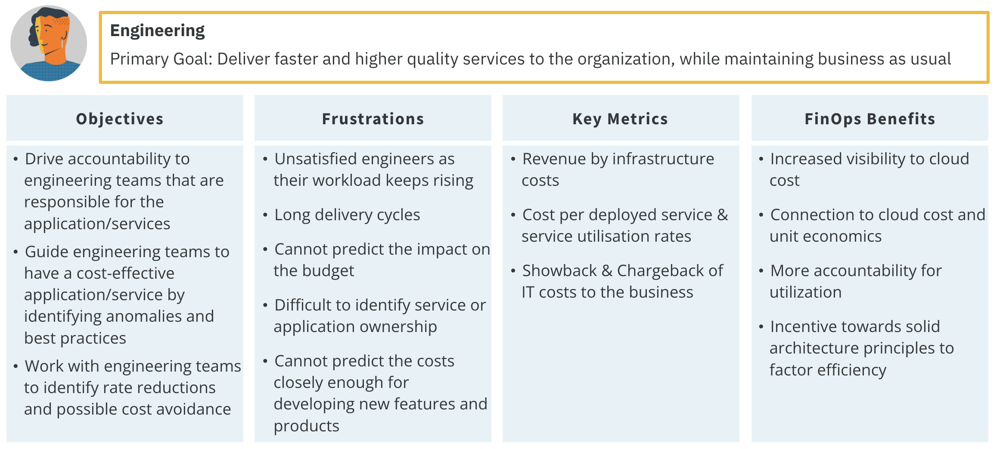
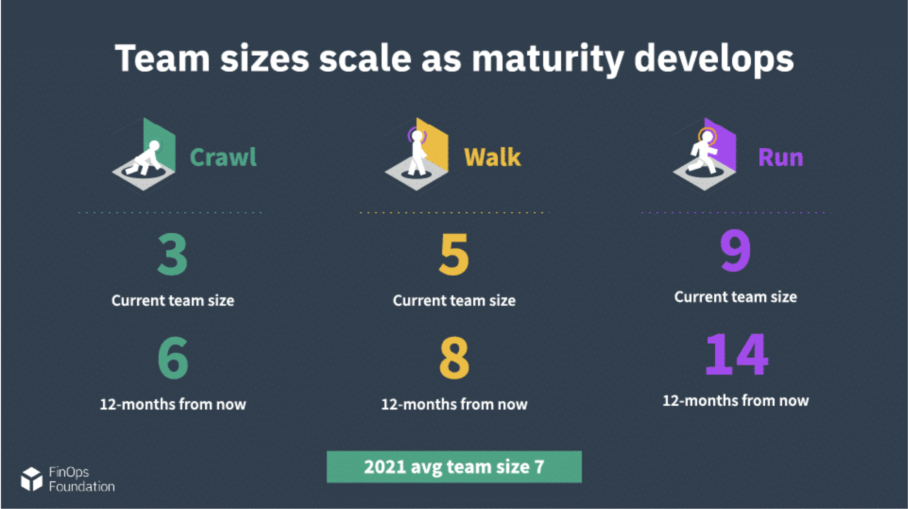

# Personas & Teams

## Personas

### Collaboration

 FinOps is inherently about collaboration. The key to the FinOps practice is the need to support a variety of different personas across the business. The FinOps team does not need to have all of the skills of each persona. Rather, they should work to build connections between personas as the FinOps culture becomes ingrained in the organization. FinOps teams also work to ensure the right people in the organization have the information they need to do their specific jobs.

 

 - Each persona represents a different discipline or perspective on the business
 - Each persona brings their own particular motivations and backgrounds to the discussion
 - Each persona brings important skills and abilities to the successful practice of FinOps
 
 **The FinOps team should be focused on providing information specific to and useful to each of these personas**. Cloud cost and usage data may be a very deep and broad set of data about an organization's services. However, a big part of what is done in data analysis and showback, chargeback, budgeting, forecasting, and in the organization alignment domain can be customized and tailored to the needs of the audience. The FinOps team can do more than simply provide "all the data."

### Personas Across the Organization

 An important soft skill of a FinOps team is understanding how to serve each persona. Every persona has different interests (cost versus usage, applications versus services, scope, KPIs, etc.).
 
 Let's refer back to the FinOps principle: everyone is responsible for their cloud usage. Personas cannot be responsible without good information. Good information must come from all groups who use cloud being able to see, in near real time, what they are using. This enables them to optimize as they go and build responsibly. The FinOps team must ensure everyone takes the responsibility for their cloud usage seriously.
 
 Every organization will have specific personas that outline the roles and responsibilities of specific groups in the organization. For example, government entities often have very strong procurement or contract management personas due to the many contract restrictions on government purchasing. In another example, traditional IT companies might have an ITAM persona who works with the FinOps team. Other organizations may have neither of these and the finance persona will handle these responsibilities. Take some time to determine who the personas in your organization are and define how the FinOps team will support each.

 **Practitione**
 
 
 **Executive**
 
 
 **PO**
 
 
 **Engineering**
 
 
 **Finance**
 
 
 **Procurement**
 

 [Additional information about FinOps personas.](https://fino.ps/Ip8N0h)

### FinOps Team

 FinOps sits at the junction of all these groups and helps to coordinate their activity. Additionally, the FinOps team will have interaction with and may coordinate the activities of cloud vendors externally and many teams internally.

 

 While FinOps primarily focuses on the coordination of discounts and collaboration with commercial cloud companies, the same disciplines and processes can be used to coordinate workload placement in other commercial clouds or on-premises or collocated data centers as well.

## Teams

### A FinOps Team

 For an organization to successfully adopt cloud, adopt the FinOps principles, generate best practices, and satisfy the needs of the diverse set of stakeholder personas, it needs a FinOps Team. The FinOps team is not a gatekeeper, but a facilitator which brings a unique set of skills and information to the organization to help it adopt a FinOps culture and more successfully drive value from their use of cloud.

#### A FinOps Team's Primary Actions
 
 - _Push Accountability Through the Organization_: FinOps requires that we extend accountability to the edges of the organization, where the commitment to purchase now resides. FinOps teams empower feature and product teams to manage their own usage of cloud against their budget. Note that every persona does not have to watch everything, the FinOps team can focus on providing curated information to meet a persona’s needs.
 - _Centralized Rate & Discount Optimization_: The FinOps team itself centrally governs and controls: Committed Use Discounts, Reserved Instances, Savings Plans, and Volume/Custom Discounts with Cloud Providers (FinOps principle: a centralized team drives FinOps). 
   
    The FinOps team is looking at the macro consumption by regions, instance types, and will have insights into both product development and executive strategic planning. This is a specific job individuals within a FinOps team do themselves by analyzing, getting commit sign-off, procurement authorization, and executing.

### Building a FinOps Team

 FinOps teams are as diverse as company organization structures and there seems to be no one way for how to build or run a FinOps team. Here are some key questions to ask when getting started.

 - Who should be on a FinOps team? 
 - What roles should we look for?
 - How many people should be on a FinOps team?
 - Where should the FinOps team report in the org chart?
 - What are the barriers to effectiveness?

### Team Structure Examples

 1. Most FinOps teams start with someone part-time who has other job roles and then evolves from there.
 1. In a less complex organization, a dedicated team can be the central point for all activities.
 1. In a more complex organization, or one that has inconsistent use case across business units, a fully matrixed organization might be a better model, giving each unit more autonomy. For example, this might be a good model for a private equity company which expects each unit to be bought or sold independently, and only wants loose coordination across them.
 1. Fidelity speaks publicly about their “hub and spoke” team structure which has each of their six large-scale cloud-using business units (BU) contributing a person to a core team. This core team performs the FinOps function for the organization as a whole (central RI purchasing, etc.) and then those people also represent and promote FinOps within their BU. They have long-term credibility, an in-depth knowledge of the specific needs of the business unit (all of which have very different cloud use cases), and they can drive that with their users. The centralized FinOps team has a shared understanding of FinOps, its value to the overall organization, and the benefits of the shared functions to the company as a whole.

### State of FinOps Data: Teams

 The State of FinOps survey report(opens in a new tab) is meant to be a living snapshot of the industry. We continue to collect additional responses from our membership and update this report as new insights come in.

 
 In 2019, FinOps members identified the following common roles that existed on FinOps teams.

 
 Our analysis also shows teams are growing 47% from last year and expecting to grow 75% next year.

 **Team size seems to hinge on complexity of cloud use** ($10M a year on one SaaS product is easier than $5M a year on 50 applications) **and complexity of company** (multi-BU, multinational, dozens of apps, five levels of management all complicates things).

 Most often FinOps sits where the problem started in an organization, and it should then move to wherever the coordination point is to continue doing it.

 

 | Location of FinOps Team | Pros / Cons |
 | :---------------------- |:----------- |
 | CIO | May have more sway with engineers; may not be aligned fully with finance, who watches the watchers |
 | CFO | May be overly focused on cost savings, may not have support of engineers |
 | Procurement | May be too low in the organization to be effective, may have the best view as to all avenues for cost savings, right mindset |
 | IT Finance | May not have the skills or experience to think broadly about finance topics, may be closer to engineering teams |
 | CEO | This should be a cooperative effort, not jammed down from above, but high level focus and push can make it effective immediately |
 | Strategic Initiative | Ultimately cloud and FinOps are standard operating procedure, so if strategic, plan to find a permanent home for it soon |
 | CTO | Worry about FinOps seeming like it’s all about new things, technology change, again look for a permanent home ultimately |

