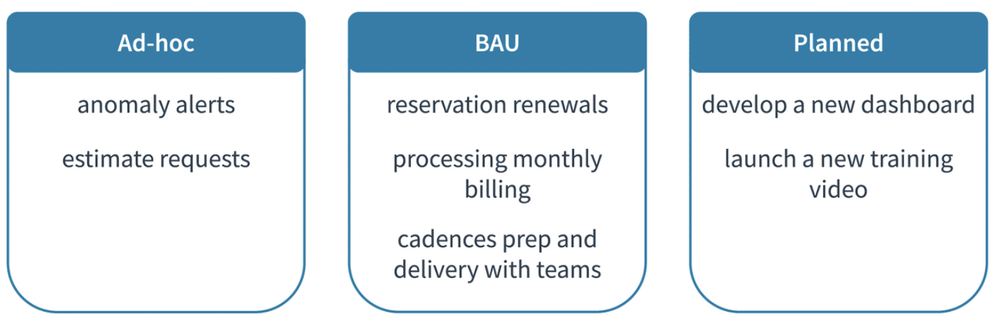

# Running the FinOps Team

## Recap

 We have spent a lot of time learning about the work that a FinOps team must do in an organization. Now, how do we use these concepts and models in our FinOps team to help our organizations achieve greatness and still focus on the FinOps team as a team?

 As we run our team we want to hone in on FinOps as a discipline. We also have to remember that our FinOps team itself (whatever the size, structure or reporting point) requires management and focus too.

## Understanding Types of Work Performed

 As your FinOps practice continues to grow and evolve along with your cloud adoption journey, it is likely that no two days will be the same. As the roles, responsibilities, processes, and tasks of your team develop, they will often fall into three areas: ad-hoc, business as usual (BAU), and planned work.

 Appropriate time and resources should be budgeted to accommodate these different workflows, ensuring that the practice is always able to respond to time-sensitive matters while continuing to perform the daily activities.

 

## Running a FinOps Team

 The [Adopting FinOps Roadmap](https://fino.ps/m60bA0) gets your organization primed to actually begin to perform the capabilities we have described as well as accelerate and amplify the value of your move to cloud. Once a FinOps team is running, there will also be an arc of progress as you launch, mature, and grow your cloud use.

### Operating the Team as a Team

 First there should be a focus on operating the team as a team with a distinct set of goals, KPIs, and responsibilities. It is tempting to staff a FinOps team entirely with part-time resources or to distribute some of the jobs of the central FinOps team to other disciplines.

 

 Without some focus on the team as a discipline, there is a likelihood that only the low hanging fruit of FinOps will be targeted and the deeper functionality and more lasting results will be missed.

### Have a FinOps Leader

 Second, there should be a FinOps leader. This is someone who will be responsible for the successful adoption of FinOps and closely accountable for the success of the organization’s use of cloud.

 

 The [FinOps Professional certification](https://learn.finops.org/path/finops-certified-professional) is an excellent way to prepare to be a FinOps leader. 

### Work the FinOps Capabilities, Mature Functionality, Bring Value

 Third, the FinOps team should work not just to do the FinOps capabilities, but to mature its own functionality and value to the organization. A FinOps team starting out will rack up some impressive results early on as low hanging fruit are often plentiful. However, over time, the team will begin to tackle harder challenges, which may take longer to implement or may involve more stakeholders to accomplish.

 

 Begin as early as possible to focus on the value the team is bringing the organization. 

  1. What recommendations are you making?
  1. Which are actioned?
  1. What value is being created?
  1. What long term value are you enabling?
  1. Are you making an impact on the engineering time available, the staffing, or the number of apps that can be moved or built in cloud?

 Continually focus on this value as you grow and mature.

