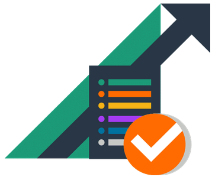
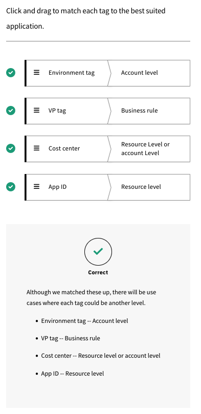

# Inform Phase Overview

## Recap

 Remember, you’re moving to cloud, facing challenges and opportunities. You’ve put together a FinOps team to realize the FinOps principles by exercising the FinOps capabilities. You’ve looked at the motivations of teams around your company and mastered the cloud billing data.  Now we’ll exercise all of those capabilities to understand our use and spending in the Inform phase.

## Inform Phase

 In the Inform phase, we create and use the tags/labels, account hierarchy and other taxonomy to allocate all costs to get a near-real-time view of our current cloud usage.

 **The Inform phase supports the principles:**

 * Everyone takes ownership for their cloud usage
 * FinOps reports should be accessible and timely

 

 **During the Inform phase, we're looking to see:**

   * What are we using and spending?
   * Is it what we expected?
   * What value is it creating?
   * Who is responsible for its effective use?
 
 

  **The majority of the capabilities we will use to accomplish the Inform phase are in the domains:**

   * Understanding Cloud Usage & Cost
   * Real-Time Decision Making
   * Performance Tracking & Benchmarking

   

## Reporting

 **Work to establish trust in numbers and consistently report cloud cost data within all groups. Assess the presentation materials for the audience, accuracy, scope, etc. Take all types of data quality issues seriously.** 

### Reporting: The User Interface of FinOps

 The reports and dashboards created to build FinOps inside your organization can be considered the User Interface (UI) of FinOps. These reports are often what your staff see when interacting with FinOps processes. By looking at your reports and dashboards as your UI, you can apply decades of research into good UI design, apply DevOps practices in order to manage your reports and design them with consideration to the psychology of how users interact with them. 

#### Building Quality FinOps Reports

 *  Differentiate production reports from ad hoc and investigative reporting capabilities - and treat them like the production software they are
 *  Prioritize consistency and data quality above all else. Automate important reports to avoid human errors and ensure consistent delivery
 *  Make reports specific to the needs and motivation of a each persona
 *  Provide context: use KPIs instead of raw numbers
 *  Edit ruthlessly, simplify, and look at what’s actually useful to your users

##### Types of Cost Metrics

 There are various types of cost metrics available to use on reporting, on dashboards, and as part of KPIs. Click each card below to flip and view the definition.

 | Types of Cost Metrics | Description |
 |:--------------------- |:----------- |
 | On-Demand Cost | On-Demand Cost: The list prices publicly stated by vendors, before any discounts. |
 | Discounted Rate | Discounted Rate: The public rate discounted with some of the available discounts (free tier, commitment based discounts, negotiated rate discounts, sustained use discounts). |
 | Amortized Costs | Amortized Cost: The amortized cost of a resource takes this initial payment into account and distributes it out based on usage, attributing the prorated cost for each hour of billing. |
 | Fully-Loaded Cost | Fully-Loaded Cost: Are amortized, reflect the actual discounted rates a company is paying for cloud resources, equitably factor in shared costs, and are mapped to the business’s organizational structure. In essence, they show the actual costs of your cloud and what is driving them. |
 | Unblended Rate | Unblended Rate: Some resources are charged in decreasing rates the more you use them. This means you’re billed different rates for resources as you use more, or for longer periods during the month. By examining your bill, you can see that some resource costs are larger than others, even for the same type of resource or an identical resource. When the rates are presented this way, they’re called unblended. |
 | Blended Rate | Blended Rate: AWS provides blended rate information on its invoice showing the effective rate for a group of resources with the same attributes where some of the resources are receiving a discount from reservations and some are not. This can help to eliminate the effects of reservations applying randomly to resources in multiple linked accounts, by providing a consistent rate for specific resources that would have been eligible to be covered by the reservation or savings plan. |

## Data in the Path of the Engineer

### The Prius Effect

 In a regular gas car, the feedback you receive about your mileage lags. You get it only when you fuel up, if you get a receipt and do some math. In the Prius, and other electric cars, the driver is given instant feedback on when they are using power from the engine, using gas, or when they are regenerating/charging. There is no light on the dash that says “Drive economically!” It is just the natural inclination of drivers to attempt to stay in the green zone. This effect will stay with you even when you drive in gas cars shortly after being in an electric, but it slowly wears off. This is not to say that you can’t go hyper fast and powerful in an electric vehicle. Anyone who has driven a full-power Tesla knows this. 

 

 There is continuous feedback on usage in the Prius (engine, gas, or recharging/charging). Therefore, when you need to use all the power at your disposal you can make a conscious decision to do so and the car will support it. However, under ordinary circumstances, the continuous feedback provided on usage tends to guide responsible behavior. 

 It is similar with the cloud. **FinOps teams should strive to provide continuous, simple, clean feedback to cloud users to keep them driving economically.** Engineering teams responsible for their cloud use will respond to cost information and use it as an efficiency metric, which is what we want. We refer to this as “Putting Data in the Path of the Engineer." This doesn’t just work for engineers, putting a good UI in front of any of our persona stakeholders makes a big difference in keeping cloud optimization front of mind. **It is in the Inform phase that the FinOps team creates the data transparency that the organization needs to successfully execute the FinOps lifecycle.**

### Resources

 **Encouraging Engineers to Take Action.** This article addresses how finance, operations, and executives can work better together to encourage cloud cost optimization from their engineering teams. [Learn More](https://fino.ps/Zg5EAS)

## Anomaly Detection

### Anomaly Detection

 Anomaly detection is crucial to any cloud operation. In addition to security and operational monitoring, cost monitoring can provide crucial early warning signs.

 **Consider Various Alerting Schemes**

 

 Anomalies will occur. Security systems, performance systems, and configuration management systems will spot anomalies in usage. FinOps teams should choose tools to help spot anomalies in spending as well. Various alerting methods work in different scenarios: spending changes, spending changes over standard deviations, and checking each allocation category (e.g. $500 of extra spending may not be anomalous on a $50,000 monthly bill, but $500 extra in my $200 monthly bill is). Percentage change can also be an anomaly type, and in some cases, spending of any type of unexpected service type can be considered an anomaly. Anomaly definitions should be continuously reviewed and refined in order to balance valid alerting against noise.

### Resources

 **Managing Anomalies** Learn more about the managing anomalies capability within the performance tracking and benchmarking domain. 

 **Anomaly Detection at Scale** This practitioner story provides an example of anomaly detection at scale. |[learn more](https://fino.ps/3j200q)

## Benchmarking

 Within the Inform phase, benchmarks enable you to see what is being used, how much it costs, and compare to others. **There are multiple ways in which you can benchmark:**

 | General Analyst Benchmarking | Details |
 |:---------------------------- |:------- |
 |Flexera, McKinsey, Gartner, IDC, etc.	| Provides some general information on state of the cloud, state of cloud adoption, cloud migration, etc.|
 |Cloud Providers |	Provides benchmarking for companies “like you” (sometimes this is not provided) |
 |FinOps Foundation: State of FinOps | Provides benchmarks for some cloud use [data.finops.org](https://data.finops.org/) |
 |FinOps Slack Group | Provides avenues to meet others and compile anecdotal comparisons to other companies in or outside your industry |
 | Internal Benchmarking | Provides insight between teams within your organization with similar profiles of usage or for size-independent KPIs |
 | Benchmarking Against Self | Provides useful and consistent benchmarks over time as well as a means to compare different types of teams |

 As you benchmark, work to develop KPIs that make sense to compare against one another. You are more likely to promote KPIs that are measured. KPIs will drive priorities - sometimes to the detriment of other things that are not being measured. It is important to select clear, relevant KPIs that are going to foster related benefits. 

 You will use these KPIs and scores in the Optimize phase to utilize trending and conduct variance analysis. You will also assess performance over time since this is just as important as the numbers. Additionally, be sure to save and consistently evaluate behavior trends.

 Different benchmarks will measure the performance of different teams. Asking whether the FinOps team is performing well is a very different question than whether your engineering, architecture, or migration team is performing well.

### Examples

 * Cost/Compute Hour Trend: Measures team against itself over time, compare against any team

 * Consistent Compute Use Coverage Rate: Measures the performance of the FinOps team in buying commitment based discounts

 * Recommended Optimization Savings/Total Cost Trend: Could measure each team or the architecture team in bringing in more scalable architectures or using spot
  
 

 Be sure not to over do it. You cannot benchmark with others until you understand your usage and have common language to communicate (FinOps). 

## Cost Allocation

 Cost allocation (or cost attribution) is the most important thing you will do as someone involved in FinOps. In order for anyone in the organization to adhere to the principle: "Everyone is responsible for their cloud usage," they must know what they are spending. Further, to know what value we are getting from spend, we must be able to identify the costs associated with delivering that value. We perform cost allocation so we can produce these reports for the users of cloud. This reporting is usually one of two types: showback or chargeback. 

### Showback

 Showback reports are reports that use cost allocation mechanisms to show a team what they are using and spending.

 

 * These reports can be done at any level (what we’re spending on compute across all applications, what we’re spending on storage within this one microservice, what we’re spending on network only in Azure, etc.)
 * These reports are not mutually exclusive of one another
 * They are designed to be informative and to be helpful to cloud users to understand usage and take actions to be responsible for its efficiency and effectiveness
 * They are not entered into an accounting system, or general ledger. Rather, they are informational and designed to promote transparency and drive behavior
  
### Chargeback

 Chargeback reports are given to the accounting system and applied against an official budget the organization is tracking.

 

 * These reports are created for a specific P&L or budget owner
 * They are likely mutually exclusive (add them all up and that’s all your cloud spend)
 * They are designed to create debits against established budgets in the accounting system
 
 Chargeback reports may be the exact same report as a showback report, but they are official budget reports. You can have less mature and more mature versions of each (maybe your reports have shared costs, maybe they have blended rates, maybe they have indirect allocations, maybe they don’t). Because these are similar, they can be produced similarly, but it is likely you will do showback for more groups.

 Chargeback reporting will face much more scrutiny. Making changes to charges in the accounting system can be difficult, or require documentation. Particularly, shared charges outside of a P&L owner’s control will face more scrutiny. Some organizations require SOC compliance testing of chargeback reporting. You will want to save and preserve your chargeback reporting more than showback reporting which can be more short-lived. This may affect the tooling or process you use. 

### Why Choose a Model

#### Start off Budgeting Centrally
 Companies adopting cloud slowly may start off budgeting for “cloud” centrally

 * It is easier
 * It is unknown how costs will divide out at first
 * It allows for flexibility and innovation, especially during the “science fair project” phase

#### Showback/Chargeback
 
 Showback/Chargeback comes later with

 * More shared cost items and complexity in the cloud environment
 * Better predictability
 * More scale making cloud costs material

#### Chargeback records costs when...

 Chargeback records costs in the accounting system when:

 * It is necessary 
    - Multinationals with different tax treatment
    - Multi Business Unit who want to keep units very separate (e.g. high M&A)
    - Highly regulated or governmental requirements

 * Have to account for changes after the fact (billing data sometimes shows up late)
    - This is more complex operationally for finance/accounting teams

#### Historically

 Chargeback may not typically be done in the traditional data center IT. Sunk costs are rarely billed or tracked for efficient use. The money was already out the door, outside of the P&L owner’s control, and did not change month-to-month. If chargeback was being done, it was likely done in the accounting system only and not in the reporting shown to those actually working on the applications.

 Unlike the data center, cloud cost can change and be tracked more easily and should be managed daily. Ideally, all direct and indirect costs should be allocated to the cost center budgeting for them.

 

 **Crawl** Split the invoice up

 **Walk** Generate reports of direct costs with amortization of commiment based discounts

 **Run** Direct and shared costs, amortization is tied to business results of each cost center

## Managing Shared Costs

 Try not to divide up shared costs unless you have to. If you have to divide up shared costs, do it in the simplest way that is feasible for your organization.

### Managing Cost Sharing

#### Centrally budget 

 * Centrally budget and pay for shared costs without dividing (cheating here, but this is the easiest way)
    - We budget for security and compliance services separately, you as a P&L owner don’t worry about them

#### Fixed or even distribution

 * Build a quick table of how much of the total each budget is going to pay
    - The SaaS product will pay 80% of the security and compliance costs, and the two other P&L groups will pay 10% each

#### Proportional

 * Cost is split based on the spending of each budget on some other item
    - We’ll split the Enterprise support cost based on total spend in your direct allocated accounts that month, you get the proportion that your total spend represents

#### Direct Allocation

 * Cost is allocated based on tracking usage of some other non-cloud-bill data
    - We will pull in the Kubernetes cluster information which can identify which pods are being run by which application and we’ll calculate total allocated resources by pod, then total by application, then figure out total cost of the environment, allocate to each application that cost, and allocate cost directly to each application’s P&L. Additionally, we’ll have to distribute a percentage of vacant/unused container environment and we’ll distribute that proportionally to the use of the overall container resources

## Resources

 **Cost Allocation**. Cost Allocation is the set of practices to divide up a consolidated invoice or bill among those who are responsible for its various component parts. In the context of FinOps this typically involves dividing up consolidated Cloud Service Provider invoices among various IT groups who use cloud within the organization. 

 **Data Analysis & Showback.** Data analysis and showback is the ability to leverage data, along with metadata on cloud resources and resource hierarchies, to create a near “real time” reporting mechanism for stakeholders which calls to attention: total costs for the desired business entity, opportunities for cost avoidance, and KPIs for financial health (e.g. performance of rate reduction commitments, unit cost measures for key services, efficiency metrics aggregated by desired “team”, organizational unit, etc…). 

 **Fair Cost Allocation in a Shared Platform.** This article provides a look into the setup, goals and story of fair cost allocation in a shared platform. 

## Accounts, Taxonomy, and Tags

 Now that we know what Showback and Chargeback are, **how do we produce reporting from our massive pile of cloud data?**  We will use various cost allocation/attribution techniques involving:

 * A meaningful structure/taxonomy of identifiers and metadata that allows us to meaningfully divide up our costs. This is very specific to your business: What do you call things? What do you call your divisions? Your cost centers? Your departments? Your P&L segments? etc. 
 * AWS Accounts / Azure Subscriptions or Resource Groups / GCP Projects are the building blocks of organization in each of the cloud providers which are required and provide a concrete boundary of cost (and other things)
 * Tags, labels, and other metadata are used to apply and associate the taxonomy values with the resources or resource hierarchy you are actually running
 
 You will use a combination of all of these structures/methods to accomplish your cost allocation task. 

### Terms

 Within the FinOps Foundation, we are vendor neutral, so we use generic terms for some of these things. In the rest of this lesson, "**account**" will be used to represent the resource hierarchy and "**tags**" will be used to represent cost allocation metadata.

 | Generic Term | Specific Terms |
 |:------------ |:-------------- |
 | Resource Hierarchy |	accounts, subscriptions, account groups, projects, folders |
 | Cost Allocation Metadata	| metadata, tags, labels |

### Methods

 Organizations often choose to allocate costs primarily by account, especially at first, because it is easy for everyone to understand. Every cost shows up in an account, even resources that can’t be tagged. 

 Eventually there will be accounts which are used for multiple purposes. Then you will need to tag things. In many cases you can tag the resource hierarchy too. In tagging individual resources you identify them in ways you will use to filter showback, chargeback, and ad hoc reporting later.

 You may not define your entire resource hierarchy plan and metadata strategy up front. You can take time and evolve these as you go. Remember, you aren’t the only stakeholder here, CCOE, Platform, Engineering, Security, etc. They all have an interest in hierarchy and metadata.

 Account-based allocation is the most powerful method of dividing costs. Azure Management Groups, AWS Organizations, and multi-layered GCP folders make this even easier to manage. How is your taxonomy broken up? 

## Tags and Labels

 Tags or labels used for cost allocation may need to be enabled or you may need to grant access to them to use them in downstream reporting (Cost Allocation Tags in AWS, IAM permissions required to view labels in GCP, etc.). Or, you may need to create or augment your cloud usage and cost data with third party tools or other data sets you have available within your organization (i.e. a CMDB of cost centers and their owners). Click each information icon below to learn more.

### Resource Level 
 
 Tag an instance,databese, connector, app ID, etc

### Account Level

 Everything in this account, resource, environment group goes to cost center xxx

### Business Rule

 If a resource is tagged, put in the cost center it's tagged with. Otherwise, make it the cost center of the account it's in.

 Any GuardDuty or Cloudwatch charges go to the central IT cost center but other costs go to the team cost centers. If one of these services is used, tag it with a "Data Services" Service Category tag.

 Business rule tags typically do not live in the billing data from the cloud provider.

### Activity
 
 

 There are lots and lots of tags; too many is just as debilitating as too few. While tags are needed for lots of reasons (operational, development, financial, team management, etc.), FinOps is interested specifically in the tags that allow us to allocate costs consistent with the company’s needs. Tags can be at the resource level, at the group of resource level, at the account level, or at the synthetic level (applied after the billing is done). Certain tags are appropriate for each level. 

#### There are some things that are untaggable.

 * Cloud vendors are constantly adding things, but also releasing things that aren’t taggable
 * Some things have taggable bits and untaggable bits (data charges associated with an EC2 instance)
 * Some things are only taggable after you create them 
 * Some things are only taggable through the SDK/API/CLI not through the console

 

#### Tag compliance will hit everyone sometime or another.

 * Measure tag compliance by cost, not items or instances
 * You will be in a good place if you get 99% of cost tagged
 
 

## Forecasting & Budgeting

 **Forecasting is one of the greatest challenges of cloud.** There are many unknowns. Traditionally 80% of IT cost was fixed, mostly depreciation. Therefore, if you were 100% wrong in your variable estimates, you were at most 20% variant from budget. Now, 80% of your IT costs are variable. If you’re 50% wrong, you’re 40% variant!

 

 **Crawl** - Forecast based on manual estimates or last year plus models

 **Walk** - Forecast based on past usage at an application or an environment scale

 **Run** - Granular forecasting by service with daily tracking and updating to actuals, including discounts, amortization, and shared cost

 Budgeting is underrated. Budgets do not have to be official budgets. You can establish "rule of thumb budgets" for each team/view where someone is responsible for spending, set alert thresholds for alerts, and know what your daily/weekly/monthly spend patterns are. This will create a basis for your estimating going forward. You will get better at budgeting if you do it weekly and assess your results. Forecasting and budgeting are skills like any others. Practice now before the annual budget cycle so you get a feel for it and start to build your skills. 

## Resources

 **Forecasting** Forecasting is the practice of predicting future spending, usually based on a combination of historical spending and an evaluation of future plans, understanding how future cloud infrastructure and application lifecycle changes may impact current budgets and influence budget planning and future cloud investment decisions. 