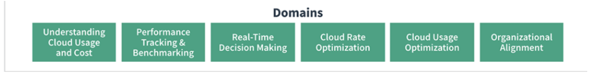
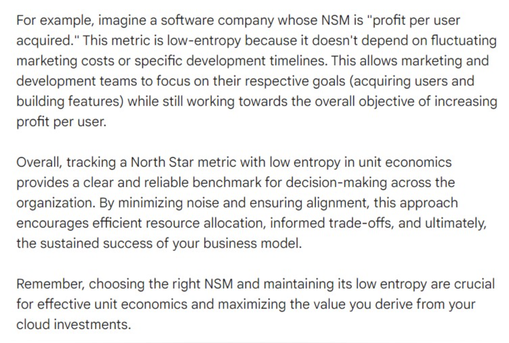
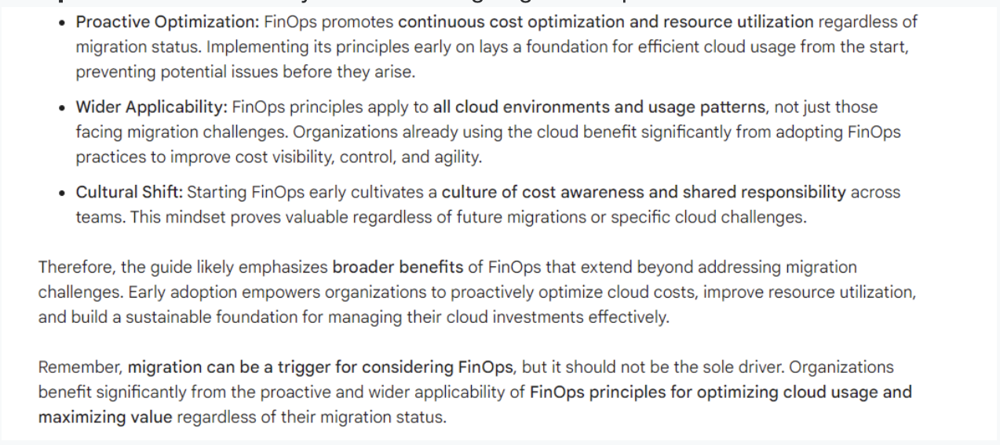
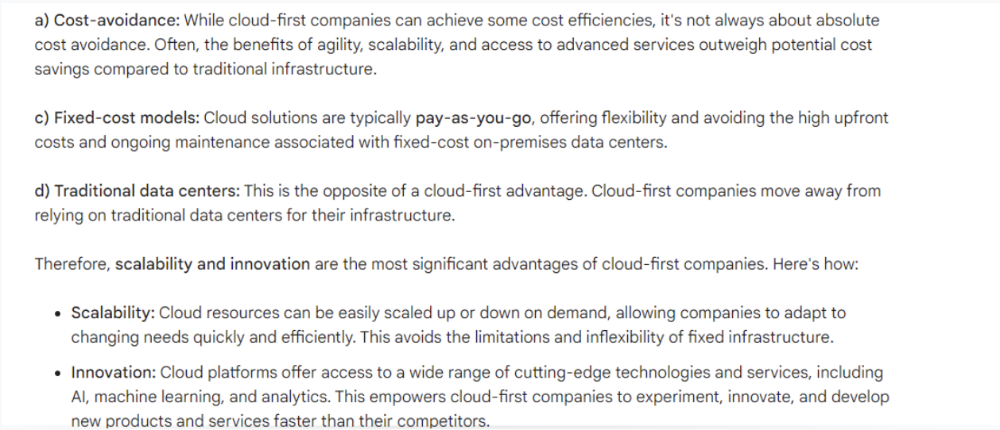
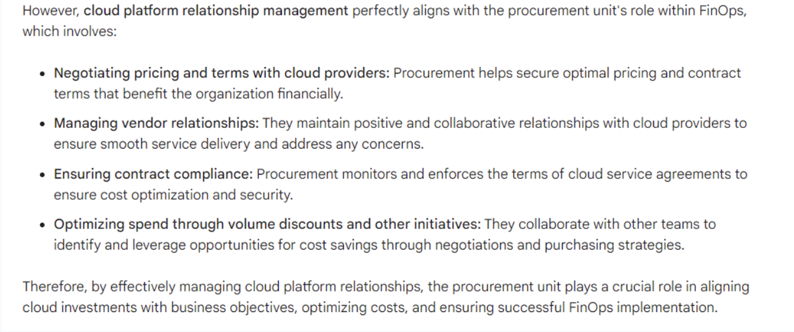

# FOCP

 1. What term is used to describe the ability to identify and allocate costs to the appropriate cost categories in use by a customer?
 
    **Cost Allocation**
 
    In FinOps, the ability to identify and allocate costs to the appropriate cost categories in use by a customer. Ideally direct costs (the cost of resources running in my accounts), amortized costs (the amortization of prepaid costs paid upfront for RIs applied in my accounts), and shared costs (my share of common services accounts run by others on my behalf) can be allocated to individual budgeting categories for a clear view of the entire cost of running my application or workload in the cloud.
    Reference: Please review the terminology page before the exam https://www.finops.org/resources/terminology/ 
 
 2. Each major cloud provider labels the platforms 'allocation metadata' a specific way. How does GCP name the allocation metadata?
    
    **"Labels" and "billing acounts"**
    Explicación
    GCP( Google Cloud Platform)- “labels” and “billing accounts”;
    GCP uses “labels” and “billing accounts”;
    AWS “resource tags”, “Linked Accounts” and “Organizations”;
    Azure “Subscriptions”, “Resource Groups” and “resource tags”
    We do need to know some cloud provider specific terms for the exam.
    Refer here before the exam [FinOps Terminology](https://www.finops.org/resources/terminology/)
  
 3. AWS provides what is called a 'Blended Rate' on its invoices. What is the blended rate showing?
   
    **Shows the effective rate for a group of resources with the same attributes.**

    AWS provides Blended Rate information on its invoice showing the effective rate for a group of resources with the same attributes where some of the resources are receiving a discount from reservations and some are not.

    Terminology is a critical knowledge area for the exam.

 4. Which of the following is NOT part of the FinOps Maturity Model?
   
    **Sprint**

    A “Crawl, Walk, Run” approach to performing FinOps enables organizations to start small, and grow in scale, scope and complexity as business value warrants maturing a functional activity. Taking quick action at a small scale and limited scope allows FinOps teams to assess the outcomes of their actions, and to gain insights into the value of taking further action in a larger, faster, or more granular way.

    Reference: Please review this page before the exam. [FinOps Maturity Model](https://www.finops.org/framework/maturity-model/)

 5. 'Establish FinOps Culture' would be under what domain according to the FinOps Foundation?
    **Organizational Alignment**

    Explanation: There are six specific domains in FinOps according to the FinOps Foundation. We will want to be able to understand what topics are covered by each domain.

    

 6. Multiple Selection:(Select two). Which of the following statements would be true regarding deploying Kubernetes clusters concerning cost complexity?
    **Generally organizations have multiple teams consuming portions of those underlying container resources**

    **The average lifespan of a container being one day versus a typically much longer utilization time for a VM**

    Explanation: Managing Kubernetes clusters on just about any cloud platform is very challenging due to the complexity of how Kubernetes is deployed, how resources are consumed and the general lack of real time visibility. Secondly, all providers charge for additional resource usage so for the example the amount of bandwidth or storage API access may not be visible even with tagging.

    Please refer to this page before the exam. [Calculating Container Costs (finops.org)](https://www.finops.org/projects/calculating-container-costs/)

 7. Which of the following is the best definition of a Kubernetes Pod?
    **A pod consists of a group of containers and treats them as a single block of resources that can be scheduled and scaled on the cluster.**

    Explanation: The other answers are incorrect and are variations of the correct answer.

    Reference: Please review the terminology here for containers. [Calculating Container Costs (finops.org)](https://www.finops.org/projects/calculating-container-costs/)

 8. _ _ _ _ _ _ or _ _ _ _ _ _ is the foundation of telling apart workloads in the cloud, identifying ownership, and attributing costs to teams.
    **Tagging or Labeling.**

    Explanation: Tagging or labeling is the foundation of telling apart workloads in the cloud, identifying ownership, and attributing costs to teams. 
    Read more about forecasting. [Accurate Cloud Forecasts (finops.org)](https://www.finops.org/projects/forecasting-cloud-costs/).

 9. Multiple Selection:(Select three)

    Cloud Forecasting can be a challenge, especially in large disparate organizations. Centralization can be a helpful factor but also there are some focus areas that we can use to 'break the challenge into addressable parts'.

    **Tagging and cost allocation can provide insight into resource spending.**

    **Use forecasting models to help provide predicable models for consistency.**
    
    **Use communications to relay that forecasting is being used for decision making**
    
    Explanation: The other answers are incorrect.  For example, we can use both third party and provider tools since some providers may not provide all the reports, features etc. we may want. It is also a Finops best practice to actually centralize our FinOps practice and provide consistency in our reporting/forecasting.
    
    Reference: [https://www.finops.org/projects/accurate-cloud-forecasts/](https://www.finops.org/projects/accurate-cloud-forecasts/)
 
 10. True or False:

    Distributed decision making coupled with the move to variable spending in cloud allows technology teams to efficiently partner with finance and business teams to make informed decisions that drive continual optimization.

    **True**

    Explicación
    Statement is correct. Remember that FinOps is really about collaboration.

    Reference: [FinOps Foundation - What is FinOps?](https://www.finops.org/introduction/what-is-finops/)

 11. When comparing TBM and FinOps, which one would focus on results mainly on speed?
     
    **FinOps**
     
    FinOps is focused on results much more frequently than with TBM. TBM is monthly or quarterly focused whereas FinOps collects and reviews data constantly.

    Technology Business Management (TBM), a best practice discipline for IT business management; and FinOps, the financial operating model for public cloud consumption, share the same goal of defining IT by impact rather than spend.
    
    TBM was built to serve the needs of on-prem IT with data-driven decision-making to manage, plan, and optimize spend. TBM has incorporated data-driven decision-making for the cloud but doesn’t manage the complexities of allocating cloud costs and the prescriptive methods of controlling those costs. TBM looks at the “what” of all IT spend, including a macro view of cloud spend.
    
    By bringing together people (and data) from IT finance, operations, and business, TBM creates a community of stakeholders to manage all IT.
    
    FinOps was born for the cloud. Systems, best practices, and cultures increase an organization’s ability to understand cloud costs and make informed and timely balancing decisions. FinOps focuses on optimizing the cost and utilization of the cloud through technical and organizational means.

 12. True or False: In regards to cloud forecasting there is no one forecasting method that fits all situations.
    
    **True**

    Every organization and even cloud provider has different requirements that are to be met or are met. Some organizations my need a granular VM pricing whereas other may not.

    Some cloud providers support things diffferently than other and therefor require the organization to consider the best model they need. Unfortunately there is no one forecasting method that fits all situations. Cloud spend is variable which is inherently difficult to predict.
    
    Specifically engineers can start workloads at any time typically without having to go through a procurement process. Forecasting cloud-provider consumption as product or service consumption requires specific data and tooling to be consistently available.
    
    Billing and reporting from cloud providers is difficult to understand and explain to traditional finance teams. Workloads need to be clearly defined whether through tagging or account structures so that cost can be attributed back to them and their owners.
    
    Please review this page before the exam. [Accurate Cloud Forecasts (finops.org)](https://www.finops.org/projects/forecasting-cloud-costs/)

 13. When proposing the adoption of a FinOps function within an organization, there will be a need to brief a variety of personas among the executive team to gain approval, buy-in, and involvement in conducting FinOps and achieving its goals. Every role has a clearly documented Primary Goal. What is the primary goal for a Chief Technology Officer (CTO)?
    
    **Leverage technology to give the business a market and competitive advantage**

    Explanation: There are clearly labeled roles for each 'Persona' and we must learn these for the exam.

    Reference:  [FinOps Personas](https://www.finops.org/framework/personas/)

 14. True or False: In FinOps decisions are not driven by the business value of the cloud?
     
     **False**

     In FinOps decisions are driven by the business value of the cloud. With FinOps we look at the cloud as a business value creator. One of the main roles of FinOps is to maximize the value of the cloud spending.

 15. Which of the following terms are associated with Agile?
     
    **Sprint**

    *Explicación*: There are several terms affiliated with Agile development such as Sprint, User Story, Epics, Lean, etc. Rightsizing, Zones and Regions are cloud computing terms.

    Sprint a short interval of work in an Agile project, usually a week or two weeks but sometimes more or less, during which time an agreed-upon amount of work will be delivered.
    
    Reference:
    
    Please review the Terminology page before the exam. [https://www.finops.org/resources/terminology/](https://www.finops.org/resources/terminology/)

 16. In Cloud Computing some costs can be considered fixed and some are variable. Which of the following costs would generally a fixed costs, meaning predictable monthly or annual costs?
    
    **Support and Maintenance**

    Explanation: Support and Maintenance are almost always a fixed cost meaning that you would pay a certain amount for a specific amount of support/users/response times. Variable costs would be about any resource you would use.
    
    Reference: Please review this page before the exam. [FinOps Terminology](https://www.finops.org/resources/terminology/)

 17. Which of the following roles/personas would be responsible for 'Rate Negations' with a cloud provider?
   
    **Procurement**

    Explanation: Procurement is handled somewhat different in the world of FinOps.
    
    We know that Procurement is moved from a CAPEX to a OPEX manner in the cloud. Procurement should have the following objectives in a FinOps organization. Negotiate the best win-win cloud contract, Exercise enterprise discount / volume commitment programs and Manage relationship with Cloud platform provider.
    
    Reference: Please review this page before the exam [https://www.finops.org/framework/personas/#product-owner](https://www.finops.org/framework/personas/#product-owner)
 
 18. True or False: FinOps is about saving money. 
    
    **False**

    Explicación
    FinOps is about making money. Cloud spend can drive more revenue, signal customer base growth, enable more product and feature release velocity, or even help shut down a data center.

    Please refer to this page. [FinOps Foundation - What is FinOps?](https://www.finops.org/introduction/what-is-finops/)
 
 19. Your organization has recently adopted a FinOps based method for dealing with cloud costs and adopting FinOps. Currently, your organization has recently completed 'Step Two' for FinOps culture in your company. What would the next stage for the organization to accomplish?
    
    **Preparing the organization for FinOps**

    Explanation: The next step after Stage 1 - Planning for FinOps in an Organization (Laying the groundwork) is the Stage 2 - Socializing FinOps for adoption in an organization. Then After Step 2 would be Stage 3 - Preparing the organization for FinOps
    
    Reference: Please reference this page before the exam. [Adopting FinOps - Getting Started](https://www.finops.org/projects/adopting-finops/)

 20. Multiple Selection: (Select three) Which activities would fit under the FinOps principle of ' Decisions are driven by business value of cloud' ?
    
    **Trending and variance analysis helps to understand why costs increased**

    **Internal team benchmarking drives best practices and celebrates wins**

    **Industry peer-level benchmarking determines how your company is performing**

    Explicación: Decisions are driven by business value of cloud The other activities are under a different phase of activities.

    Please reference this page, section. [https://www.finops.org/framework/principles/](https://www.finops.org/framework/principles/)
 
 21. Which service on AWS used to download and store the Cost and Usage report on so you can query it?

    **AWS S3**

    AWS S3 is the service for storing data on AWS. You can publish your AWS billing reports to an Amazon Simple Storage Service (Amazon S3) bucket that you own and choose to use that how you like.

    Reference: [https://docs.aws.amazon.com/cur/latest/userguide/what-is-cur.htm](https://docs.aws.amazon.com/cur/latest/userguide/what-is-cur.htm)

 22. True or False: A key role toward building FinOps adoption is the Driver.
    
    **True**

    A key role toward building FinOps adoption is the Driver which means that we must get broad executive support and buy-in to dedicate the time and resources needed for the cultural change.

     Reference:

     Please review this page before the exam. [https://www.finops.org/projects/adopting-finops/](https://www.finops.org/projects/adopting-finops/)

 23. FinOps Principles are north stars that guide the activities of our FinOps practice. These principles are clearly broken down and we must encourage members to practice these. When it comes to these principles which of the following activities would be under the 'Teams need to Collaborate' principle?
    
    **Define governance and controls for cloud usage**

    Explanation: Honestly, some of these activities may or not intuitively seem like they are under specific principles. This is perhaps the most confusing part of the content to remember. For Teams need to collaborate these are the activities specified by the FinOps Foundation: Finance moves at the speed and granularity of IT Engineering considers cost as a new efficiency metric Continuously improve your practice to gain efficiency and innovation Define governance and controls for cloud usage.
    
    Reference:
    
    Please refer to this page before the exam. [FinOps Principles](https://www.finops.org/framework/principles/)
 
 24. In regards to the FinOps Maturity Model Guidelines which of the following statements would be true regarding the Maturity Level Characteristics for 'Run'.

    **Capability is understood and followed by all teams within the organization**

    Explicación

    The guidelines and characteristics are clearly defined by the FinOps Foundation and these are a must know for the exam.
    
    RUN MATURITY CHARACTERISTICS Capability is understood and followed by all teams within the organization Difficult edge cases are being addressed Very high goals/KPIs set on the measurement of success Automation is the preferred approach The maturity model
    
    Must read. [FinOps Maturity Model](https://www.finops.org/framework/maturity-model/)

 25. AWS has a wealth of FinOps capabilities that we could use as an AWS user. Which of the following AWS Services would we use to track costs and usage and send alerts when a threshold is exceeded.

    **AWS Budgets**

    Explanation: AWS Budgets allows users to set up alerts, initiated when actual or forecasted costs and usage exceed predetermined budget thresholds. The goal of AWS Budgets is to reduce unintentional over-spending. AWS Budgets also allows for the configuration of automated responses if costs or usage exceed desired limits.
    
    [https://docs.aws.amazon.com/cost-management/latest/userguide/budgets-managing-costs.html](https://docs.aws.amazon.com/cost-management/latest/userguide/budgets-managing-costs.html)
 
 26. Your FinOps leader and mentor has reached out to you to find out more about Azure Capabilities. What tool in Azure would you use to implement enforcement of Tagging on Azure?

    **Azure Policy**
   
    Explanation: You use Azure Policy to enforce tagging rules and conventions. By creating a policy, you avoid the scenario of resources being deployed to your subscription that don't have the expected tags for your organization. Instead of manually applying tags or searching for resources that aren't compliant, you create a policy that automatically applies the needed tags during deployment.

    Tags can also now be applied to existing resources with the new Modify effect and a remediation task. The following section shows example policy definitions for tags.

    References: 
    [https://www.finops.org/projects/multi-cloud-tools-and-terminology/](https://www.finops.org/projects/multi-cloud-tools-and-terminology/)

    [Policy definitions for tagging resources - Azure Resource Manager | Microsoft Learn](https://learn.microsoft.com/en-us/azure/azure-resource-manager/management/tag-policies)

 27. Which stage in the FinOps Adoption Process would we be 'performing initial resourcing' such as getting budget approval?
    
    **Stage 1 - Planning for FinOps in an Organization (Laying the groundwork) **
    
    Explanation: When planning for FinOps we must assemble resources, estimate, review, plan and assemble people and all this is done in the first stage.

    Please review this page before the exam. [Adopting FinOps - Getting Started](https://www.finops.org/projects/adopting-finops/)

 28. Each of the cloud providers have tools that can help FinOps professionals specifically in that cloud platform. You have been working with AWS for over 1 year. You know would like to go back and view the billing reports but also perform a detailed report for BI analysis. What AWS service could you use?
    
    **AWS QuickSight** 
    
    is a cloud-native, serverless, business intelligence with native ML integrations and usage-based pricing, allowing insights for all users.

    Reference: 
    
    [https://www.finops.org/projects/multi-cloud-tools-and-terminology/](https://www.finops.org/projects/multi-cloud-tools-and-terminology/)

    [AWS](https://aws.amazon.com/quicksight/)

 29. Which of the following statements would be correct about Weighted Average Cost of Capital?
    
    **This is the rate the company is expected to pay on average to all its securities holders to finance the operation of the business.**

    Weighted Average Cost of Capital - the rate the company is expected to pay on average to all its securities holders to finance the operation of the business. Importantly this is set by the external market (what the market is willing to pay for various forms of the company’s securities) not by management.
    
    Reference: [FinOps Terminology](https://www.finops.org/resources/terminology/)

 30. Which of the following a native tool in AWS that we would use in our FinOps exercises to understand costing issues, get recommendations, etc.
   
    **Cost Explorer**

    Explanation: Cost Explorer is a free tool that AWS offers to all customers that provides visibility across the AWS infrastructure and has features like rightsizing, savings plans recommendations, and cost anomaly alerting. Cost and Usage Reports (CUR) provides no recommendations and it is important to that Trusted Advisor has free and paid support options but does not provide insight into billing.
    
    Reference: [https://aws.amazon.com/aws-cost-management/aws-cost-explorer/](https://aws.amazon.com/aws-cost-management/aws-cost-explorer/)

 31. FinOps Principles are north stars that guide the activities of our FinOps practice. They’re developed by FinOps Foundation members, and honed through experience. When it comes to the FinOps principle of 'A centralized team drives FinOps' which of the following statements would be true?
   
    **Centralized discount buying process removes rate negotiations from engineering team consideration.**

    Explicacion: Using a granular approach is recommended and Track team-level targets to drive accountability is not under the A centralized team section, it is under 'Everyone takes ownership for their cloud usage'

    Reference: Please review this page before the exam. [FinOps Principles](https://www.finops.org/framework/principles/)

 32. 'Manage Commitment Based Discounts' would be under what domain according to the FinOps Foundation?
    
    **Cloud Rate Optimization**

    Explanation: There are six specific domains in FinOps according to the FinOps Foundation. We will want to be able to understand what topics are covered by each domain.
    
    Reference: [Managing Commitment Based Discounts (finops.org)](https://www.finops.org/framework/capabilities/manage-commitment-based-discounts/)

 33. Multiple Selection: (Select two) Your business unit has decided to use Azure for its cloud services for production. Other business units have been Azure for both development and production use cases. You have been asked to provide tools in Azure that can provide recommendations for reducing costs and getting insight into better ways of resource management. What tools in Azure could you identify?
    
    **Azure Advisor**
    
    **Azure has only one tool** 
    
    Explanation: Every cloud provider has their own approach for billing and cost management. We need to know the three major providers in preparation for the exam.

    Reference: Please refer to this page for a handy table. [Multi-Cloud Tools and Terminology (finops.org)](https://www.finops.org/projects/multi-cloud-tools-and-terminology/)

 34. When rightsizing your containers which of following would be focused on responding dynamically to different conditions?
    
    **Autoscaling**

    Autoscaling provides the ability to respond dynamically to different conditions, such as increased or decreased demand. This can take some architecting and iterative adjustments to get right for your application, and there is room for waste along the way. However, the more tightly your horizontal pod autoscaling (when we need more / less pods) and cluster autoscaling (when do we need more / less nodes) are configured, the less waste and unnecessary cost to run your application.
    
    Please review this page before the exam. (Section Optimize)
    
    Reference: [Calculating Container Costs (finops.org)](https://www.finops.org/projects/calculating-container-costs/)

 35. _ _ _ _ _ _ _ _is the idea is to measure cloud spend against a business metric or metrics such as revenue, subscribers, etc. What is the correct term?

    **Unit Economics**

    Explanation:

    One of the most important concepts in FinOps is Unit Economics.
    
    The idea is to measure cloud spend against a business metric (total revenue, shipments made, paid subscribers, customer orders completed, etc.). Choosing the right business metric is a complex process. For now, the main thing to remember is that Unit Economics relies on almost every aspect of FinOps, including tagging, cost allocation, cost optimization, and FinOps operations. This business metric is important, because it allows you to change the conversation from one that is just about dollars spent to one about efficiency and the value of cloud spend.
    
    Reference: [https://www.finops.org/project/introduction-cloud-unit-economics/](https://www.finops.org/project/introduction-cloud-unit-economics/)

 36. FinOps Principles gives us what are called _ _ _ _ _ _ _ _to help guide our activities in FinOps.
    
    **North Stars**

    Explanation: [FinOps Principles](https://www.finops.org/framework/principles/) are north stars that guide the activities of our FinOps practice. They’re developed by FinOps Foundation members, and honed through experience. These were initially proposed as part of the writing the Cloud FinOps book in Sept 2019 as a joint AWS announcement at CloudyCon. Now, they cover multiple clouds, and knowing how cloud services change every quarter it seems, they may change slightly over time as new experience is gained by all.

 37. FinOps Practitioners use _ _ _ _ _ _ _ _ to provide insight into how well an organization is doing with cloud spend.
    
    **Cloud Performance Benchmarking**

    Explanation: Benchmarking is important because it provides a reference to measure against. There are both internal and external benchmarks to consider as well.
    
    Reference: [Performance Tracking & Benchmarking (finops.org)](https://www.finops.org/framework/domains/performance-tracking-benchmarking/)

 38. Multiple Selection: What would be some common names that could used for a FinOps team? (Select three)
    
    **Cloud Business Office (CBO)**
    
    **Cloud Economics Team** 
    
    **Cloud Center of Excellence**

    Explanation: A FinOps team may have different names in difference organizations.
    
    Here are some examples.
    
       - Cloud Business Office (CBO)
       - Cloud Economics Team
       - Cloud Center of Excellence
        
 39. What is the name of the file format used in AWS Cost and Usage reports?

    **CSV**

    Explanation: The AWS Cost and Usage Reports (AWS CUR) contains the most comprehensive set of cost and usage data available. AWS updates the report in your bucket once a day in comma-separated value (CSV) format. You can view the reports using spreadsheet software such as Microsoft Excel or Apache OpenOffice Calc, or access them from an application using the Amazon S3 API.
    
    Reference: [https://docs.aws.amazon.com/cur/latest/userguide/what-is-cur.html](https://docs.aws.amazon.com/cur/latest/userguide/what-is-cur.html)

 40. Multiple Selection : Select all the correct options. When managing cloud costs specifically around containers there are several things in Google Cloud we can do to manage costs and identify these costs. Which of the following would be ways we could break down costs? 
   
    **Billing Hierarchy**
    
    **Namespaces**
    
    **Labels**.

    Explanation: Google Cloud provides some robust methods to identify costs and also segment. Availability Zones is actually an AWS concept so that's incorrect. One method, recommended by Debo Aderibigbe, a Google Cloud Billing Product Manager, is to break down costs by:
    
    *Billing Hierarchy*: Organizations, folders, projects, normalizing them with cross-cloud concepts: Linked Accounts, Tags, Subscriptions, etc. Resources: Compute cores, RAM, GPU, TPU, Load Balancers, Persistent Disk, Custom Machines, Network Egress
    
    *Namespaces*: labeling specific, isolated containers

    *Labels*: Teams, cost centers, app names, environment, and more With a deep labeling and tagging of all of these cost drivers, users can improve the accuracy of how they invoice teams, audit costs, allocate costs, optimize overrun costs, model budgeting scenarios, or fit workload costs within quotas or under budget caps. Please review this page before the exam.

 41. Multiple Selection:(Select four) Which of the following are considered goals of the FinOps journey?
    
    **Visibility**
    
    **Benchmarking**
    
    **Budgeting** 
    
    **Forecasting** 

    Visibility, Benchmarking, Budgeting and Forecasting are goals of the FinOps Inform Phase. The Inform Phase of the FinOps journey is about understanding the current state of your system.
    
    Due to the on-demand and elastic nature of access to cloud resources, along with variable pricing structures, it is critical to have access to timely and accurate system metrics to make appropriate, informed decisions. In this phase there are five primary goals:
    
      - Visibilit
      - Allocatio
      - Benchmarkin
      - Budgetin
      - Forecasting

    Please review this page before the exam [https://www.finops.org/framework/phases/](https://www.finops.org/framework/phases/)

 42. An Availability Zone in AWS is defined as?
    
    **A sub-unit of a Region, there are typically multiple AZs per Region**

    In AWS a Region is a geographic area that holds multiple Availability Zones. AWS does not deploy a Region w/o at least three AZs available.

    Terminology is a critical knowledge area for the exam. [FinOps Terminology](https://www.finops.org/resources/terminology/)

 43. Which are the correct FinOps Principles? (Select Six) 

    **Teams need to collaborate**

    **Business value of cloud drives decisions**

    **Everyone takes ownership of cloud usage**

    **FinOps reports should be accessible and timely**

    **A centralized team drives FinOps**

    **Take advantage of the variable cost model of the cloud**

    Reference: Before the exam you must review this page! [https://www.finops.org/framework/principles/](https://www.finops.org/framework/principles/)

 44. What is the name of the resource you would look at to identify the full list of the columns that can appear in AWS Cost and Usage Reports (AWS CUR) and the services that the columns apply to?
    
    **Data Dictionary**

    Explanation: You can analyze your usage and cost in detail once you've set up your report. AWS has provided a Data Dictionary that lists the columns you'll see in your report, along with definitions and examples.
    
    Reference: [Data dictionary - AWS Cost and Usage Reports (amazon.com)](https://docs.aws.amazon.com/cur/latest/userguide/data-dictionary.html)

 45. Which of following is a simple formula for cloud spending?
    
    **Spend = Usage × Rate**

    The simple formula plays a key part of deciding both how to optimize and who in the organization takes optimization. Usage could be the number of hours of a resource used and the rate is the hourly (or per second) amount paid for the usage of that resource.

 46. Multiple Selection : (Select two) Your business unit has decided to use GCP for its cloud services for production. Other business units have been GCP for both development and production use cases. You have been asked to provide tools in GCP that can provide recommendations for reducing costs and getting insight into better ways of resource management. What tools in GCP could you identify?

    **Recommender**

    **Commitment Analysis**

    Explicación Every cloud provider has their own approach for billing and cost management. We need to know the three major providers in preparation for the exam. Please refer to this page for a handy table. [Multi-Cloud Tools and Terminology (finops.org)](https://www.finops.org/projects/multi-cloud-tools-and-terminology/)

 47. According to the FinOps Foundation there are very specific roles/personas. For the role of a product owner what would be the 'Primary Goal' ?
    
    **Quickly bring new products and features to market with an accurate price point.**

    Explanation: The product owner is focused on Product Growth and other concerns such as delivering innovative, market leading solutions cost effectively. Products need to get market correctly.

    Reference: Please review this page before the exam [https://www.finops.org/framework/personas/#product-owner](https://www.finops.org/framework/personas/#product-owner)

 48. When proposing the adoption of a FinOps function within an organization, there will be a need to brief a variety of personas among the executive team to gain approval, buy-in, and involvement in conducting FinOps and achieving its goals. Every role has a clearly documented Primary Goal. What is the primary goal for the **Engineering Lead**?
    
    **Deliver faster and high quality services to the organization, whilst maintaining business as usual**

    There are clearly labeled roles for each 'Persona' and we must learn these for the exam.
    
    Reference: [FinOps Personas](https://www.finops.org/framework/personas/)

 49. When proposing the adoption of a FinOps function within an organization, there will be a need to brief a variety of personas among the executive team to gain approval, buy-in, and involvement in conducting FinOps and achieving its goals. Every role has a clearly documented Primary Goal. What is the primary goal for a **Chief Technology Officer (CTO)**
    
    **Leverage technology to give the business a market and competitive advantage**

    There are clearly labeled roles for each 'Persona' and we must learn these for the exam.
    
    Reference: [FinOps Personas](https://www.finops.org/framework/personas/)

 50. Multiple Selection : Which of the following is true regarding teams working in FinOps organizations? (Select two) 
    
    **All teams have a role to play in FinOps**

    **Teams have different motivators that drive spend and savings.**

    Some other basic realities are with FinOps teams are
    
      - Teams need to work together with a balance of empathy for one another’s goals.
      - FinOps practitioners help align teams to organizational goals.
    
      Teams inside your organization are able to work together to understand one another’s goals alongside a centralized FinOps team that is helping to build out reporting and practices to assist everyone in achieving them.

 51. What is the purpose of a FinOps Center of Excellence in an organization?
    
    **To strictly enforce FinOps governance policies and models**
    
    A FinOps Center of Excellence is built around business, technology, financial, and operational stakeholders. It defines the governance policies and models for FinOps, and the rest of the organization follows these guidelines to ensure effective adoption of FinOps practices.

 52. What is the key factor for the successful adoption of Cloud Computing?
    
    **Building a culture of FinOps**

    The successful adoption of Cloud Computing relies on the proper implementation and adoption of the FinOps Framework. Building a culture of FinOps involves having a FinOps Center of Excellence and ensuring that the organization strictly follows the defined governance policies and models.

 53. True or False: FinOps teams primarily focus on managing costs, while innovation and velocity are secondary considerations.
    
    **False**.

    While cost optimization is undoubtedly a core component of FinOps, the statement that FinOps teams prioritize it at the expense of innovation and velocity is inaccurate. In fact, a successful FinOps approach recognizes the need to balance all three aspects:
    
      - Cost optimization: Finding ways to optimize cloud spending without compromising performance or functionality.

      - Innovation: Encouraging teams to explore and adopt new technologies and cloud services that can drive business value.

      - Velocity: Ensuring projects and deployments happen quickly and efficiently without incurring unnecessary costs.
    
    
 
 54. What is the primary benefit of OpEx for businesses?
    
    **Reduced hardware and software costs**

    - (a) Reduced hardware and software costs: This is correct because a major benefit of OpEx is the ability to rent instead of purchase technology and infrastructure, leading to cost savings on hardware and software.
    - (b) Elimination of IT staff workload: While OpEx may reduce some burden on IT, it doesn't completely eliminate their work. Managing cloud resources and optimizing costs still requires their expertise.
    - (c) Increased control over IT infrastructure: Moving to the cloud generally involves some loss of control over infrastructure compared to on-premise solutions. While management tools exist, the absolute control of your own hardware isn't present.
    - (d) Faster deployment of new technologies: This may be a secondary benefit of cloud-based OpEx due to its scalability and flexibility.

 55. What does the OpEx ratio measure?
    
    **The efficiency of cloud cost management**

    - (a) The efficiency of cloud cost management: This is correct, the OpEx ratio is a key metric for comparing a company's cloud spending to its revenue, effectively measuring their cost efficiency.
    - (b) The level of IT infrastructure control: While control over infrastructure plays a role in cost management, the OpEx ratio specifically focuses on financial efficiency, not control levels.
    - (c) The return on investment in cloud services: The OpEx ratio compares current spending to revenue, not investments or future returns.
    - (d) The profit margin of a business: The OpEx ratio is a specific metric within OpEx and doesn't directly reflect a company's overall profit margin, which encompasses various factors beyond cloud costs.

 56. What is a challenge associated with managing cloud costs across multiple providers? (Select Two)
    
    **Increased operational complexity**

    **Reduced visibility into spending**

    Reduced visibility into spending. there is a difficulty of understanding costs across multiple clouds, hindering optimization efforts.

    - (a) Increased operational complexity: This is correct because managing resources across multiple cloud providers can be challenging, requiring additional tools, processes, and expertise to maintain visibility and control, hence increasing operational complexity.
    - (b) Reduced visibility into spending: This is also correct as the passage mentions the difficulty of understanding costs across multiple providers, making it harder to analyze and optimize spending.

 57. How can FinOps help prevent cloud cost spikes?
    
    **By setting spending limits and alerts**

    This is correct because It highlights the importance of proactive monitoring and alerts to prevent unforeseen cost spikes. FinOps teams often leverage tools and dashboards to set spending thresholds and trigger alerts that prevent excessive spending.

 58. True or False : FinOps aims to balance cost management with business agility and innovation, ensuring that cost-consciousness aligns with overall business goals.
    
    **True**

    

 59. What does FinOps represent?

    **Financial Operations, more commonly referenced as FinOps, represent the intersection of Finance, DevOps, and Business.**

    Here's why:
    
    - FinOps focuses on managing and optimizing cloud costs: HR doesn't typically play a direct role in this process, while DevOps teams have significant involvement in cloud resource utilization and cost drivers.
     
    - Collaboration between Finance, DevOps, and Business is crucial: This collaboration ensures informed decision-making regarding cloud investments, balancing cost optimization with business value and agility needs.
     
    - Marketing doesn't directly manage cloud resources: While Marketing might benefit from cloud technologies, they're generally not involved in optimizing their infrastructure costs.
    
    Therefore, FinOps primarily operates at the intersection of Finance, DevOps, and Business, where the focus lies on:
    
    - Finance: Provides financial expertise, budgeting, and cost visibility.
     
    - DevOps: Understands cloud resource usage, identifies optimization opportunities, and implements efficient practices.

    - Business: Sets strategic goals, prioritizes initiatives, and aligns cloud investments with business objectives.
    
    By fostering collaboration and shared responsibility across these stakeholders, FinOps empowers organizations to optimize cloud costs, maximize value, and achieve sustainable cloud growth.
    
    Remember, FinOps is more than just cost reduction. It's about driving responsible and value-driven cloud adoption that benefits the entire organization.
    
    Reference: [https://www.finops.org/introduction/what-is-finops/](https://www.finops.org/introduction/what-is-finops/) 

 60. What is the role of cloud management tools in OpEx management?
    
    **They help keep things in check and manage cloud resources effectively.**

    Here's why the other options are incorrect:

    - a. They eliminate the need for FinOps teams: Cloud management tools are powerful, but they cannot replace the expertise and strategic role of FinOps teams. These teams still need to analyze data, set goals, and make decisions based on the insights provided by the tools.
    - b. They provide complete control over IT infrastructure: While cloud management tools offer greater visibility and control than simply relying on the cloud provider's interface, they don't offer complete control over the underlying infrastructure. The level of control depends on the specific tool and cloud provider.
    - d. They only focus on financial benchmarks: Cloud management tools offer a wider range of features beyond just financial data. They can track resource utilization, security, performance, and compliance, providing a holistic view of cloud resources.
    
    Therefore, cloud management tools act as valuable assistants to FinOps teams, helping them monitor, analyze, and optimize cloud resources for cost-effectiveness and overall efficiency. They automate tasks, provide alerts, and generate reports, making it easier to manage large and complex cloud environments.
    
    Remember, FinOps is the broader strategy and framework, while cloud management tools are the technical instruments that support its implementation.

 61. Why is it essential for business leaders to analyze budgets and financial benchmarks when moving to cloud-based OpEx offerings?
    
    **To ensure long-term savings despite some upfront costs**

    Here's why the other options are incorrect:

    - a. To increase employee salaries: Although cost optimization often leads to increased profitability, which might allow for employee raises, that's not the primary focus when analyzing budgets and benchmarks for cloud migrations.
    - b. To eliminate all risks associated with on-premise infrastructure: Moving to the cloud doesn't completely eliminate all risks associated with on-premise infrastructure. There are still cloud-specific risks and considerations.
    - d. To completely avoid the need for cloud cost management: Even with apparent long-term savings, cloud cost management remains crucial. Analyzing budgets and benchmarks helps anticipate the upfront costs and ongoing expenses to effectively manage spending and optimize your cloud investment.
    
    Therefore, analyzing budgets and financial benchmarks ensures that the potential long-term savings from cloud-based OpEx outweigh the initial costs and ongoing expenses. This analysis helps business leaders make informed decisions about resource allocation, pricing models, and optimization strategies to maximize the cloud's cost-effectiveness for their business.
    
    Remember, even though the cloud promises flexibility and scalability, proper financial planning and management are still essential for a successful cloud migration and cost optimization journey.

 62. What role does cloud health monitoring play in FinOps?
    
    **It provides insights into cloud consumption.**

    Here's why the other options are incorrect:

    - a. It ensures complete control over IT infrastructure: While cloud health monitoring offers increased visibility and control compared to purely relying on the cloud provider's interface, it doesn't guarantee complete control over the underlying infrastructure. The level of control still depends on the tools and the specific cloud provider.
    - c. It eliminates the need for cloud management tools: Cloud health monitoring is actually a core function of many cloud management tools. While monitoring provides valuable insights, tools offer additional features like automation, alerts, and reporting, making them crucial for comprehensive FinOps strategies.
    - d. It focuses solely on financial benchmarks: While monitoring data can be used to track costs and optimize expenditure, its role in FinOps extends beyond just financial aspects. Cloud health monitoring also provides insights into resource utilization, performance, security, and compliance, offering a holistic view of your cloud environment's health and efficiency.
    
    Therefore, cloud health monitoring plays a vital role in FinOps by providing valuable data and insights into your cloud consumption. This information empowers FinOps teams to:
    
    * Identify areas for optimization and cost reduction.
    * Improve resource utilization and prevent waste.
    * Track performance and detect potential issues.
    * Ensure compliance and secure your cloud environment.
    
    Overall, cloud health monitoring serves as a critical diagnostic tool for FinOps teams, enabling them to make informed decisions and optimize your cloud investment for cost-effectiveness, performance, and overall health.
 63. What is the purpose of tagging in cloud cost management?
    
    **To provide metadata for individual resources.**

    Here's why the other options are incorrect:

    - a. To eliminate the need for cost allocation strategies: While tagging can facilitate cost allocation, it doesn't eliminate the need for strategies entirely. You still need to determine how costs are attributed to different tags and define relevant groupings for analysis.
    - b. To organize tags based on hierarchy groupings: Tag hierarchies can be helpful, but the primary purpose of tagging is not to create hierarchies. Tags are primarily used to tag individual resources with relevant information.
    - d. To enforce compliance with cloud service provider policies: While tags can be used to track compliance with some policies, this is not their primary purpose. Tags are primarily used for cost management and resource organization.
    
    Therefore, the main purpose of tagging in cloud cost management is to add descriptive metadata to individual resources. This metadata can include information such as:
    
    * Project name
    * Team or department
    * Environment (e.g., production, development, testing)
    * Application name
    * Owner or contact information
    
    This metadata allows you to:
    
    * Track costs by category: By tagging resources with relevant categories, you can easily analyze your cloud spend and identify areas for optimization.
    * Allocate costs to different teams or departments: Tags can be used to attribute costs to individual teams or departments, making it easier to track their cloud usage and budget allocations.
    * Filter and group resources: Tags can be used to filter and group resources based on specific criteria, making it easier to manage and troubleshoot your cloud environment.
    * Automate tasks: Some cloud platforms allow you to automate tasks based on tags, such as sending cost alerts or decommissioning unused resources.
    
    Overall, tagging plays a crucial role in effective cloud cost management by providing a detailed and flexible way to organize and analyze your cloud resources. By using tags strategically, you can gain valuable insights into your cloud usage and make informed decisions to optimize your spending and improve your cloud efficiency.
 
 64. What are the primary categories of tags used in cost allocation for chargeback or showback?
    
    **Business Tags, Environment Tags, and Automation Tags.**

    Here's why:
    
    - Business Tags: These are crucial for identifying the business unit, department, or project responsible for the cloud resources' costs. Examples include project names, product lines, or business units.
    - Environment Tags: These categorize resources based on their purpose (e.g., production, development, testing) or specific configurations. This helps understand cloud usage across different environments and allocate costs accordingly.
    - Automation Tags: While not directly related to cost allocation, these tags enable automation of cost-related tasks based on resource attributes. For example, automatically decommissioning idle resources tagged for "testing" after a certain period.
    
    Other options:
    
    * a. Business Tags, Security Tags, and Compliance Tags: While Security and Compliance are important categories, they wouldn't necessarily be primary for cost allocation. They might be used for tracking resource configurations for compliance purposes, but wouldn't directly map to cost attribution.
    * c. Compliance Tags, Automation Tags, and Business Owner Tags: "Business Owner Tags" might be relevant for specific scenarios, but generally, Business Tags encompass broader ownership information. Compliance tags wouldn't be primary for cost allocation as explained earlier.
    * d. Name Tags, Encryption Tags, and Cost Center Tags: "Name Tags" are simply descriptive labels and wouldn't be meaningful for cost allocation. Encryption tags might be relevant for specific security needs but not directly related to cost attribution. "Cost Center Tags" could overlap with Business Tags depending on the organization's structure.
    
    Therefore, while the specific tag categories may vary based on individual organizational needs, Business Tags, Environment Tags, and Automation Tags are the most likely primary categories used in cost allocation for chargeback or showback due to their direct relevance to resource ownership, usage, and cost attribution.
    
    Remember, effective tagging requires a thoughtful and consistent approach to ensure accurate and insightful cost allocation for chargeback or showback purposes.
 
 65. Why is it recommended to assign tags as close to the resource and source data as possible?

    **To allow tags to flow with cost and usage data to downstream systems.**

    Here's why the other options are incorrect:
    
    - a. To minimize the number of tags needed: While minimizing tag clutter is advisable, assigning tags close to the source doesn't automatically guarantee minimizing the number of tags. It actually enables more granular and accurate cost allocation.
    - b. To ensure compliance with cloud service provider policies: Tagging can facilitate compliance with certain policies, but compliance isn't the primary reason for this recommendation.
    - c. To guarantee complete control over IT infrastructure: Tagging offers increased visibility and control, but it doesn't guarantee complete control over the underlying infrastructure.
    
    Therefore, the primary reason for assigning tags as close to the resource and source data as possible is to ensure that the tags seamlessly flow with the associated cost and usage data throughout your internal systems. This flow is crucial for:
    
    * Accurate cost allocation: By inheriting resource tags, downstream systems like cost management platforms can accurately assign costs to the relevant business units, projects, or departments.
    * Granular analysis: Tags closer to the source enable fine-grained analysis of resources and their associated costs, providing deeper insights into cloud usage patterns and potential optimization opportunities.
    * Automated cost tracking: When tags flow automatically with cost data, downstream systems can trigger automated actions based on predefined tag-based cost thresholds, improving cost control and efficiency.
    
    Overall, assigning tags close to the resource and source data fosters a cohesive and integrated cloud cost management ecosystem. This tight integration allows for accurate cost attribution, deeper analysis, and automated cost control, ultimately leading to optimized cloud spend and improved financial transparency.
    
    Remember, strategic tagging and efficient data flow are essential pillars for effective cloud cost management and FinOps practices.
 
 66. Why is it crucial for on-premise teams and cloud teams to use the same unit of measure when comparing infrastructure services?

    **To ensure fair and accurate cost comparison.**

    Here's why the other options are incorrect:

    - a. To make cloud services seem more expensive: This is misleading. Using the same unit of measure actually promotes transparency and facilitates objective cost comparisons.
    - b. To prevent accurate cost comparison between on-premise and cloud services: This is the opposite of the actual goal. Standardizing the unit of measure allows for apples-to-apples comparisons and informed decision-making.
    - d. To discourage organizations from moving to the cloud: This doesn't align with the benefits of adopting a unified unit of measure. It enables organizations to assess the true cost-effectiveness of different options, including cloud alternatives.
    
    Therefore, using the same unit of measure is crucial because it provides a fair and consistent basis for comparing the costs of on-premise and cloud infrastructure services. This facilitates:
    
    * Informed decision-making: By accurately understanding the true cost of both options, organizations can make informed choices about migrating or expanding their cloud presence.
    * Budget allocation and planning: Standardized cost metrics enable consistent budgeting and financial planning across both on-premise and cloud environments.
    * Cost transparency and accountability: Consistent units help track and compare costs effectively, promoting transparency and accountability within the organization.
    
    Common units of measure used for comparing infrastructure services include:
    
    * Cost per core-hour: This measures the cost of using a CPU core for a specific period.
    * Cost per gigabyte-month: This measures the cost of storing data for a specific period.
    * Cost per network transfer: This measures the cost of transferring data across the network.
    
    Using a standardized unit of measure is recommended best practice for cloud cost management and FinOps principles. It fosters transparency, objectivity, and informed decision-making when evaluating and comparing different infrastructure options, empowering organizations to optimize their cloud spend and maximize the value of their cloud investments. 

 67. True or False: Visibility into cloud spend allows investigating trends and building forecasts for future costs in FinOps. 
    
    **True**

    Explicación: Visibility into cloud spend is essential for investigating trends, building forecasts, and making informed decisions about future costs in FinOps.
 
 68. How can a FinOps practitioner address resources that are not tagged?
    
    **Enforce tagging via cloud service provider capabilities.**

    Here's why the other options are less preferable:

    - b. Rely solely on 3rd party cost allocation systems: While third-party cost allocation tools can offer valuable insights and automation, they still rely on accurate and consistent tagging data for effective attribution. Ignoring untagged resources completely would lead to inaccurate cost visibility and hinder optimization efforts.
    - c. Ignore untagged resources for cost allocation: This completely neglects the costs associated with untagged resources, leading to inaccurate financial reporting and potential waste. It's crucial to address and allocate costs for all resources used, even if untagged.
    - d. Apply peer pressure on cloud service providers: While advocating for improved tagging features with cloud providers is valid, it's not a direct solution for addressing immediate untagged resources and their associated costs.
    
    Therefore, the most proactive approach is to utilize the tagging enforcement capabilities offered by most cloud service providers. These features allow FinOps practitioners to:
    
    * Set mandatory tagging requirements: You can define specific tags that must be applied to all resources before they can be deployed.
    * Trigger alerts for untagged resources: Monitor for newly created resources and proactively identify any that are missing tags.
    * Enforce cost allocation rules for untagged resources: Implement pre-defined rules to attribute costs for untagged resources to specific categories or departments based on resource type or other available information.
    
    Additionally, FinOps practitioners can:
    
    * Educate and incentivize developers and cloud users: Promote the importance of proper tagging and the consequences of leaving resources untagged.
    * Automate tagging solutions: Utilize tools or scripts to automatically apply tags based on resource attributes or usage patterns.
    * Regularly audit and refine tagging practices: Continuously review tagging effectiveness, identify improvement opportunities, and adapt the strategy as needed.
    
    By actively addressing untagged resources and enforcing a strong tagging culture, FinOps practitioners can ensure accurate cost allocation, optimize cloud expenses, and gain valuable insights into resource utilization for informed decision-making.

 69. Which stakeholders are involved in developing a robust cost allocation methodology?
    
    **Engineering, Finance, and Executives.**

    Here's why the other options are less likely:

    - a. Finance and Compliance teams: While Finance is crucial for cost allocation, Compliance usually focuses on regulations and data security, not cost attribution models.
    - c. Business Owners and Security teams: Although Business Owners can provide input on cost distribution preferences, security teams wouldn't typically lead the development of the methodology itself.
    - d. Cloud Service Providers and 3rd party vendors: While cloud providers offer tagging functionalities and third-party tools can provide insights, they wouldn't spearhead the internal development of an organization's specific cost allocation methodology.
    
    Engineering teams bring technical expertise and understand the resource dependencies and utilization patterns. Finance teams possess accounting knowledge and ensure cost allocation principles are sound and align with financial reporting requirements. Executives provide strategic direction and set budget constraints, ultimately approving the adopted methodology.
    
    Collaboration between these key stakeholders is crucial for developing a robust cost allocation methodology that:
    
    * Reflects the organization's specific needs and structure.
    * Balances fairness and accuracy in cost attribution.
    * Aligns with technical feasibility and data availability.
    * Supports clear communication and transparency across departments.
    
    Effective cost allocation methodologies enable informed decision-making, optimize resource utilization, and promote cloud cost accountability within an organization.

 70. What are the reasons for starting FinOps practices early in an organization? (Select three)
    
    **To quickly reduce the cloud bill** 

    **To achieve better visibility and make informed decisions**

    **To ensure compliance with industry benchmarks**
    
    The following are reasons to start FinOps practices early in an organization

    - A. To quickly reduce the cloud bill: True. Implementing FinOps practices like cost optimization, resource management, and budgeting can help identify and eliminate cloud waste, leading to cost reductions early on.
    - C. To achieve better visibility and make informed decisions: True. Early FinOps practices provide better insights into cloud spend patterns, resource usage, and potential cost drivers. This data empowers informed decisions about resource allocation, pricing models, and optimization strategies.
    - D. To ensure compliance with industry benchmarks: True. While not the primary goal, early FinOps can help establish best practices and align cloud usage with industry standards, indirectly contributing to compliance.
    
    -----------------------------------------------------------------------------------------------------------------
    
    * B. To avoid any executive interventions: False. While early FinOps can lead to smoother scaling and resource allocation, avoiding executive involvement is not a healthy goal. FinOps should involve collaboration with leadership to ensure aligned goals and resource prioritization.
    * E. To promote misunderstandings among teams: False. This is the opposite of the desired outcome. FinOps promotes collaboration and communication between finance, operations, development, and business teams to achieve shared goals.
    * F. To establish complex financial models: False. Early FinOps should start with simple and actionable practices. Complex financial models can be introduced later as the organization matures in its FinOps journey.
    
    Therefore, the correct answers are A, C, and D. Starting FinOps early allows organizations to gain better control over cloud spending, make informed decisions based on data, and potentially align with industry best practices. It's not about avoiding leadership involvement, promoting team conflict, or establishing overly complex financial models right away.

 71. What is the relationship between cost allocation and a FinOps culture?
 
    **A FinOps culture can achieve more results than technology alone in applying tags.**

    Here's why the other options are incorrect:

     - Cost allocation replaces the need for a FinOps culture: This is incorrect. Cost allocation is one element of FinOps, but it's not sufficient on its own. A FinOps culture promotes collaboration, awareness, and responsible cloud usage, fostering behaviors that optimize costs beyond just tagging resources.
     - Cost allocation is solely dependent on technology, not culture: While technology plays a role in automating tagging and cost data analysis, effective implementation relies on human engagement and a shift in mindset. A FinOps culture encourages participation from different teams, ensuring accurate tagging and responsible resource usage.
     - A FinOps culture is unnecessary for successful cost allocation: This is inaccurate. While cost allocation can be implemented, the results will be limited without a supportive FinOps culture. Lack of awareness, collaboration, and ownership can lead to inconsistent tagging, inaccurate cost attribution, and missed optimization opportunities.
    
    Therefore, a strong FinOps culture empowers effective cost allocation by:
    
    - Encouraging accurate and consistent tagging: Users become engaged in understanding their costs and properly tag resources with relevant information.
    - Promoting shared responsibility: Different teams feel involved in optimizing cloud expenses, leading to collaborative cost-saving initiatives.
    - Fostering continuous improvement: The focus on cloud cost management becomes embedded in the organization's culture, leading to ongoing efforts to refine tagging practices and cost allocation methodologies.
    - Technology like tagging systems and cost management tools can automate tasks and provide valuable insights, but ultimately, a FinOps culture drives the behavioral change and shared commitment necessary for sustainable and effective cloud cost optimization.
    
    Remember, a successful FinOps strategy integrates both technological solutions and a cultural shift toward cloud cost awareness and responsibility.

 72. which of the following is the challenge for shared costs?
    
    **Shared costs may not be supported by tagging.**

    Here's why the other options are incorrect:
    
    - Shared costs are easier to allocate than dedicated costs: This is generally not true. Shared costs often require more complex allocation strategies compared to dedicated costs, which have a clear owner and usage pattern.
    - Shared costs do not require cost allocation structures: This is incorrect. Shared costs still need a defined allocation structure to determine how the costs are attributed to different owners or departments. Without this, cost tracking and optimization become difficult.
    - Shared costs are always 1:1 ownership ratios: This is not necessarily true. Ownership ratios for shared costs can vary depending on factors like resource utilization, project contribution, or budget limitations. A single resource might have multiple owners with different cost shares.
    
    Tagging systems can be invaluable for cost allocation, but they often struggle with shared costs. This is because tagging typically identifies a single owner for a resource, which doesn't work well for resources whose costs need to be split across multiple entities. This lack of native support for shared costs in tagging systems presents a significant challenge for accurate and transparent cost attribution.
    
    While some cloud providers and third-party tools offer advanced tagging features or custom cost allocation schemes, the challenge of managing shared costs persists. FinOps practitioners need to explore alternative solutions, such as:
    
    - Manually defining cost allocation rules: This requires manual attribution of costs based on defined criteria like usage patterns, project budgets, or ownership agreements.
    - Leveraging cost allocation tools: Some specialized tools allow defining complex cost allocation rules and integrating with specific cloud provider's cost data.
    - Combining tagging with external data sources: By linking tag data with additional information like project budgets or resource utilization insights, shared costs can be attributed more accurately.
    
    Addressing the challenge of shared costs is crucial for effective cloud cost management, and FinOps practitioners need to adopt creative and flexible strategies to ensure accurate and fair cost allocation for all resources, regardless of ownership structure.

 73. True or False: Unit economics provides data to make decisions around the Iron Triangle in FinOps.
    
    **True**

    Unit economics allows teams to make decisions weighing the benefits of changes against the expected impact on the unit cost, aligning with the Iron Triangle principles.

 74. What is crucial for building trust and partnership in FinOps?
    
    **Visibility, responsibility, and role definition.**

    Out of the options given, the most crucial element for building trust and partnership in FinOps is:

    Here's why:
    
    - Process automation: While automation can streamline operations, it doesn't inherently build trust or partnerships. Without clear communication and shared responsibility, automation can lead to misunderstandings and friction.
    - Monthly cost reports: Regular reporting is important for tracking progress and identifying areas for improvement, but it doesn't address the underlying need for shared understanding and collaboration.
    - Centralized management: Centralized management can ensure consistent practices, but it can also create silos and hinder collaboration between teams. Shared responsibility and open communication are key for effective FinOps partnerships.
    
    On the other hand, clear visibility, defined roles, and individual accountability foster trust and collaboration in several ways:
    
    - Transparency: When everyone has access to the same data and insights, it eliminates suspicion and encourages open communication about costs and resource utilization.
    - Shared responsibility: Defining clear roles and responsibilities ensures that everyone understands their contributions and owns their portion of the cloud cost management process.
    - Collaboration: Building trust allows teams to work together effectively, share best practices, and collectively tackle cost optimization challenges.
    
    Therefore, prioritizing open communication, clearly defined roles, and shared accountability lays the foundation for strong partnerships and a successful FinOps culture. This collaborative approach allows teams to move beyond simply reporting costs and towards proactively optimizing cloud expenses for everyone's benefit.
    
    Remember, FinOps is not just about technology or processes; it's about fostering a collaborative environment where everyone feels empowered to contribute to shared cost optimization goals.

 75. How does FinOps suggest dealing with teams that prioritize speed over cost savings?
    
    **Highlight positive impacts and track non-compliance.**

    Here's why the other options are not ideal:
    
    - Implement strict penalties: Punitive measures can create animosity and hinder collaboration. FinOps promotes a positive and collaborative approach to optimize costs.
    - Increase budget allocations: Simply throwing money at the problem doesn't address the underlying behavior and can encourage continued prioritization of speed over cost-effectiveness.
    - Disregard the speed concerns: Ignoring the needs of speed-focused teams can lead to friction and hinder productive collaboration. Finding a balance between speed and cost is crucial.
    
    The FinOps approach emphasizes finding a balance between agility and cost optimization. Highlighting the positive impacts of speed for the business while simultaneously encouraging cost awareness and tracking non-compliance with established cost optimization best practices can be effective. This can involve:
    
    - Demonstrating the long-term cost implications of short-term speed prioritization. Show how optimized resource utilization can maintain performance while decreasing costs, ultimately providing the organization with more resources for future innovation and growth.
    - Providing alternative resource configurations and optimization strategies. Offer guidance and support to teams in finding cost-effective ways to achieve their speed goals. This could involve suggesting different cloud provider offerings, recommending resource scaling strategies, or promoting automation for efficient resource utilization.
    - Implementing cost visibility tools and dashboards. Empowering teams with real-time insights into their resource usage and associated costs can encourage them to make informed decisions that balance speed with cost-effectiveness.
    - Establishing clear goals and expectations. Set measurable targets for both speed and cost optimization, and track progress collaboratively. This fosters accountability and encourages teams to find creative solutions that address both priorities.
    
    Remember, successful FinOps involves collaboration and understanding, not dictating or penalizing. By working together with speed-focused teams, FinOps practitioners can identify win-win situations that address both the need for agility and the responsibility for cost-effectiveness.
    
    Ultimately, the key is to promote a culture of shared responsibility for cloud costs while acknowledging the value of speed and agility for the business. This collaborative approach enables organizations to leverage the cloud's full potential for innovation and growth without compromising on financial sustainability.

 76. True or False: The primary goal of FinOps is cost savings, and growth and velocity are secondary considerations.
   
    **False**

    Explicación: In highly competitive spaces, the goal of FinOps is often about driving more features and faster growth, not just cost savings.

 77. What is the recommended approach for automation in FinOps?
   
    **Follow a clearly defined process for automation.**

    Here's why the other options are not ideal:
    
    - Automate all processes simultaneously: While automation can be beneficial, rushing into it without a plan can lead to inefficient practices, unforeseen consequences, and potential disruptions. A systematic approach is crucial for successful FinOps automation.
    - Rely on external consultants for automation: While external expertise can be helpful, relying solely on consultants for automation can create dependence and hinder internal understanding and ownership of the process. Building internal capabilities for FinOps automation is key for long-term success.
    - Avoid automation in FinOps processes: This is the least recommended approach. FinOps thrives on streamlining and optimizing processes, and automation plays a crucial role in achieving this. Manual tasks are susceptible to human error and inefficiency, while automation can improve accuracy, speed, and cost-effectiveness.
    
    Therefore, the most effective approach for FinOps automation is to:**
    
    * Define clear goals and priorities: Identify the specific processes you want to automate and align them with your overall FinOps objectives.
    * Evaluate potential impact: Analyze the benefits and potential risks of automating each process, considering factors like cost savings, efficiency gains, and potential disruptions.
    * Develop a phased approach: Don't try to automate everything at once. Prioritize high-impact processes and implement automation in stages, allowing for testing, adaptation, and continuous improvement.
    * Utilize appropriate tools and technology: Choose automation tools and platforms that are compatible with your cloud environment and FinOps practices.
    * Invest in training and development: Ensure your team has the necessary skills and knowledge to understand, implement, and manage automated FinOps processes.
    
    By following a clearly defined and strategic approach, you can leverage automation to streamline your FinOps activities, improve cost transparency and control, and unlock the full potential of your cloud investments. Remember, effective FinOps automation should be a collaborative effort that combines technology with human expertise to achieve optimized and sustainable cloud costs.

 78. What is a critical factor for achieving FinOps goals, especially in the "Operate" phase?
   
    **Combining visibility, responsibility, and role definition.**

    Here's why the other options are not the best fit:
    
    - Strict adherence to automated processes: While automation plays a vital role in the "Operate" phase, solely relying on it can hinder adaptability and miss opportunities for further optimization. A balance between automation and human oversight is crucial.
    - Focusing solely on usage optimization: While optimizing usage is important, the "Operate" phase also focuses on continuously refining cloud cost management practices, evaluating cost allocation models, and adapting to changing needs. It's a broader scope than just usage optimization.
    - Reducing overall budget allocations: This approach might seem efficient, but it doesn't consider the potential value delivered by cloud resources within budget constraints. The "Operate" phase aims to optimize costs while ensuring resources effectively support business objectives.
    
    Therefore, combining visibility, responsibility, and role definition forms the backbone of successful FinOps in the "Operate" phase. This entails:
    
    - Maintaining transparent cost visibility: All stakeholders should have access to accurate and up-to-date cost data to understand their resource usage and associated expenses.
    - Ensuring shared accountability: Clearly defined roles and responsibilities empower individuals and teams to take ownership of their cloud costs and optimize them within their domain.
    - Adapting and refining practices: Regular review and analysis of cost data, usage patterns, and optimization strategies allow for continuous improvement and adjustment to evolving needs.
    
    By fostering collaboration, shared ownership, and data-driven decision-making, the "Operate" phase of FinOps can translate initial cost optimization gains into sustained financial stability and value through the efficient and responsible use of cloud resources.
    
    Remember, the "Operate" phase is not just about maintaining the status quo; it's about leveraging continuous improvement and adaptation to maximize the financial and operational benefits of the cloud for the long term.

 79. Which of the following factors contribute to the success of a FinOps? (Select Three)
   
    **Establishing a common lexicon on cloud spending.**

    **Fostering collaboration between finance and technology teams.**

    **Implementing FinOps processes incrementally.**

    
    Let me break down why the other options are not ideal:
    
    - Maximizing cloud spending without constraints: This contradicts the core principles of FinOps, which emphasize cost optimization and maximizing value from cloud investments.
    - Avoiding collaboration between finance and technology teams: Strong collaboration between these teams is crucial for effective FinOps. Finance provides financial expertise and budgeting skills, while technology teams offer insights into resource usage and optimization opportunities.
    - Embracing a static long-term planning approach: FinOps requires agility and adaptability to respond to changing business needs and cloud technologies. A static plan wouldn't allow for adjustments based on data and ongoing evaluations.
    
    Establishing a common language, implementing practices incrementally, and fostering collaboration between finance and technology teams are key factors that contribute to the success of a FinOps practice. Maximizing spending, avoiding collaboration, and limiting visibility, on the other hand, would hinder its effectiveness.

 80. What should organizations focus on when dealing with teams of different maturity levels in the FinOps lifecycle?
   
    **Focusing on the critical aspects relevant to each team's maturity.**

    Here's why the other options are not ideal:
    
    - Criticizing less mature teams: This is counterproductive and demoralizing. It hinders collaboration and progress, potentially causing teams to resist further engagement with FinOps practices.
    - Encouraging competition among teams: While striving for improvement is good, framing it as competition can create unhealthy rivalries and divert focus from the overall goal of optimized cloud costs.
    - Ignoring the differences in maturity levels: This can lead to ineffective strategies and missed opportunities. Tailoring the approach to individual needs is crucial for successful FinOps implementation across all teams.
    
    Therefore, focusing on the critical aspects relevant to each team's maturity is the most effective approach for several reasons:
    
    - Customized support: It provides targeted guidance and resources based on specific needs and challenges. Crawl-stage teams might need basic budgeting and tagging support, while Walk-stage teams might benefit from automation tools and advanced cost allocation strategies.
    - Faster progress: Addressing immediate challenges and delivering quick wins builds momentum and motivates less mature teams to continue their FinOps journey.
    - Efficient resource allocation: Focusing on impactful actions for each stage leverages resources effectively and avoids wasting time on irrelevant tasks.
    - Collaborative environment: Tailored support fosters collaboration and knowledge sharing across different maturity levels, promoting a unified FinOps culture.
    
    Remember, a successful FinOps approach embraces inclusivity and recognizes that diverse maturity levels are natural in any organization. By focusing on individual needs, providing targeted support, and fostering collaboration, you can guide all teams on a path towards optimized cloud costs and maximized value from your cloud investments.

 81. True or False: The primary goal of the Action stage in FinOps is to create new reports, with minimal focus on turning off cloud resources.
   
    **False**

    Explicación The Action stage in FinOps involves processes and activities that enable organizations to reach their goals, including turning off unnecessary cloud resources for efficiency.

 82. How does unit economics help in decision-making during the optimize phase of FinOps?
   
    **By providing a framework for evaluating the cost-effectiveness of different optimization options.**

    Here's why the other options are not the sole focus of unit economics in the optimize phase:
    
    - Focusing only on operational metrics: While operational metrics are important, they don't directly quantify the financial impact of optimization choices. Unit economics adds the financial lens to understand how operational changes translate into cost savings or value improvement.
    - Reducing cost per subscriber: This specific goal might be an outcome of applying unit economics principles, but it's not the defining characteristic. Unit economics can reveal opportunities to optimize beyond just subscriber-based costs, potentially impacting other cost components like infrastructure or data storage.
    - Increasing RI coverage: Reserved Instances (RIs) can be a cost-optimization strategy, but unit economics goes beyond specific tactics. It provides a framework for evaluating the potential cost benefits and trade-offs of any optimization option, including RIs compared to other options like on-demand pricing or spot instances.
    - Automating processes: Automation is valuable in the optimize phase, but it's a tool, not the driving force of decision-making. Unit economics helps in choosing which processes to automate based on their potential impact on the overall cost-effectiveness of cloud usage.
    
    Therefore, understanding unit economics during the optimize phase enables organizations to:
    
    * Quantify the potential cost savings or revenue gains from different optimization options.
    * Compare the cost-effectiveness of various resource configurations, pricing models, and optimization strategies.
    * Prioritize optimization initiatives based on their financial impact and alignment with business goals.
    * Track progress towards cost optimization goals by monitoring how unit economics evolve over time.
    
    By providing a robust framework for financial analysis and decision-making, unit economics becomes a crucial tool for organizations to identify and implement the most effective cost optimization strategies during the FinOps optimize phase.
    
    Remember, successful FinOps in the optimize phase goes beyond simply implementing cost-saving tactics. It involves understanding the financial implications of each decision and choosing the options that provide the most significant and sustainable value for the organization. Unit economics empowers you to make those informed choices and move towards optimized cloud costs that align with your business objectives.

 83. In FinOps, what does the 'Iron Triangle' refer to?
   
    Cost, performance, and reliability.

    Here's why:
    
    - Cloud infrastructure, development, and operations: These are important elements of FinOps, but they don't represent the specific trade-offs inherent in the Iron Triangle concept.
    - Unit economics, revenue impact, and operational metrics: These are relevant concerns in FinOps, but the Iron Triangle focuses on a more fundamental level of resource management, balancing core technical requirements.
    - Operations, finance, and business teams: These stakeholder groups are crucial for FinOps collaboration, but the Iron Triangle represents a specific set of technical trade-offs, not organizational roles.
    
    The "Iron Triangle" in FinOps draws an analogy from project management principles, highlighting the constant juggling act between:
    
    - Cost: Minimizing cloud spend through efficient resource utilization and cost-saving strategies.
    - Performance: Ensuring adequate performance and scalability to meet business needs without resource bottlenecks.
    - Reliability: Guaranteeing dependable and stable cloud services with minimal downtime or service disruptions.
    
    These three factors are in constant tension: optimizing for lower costs might compromise performance, while prioritizing high performance might incur higher expenses. Achieving optimal balance requires careful consideration of trade-offs and implementing strategies like:
    
    - Cost-benefit analysis: Evaluating different resource configurations to find the right balance between cost and performance.
    - Hybrid approaches: Utilizing various pricing models like on-demand, reserved instances, and spot instances based on usage patterns.
    - Automation: Automating infrastructure and resource management to improve efficiency and cost-effectiveness.
    - Monitoring and optimization: Continuously monitoring resource utilization and costs to identify opportunities for further optimization.
    
    By understanding the "Iron Triangle" and its implications, FinOps practitioners can make informed decisions about cloud resource allocation, pricing models, and optimization strategies, ensuring a balanced and sustainable approach to managing cloud costs while meeting business needs effectively.
    
    Remember, the "Iron Triangle" is a valuable framework for navigating the complexities of cloud resource management. By acknowledging the trade-offs and employing smart strategies, organizations can optimize their cloud investments for both cost-effectiveness and performance, maximizing the value they derive from their cloud environment.

 84. How can unit economics help in situations where increased spend is required for performance improvement?
   
    **By making intentional choices based on cross-functional conversations.**

    Here's why the other options are not ideal:
    
    - By decreasing application performance: This contradicts the purpose of spending for performance improvement and doesn't align with the goals of unit economics.
    - By ignoring the impact on revenue: Unit economics emphasize understanding the financial implications of decisions, including the impact on both costs and revenue. Ignoring revenue would hinder informed decision-making.
    - By reducing overall cloud spend: While reducing costs is a significant aspect of unit economics, it shouldn't come at the expense of necessary performance improvements that can positively impact the business.
    
    Therefore, using unit economics in scenarios requiring increased spend for performance improvement involves:
    
    - Cross-functional conversations: Engaging developers, operations, finance, and business stakeholders in discussions about performance benchmarks, cost implications, and potential revenue gains ensures a holistic perspective and informed decision-making.
    - Data-driven analysis: Unit economics provide metrics like cost per unit performance, return on investment (ROI), and cost-benefit analysis to quantify the trade-offs between increased spend and potential performance gains.
    - Prioritization: By analyzing the cost-benefit of various performance improvement options, prioritizing initiatives with the highest ROI optimizes spending and maximizes value.
    - Strategic resource allocation: Allocate resources efficiently within the increased budget, using unit economics to compare resource configurations, pricing models, and optimization strategies to find the best balance between cost and performance.
    - Monitoring and adapting: Continuously monitor actual performance improvements and costs after the increased spending. Unit economics enable tracking ROI and adjusting strategies if needed to ensure sustained value from the performance investments.
    
    By facilitating informed conversations, data-driven analysis, and strategic resource allocation, unit economics helps organizations make intentional choices about increasing spend for performance improvement, ensuring these investments deliver the desired outcomes and contribute to overall business success.
    
    Remember, unit economics shouldn't be solely focused on minimizing costs but on finding the optimal balance between costs and the value delivered, including potential performance improvements that can drive revenue growth and improve customer satisfaction. By leveraging unit economics effectively, organizations can navigate the complexities of balancing costs with performance goals and make strategic investment decisions that maximize the value they derive from their cloud resources.

 85. True or False: Starting FinOps practices is recommended only when an organization faces a crisis in cloud spending.
    
    **False!**

    While a cloud spending crisis can certainly be a catalyst for starting FinOps practices, it's definitely not the only or ideal reason to do so. In fact, starting FinOps early offers numerous benefits:
    
    - Proactive cost optimization: By establishing good practices and visibility from the outset, organizations can prevent potential cost issues before they escalate.
    - Smoother scaling and growth: When FinOps principles are embedded from the beginning, scaling your cloud environment becomes easier and more cost-effective.
    - Cultural shift towards cost awareness: Starting early fosters a culture where everyone involved in cloud decisions understands the financial implications and prioritizes value creation.
    - Easier adoption and adaptation: Implementing FinOps gradually allows for smoother learning, adaptation, and continuous improvement compared to a rushed response to a crisis.
    
    Therefore, while a crisis can prompt action, it's far from the only reason to embrace FinOps. Proactive implementation offers more significant advantages and sets organizations on a path for sustainable cloud usage optimization and value creation.

 86. What is the significance of tracking the North Star metric with low entropy in unit economics?
   
    **It ensures decisions in one part of the business do not affect metrics used by others.**

    Here's why the other options are not ideal:
    
    - It increases overall cloud spend: This is not necessarily true. A low-entropy NSM could actually help optimize cloud spend by focusing on efficiency and value delivered per unit.
    - It requires frequent changes in the chosen metric: While the optimal NSM might evolve over time, a low-entropy metric should be relatively stable and represent a core value driver for your business, reducing the need for frequent changes.
    - It makes the metric less relevant for decision-making: On the contrary, a low-entropy NSM is highly relevant for decision-making due to its focus on core value and its resistance to external influences.
    
    So, why is low entropy crucial for the NSM in unit economics?
    
    - Clarity and focus: A low-entropy NSM is clear, concise, and directly tied to your core business value. This helps ensure everyone in the organization is aligned towards a common goal and can make decisions based on the same metric.
    - Reduced noise and bias: Low entropy minimizes the influence of internal or external factors that might distort the metric, making it a more reliable indicator of true performance and efficiency.
    - Informed trade-offs: When decisions in one part of the business don't significantly impact the NSM used by others, it becomes easier to make informed trade-offs and optimize resources across departments without disrupting individual team goals.
    
    

 87. What does the term 'activity-based costing' involve in FinOps?
    
    **Managing cost drivers actively.**

    Here's why the other options are not the best fit:
    
    - Reducing cloud usage: While optimizing cloud usage is a FinOps goal, ABC is a methodology for assigning costs to activities and understanding their drivers, not simply a cost-reduction tactic.
    - Automating billing processes: Automating billing is valuable for FinOps, but it doesn't directly relate to the core concept of ABC, which focuses on cost allocation and analysis.
    - Setting monthly budgets: Budgeting is important in FinOps, but ABC delves deeper into understanding the reasons behind specific costs and identifying opportunities for optimization within those constraints.
    
    Activity-based costing (ABC) involves:
    
    - Identifying key cloud activities: These are the processes or functions that consume cloud resources, such as running virtual machines, data storage, or application deployments.
    - Analyzing cost drivers: For each activity, you identify the specific factors that influence its cost, such as resource type, usage patterns, or workload demands.
    - Allocating costs based on drivers: Instead of simply distributing costs evenly or based on resource consumption, you assign them to each activity based on the identified cost drivers, providing a more nuanced understanding of where expenses originate.
    - Optimizing activities: By understanding the cost drivers, you can identify inefficiencies and optimize activities to reduce unnecessary expenses or improve resource allocation.
    
    In FinOps, using ABC can provide several benefits:
    
    - Improved cost transparency: Shows the true cost of specific cloud activities, enabling targeted optimization efforts.
    - Data-driven decision-making: Provides insights into the cost drivers of different services and workloads, allowing for informed choices about resource allocation and pricing models.
    - Shared accountability: Creates ownership for cloud costs within teams responsible for specific activities, promoting cost awareness and optimization efforts.
    
    While implementing ABC in FinOps can be complex, it offers a powerful framework for understanding and managing cloud costs effectively. By actively managing cost drivers and optimizing activities, organizations can achieve significant cost savings and maximize the value they derive from their cloud investments.
    
    Remember, ABC is not a one-size-fits-all solution, and its successful implementation requires careful planning, data analysis, and collaboration across different teams within the organization. However, it can be a valuable tool for FinOps practitioners seeking to gain deeper insights into their cloud costs and drive sustainable cost optimization.

 88. True or False: Decentralizing decision-making about resource usage is a core principle of FinOps.
   
    **True**.

    Decentralizing decision-making about resource usage is indeed a core principle of FinOps, empowering individual teams to manage their own cloud usage.
    
    Reference: [https://www.finops.org/framework/principles/](https://www.finops.org/framework/principles/)

 89. In unit economics, what scenario might lead to adjusting the performance of a free-tier offering?
   
    
    **When cloud spend exceeds the projected increase in revenue.**

    Here's why the other options are not as likely to trigger an adjustment:
    
    - When cloud spend decreases: While a sudden drop in cloud spend might require investigation, it wouldn't necessarily lead to changes in the free tier performance specifically. Other factors like cost optimization or reduced usage might explain the decrease.
    - When revenue decreases: A decrease in revenue could be a factor to consider, but it wouldn't automatically necessitate adjusting the free tier. Other strategies like cost optimization or marketing efforts might be explored first.
    - When the free tier is introduced: Introducing a new free tier typically involves careful planning and consideration of expected impacts. Adjustment might happen later based on usage data and performance, but not immediately upon introduction.
    
    However, when cloud spend starts exceeding the projected increase in revenue due to the free tier, it raises concerns about the sustainability of the model. This scenario suggests that:
    
    - The free tier might be attracting too many users who aren't converting to paying customers.
    - The resources provided in the free tier might be too generous, leading to excessive cloud costs.
    - The user engagement or conversion rate from free to paid tiers might be lower than expected.
    
    In such situations, adjusting the performance of the free tier could involve:
    
    - Limiting resource availability: Reducing CPU, storage, or other features offered in the free tier to manage cloud costs while still providing a basic functionality.
    - Imposing usage restrictions: Setting quotas or caps on resource usage for free tier users to prevent excessive consumption.
    - Introducing tiered free plans: Offering different levels of free service with varying resource allocations and features to target different user segments.
    - Enhancing conversion efforts: Improving the onboarding experience, providing clear calls to action, and highlighting the benefits of paid plans to encourage free tier users to upgrade.
    
    Remember, continuously monitoring the performance of your free tier in terms of user engagement, conversion rates, and cloud costs is crucial. When cloud spend outpaces revenue growth, adjusting the free tier becomes a strategic decision to ensure the long-term success and sustainability of your business model. By finding the right balance between attracting users, encouraging conversions, and managing costs effectively, you can leverage the power of the free tier to drive both user acquisition and sustainable business growth.

 90. How can unit economics help decide whether to invest more in cloud resources?
   
    **By considering the long-term benefits for the business.**

    Here's why the other options are not ideal:
    
    - By ignoring business growth: Unit economics should actually take business growth into account. It helps analyze how additional cloud resources can contribute to increasing revenue, expanding customer base, or improving operational efficiency, thus supporting business growth.
    - By making unintentional choices: Unit economics encourages informed decision-making by providing data-driven insights into the potential costs and benefits of additional cloud investments. Unintentional choices could lead to missed opportunities or financial pitfalls.
    - By avoiding cross-functional conversations: Effective unit economics implementation involves collaboration between teams like finance, operations, and development. Cross-functional discussions help assess technical feasibility, resource needs, and financial ROI from different perspectives.
    
    Therefore, the key strength of unit economics in making investment decisions lies in its holistic approach:
    
    - Analyzing cost-benefit: By quantifying the costs associated with additional cloud resources and estimating the potential benefits in terms of revenue growth, operational efficiency, or improved scalability, unit economics helps evaluate the financial feasibility of the investment.
    - Long-term perspective: It goes beyond immediate savings and considers the long-term impact on the business. This includes analyzing how the additional resources can contribute to sustained competitive advantage, cost optimization, or future growth opportunities.
    - Data-driven insights: Unit economics leverages metrics like cost per unit of output, return on investment (ROI), and breakeven points to provide data-driven evidence to support or reject investment proposals.
    - Cross-functional collaboration: Effective unit economics involves bringing together different stakeholders like finance, operations, and development to share expertise, analyze data, and discuss potential risks and rewards of the investment.
    
    By considering these factors, unit economics enables organizations to make informed and strategic decisions about cloud resource investments. It helps identify the initiatives with the highest potential ROI, ensure financial sustainability, and ultimately contribute to the long-term success and growth of the business.

 91. What role does the North Star metric play in determining if cloud spend is 'wasted'?
   
    **It helps identify if cloud spend aligns with business growth.**

    Here's why the other options are not ideal:
    
    - It doesn't impact the assessment of wasted spend: The NSM directly connects cloud spend to the organization's core value driver. If spend isn't driving growth in the NSM, it raises questions about its efficiency and potential waste.
    - It focuses only on short-term influences: While the NSM considers immediate performance, it also takes a longer-term view, assessing the sustainable impact of cloud spend on business growth. Short-term fluctuations might not definitively indicate waste, but a sustained disconnect between spend and the NSM could be a red flag.
    - It is unrelated to cloud spend assessment: The NSM serves as a central point of reference for all business decisions, directly impacting resource allocation and ultimately, cloud spend. Understanding how spend aligns with the NSM's trajectory is crucial for optimizing costs and avoiding waste.
    
    Therefore, the NSM plays a critical role in assessing cloud spend by:
    
    * Providing a benchmark: As a measure of core business value, the NSM acts as a benchmark against which cloud spend can be compared. If spend significantly outpaces NSM growth, it indicates the possibility of inefficient resource utilization or unnecessary expenses.
    * Prioritizing investments: Focusing on initiatives that contribute to the NSM helps ensure cloud investments align with the overall business goals. This reduces the risk of spending on resources that don't contribute to the core value driver, reducing potential waste.
    * Facilitating data-driven decisions: The NSM provides quantifiable data that can be used to analyze the relationship between cloud spend and its impact on business growth. This data-driven approach helps identify areas where spend can be optimized or redirected to activities with higher ROI.
    * Driving continuous improvement: Regularly monitoring the relationship between cloud spend and the NSM promotes ongoing cost awareness and encourages efforts to identify and eliminate sources of waste.
    
    Remember, the NSM is not a binary indicator of "wasted" vs. "effective" spend. It's a dynamic tool that helps identify areas for improvement and optimize cloud investments for sustained growth and value creation. By effectively connecting cloud spend to the core business objective, the NSM empowers organizations to make informed decisions that maximize the effectiveness and efficiency of their cloud infrastructure.

 92. True or False: FinOps practices are primarily beneficial for organizations with massive cloud deployments and multimillion-dollar bills.
    
    **False!**

    While organizations with large cloud deployments and significant spending undoubtedly benefit from FinOps practices, the statement that these practices are only relevant for such cases is a misconception. In fact, FinOps offers immense value for organizations of all sizes, regardless of their cloud usage or budget:
    
    - Smaller organizations: Even with limited spending, managing cloud resources effectively can save money, improve efficiency, and avoid future cost issues. FinOps provides the framework and tools to do this effectively.
    - Startups and early-stage ventures: For startups, optimizing cloud expenses is crucial for maximizing limited resources and ensuring sustainable growth. FinOps helps establish good practices early on and avoid falling into cost traps later.
    - Non-profit organizations: Managing resources responsibly is even more critical for non-profits, where wasted funds directly impact their ability to serve their mission. FinOps provides the tools and techniques for responsible and effective cloud usage.
    
    

 93. How does the 'Iron Triangle' impact decision-making in FinOps?
   
    **It balances cost, performance, and reliability in decisions.**

    Here's why the other options are not ideal:
    
    - It emphasizes cost reduction only: While cost optimization is a significant aspect of FinOps, the Iron Triangle recognizes the trade-offs between cost, performance, and reliability. Reducing costs without considering the impact on performance or reliability could lead to suboptimal outcomes.
    - It focuses on operational metrics: While operational metrics are important for monitoring and managing cloud resources, the Iron Triangle focuses on a higher level of decision-making, balancing the fundamental trade-offs between the three core priorities.
    - It avoids cross-functional conversations: On the contrary, the Iron Triangle encourages cross-functional conversations by bringing together stakeholders from finance, operations, development, and business teams to discuss the trade-offs and prioritize goals based on the specific scenario.

 94. What does the "Crawl, Walk, Run" model specifically emphasize in FinOps implementation?
   
    **A gradual and incremental approach to learning from each step.**

    Here's why the other options are not ideal:
    
    - Immediate and large-scale adoption of FinOps practices: While the "Crawl, Walk, Run" model encourages ongoing progress, it emphasizes starting small and scaling up gradually, not diving headfirst into large-scale changes.
    - A slow and cautious approach to FinOps implementation: While the model advocates for deliberate progress, it's not simply about being slow. It focuses on learning from each step and building upon that knowledge for continuous improvement.
    - Rapid deployment of financial forecasting tools: Implementing forecasting tools can be part of the "Walk" or "Run" stages, but the model itself doesn't prioritize that specific action. It's more concerned with the overall approach to learning and growth in FinOps maturity.
    
    Therefore, the "Crawl, Walk, Run" model emphasizes:
    
    - Starting small and building upon success: Begin with simple, achievable initiatives in a limited scope. This reduces risk and allows for quick wins that build confidence and momentum.
    - Iterative learning: Each step provides valuable insights and lessons learned. The model encourages reflecting on these learnings and using them to inform the next step, rather than making drastic leaps without feedback.
    - Gradual expansion: As comfort and competence increase, the scope and complexity of FinOps initiatives can be gradually expanded. This ensures a sustainable and adaptable approach to growth.
    - Continuous improvement: The model is not about reaching a "Run" stage and stopping there. It encourages ongoing evaluation, learning, and refinement of FinOps practices over time.
    
    By emphasizing gradual learning and adaptation, the "Crawl, Walk, Run" model provides a well-structured and manageable approach to implementing FinOps in organizations. It helps avoid overwhelming challenges and costly mistakes while encouraging steady progress towards optimizing cloud costs and maximizing the value of cloud investments.

 95. Which of the following is NOT a part of core principles of FinOps?
   
    **Maximizing cloud spending without constraints.**

    Here's why the other options are core principles of FinOps:
    
    - Decentralizing decision-making about resource usage: This empowers teams to optimize their cloud usage based on their specific needs and knowledge, fostering ownership and cost awareness.
    - Embracing the variable cost model of the cloud: FinOps recognizes that cloud resources are typically pay-as-you-go, allowing for flexible scaling and avoiding unnecessary fixed costs.
    - Teams work together to continuously improve for efficiency and innovation: This collaborative approach is crucial for identifying and implementing optimization opportunities, leading to a culture of shared responsibility and sustained value creation.

 96. True or False: Organizations should only start implementing FinOps when they face cloud migration challenges.
    
    **False!**

    FinOps offers benefits beyond addressing migration-specific issues.

    

 97. Which of the following is the key element required to connect FinOps with TBM(Technology Business Management)?
    
    **Shared taxonomy.**

    Here's why the other options are less relevant:
    
    - Shared language: While a shared language is important for communication and collaboration, it's not the core foundation for connecting FinOps and TBM. Both frameworks use specific financial and technical terms, but a taxonomy provides a more specific and structured mapping of those terms to common categories and structures.
    - Common goals: While FinOps and TBM share broad goals of cloud cost optimization and value creation, a shared taxonomy provides the concrete framework for aligning those goals by ensuring consistent categorization and measurement of cloud resources and costs across both frameworks.
    - Mutual agreements: Agreements can be helpful for specific initiatives or collaborations, but they wouldn't necessarily be the key underlying element for connecting two entire frameworks like FinOps and TBM. A shared taxonomy offers a standardized approach that goes beyond individual agreements.
    - Unified budget: A unified budget might be a desired outcome of connecting FinOps and TBM, but it's not the initial element required to make the connection. A shared taxonomy provides the basis for mapping and consolidating cost data from different sources under the same structure, which can then lead to a unified budget as a later step.
    
    Therefore, a shared taxonomy serves as the critical foundation for connecting FinOps and TBM. It enables consistent cost mapping, allows for comparable data analysis, and facilitates collaboration between finance and technology teams in optimizing cloud usage and costs. This shared understanding of categories and structures forms the backbone for aligning the goals and practices of both frameworks.
    
    Remember, both frameworks play crucial roles in managing and optimizing cloud investments, and establishing a strong connection between them can significantly enhance your organization's cloud cost consciousness and value creation through cloud resources.
    
    Reference : [https://www.finops.org/wg/finops-tbm-navigating-coexisting-disciplines/](https://www.finops.org/wg/finops-tbm-navigating-coexisting-disciplines/)

 98. How does FinOps address the challenges of managing public cloud spend?
    
    **By providing a flexible and agile approach.**

    Here's why the other options are less likely:
    
    - By increasing complexities: Although implementing FinOps processes can involve initial learning and setup, its core principles aim to simplify and streamline cloud cost management, not add complexity.
    - By aligning with TBM practices only: While aligning with TBM (Technology Business Management) can be beneficial for FinOps, it's not the only way FinOps addresses spend challenges. FinOps offers its own set of principles and practices beyond just TBM integration.
    - By reducing the frequency of cost monitoring: Frequent cost monitoring is a crucial aspect of FinOps, as it allows for continuous optimization and identification of potential issues. Reducing monitoring would contradict this principle.
    - By centralizing control of all cloud operations: Centralizing control can be helpful in some situations, but FinOps also promotes decentralized decision-making based on local knowledge and team ownership. A flexible and agile approach allows for adapting to various cloud environments and team structures.

 99. True or False : Uncontrolled cloud spending can lead to unexpected and unsustainable costs, causing surprise and potentially hampering financial planning and resource allocation across the organization.
    
    **True! **
    
    Uncontrolled cloud spending can indeed lead to unexpected and unsustainable costs, causing surprise and potentially hampering financial planning and resource allocation across the organization.

    

 100. Which of the following is true advantage for cloud-first companies?
    
    **Scalability and innovation,**

    

 101. In Cloud Computing some costs can be considered fixed and some are variable. Which of the following costs would generally a fixed costs, meaning predictable monthly or annual costs?
   
    **Support and Maintenance**
    
    Support and Maintenance are almost always a fixed cost meaning that you would pay a certain amount for a specific amount of support/users/response times. Variable costs would be about any resource you would use.

    Please review this page before the exam. [https://www.finops.org/resources/terminology/](https://www.finops.org/resources/terminology/)

 102. Your currently working with the head of finance to understand how to identify specific cloud usage to specific business units. What would we use to account for costs for each business units and then debit the business unit for the cloud usage?
    
    **Chargebacks** and showbacks both represent processes where departments are asked to be accountable for their technology usage and resources by being given visibility of the costs associated with it.

    Chargebacks offer departmental visibility into IT resource usage and also charge departments for their use

    Showbacks offer departmental visibility into IT resource usage without charging departments for their use.

 103. Which of the following statements would be true regarding a FinOps practice? (Select One)
    
    **At its core, FinOps is a cultural practice.**

    FinOps Requires a Cultural Shift At its core, FinOps is a cultural practice. This operating model is the most efficient way for teams to manage their cloud costs. Using FinOps, teams can come together to deliver faster while gaining financial and operational control.

 104. When proposing the adoption of a FinOps function within an organization, there will be a need to brief a variety of personas among the executive team to gain approval, buy-in, and involvement in conducting FinOps and achieving its goals. Every role has a clearly documented Primary Goal.
 
    What is the primary goal for the procurement business unit?

    **Cloud platform relationship management.**

    Explicación: The primary goal for the procurement business unit when adopting a FinOps function is: Cloud platform relationship management.
  
    
  
    Here's why the other options are incorrect:
  
    **Assurance that cloud investments are aligned with business objectives**: While this is a broader goal of FinOps, it's not specifically focused on procurement's role. Other stakeholders like finance and business units might be more concerned with this aspect.
   
    **Quickly bring new products and features to market with an accurate price point**: This might be a goal for product development or marketing, not directly related to procurement's FinOps involvement.
   
    **Drive best practices into the organization through education, standardization, and cheerleading**: This could be a secondary or supportive role for procurement, but not their primary focus within FinOps.
   
    There are clearly labeled roles for each 'Persona' and we must learn these for the exam.
   
    Reference : [https://www.finops.org/framework/personas/#procurement](https://www.finops.org/framework/personas/#procurement)

 105. FinOps Principles are north stars that guide the activities of our FinOps practice. They’re developed by FinOps Foundation members, and honed through experience. When it comes to the FinOps principle of 'A centralized team drives FinOps' which of the following statements would be true? (Select Two)
   
    **Centralized discount buying process removes rate negotiations from engineering team consideration**

    **Centrally govern and control Committed Use Discounts, Reserved Instances, and Volume/Custom Discounts with Cloud Providers**

    Using a granular approach is recommended and Track team-level targets to drive accountability is not under the A centralized team section, it is under 'Everyone takes ownership for their cloud usage'

    Please review this page before the exam. https://www.finops.org/framework/principles/

 106. Distributed decision making coupled with the move to variable spending in cloud allows technology teams to efficiently partner with finance and business teams to make informed decisions that drive continual optimization. (True or False)  
 
    **True**

    Explicación. Statement is correct. Remember that FinOps is really about collaboration. Please review the following

 107. True or False:In FinOps decisions are driven by the business value of the cloud.

      True

    Explicación: Cloud has been commonly looked to a 'Cost Center'. With FinOps we look at the cloud as a business value creator. One of the main roles of FinOps is to maximize the value of the cloud spending.

    Reference: https://www.finops.org/framework/principles/

 108. When managing cloud costs specifically around containers there are several things in Google Cloud we can do to manage costs and identify these costs. Which of the following would be ways we could break down costs? (Select Three)
   
    **Labels**

    **Namespaces**

    **Billing Hierarchy**

    Explicación: Google Cloud provides some robust methods to identify costs and also segment. Availability Zones is actually an AWS concept so thats incorrect. One method, recommended by Debo Aderibigbe, a Google Cloud Billing Product Manager, is to break down costs by:

    **Billing Hierarchy**: Organizations, folders, projects, normalizing them with cross-cloud concepts: Linked Accounts, Tags, Subscriptions, etc.
    
    Resources: Compute cores, RAM, GPU, TPU, Load Balancers, Persistent Disk, Custom Machines, Network Egress
    
    **Namespaces**: labeling specific, isolated containers
    
    **Labels**: Teams, cost centers, app names, environment, and more
    
    With a deep labeling and tagging of all of these cost drivers, users can improve the accuracy of how they invoice teams, audit costs, allocate costs, optimize overrun costs, model budgeting scenarios, or fit workload costs within quotas or under budget caps.
    
    Please review this page before the exam...https://www.finops.org/projects/calculating-container-costs/

 109. FinOps is about saving money. (True or False)

    **False**

    Explicación:FinOps is about making money. Cloud spend can drive more revenue, signal customer base growth, enable more product and feature release velocity, or even help shut down a data center. Please refer to this page.

    [What is FinOPs](https://www.finops.org/introduction/what-is-finops/)

 110. When considering shared costs we know that there are three main ways to accomplish this according to the FinOps Foundation. What approach would we want to use if we wanted to use a 'relative percentage of direct costs' for our costs? (Select One)
    
    **Proportional**

    There are typically three ways to split up shared costs:
    **Proportional**: Based on relative percentage of direct costs
    Even split: Split total amount evenly across targets
    Fixed: User-defined coefficient (the sum of coefficients needs to be 100%)
    This page here is perhaps one of the most important pages to review and understand before the exam.
    
    [Identifying Shared Costs](https://www.finops.org/projects/identifying-shared-costs/)

 111. When rightsizing your containers which of following would be focused on responding dynamically to different conditions? (Select One)

    **Autoscaling**

    Explicación **Auto-scaling** provides the ability to respond dynamically to different conditions, such as increased or decreased demand. This can take some architecting and iterative adjustments to get right for your application, and there is room for waste along the way. However, the more tightly your horizontal pod autoscaling (when we need more / less pods) and cluster autoscaling (when do we need more / less nodes) are configured, the less waste and unnecessary cost to run your application.

    Please review this page before the exam. (Section Optimize)

    Reference:
    
    https://learn.microsoft.com/en-us/azure/architecture/best-practices/auto-scaling

    https://www.finops.org/framework/domains/cloud-usage-optimization/

 112. Multiple Selection: (Select two) Your currently adopting FinOps in your organization and are in Stage 1 - Planning for FinOps in an organization. Which of the following two exercises would be understand Stage 1?
    
    **Do Your Research** 
    
    **Create a Plan**

    Reference: https://www.finops.org/projects/adopting-finops/

 113. What is the model of constraints that is used in project management called? (Select One)
    
    **Iron Triangle**

    Explicación **The Iron Triangle** (Project Triangle”), is a model of the constraints of project management: speed, cost, and quality. It contends that a project manager can trade among constraints in determining the way a project is completed. A change in one constraint necessitates changes in the others to compensate. With FinOps we would use measures such as good, fast and cheap.

 114. Your organization has recently adopted a FinOps based method for dealing with cloud costs and adopting FinOps. Currently, your organization has recently completed 'Step Two' for FinOps culture in your company. What would the next stage for the organization to accomplish? (Select One)
    
    **Preparing the organization for FinOps**

    Explicación: The next step after Stage 1 - Planning for FinOps in an Organization (Laying the groundwork) is the Stage 2 - Socializing FinOps for adoption in an organization. Then After Step 2 would be Stage 3 - Preparing the organization for FinOps

    Please reference this page before the exam. [Adopting FinOps](https://www.finops.org/projects/adopting-finops/)

 115. Which of the following would be correct when comparing TBM to FinOps? (Select Three)
    
    **TBM takes a top-down view whereas FinOps takes a more bottoms up view.**

    **FinOps has great controls into cloud, granulatity, and prescriptive methods but does not incluide decision data.**

    **FinOps focuses on cloud processes, cloud data, and cloud execution whereas TBM provides the genereal ledger (GL) data (labor costs, licensing, revenue data)**

    
    Explicación **TBM is a value management framework** for decision making by CIOs, CTOs, CFO, and the team. Technology Business Management defines the tools, processes, data, and people needed to manage the business of technology.(Looks at all IT Investments and is a top down model) FinOps is the practice of bringing financial accountability to the variable spend model of cloud, enabling distributed

    **teams to make business trade-offs between speed, cost, and quality.(Cloud Only and is bottom up model) TBM = Broad Focused while FinOps = Very Focused**

 116. When proposing the adoption of a FinOps function within an organization, there will be a need to brief a variety of personas among the executive team to gain approval, buy-in, and involvement in conducting FinOps and achieving its goals. Every role has a clearly documented Primary Goal. What is the primary goal for a Chief Technology Officer (CTO)? (Select One)
    
    **Leverage technology to give the business a market and competitive advantage**

    Explicación: There are clearly labeled roles for each 'Persona' and we must learn these for the exam.

    Reference : https://www.finops.org/framework/personas/

 117. In a FinOps based organization spending is a concern only for finance team and the FinOps team members. (True or False)
    
    **False**

    Explicación: False.

    Spending is a concern for everyone, whether the finance team, engineering, production, etc.
    In a FinOps-based organization, spending is a concern for all teams, not just the finance team and FinOps team members. FinOps is a collaborative effort that requires everyone in the organization to be aware of and accountable for their cloud spending. This includes engineering teams, product teams, and even executives.
    Here are some of the reasons why spending is a concern for all teams in a FinOps-based organization:
    
    - Engineering teams: Engineering teams are responsible for designing and implementing cloud-based systems. They need to be aware of the cost implications of their design decisions.
    - Product teams: Product teams are responsible for developing and launching new products and features. They need to understand the cost of running these products and features in the cloud.
    - Executives: Executives are ultimately responsible for the financial performance of the organization. They need to have a clear understanding of cloud spending and how it is impacting the bottom line.
    
    By making spending a concern for all teams, organizations can achieve the following benefits:
    
    - Reduced cloud costs: When everyone is aware of the cost of cloud usage, they are more likely to make decisions that will optimize costs.
    - Increased agility: When teams are empowered to make their own decisions about cloud usage, they can move more quickly and innovate more effectively.
    - Improved financial transparency: When everyone has access to accurate and up-to-date information about cloud spending, there is more transparency and accountability.
    
    In short, FinOps is not just about saving money. It is also about driving business value by enabling teams to make informed decisions about cloud usage. When spending is a concern for all teams, organizations can achieve the best of both worlds: they can save money and innovate more effectively.
    
    Please review [What is FinOps](https://www.finops.org/introduction/what-is-finops/)

 118. When proposing the adoption of a FinOps function within an organization, there will be a need to brief a variety of personas among the executive team to gain approval, buy-in, and involvement in conducting FinOps and achieving its goals. Every role has a clearly documented Primary Goal. What is the primary goal for the Engineering Lead? (Select One)
    
    **Delivery faster and high quality services to the organization, whilst maintaining business as usual**

    Explicación: There are clearly labeled roles for each 'Persona' and we must learn these for the exam.

    References: [FinOps Personas](https://www.finops.org/framework/personas/)

 119. In the Inform Stage of the FinOps cycle which of the following would be true regarding. (Select One)
    
     **The IT, finance, and business departments rely on timely and relevant data to create customized FinOps frameworks and processes.**

    Explanation: The Inform stage of the FinOps cycle is focused on providing timely and relevant data to the IT, finance, and business departments. This data is used to create customized FinOps frameworks and processes that align with the organization's operational and financial goals. The Inform stage is about collecting, analyzing, and presenting data to inform decision-making and optimize cloud operations. Option 1 is incorrect because it describes the Optimize stage of the FinOps cycle. Option 3 and 4 are not directly related to the Inform stage.

 120. 'IT Asset Management' would be under what domain according to the FinOps Foundation? (Select One)
    
    **Understanding Cloud Usage and Cost**

    Explicación: There are six specific domains in FinOps according to the FinOps Foundation. We will want to be able to understand what topics are covered by each domain. The FinOps Foundation has put out an excellent downloadable poster that we should use as a study aid. https://www.finops.org/img//resources/FinOps%20Poster_011021.pdf

 121. Which phase of the FinOps cycle is where continuous optimization should really occur? (Select One)
    
    **Operate**

    Explicación The lifecycle phase operate in summary is focused continuous improvement. It is critical you understand these three phases for the exam. Review this page here. [FinOps Phases](https://www.finops.org/framework/phases/)

 122. Which of the following statements would be correct about Weighted Average Cost of Capital? (Select One)
    
    **This is the rate company is expected to pay on average to all its securities holders to finance the operation of the business.**

    Explicación: eighted Average Cost of Capital - the rate the company is expected to pay on average to all its securities holders to finance the operation of the business. Importantly this is set by the external market (what the market is willing to pay for various forms of the company’s securities) not by management.

    Please review this page before the exam. https://www.finops.org/resources/terminology/

 123. Which of the following methods would we use if we wanted to ensure 'a user defined coefficient' ?
    
    **Fixed**

    Explicación: There are typically three ways to split up shared costs: Proportional: Based on relative percentage of direct costs Even split: Split total amount evenly across targets Fixed: User-defined coefficient (the sum of coefficients needs to be 100%) This page here is perhaps one of the most important pages to review and understand before the exam.

    Reference:  [A Guide to Spreading Out Shared Cloud Costs (finops.org)](https://www.finops.org/project/identifying-shared-costs/)

 124. FinOps Principles are north stars that guide the activities of our FinOps practice. These principles are clearly broken down and we must encourage members to practice these. When it comes to these principles which of the following activities would be under the 'Teams need to Collaborate' principle? (Select One)
    
    **Define governance and controls for cloud usage**

    Explicación
    Honestly, some of these activities may or not intuitively seem like they are under specific principles. This is perhaps the most confusing part of the content to remember.
    
    For Teams need to collaborate these are the activities specified by the FinOps Foundation:
    
    Finance moves at the speed and granularity of IT
    
    Engineering considers cost as a new efficiency metric
    
    Continuously improve your practice to gain efficiency and innovation Define governance and controls for cloud usage
    
    Please refer to this page before the exam. https://www.finops.org/framework/principles/

 125. What is the primary goal of a FinOps Practitioner in an organization? (Select One)

    **Drive best practice into the organization through education, standardization and cheerleading.**

    Explicación: Being a FinOps practitioner about collaboration thru several means. There are clear objectives, metrics, benefits and frustrations that come with the job. A FinOps champion will be able to describe the value of FinOps more effectively, minimizing the time and effort to gain alignment.

    [FinOps Personas](https://www.finops.org/framework/personas/)

 126. How has cloud computing impacted enterprise financial operations? (Select Two)

    **Change from a fixed spending model to a variable spending model**

    **Utilization of an OPEX based procurement**

    Explicación: With advent of Cloud Computing organizations went from a fixed and predictable spending model to cloud driven model that based on variable and less predictable spending model. Because of these spending changes organization went to a procurement model that is now OPEX based as compared to the on premises which was a procurement model that driven by CAPEX funding.

 127. You have started working a new role in an organization that practices FinOps. Your new role has focused on FinOps for some of your duties. Which of the following would likely be considered a FinOps professionals responsibility? (Select Two)
    
    **Maximize the value of the cloud spend**

    **Continuously improve upon the metrics for efficiency**

    Explicación: A FinOps professional should be more administrative in nature. Proactive but not a manager either. The role should be focused on metrics and providing value. The other answers would be a better choice for an engineer or cloud architect.

 128. AWS has a wealth of FinOps capabilities that we could use as an AWS user. Which of the following AWS Services would we use to track costs and usage and send alerts when a threshold is exceeded? (Select One)
    
    **AWS Budgets**

    Explicación: AWS Budgets allows users to set up alerts, initiated when actual or forecasted costs and usage exceed predetermined budget thresholds. The goal of AWS Budgets is to reduce unintentional over-spending. AWS Budgets also allows for the configuration of automated responses if costs or usage exceed desired limits.

 129. You have been asked to assemble the first FinOps team for your company. What would be two factors you must consider when organizing your team? (Select Two)
    
    **Complexity of your cloud usage**
    
    **Complexity of your organization**

    Explicación: The complexity of your organization can entail the layers of your management, size of the business units, experience of employees, etc. The complexity of your cloud usage can be really critical to understand what cost structure are efficient and what ones may not be. Team members from engineering think and speak differently as opposed to members from finance so we must have a common approach to communications to reduce complexity.

 130. What is the purpose of a blended rate?
    
    **To standardize the rate you pay for the same tupe of resource**

    Explicación: Blended Rate information on its invoice showing the effective rate for a group of resources with the same attributes where some of the resources are receiving a discount from reservations and some are not.

 131. What is the primary purpose of the FinOps Framework?
    
    **To provide a set of concepts and measurements to support an analysis of current operating maturity.**

    Expliación:

    

    [FinOps Framework Overview:](https://www.finops.org/framework/)

    [FinOps Maturity Model:](https://www.finops.org/framework/maturity-model/)

 132. What is the concept of a "Lens" used for in FinOps?
    
    **To talk about how you inspect and analyze a FinOps Practice**

    Explicación
    References: https://www.finops.org/projects/finops-assessment/

 133. How has cloud computing impacted enterprise financial operations?
    
    **Utilization of OPEX based procurement**

    Explicación: With advent of Cloud Computing organizations went from a fixed and predictable spending model to cloud driven model that based on variable and less predictable spending model. Because of these spending changes organization went to a procurement model that is now OPEX based as compared to the on premises which was a procurement model that driven by CAPEX funding.

 134. You have been asked to assemble the first FinOps team for your company. What would be two factors you must consider when organizing your team? (Select Two)
    
    **Complexity of your organization**

    **Complexity of the Cloud usage**

    Explicación: The complexity of your organization can entail the layers of your management, size of the business units, experience of employees, etc. The complexity of your cloud usage can be really critical to understand what cost structure are efficient and what ones may not be. Team members from engineering think and speak differently as opposed to members from finance so we must have a common approach to communications to reduce complexity.

 135. What is the name of the file format used in AWS Cost and Usage reports? (Select One)
    
    **CSV**

    Explicación: The AWS Cost and Usage Reports (AWS CUR) contains the most comprehensive set of cost and usage data available.

    

 136. Which of following is a simple formula for cloud spending? (Select One)
    
    **Spend = Usage × Rate**

    The simple formula plays a key part of deciding both how to optimize and who in the organization takes optimization. Usage could be the number of hours of a resource used and the rate is the hourly (or per second) amount paid for the usage of that resource.

 137. “Manage Commitment Based Discounts” would be under what domain according to the FinOps Foundation? (Select One)
    
    **Cloud Rate Optimization**

    There are six specific domains in FinOps according to the FinOps Foundation. We will want to be able to understand what topics are covered by each domain. The FinOps Foundation has put out an excellent downloadable poster that we should use as a study aid.

    https://www.finops.org/img//resources/FinOps%20Poster_011021.pdf

 138. Which of the following is true regarding teams working in FinOps organizations? (Select Two)
    
    **All teams have a role to play in FinOps** 
    
    **Teams have different motivators that drive spend and savings.**

    Some other basic realities are with FinOps teams are 1. Teams need to work together with a balance of empathy for one another’s goals. 2. FinOps practitioners help align teams to organizational goals. Teams inside your organization are able to work together to understand one another’s goals alongside a centralized FinOps team that is helping to build out reporting and practices to assist everyone in achieving them.

 139. What is the model of constraints that is used in project management called? (Select One)
    
    **Iron Triangle**
    
    Explicación: The Iron Triangle (Project Triangle”), is a model of the constraints of project management: speed, cost, and quality. It contends that a project manager can trade among constraints in determining the way a project is completed. A change in one constraint necessitates changes in the others to compensate. With FinOps we would use measures such as good, fast and cheap.

 140. Your FinOps lead has requested all cloud expenses and would like to understand all costs realized and paid for this quarter. What type of expense would consider this? (Select One)
    
    **Operational Expenditure (OPEX)**

    Explicación: When you capitalize something, it becomes an asset of the company, whether or not it gets expensed within a specific period(CAPEX). If it benefits only the current period, then it’s an expense that is expended in this period with no future benefit, making it an operational expense(OPEX). Capitalization causes total outlays to differ from expenses in a similar period, with the delta being that which is capitalized.

 141. The FinOps journey consists of three detailed phases which are Inform, Optimize and Operate. Which of the following statements would be a correct description of the Inform Phase? (Select One)
    
    **Empowering organizations and teams with visibility, allocation, benchmarking, budgeting, and forecasting.**

    The on-demand and elastic nature of cloud, along with customized pricing and discounts, makes it necessary for accurate and timely visibility for intelligent decisions. Accurate allocation of cloud spend based on tags, accounts, or business mappings enable accurate chargeback and showback. Business and financial stakeholders also want to ensure they are driving ROI while staying within budget and accurately forecasting spend, avoiding surprises. Benchmarking as a cohort and against teams provides organizations with the necessary metrics to develop a high performing team.

    For the exam it is critical we can distinguish between the Phases… References:  https://www.finops.org/framework/phases/

 142. What is the name of the organization that created the FinOps Principles?
    
    **FinOps Fundation**

    Explicación References: https://www.finops.org/framework/principles/

 143. What is the name of the first principle?
    
    **Teams need to collaborate**

    Explicación References: https://www.finops.org/framework/principles/

 144. What drives continuous improvement?
    
    **Automation of resources**

    Explicación References: https://www.finops.org/framework/principles/

 145. What is the Data Efficiency team responsible for?
    
    **Tracks the latencies to access and use data, and can estimate the performance impact of applying data efficiency approaches.**
    
    Explicación References: https://www.finops.org/projects/managing-data-efficiency-playbook/

 146. How frequently are forecast updates needed in FinOps?

    **As required by finance**

    Explicación References: https://www.finops.org/framework/phases/

 147. What is the most common type of forecast?
    
    **Annual forecast**

    Explicación References: https://www.finops.org/framework/phases/

 148. What is budgeting for Cloud?
    
    **A process of collecting estimated expenses for a specific period of time**

 149. What does the term 'favorable to budget' mean?
    
    **There are less expenses than as planned inthe budget**

    Explicación References: https://www.finops.org/framework/capabilities/budget-management/

 150. Which of the following are not considered goals of the FinOps journey? (Select Two)
    
    **Efficiency**

    **SLO's**

    Explanation: The Inform Phase of the FinOps journey is about understanding the current state of your system. Due to the on-demand and elastic nature of access to cloud resources, along with variable pricing structures, it is critical to have access to timely and accurate system metrics to make appropriate, informed decisions. In this phase there are five primary goals: Visibility Allocation Benchmarking Budgeting Forecasting
    
    Please review this page before the exam https://www.finops.org/framework/phases/

